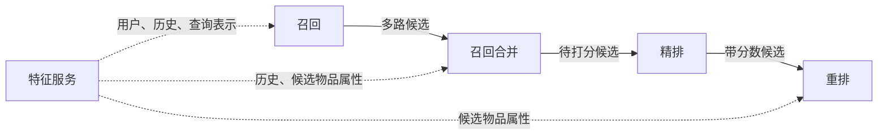
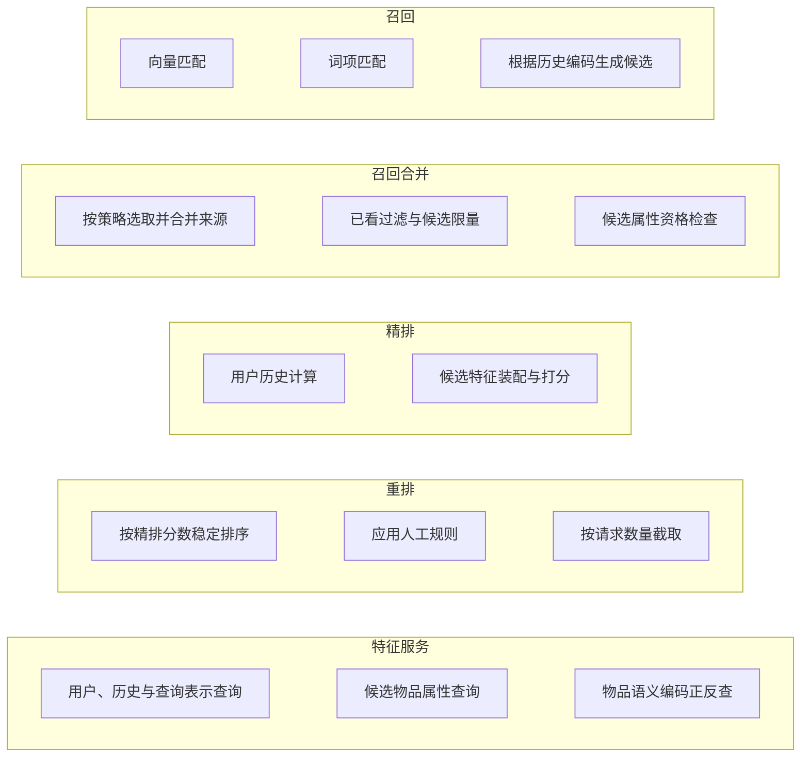
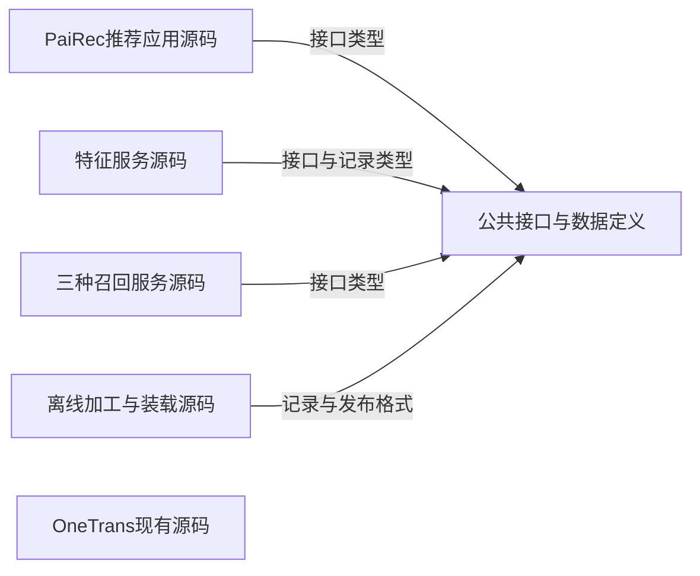
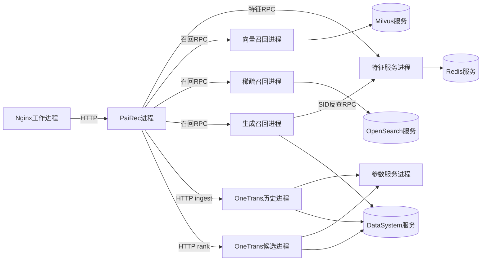
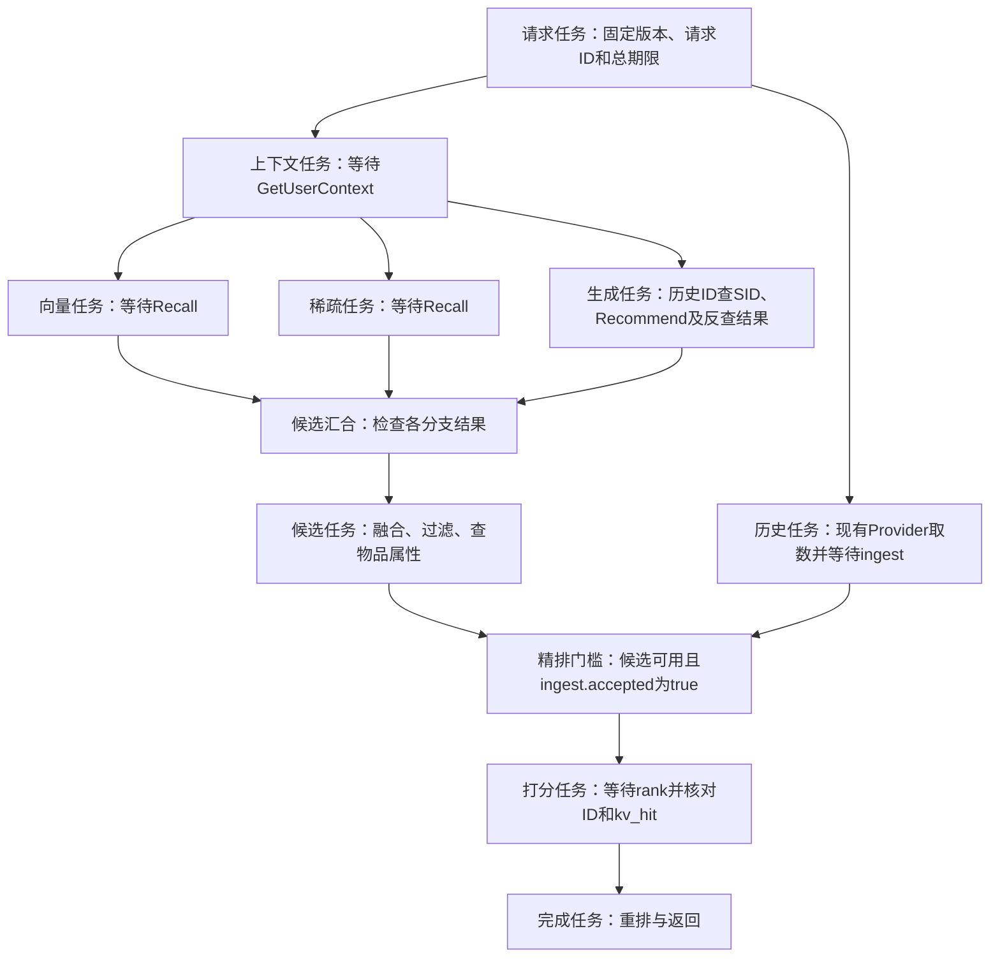
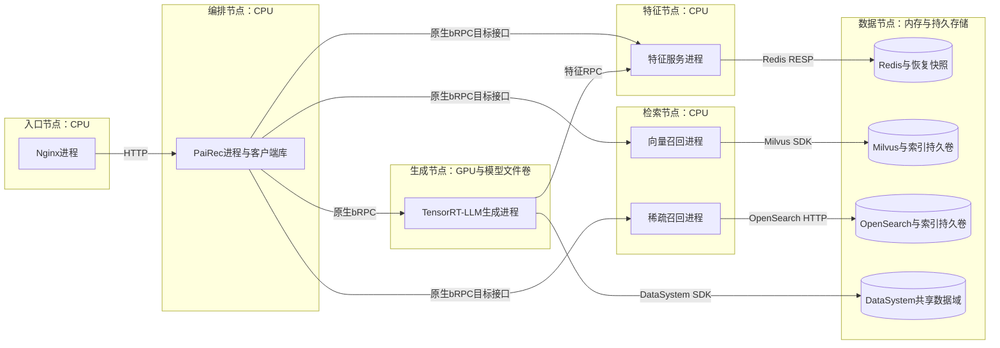
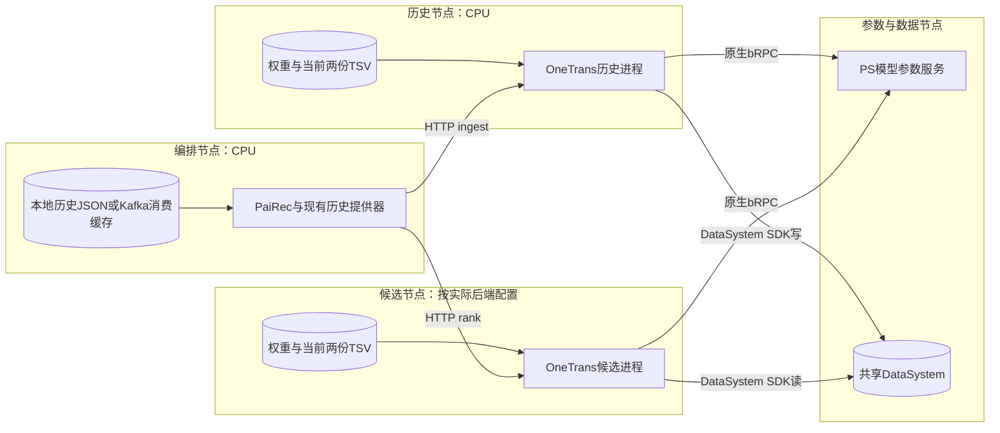
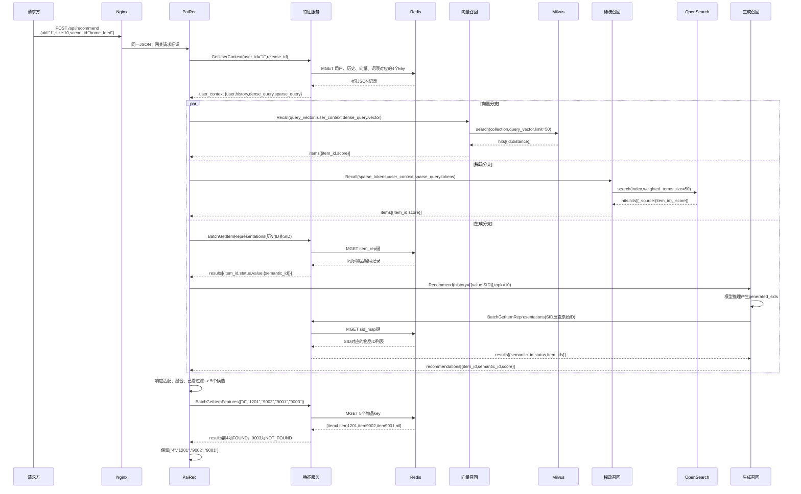
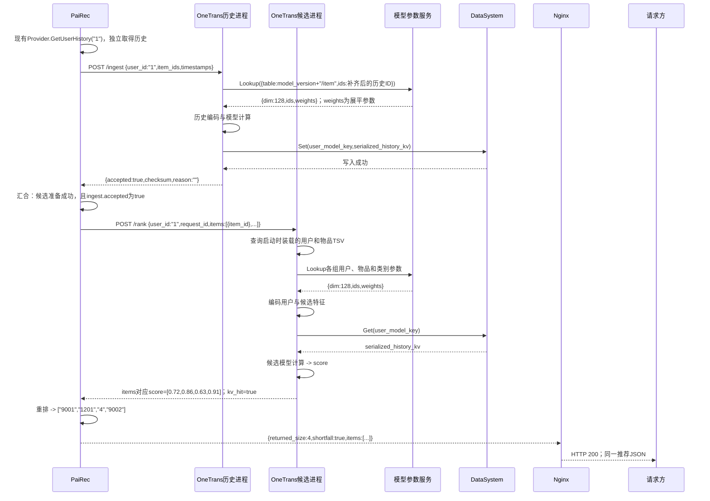

# 系统 4+1 视图

图中符号与连线遵循[图法与 UML 约定](DIAGRAM_NOTATION.md)，每张图前注明使用的图法。

本版按 4+1 的关注点重新组织：逻辑视图描述业务功能及其责任划分；开发视图描述代码的静态组织；进程视图描述独立执行、并发与同步；物理视图描述软件到硬件的映射；场景用关键用例检验这四种设计。划分依据为 [Kruchten 的 4+1 原文](https://arxiv.org/pdf/2006.04975)。

本系统的约束保持不变：Nginx 统一入口；PaiRec 编排；其他模块通过独立特征服务查询业务数据；OneTrans 按当前源码保留历史提供器、本地特征表和 HTTP 接口；离线装载真实数据与模型资产；人工配置可审阅；压力回放放在系统外部。本文给出目标架构，并明确保留的源码行为，不表示已完成部署。

| 视图 | 图中节点与连线的含义 | 应帮助工程师作出的判断 |
|---|---|---|
| 逻辑 | 业务功能及数据责任；归属、结果传递、数据提供 | 功能怎样划分，数据与规则归谁负责 |
| 开发 | 源码模块、库、接口定义；导入或编译依赖 | 怎样分工开发、复用和构建，改动影响哪些模块 |
| 进程 | 进程、请求任务、工作队列；通信、等待、同步 | 哪些工作并行，状态谁持有，失败会影响什么 |
| 物理 | 部署节点及其软件分配；网络连接 | CPU/GPU、持久存储和分离部署如何满足运行要求 |
| 场景（+1） | 具体参与者、请求和返回；有先后的交互 | 功能、代码、执行和部署的选择能否共同满足用例 |

“层级”在每个视图内部展开，例如整体逻辑职责再展开为各自的子功能；不同视图是同一系统的不同观察角度，不是前后处理阶段。

## 1. 逻辑视图：推荐功能怎样划分

### 1.1 四项处理职责与共用的特征服务

本层只表达功能和数据责任。实线标出各项处理交付的业务结果；虚线标出特征服务提供的数据。这些线不表示 RPC、线程或部署关系。特征服务是共用的查询能力，不是第五个推荐处理阶段。

图法：功能与数据关系示意图（非 UML，连线含义见本节）。



| 功能 | 输入 → 输出 | 负责什么 |
|---|---|---|
| 召回 | `recall(user_context) -> candidates_by_source` | 根据用户及历史取得多路候选；保留各路次序、来源和原始分数 |
| 召回合并 | `merge(candidates_by_source, history, item_features, rules) -> candidate_ids` | 合并重复物品的来源、过滤已看物品、限制待评估数量，再按候选属性做资格检查；本期没有粗排模型 |
| 精排 | `prepare_history(user_id, history)`；`score(user_id, candidate_ids) -> scored_items` | 计算历史状态、逐候选产生模型分数；不决定最终展示次序 |
| 重排 | `rerank(scored_items, item_features, rules, size) -> result` | 按分数稳定排序、执行人工规则、截取最终列表；候选不足时返回实际数量 |
| 特征服务 | `query(entity_ids, release_id) -> features` | 提供用户、历史、物品属性及派生表示；区分缺失与查询失败，不负责推荐打分或资格决策 |

表中函数表示业务操作，不是要求实现同名类或网络方法。`user_context` 是召回所需的用户字段、历史、查询向量和词项；`item_features` 是候选的属性。特征服务到重排的线表示数据归属：PaiRec 可以复用召回合并时已查得的属性，不必再次查询。

**OneTrans 按当前源码保留独立取数路径**：历史来自 PaiRec 中现有的历史提供器，用户和物品字段来自 OneTrans 启动时装载的本地表。因此本轮不画“特征服务 → 精排”，也不能假定两处历史天然一致。一般模型特征应经特征服务查询，这是本轮明确保留的例外。

所有职责受同一份人工场景配置约束：`scene_id -> {release_id, enabled_recalls, limits, rules}`。它决定数据与模型版本、启用的召回路、数量和规则；同一请求保持绑定不变。配置不增加一个推荐处理阶段。

### 1.2 各项功能再展开一层

下图外框沿用 1.1 的五个功能名称，内框列出各自承担的子功能。外框表示归属；图中的位置只为排版，不表示执行先后。这里仍不引入数据库、通信协议或源码模块。

图法：功能分解示意图（非 UML；外框内的功能由该职责承担）。



| 子功能中的关键约定 | 设计含义 |
|---|---|
| 三种召回方式 | 向量匹配使用用户查询向量；词项匹配使用带权兴趣词；生成方式根据历史物品的语义编码产生候选编码，再还原为物品 ID |
| 按策略选取并合并来源 | 人工配置各路优先次序和配额；同一物品只保留一个候选，同时保留所有命中来源。向量分、BM25 分和生成分不直接相加 |
| 限量与资格检查 | 合并时限制待评估候选数，查得物品属性后处理缺失记录与屏蔽规则；这与重排按请求的 `size` 截取最终结果是两件事 |
| 历史计算与候选打分 | 当前 OneTrans 先计算可复用的历史状态，候选打分再使用它；打分结果必须与候选 ID 一一对应。具体等待关系属于进程视图 |
| 稳定排序与人工规则 | 精排同分时保留合并后的相对次序，再执行配置的过滤规则；没有足够候选时不伪造补齐项 |
| 三种特征查询 | 用户上下文对应 `GetUserContext`；物品属性对应 `BatchGetItemFeatures`；编码正反查对应 `BatchGetItemRepresentations` |

物品语义编码简称 SID，是模型使用的一组离散整数。正查是 `item_id -> semantic_id`；反查是 `semantic_id -> item_ids`，一个编码可能对应多个物品。映射记录属于特征服务；产生编码的模型与分词器属于模型资产。字段定义见[特征字典](10_feature_catalog.md)，各功能对用户 1 的具体输入输出见[请求推演](08_request_walkthrough.md)。

## 2. 开发视图：源码模块、静态依赖与构建产物

本层按可分别开发和构建的源码范围分组。实线箭头 `A -> B` 只表示 A 导入或编译时依赖 B；不画服务之间的网络调用。公共接口与特征记录定义是复用的代码或规范，不单独部署为服务。

图法：源码依赖示意图（非 UML，连线含义见本节）。



图只保留项目级共享依赖。各程序内部的模型库、数据库 SDK 和通信库在模块文档展开；OneTrans 使用自己的现有 HTTP 类型与计算代码，没有因新增公共接口而自动接入特征服务。三个召回实现合画为一组源码，仍分别交付三个服务程序。

| 源码或配置范围 | 包含的代码职责 | 构建或交付产物 |
|---|---|---|
| PaiRec 推荐应用 | 请求入口、`RecommendEngine`、召回合并与重排规则、特征及模型客户端、现有历史提供器 | 推荐程序及人工可编辑的场景配置；固定依赖官方 PaiRec v2.6.2 |
| 特征服务 | 三种查询方法、批读、记录解码、缺失与版本检查、Redis 适配 | 独立特征服务程序 |
| 三种召回服务 | 向量检索、加权词项检索、生成推理与 SID 反查；各自的后端适配 | 向量、稀疏、生成三个服务程序及索引/模型绑定配置 |
| OneTrans | 现有 `/ingest`、`/rank`、本地特征装配、参数及历史状态访问、模型计算 | OneTrans 服务程序；以不同角色配置启动历史和候选两个进程；配套权重与本地表 |
| 公共接口与数据定义 | 特征及召回请求响应、目标 protobuf、特征记录格式、版本清单格式 | 接口文件、生成代码和共享类型；由相应程序导入或编译，不单独启动 |
| 离线加工与装载 | Tenrec 预处理、特征与表示导出、索引装载、读回核对 | 离线工具、可重放装载文件、索引及模型资产、发布清单 |
| 网关与场景配置 | Nginx 路由；服务地址、版本绑定、召回数量与规则 | Nginx 配置和场景配置；由人工审阅发布 |

编排只依赖业务客户端和规则，不导入 Redis 键名或数据库访问实现。原生 bRPC、Go 与 C/C++ 的调用封装以及现有 HTTP 客户端归入各自程序的通信适配代码，细节见[RPC 视图](06_rpc.md)。构建产生程序与配置；运行时的调用关系另见下一节。

这里规定的是目标源码职责，不要求照图新建同名目录，也不表示代码已经全部具备。当前生成接口的 `history[{value}]`、`recommendations` 结构仍保留，版本字段与特征反查待补；当前 OneTrans `/rank` 仍只收用户与候选 ID。开发缺口与源码证据见[证据与主要缺口](09_evidence_and_gaps.md)。

## 3. 进程视图：独立执行、并发与状态所有权

### 3.1 哪些执行单元相互通信

本层每个框代表可独立启动的服务进程或数据库服务。箭头表示运行时调用，未决定它们在哪台机器上。历史提供器和原生客户端在 PaiRec 进程内部；它们不增加远程服务跳数。

图法：进程通信示意图（非 UML，连线含义见本节）。



目标特征与召回 RPC 使用原生 bRPC；当前 OneTrans 业务接口使用 HTTP。数据库仍使用各自协议。旧后端需要协议桥时，桥是另一个进程，和后端间的通信见[通信视图](06_rpc.md)。

### 3.2 一个请求在 PaiRec 中怎样并行与汇合

本层只展开 PaiRec 进程中的请求任务，框内的远程方法是该任务等待的调用。向量、稀疏、生成三个分支在取得公共上下文后并行；独立的历史任务可以更早开始。

图法：结构或流程示意图（非 UML，连线含义见本节）。



这是目标编排。当前配套调用方会先 `/rank`，未命中才等待历史任务结束并重查；本设计要求等待结果携带成功或错误，不能仅等一个“任务已结束”的信号。候选为空时跳过打分，返回真实空列表。

| 状态或并发资源 | 所有者及规则 | 故障影响 |
|---|---|---|
| 请求上下文、候选、已取得特征 | PaiRec 单个请求任务持有；并行分支返回后汇合；无重复召回扇出 | 必需分支错误则整请求失败并取消其余等待，不伪装成零候选 |
| 特征查询批次 | 特征服务限制条数、字节和在途数；按原输入位置合并 | 数据库错误与缺键分开；不跨版本补齐 |
| 召回队列和模型执行资源 | 各服务管理自己的有界队列；满载返回错误 | 按剩余期限结束等待；默认不自动重试模型请求 |
| OneTrans 计算任务 | 历史线程池独立；候选内部参数查询、编码、KV 读取与攒批 | KV 未命中时当前候选前向可能不执行，返回的 0.5 不能充当成功证据 |
| 历史注意力缓存 | DataSystem 按当前模型版本与用户 ID 保存；两个 OneTrans 进程读写同一键 | 同用户并发可能覆盖；命中不保证读到本次历史 |
| 生成注意力缓存 | 生成运行时按实际缓存块生命周期管理 | 换入换出按需发生；不能给每个推荐请求固定读写次数 |

正常样例有 PaiRec 三次、生成服务一次特征 RPC；底层 Redis 拆批另计。总预算初值 25 秒，阶段超时取“阶段上限与总剩余时间的较小值”。取消客户端等待不等于远端计算停止；当前 OneTrans 没有请求级释放接口。联调可限制同用户串行并核对历史，但该限制不等于已实现并发隔离。

## 4. 物理视图：把执行单元分配到硬件节点

每个外框是一种可配置的部署节点角色，框内是分配到它的进程及资源。两图中的 PaiRec 和 DataSystem 表示同一系统的共享节点角色。首条链路可将部分角色放在同一主机；验证跨机通信时，OneTrans 历史与候选进程分别部署到两个节点。

### 4.1 推荐入口、特征与召回的部署映射

图法：部署映射示意图（非 UML，连线含义见本节）。



### 4.2 OneTrans 分离部署的映射

图法：部署映射示意图（非 UML，连线含义见本节）。



TSV 是制表符分列表。当前 OneTrans 启动的两个进程都会加载用户和物品 TSV；历史模型的输入仍由调用方发送。历史计算使用 C++ CPU；候选可选择 C++ CPU 或 Python 桥等已有后端，实际设备和回退行为必须记录，不以部署图宣称 GPU 已执行。

| 物理或运维约束 | 本系统的配置要求 |
|---|---|
| 两阶段共享状态 | 显式编入并启用 PS/DataSystem，两端模型版本、用户 ID 与共享数据域一致；进程本地存储不满足跨进程共享 |
| 数据可恢复 | 离线文件卷或对象存储保留 Tenrec、加工结果、装载文件和清单；Redis 可持久化恢复或重载，索引使用持久卷 |
| 模型可重现 | 权重、词表、SID 版本、索引与特征发布绑定；OneTrans 本地文件另行核对 |
| 容量与故障边界 | 按资源测量增加服务副本；只画了单个角色不等于具备高可用，数据库和共享状态的可用性需单独配置 |
| 人工操作 | 可选择版本、服务后端、召回开关与数量、屏蔽规则和回退版本；外部回放器产生测试负载 |

### 4.3 同一项能力在四个视图中的位置

| 逻辑职责 | 开发单元 | 运行执行者 | 部署节点 |
|---|---|---|---|
| 召回合并与重排 | 候选融合与排序规则模块 | PaiRec 请求任务 | 编排节点 |
| 业务特征查询 | 特征程序、记录定义与访问适配 | 特征服务及 Redis | 特征节点、数据节点 |
| 三种候选获取 | 三种召回程序与算法适配 | 召回服务及其数据库/模型运行时 | 检索节点、生成节点、数据节点 |
| 历史计算与候选评分 | OneTrans 现有程序及模型模块 | 两个 OneTrans 进程、PS、DataSystem | 历史节点、候选节点、参数与数据节点 |
| 版本与场景管理 | 离线/发布工具、配置定义、入口装配 | 离线任务及请求开始时的版本选择 | 离线构建环境、编排与数据节点 |

## 5. 场景视图（+1）：用具体用例检验四个视图

### 5.1 正常推荐：用户 1 请求 10 项

前提：所选发布已就绪，三路召回启用；本例单个用户串行请求，OneTrans 历史与本地表覆盖已另行核对。教学请求 `request_id="demo-user-1-001"`、`release_id="demo_tenrec_v1"` 的具体数据见[请求推演](08_request_walkthrough.md)。两张图表示同一请求，历史计算可与召回并行开始。图中保留关键业务参数，省略重复的版本头；完整参数和数值在请求推演中展开。

图法：UML 时序图；同一交互片段 1/2。 PaiRec 代表含并行子任务的编排进程，各分支内同步等待，分支之间可以交错。



图中 `user_context` 就是特征查询返回的用户上下文；历史正查保持物品顺序，生成反查允许一个 SID 对应多个物品。生成响应由客户端从 `recommendations` 转成统一 `items`，并将物品 ID 转为字符串。生成运行时按需读写 DataSystem 缓存，具体调用见生成模块；不把可选换入换出画成每请求必经步骤。

图法：UML 时序图；同一交互片段 2/2。



这里的 Provider 是 PaiRec 内部现有历史读取代码；`user_model_key` 由模型版本与用户 ID 构造，不含请求 ID。`serialized_history_kv` 是历史模型产生的注意力张量字节，参数服务的 `weights` 则是模型参数，二者用途不同。最终 Nginx 将业务 JSON 返回请求方；本例没有够用的十个候选，实际返回四项。

### 5.2 异常和人工发布用例

| 用例及触发 | 动作与可观察结果 | 检验的设计 |
|---|---|---|
| 候选 `9003` 没有物品记录 | 特征响应保留该位置且标 `NOT_FOUND`；召回合并剔除；四个 ID 与分数仍一一对应 | 逻辑候选资格；开发响应契约；进程结果合并 |
| 历史写入失败，或精排 KV 未命中 | 写入失败不提交精排；当前 `/rank` 未命中可能返回 0.5，目标编排检查 `kv_hit` 并判失败 | 进程同步与失败传播；两个物理节点是否真实共享存储 |
| 同用户两个请求使用不同历史 | 当前用户级键有覆盖风险，标记一致性缺口；未补身份设计前不能宣布并发隔离通过 | 逻辑历史对应关系；进程共享状态；部署共享数据域 |
| 数据库超时或必需表示版本错误 | 返回明确失败并停止后续必需阶段；不换另一版本或伪造空输入 | 逻辑版本约束；通信与数据库模块；期限控制 |
| 人工发布新数据或规则 | 新版本完整装载并核对后供新请求选择；在途请求仍使用旧版本；保留可回退的完整旧资产 | 版本管理职责；离线构建与配置代码；请求状态；持久存储 |

人工发布的最小操作如下。`READY` 表示必需数据与索引已经核对就绪，不表示当前 OneTrans 本地资产已自动一致；其文件、PS 表与模型版本需要另外校验。

```python
release = build_release(source_snapshot, feature_recipe, model_bindings)
load_features_and_retrieval_indexes(release)
verify_readback_and_coverage(release)
verify_current_onetrans_assets(release)
mark_ready(release)
activate_for_new_requests(release)
# 旧请求继续使用旧绑定；旧请求结束后才允许回收旧版本。
```

以上场景解释架构应如何工作；真实数据库访问、模型前向、历史一致性和长期缓存容量仍需运行证据。完整字段和教学数值集中在请求文档，不在本篇重复每个载荷。
