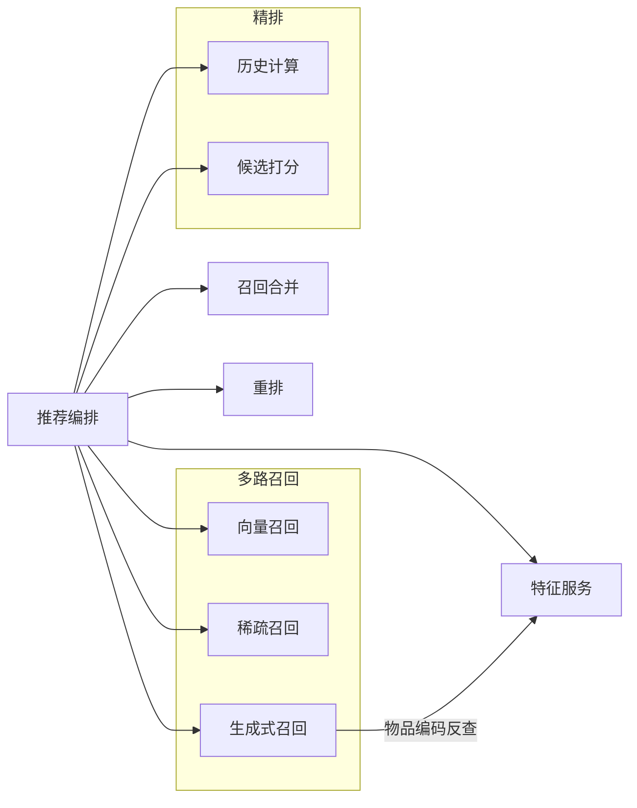
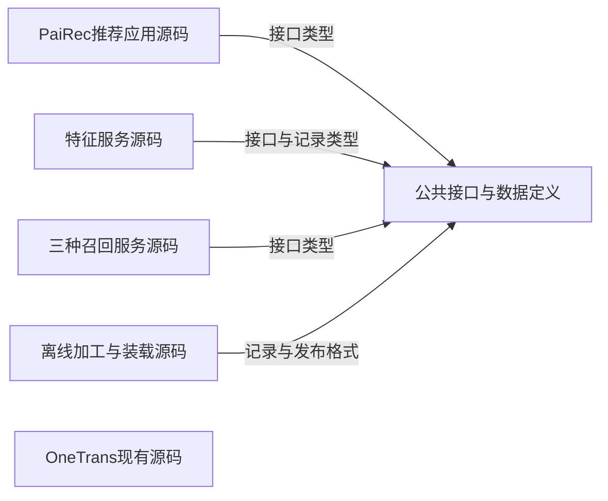
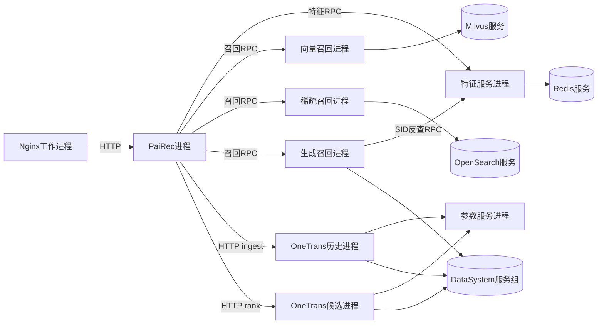
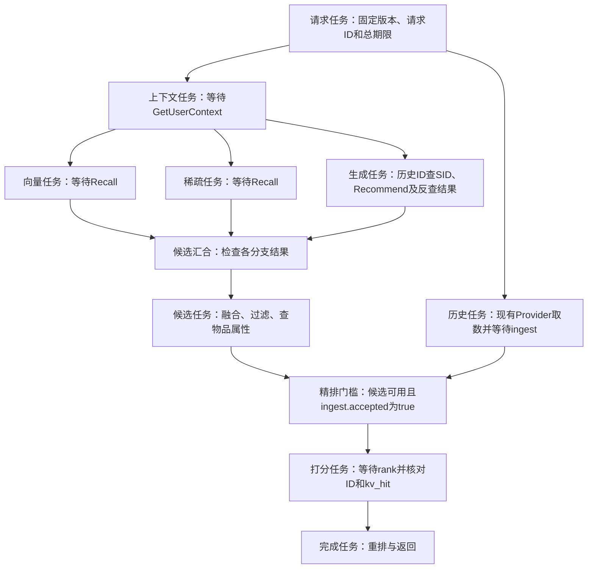
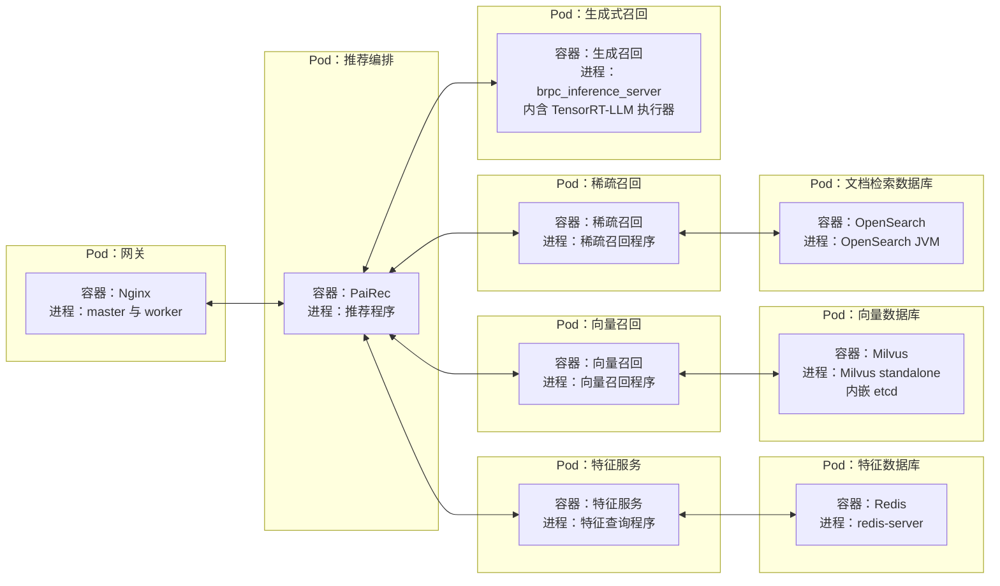
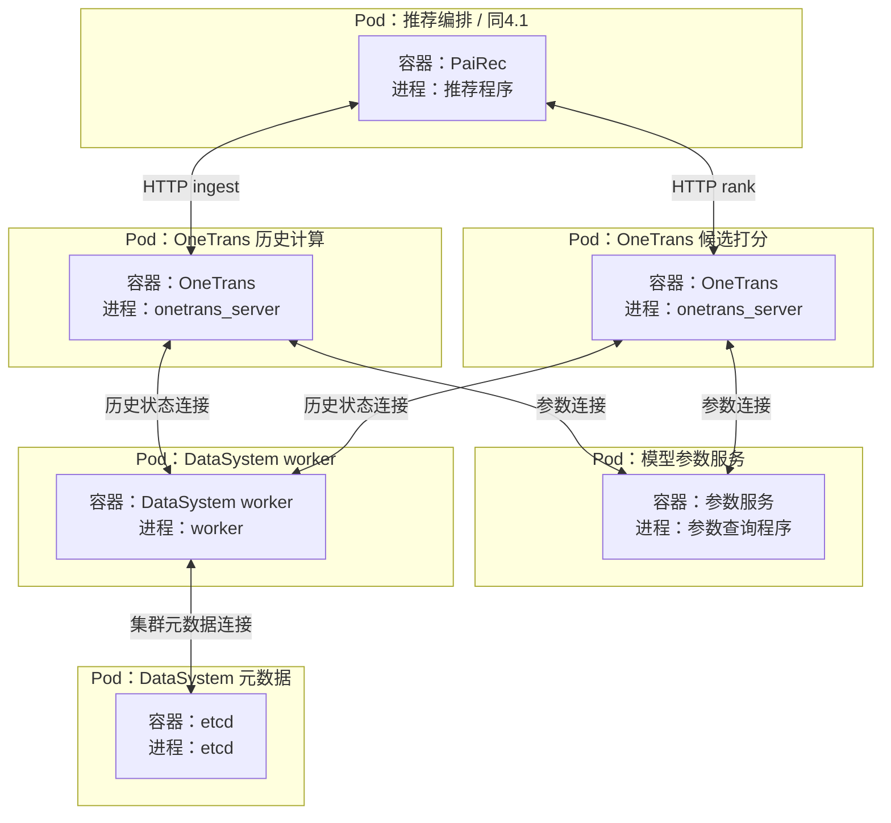
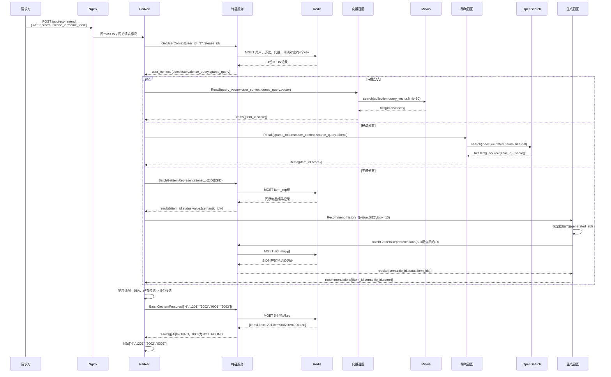
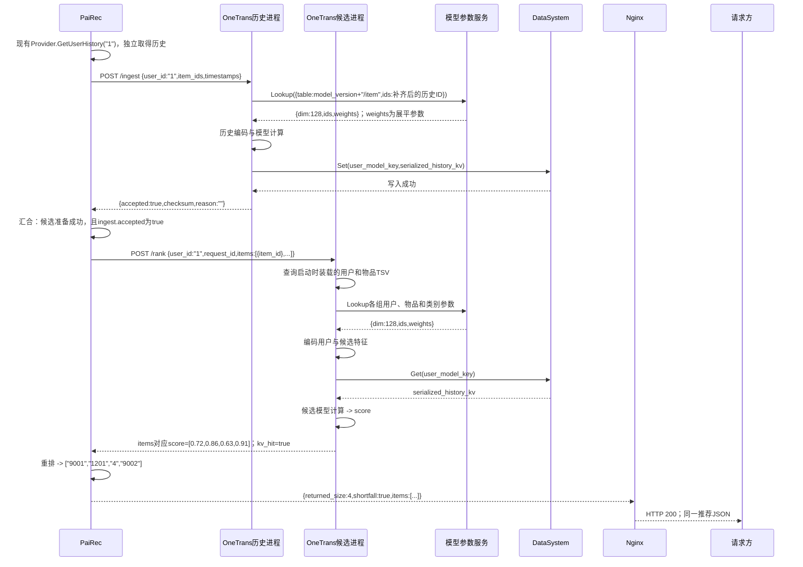

# 系统 4+1 视图

图中符号与连线遵循[图法与 UML 约定](DIAGRAM_NOTATION.md)，每张图前注明使用的图法。

本版按 4+1 的关注点组织：逻辑视图描述核心业务抽象及其职责、接口与关系；开发视图描述代码的静态组织；进程视图描述独立执行、并发与同步；物理视图描述部署单元及其容纳的进程；场景用关键用例检验这四种设计。划分依据为 [Kruchten 的 4+1 原文](https://arxiv.org/pdf/2006.04975)。目前没有主机分配信息，物理视图先展开 Pod、容器与进程，待部署确定后再补到主机的映射。

本系统的约束保持不变：Nginx 统一入口；PaiRec 编排；其他模块通过独立特征服务查询业务数据；OneTrans 按当前源码保留历史提供器、本地特征表和 HTTP 接口；离线装载真实数据与模型资产；人工配置可审阅；压力回放放在系统外部。本文给出目标架构，并明确保留的源码行为，不表示已完成部署。

| 视图 | 图中节点与连线的含义 | 应帮助工程师作出的判断 |
|---|---|---|
| 逻辑 | 业务职责、接口与对象；归属和能力依赖 | 哪些核心抽象承担功能，它们需要哪些业务能力 |
| 开发 | 源码模块、库、接口定义；导入或编译依赖 | 怎样分工开发、复用和构建，改动影响哪些模块 |
| 进程 | 进程、请求任务、工作队列；通信、等待、同步 | 哪些工作并行，状态谁持有，失败会影响什么 |
| 物理 | Pod、容器及其内部进程；包含关系、网络连接与所需存储 | 哪些进程放入同一容器，哪些单元独立部署，需要挂载什么；主机分配待定 |
| 场景（+1） | 具体参与者、请求和返回；有先后的交互 | 功能、代码、执行和部署的选择能否共同满足用例 |

“层级”在每个视图内部展开；不同视图是同一系统的不同观察角度，不是前后处理阶段。逻辑视图在一张 L1 图中直接展开三路召回与精排的两个职责；模型内部结构在模块文档中说明。

## 1. 逻辑视图：核心职责、业务接口与依赖

逻辑视图回答“系统由哪些核心抽象组成，它们各自负责什么，需要其他部分提供什么能力”。本文以业务职责为逻辑单元，用接口及业务对象说明协作。处理顺序与并发放在第 3 节和[请求时序](08_request_walkthrough.md)；源码如何分包、编译放在第 2 节。此处不按进程或机器提前切分职责。

### 1.1 L1：整体逻辑结构，展开多路召回与精排

图中的框是逻辑单元；外框表示职责归属。箭头 `A --> B` 统一表示“A 需要 B 提供的业务能力”，不表示先执行 A 再执行 B，也不表示源码导入。推荐编排协调三路召回、召回合并、精排和重排；特征服务提供所需业务数据。

图法：逻辑结构示意图（非 UML，箭头表示业务能力依赖）。



这一层已经能区分三种候选获取方式，以及 OneTrans 历史计算与候选打分的责任，无需另画一张重复的内部结构图。逻辑单元不与独立服务一一对应：召回合并、重排可在 PaiRec 内实现；召回算法与特征查询可在独立服务中实现。进程和容器边界分别在第 3、4 节说明。

### 1.2 业务操作与数据责任

| 逻辑单元 | 提供的业务操作 | 拥有的责任与约束 |
|---|---|---|
| 推荐编排 | `recommend(request, policy) -> result` | 持有本次请求上下文，固定场景与版本；取得特征并协调其他能力，核对候选与分数的对应关系 |
| 向量召回 | `recall(query_vector, policy) -> candidates` | 根据查询向量检索物品表示，保留向量分与返回次序 |
| 稀疏召回 | `recall(weighted_terms, policy) -> candidates` | 根据加权兴趣词项检索物品文档，保留 BM25 分与返回次序 |
| 生成式召回 | `generate(history_codes, policy) -> candidates` | 根据历史编码生成候选编码，通过特征服务反查物品 ID；保留生成分与次序 |
| 召回合并 | `merge(candidates_by_source, history, item_features, policy) -> candidates` | 管理唯一候选集合及全部命中来源；按来源策略选取，执行已看过滤、候选限量和属性资格规则；本期没有粗排模型 |
| 精排／历史计算 | `prepare_history(user_id, history)` | 将历史物品序列计算为模型中间结果，供候选打分复用 |
| 精排／候选打分 | `score(user_id, candidate_ids) -> scored_items` | 结合用户、候选特征与已准备的历史中间结果，产生与候选 ID 一一对应的分数；不决定最终展示顺序 |
| 重排 | `rerank(scored_items, item_features, policy, size) -> result` | 按分数与人工规则组织最终列表；同分保留合并后相对次序；按 `size` 限量，不足时返回实际数量 |
| 特征服务 | `GetUserContext`、`BatchGetItemFeatures`、`BatchGetItemRepresentations` | 提供用户上下文、物品属性及编码映射，统一版本与缺失语义；不负责推荐分数或候选资格决策 |

表中的操作表示业务契约，不要求源码存在同名类或网络方法。`request` 含用户、场景和数量；`policy` 是人工场景配置，含发布版本、召回开关、数量及规则。`query_vector`、`weighted_terms`、`history_codes` 分别是查询向量、加权词项、历史物品的语义编码；`history` 是历史序列，`item_features` 是物品属性。`candidates_by_source` 按召回来源保存候选；`scored_items` 为与候选 ID 对应的评分条目；`result` 为最终有序列表及实际数量。

三路召回保留各自原始分数含义，不把向量分、BM25 分和生成分直接相加。精排的“历史中间结果”是历史模型产生、供候选打分使用的注意力键和值张量；候选打分依赖它，但不直接调用历史计算接口，由编排协调准备与等待。

**特征的数据责任与查询责任分开**：特征服务提供事实；编排为召回、候选资格检查和重排取得所需数据，后两者复用已查得的物品属性。生成服务在推理后才知道候选编码，因此直接使用特征服务的编码反查能力。逻辑图中只有需要查询能力的单元依赖特征服务，不把所有使用查询结果的单元都画成查询方。

**当前 OneTrans 保留独立取数边界**：历史来自 PaiRec 现有历史提供器，用户和候选字段来自 OneTrans 本地表，因此不画精排到特征服务的依赖。两套历史需要另行核对；不能因为逻辑上都称为“历史”，就认为它们已经统一。

物品语义编码简称 SID，是模型使用的一组离散整数。编码正查为 `item_id -> semantic_id`，反查为 `semantic_id -> item_ids`，一个编码可能对应多个物品。查询映射记录属于特征服务；产生编码的模型与分词器属于模型资产。完整字段见[特征字典](10_feature_catalog.md)，用户 1 的具体数据传递见[请求推演](08_request_walkthrough.md)。

## 2. 开发视图：源码模块、静态依赖与构建产物

本层按可分别开发和构建的源码范围分组。实线箭头 `A -> B` 只表示 A 导入或编译时依赖 B；不画服务之间的网络调用。公共接口与特征记录定义是复用的代码或规范，不单独部署为服务。

图法：源码依赖示意图（非 UML，连线含义见本节）。



图只保留项目级共享依赖。各程序内部的模型库、数据库 SDK 和通信库在模块文档展开；OneTrans 使用自己的现有 HTTP 类型与计算代码，没有因新增公共接口而自动接入特征服务。三个召回实现合画为一组源码，仍分别交付三个服务程序。

| 源码或配置范围 | 包含的代码职责 | 构建或交付产物 |
|---|---|---|
| PaiRec 推荐应用 | 请求入口、`RecommendEngine`、召回合并与重排规则、特征及模型客户端、现有历史提供器 | 推荐程序及人工可编辑的场景配置；固定依赖官方 PaiRec v2.6.2 |
| 特征服务 | 三种查询方法、批读、记录解码、缺失与版本检查、Redis 适配 | 独立特征服务程序 |
| 三种召回服务 | 向量检索、加权词项检索、生成推理与 SID 反查；各自的后端适配 | 向量、稀疏、生成三个服务程序及索引/模型绑定配置 |
| OneTrans | 现有 `/ingest`、`/rank`、本地特征装配、参数及历史状态访问、模型计算 | OneTrans 服务程序；以不同角色配置启动历史和候选两个进程；配套权重与本地表 |
| 公共接口与数据定义 | 特征及召回请求响应、目标 protobuf、特征记录格式、版本清单格式 | 接口文件、生成代码和共享类型；由相应程序导入或编译，不单独启动 |
| 离线加工与装载 | Tenrec 预处理、特征与表示导出、索引装载、读回核对 | 离线工具、可重放装载文件、索引及模型资产、发布清单 |
| 网关与场景配置 | Nginx 路由；服务地址、版本绑定、召回数量与规则 | Nginx 配置和场景配置；由人工审阅发布 |

编排只依赖业务客户端和规则，不导入 Redis 键名或数据库访问实现。原生 bRPC、Go 与 C/C++ 的调用封装以及现有 HTTP 客户端归入各自程序的通信适配代码，细节见[RPC 视图](06_rpc.md)。构建产生程序与配置；运行时的调用关系另见下一节。

这里规定的是目标源码职责，不要求照图新建同名目录，也不表示代码已经全部具备。当前生成接口的 `history[{value}]`、`recommendations` 结构仍保留，版本字段与特征反查待补；当前 OneTrans `/rank` 仍只收用户与候选 ID。开发缺口与源码证据见[证据与主要缺口](09_evidence_and_gaps.md)。

## 3. 进程视图：独立执行、并发与状态所有权

### 3.1 哪些执行单元相互通信

本层的框表示服务进程或数据库服务组，箭头表示运行时调用；数据库服务组内部可有多个进程，部署映射见第 4 节。历史提供器和原生客户端在 PaiRec 进程内部；它们不增加远程服务跳数。

图法：进程通信示意图（非 UML，连线含义见本节）。



目标特征与召回 RPC 使用原生 bRPC；当前 OneTrans 业务接口使用 HTTP。数据库仍使用各自协议。旧后端需要协议桥时，桥是另一个进程，和后端间的通信见[通信视图](06_rpc.md)。

### 3.2 一个请求在 PaiRec 中怎样并行与汇合

本层只展开 PaiRec 进程中的请求任务，框内的远程方法是该任务等待的调用。向量、稀疏、生成三个分支在取得公共上下文后并行；独立的历史任务可以更早开始。

图法：结构或流程示意图（非 UML，连线含义见本节）。



这是目标编排。当前配套调用方会先 `/rank`，未命中才等待历史任务结束并重查；本设计要求等待结果携带成功或错误，不能仅等一个“任务已结束”的信号。候选为空时跳过打分，返回真实空列表。

| 状态或并发资源 | 所有者及规则 | 故障影响 |
|---|---|---|
| 请求上下文、候选、已取得特征 | PaiRec 单个请求任务持有；并行分支返回后汇合；无重复召回扇出 | 必需分支错误则整请求失败并取消其余等待，不伪装成零候选 |
| 特征查询批次 | 特征服务限制条数、字节和在途数；按原输入位置合并 | 数据库错误与缺键分开；不跨版本补齐 |
| 目标服务的队列和执行资源 | 设计要求各服务限制队列与在途工作；满载返回明确错误 | 按剩余期限结束等待；默认不自动重试模型请求；当前 OneTrans 的实际容量与异常边界另见专文 |
| OneTrans 计算任务 | 历史线程池独立；候选内部参数查询、编码、KV 读取与攒批 | KV 未命中时当前候选前向可能不执行，返回的 0.5 不能充当成功证据 |
| 历史注意力缓存 | DataSystem 按当前模型版本与用户 ID 保存；两个 OneTrans 进程读写同一键 | 同用户并发可能覆盖；命中不保证读到本次历史 |
| 生成注意力缓存 | 生成运行时按实际缓存块生命周期管理 | 换入换出按需发生；不能给每个推荐请求固定读写次数 |

正常样例有 PaiRec 三次、生成服务一次特征 RPC；底层 Redis 拆批另计。总预算初值 25 秒，阶段超时取“阶段上限与总剩余时间的较小值”。取消客户端等待不等于远端计算停止；当前 OneTrans 没有请求级释放接口。联调可限制同用户串行并核对历史，但该限制不等于已实现并发隔离。

线程或协程的具体等待、唤醒、数据复制及 OS 负载分别见 [PaiRec 内部分析](03_pairec_orchestration.md)、[OneTrans 内部分析](02_onetrans.md)和 [Redis 执行分析](11_redis_workload.md)。其中 OneTrans 当前连接与攒批队列没有显式硬容量，不能由上面的目标要求推断现状已经有界。

## 4. 物理视图：Pod、容器与进程的部署关系

目前没有可确认的 Host（主机）或 Kubernetes Node（工作节点）分配。本节先给出**目标容器部署单元**：外框是 Pod，内框是容器，容器内列出主要进程。不填写主机数量、同机或跨机关系、调度规则和副本数；每个框表示一种部署单元，不代表只部署一个实例。[Pod 与容器的关系](https://kubernetes.io/docs/concepts/workloads/pods/)。

已有配置只能证明局部部署方式已有定义，不能证明整套系统已运行。两图按同一套目标边界绘制，现有依据与待补部分在 4.3 区分；不用 Kubernetes 时，可保留容器与进程边界，再补实际容器运行环境。

### 4.1 入口、特征与召回的容器边界

图法：部署映射示意图（非 UML）。包含关系表示 Pod 容纳容器、容器运行所列进程；双向实线表示主要网络连通要求，不表示执行顺序。完整调用关系见第 3 节。



Nginx 的 master 负责管理工作进程，worker 处理请求。PaiRec 的历史提供器、召回合并、重排和 RPC 客户端均在推荐进程内部。特征服务与 Redis、召回程序与对应索引服务分别部署；Pod 分开不意味着位于不同主机。

本图按召回程序内置原生 bRPC 处理器的目标方案绘制。若复用 HTTP 后端，可另加协议桥进程，见[召回模块的适配方案](07_other_services.md)；桥的容器分组届时确定，后端仍须支持目标输入字段。

生成容器采用当前原生 C++ 后端：bRPC 入口和 TensorRT-LLM 执行器在同一进程内，运行需要 GPU；具体设备分配待定。它还要连接特征服务和下一图的 DataSystem。Milvus 使用已有 standalone 配置中的内嵌 etcd；不额外画一个 Milvus etcd Pod，也不与 DataSystem 的 etcd 混用。

### 4.2 OneTrans 计算容器与共享状态

图法：部署映射示意图（非 UML）。外框和连线与 4.1 含义相同；推荐编排 Pod 是上一图同一个部署单元的引用。DataSystem worker 框代表此类存储 Pod，数量及模型服务连接哪些 worker 由后续部署配置确定。



两个 OneTrans 容器运行同一服务程序，程序均注册历史和打分接口，由 PaiRec 调用不同地址来区分角色。当前资料仅有多进程启动示例，**拆成历史 Pod、候选 Pod 是目标部署边界，尚需补容器和部署配置**；不据此要求它们落在不同主机。

两端须编入参数服务与 DataSystem 支持，配置 `embedding_source=ps`、`kv_backend=datasystem`，并使用一致的 `model_version` 和匹配的参数表。历史计算当前使用 C++ CPU，候选计算后端由配置选择，详见 [OneTrans 执行条件](02_onetrans.md)。

两端必须能访问**同一 DataSystem 数据域**，才能共享历史计算结果；这不要求连接同一个 worker 实例。worker 管理模型键值数据，etcd 管理集群元数据。已有 worker 和 etcd 分别定义为 DaemonSet、Deployment 两类 Kubernetes 工作负载，负责管理各自的 Pod；本图没有将 worker 放入模型 Pod。worker 数量、调度位置以及 SDK 连接方式，应在真实部署时确定并验证。生成服务也连接 DataSystem，但使用生成模型自己的缓存键与生命周期。

### 4.3 现有部署依据与待补内容

| 部署单元 | 源码或配置已能确认什么 | 本图仍属目标设计的部分 |
|---|---|---|
| 生成式召回 | [已有 Deployment 的容器和启动命令](assets/source_snapshots/pairec4tigerllm/k8s/deployment-inference-brpc-trtllm.yaml.html#L35)；[执行器装配源码](assets/source_snapshots/pairec4tigerllm/cpp/brpc_gateway/brpc_inference_server.cpp.html#L1006)确认 bRPC 与 TensorRT-LLM 在同一进程 | 与新特征服务、场景版本及缓存服务的完整联调 |
| Milvus | [已有 standalone 容器配置](assets/source_snapshots/pairec4tigerllm/k8s/deployment-milvus-standalone.yaml.html#L49)，使用内嵌 etcd 与本地存储 | 按目标发布装载向量数据，并与向量召回服务联调 |
| DataSystem | [etcd Deployment](assets/source_snapshots/pairec4tigerllm/k8s/deployment-datasystem-pool-hostnetwork.yaml.html#L19)与 [worker DaemonSet](assets/source_snapshots/pairec4tigerllm/k8s/deployment-datasystem-pool-hostnetwork.yaml.html#L114)分别定义；[worker 配置](assets/source_snapshots/pairec4tigerllm/k8s/deployment-datasystem-pool-hostnetwork.yaml.html#L217)指定集群地址与标识 | 目标集群的规模、调度、资源和模型 SDK 连通性；不照搬样例中的固定地址和节点名 |
| OneTrans 历史与候选 | [现有启动说明](assets/source_snapshots/OneTrans_HSE_project/docs/%E5%8D%95%E6%9C%BA%E5%A4%9A%E8%8A%82%E7%82%B9%E9%83%A8%E7%BD%B2.md.html#L152)使用同一程序启动多个进程 | 两种角色各自容器化、提供可访问地址，并验证共享历史结果 |
| 网关、编排、特征服务、其他召回及参数服务 | 代码职责与当前能力分别见模块文档 | 本图中的独立 Pod/容器分组是目标安排；整套部署清单仍需补齐 |

### 4.4 各容器需要哪些文件与存储

| 使用方 | 必需资源 | 放置与访问要求 |
|---|---|---|
| Nginx、PaiRec 容器 | 各自的路由、场景及地址配置；PaiRec 历史提供器的数据源 | 挂载配置；当前历史来源为本地 JSON 或 Kafka 消费缓存，按选定来源配置文件或外部连接 |
| Redis、Milvus、OpenSearch 容器 | 版本化特征记录、向量集合、文档索引及恢复数据 | 分别提供数据目录或持久卷；存储类型和后端待定，离线工具负责装载并核对发布版本 |
| 生成召回容器 | TensorRT-LLM 模型文件与 GPU | 进程可读取模型并访问设备；模型资产与场景绑定一致，不把 SID 映射当作模型缓存 |
| 两个 OneTrans 容器 | 匹配的模型文件、用户 TSV 和物品 TSV | 两端启动时均可读；文件挂载或分发方式待定，不假定共用一个文件系统 |
| 参数服务容器 | 参数装载文件 | 启动后装载对应版本的内存表，供两个 OneTrans 进程查询 |
| DataSystem worker、etcd 容器 | worker 的内存、共享内存与工作目录；etcd 的持久数据目录 | 按 SDK 与部署方式配置资源和权限；现有样例使用的临时 etcd 目录需改为可持久保存的目录 |
| 离线加工与装载任务 | Tenrec 快照、加工结果、装载文件、发布清单 | 保存可重放版本，并交付给对应在线容器或存储；任务运行环境另行安排 |

`TSV` 是制表符分列表。历史计算使用 PaiRec 发来的历史 ID；历史容器也需要两份 TSV，是当前程序的启动要求。此表只约定资源使用者，不推定物理磁盘、共享卷或主机位置。

### 4.5 同一项能力在四个视图中的位置

| 逻辑职责 | 开发单元 | 运行执行者 | 目标部署单元 |
|---|---|---|---|
| 推荐编排、召回合并与重排 | 推荐程序及候选、列表规则代码 | PaiRec 请求任务 | 推荐编排 Pod 内的 PaiRec 容器 |
| 特征查询 | 特征程序、记录定义与访问适配 | 特征服务进程，访问 Redis | 特征服务与 Redis 分别部署 |
| 多路召回 | 三种召回程序及算法适配 | 三种召回进程，检索分支访问索引服务 | 三种召回各自部署；Milvus、OpenSearch 独立部署 |
| 历史计算与候选打分 | OneTrans 程序与模型代码 | 两个计算进程，访问参数及历史状态服务 | 两个 OneTrans Pod；独立参数服务与 DataSystem 部署单元 |

## 5. 场景视图（+1）：用具体用例检验四个视图

### 5.1 正常推荐：用户 1 请求 10 项

前提：所选发布已就绪，三路召回启用；本例单个用户串行请求，OneTrans 历史与本地表覆盖已另行核对。教学请求 `request_id="demo-user-1-001"`、`release_id="demo_tenrec_v1"` 的具体数据见[请求推演](08_request_walkthrough.md)。两张图表示同一请求，历史计算可与召回并行开始。图中保留关键业务参数，省略重复的版本头；完整参数和数值在请求推演中展开。

图法：UML 时序图；同一交互片段 1/2。 PaiRec 代表含并行子任务的编排进程，各分支内同步等待，分支之间可以交错。



图中 `user_context` 就是特征查询返回的用户上下文；历史正查保持物品顺序，生成反查允许一个 SID 对应多个物品。生成响应由客户端从 `recommendations` 转成统一 `items`，并将物品 ID 转为字符串。生成运行时按需读写 DataSystem 缓存，具体调用见生成模块；不把可选换入换出画成每请求必经步骤。

图法：UML 时序图；同一交互片段 2/2。



这里的 Provider 是 PaiRec 内部现有历史读取代码；`user_model_key` 由模型版本与用户 ID 构造，不含请求 ID。`serialized_history_kv` 是历史模型产生的注意力张量字节，参数服务的 `weights` 则是模型参数，二者用途不同。最终 Nginx 将业务 JSON 返回请求方；本例没有够用的十个候选，实际返回四项。

### 5.2 异常和人工发布用例

| 用例及触发 | 动作与可观察结果 | 检验的设计 |
|---|---|---|
| 候选 `9003` 没有物品记录 | 特征响应保留该位置且标 `NOT_FOUND`；召回合并剔除；四个 ID 与分数仍一一对应 | 逻辑候选资格；开发响应契约；进程结果合并 |
| 历史写入失败，或精排 KV 未命中 | 写入失败不提交精排；当前 `/rank` 未命中可能返回 0.5，目标编排检查 `kv_hit` 并判失败 | 进程同步与失败传播；两个计算进程是否能读写同一历史状态 |
| 同用户两个请求使用不同历史 | 当前用户级键有覆盖风险，标记一致性缺口；未补身份设计前不能宣布并发隔离通过 | 逻辑历史对应关系；进程共享状态；部署共享数据域 |
| 数据库超时或必需表示版本错误 | 返回明确失败并停止后续必需阶段；不换另一版本或伪造空输入 | 逻辑版本约束；通信与数据库模块；期限控制 |
| 人工发布新数据或规则 | 新版本完整装载并核对后供新请求选择；在途请求仍使用旧版本；保留可回退的完整旧资产 | 版本管理职责；离线构建与配置代码；请求状态；持久存储 |

人工发布的最小操作如下。`READY` 表示必需数据与索引已经核对就绪，不表示当前 OneTrans 本地资产已自动一致；其文件、PS 表与模型版本需要另外校验。

```python
release = build_release(source_snapshot, feature_recipe, model_bindings)
load_features_and_retrieval_indexes(release)
verify_readback_and_coverage(release)
verify_current_onetrans_assets(release)
mark_ready(release)
activate_for_new_requests(release)
# 旧请求继续使用旧绑定；旧请求结束后才允许回收旧版本。
```

以上场景解释架构应如何工作；真实数据库访问、模型前向、历史一致性和长期缓存容量仍需运行证据。完整字段和教学数值集中在请求文档，不在本篇重复每个载荷。
