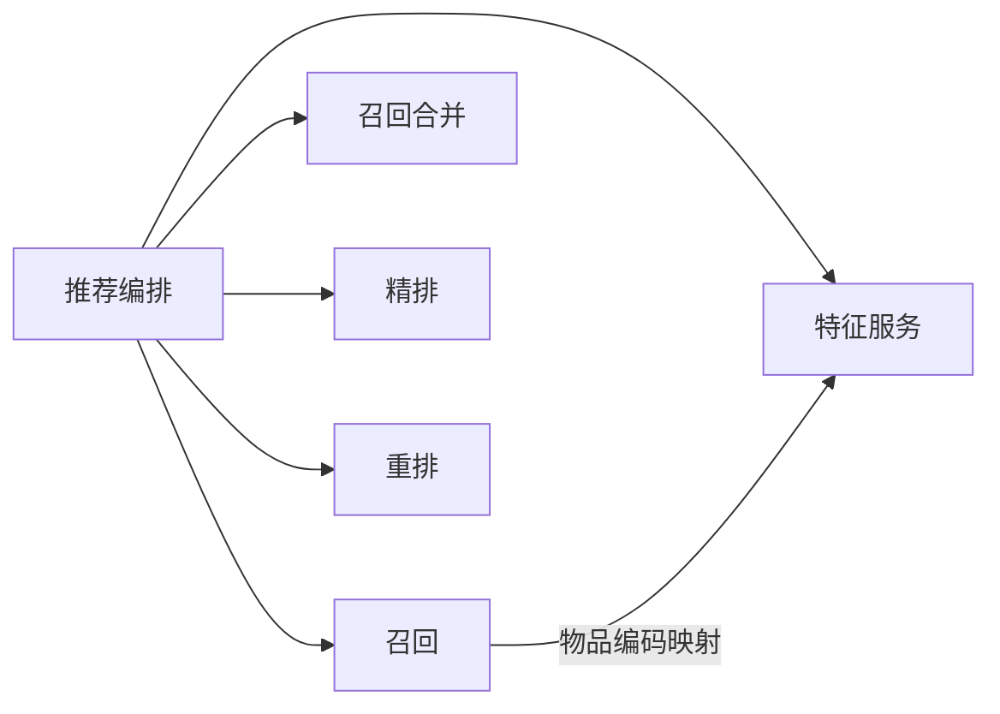
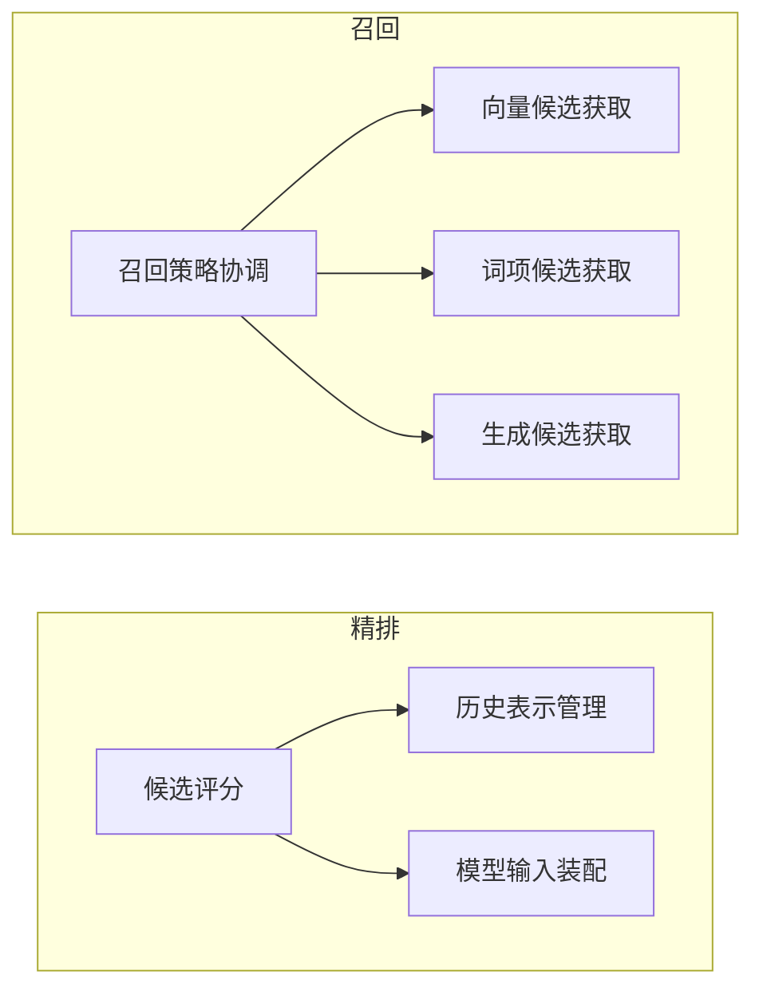
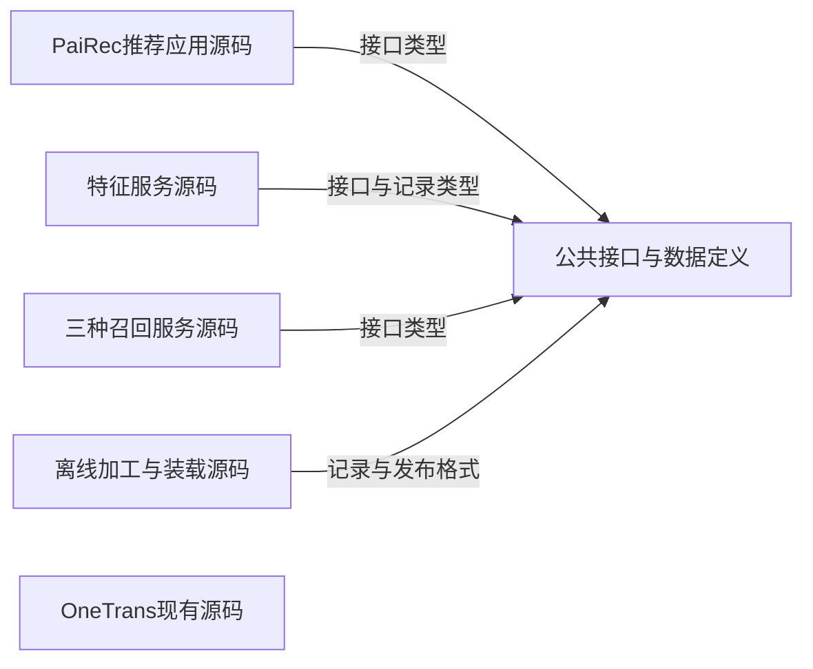
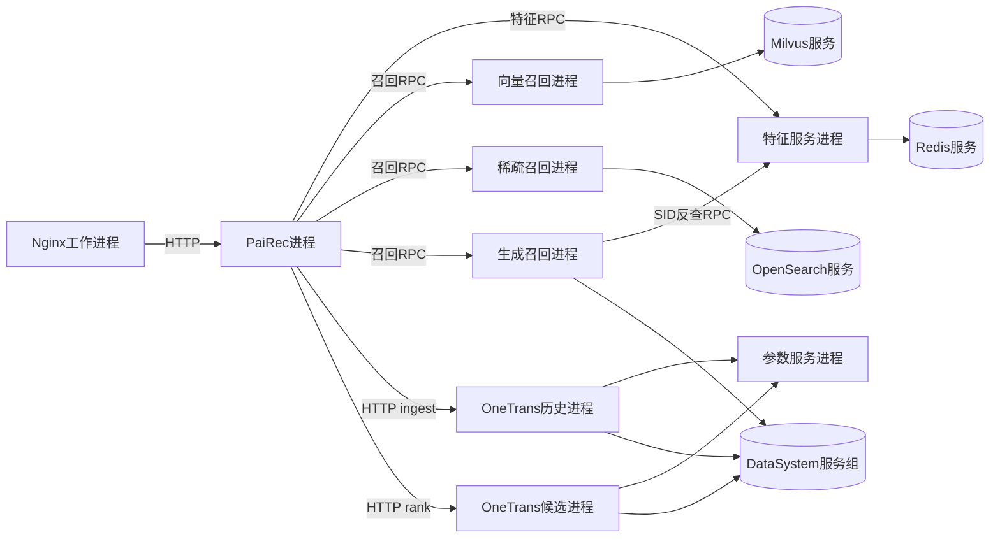
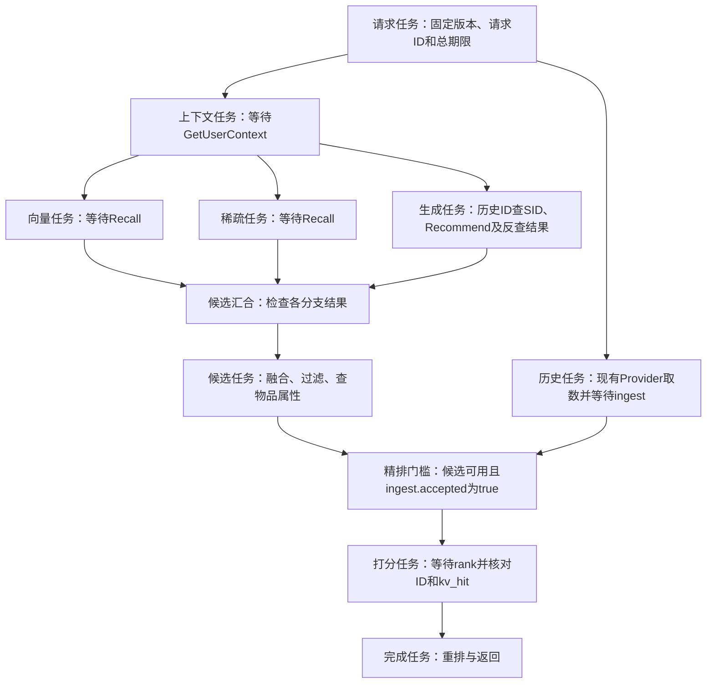
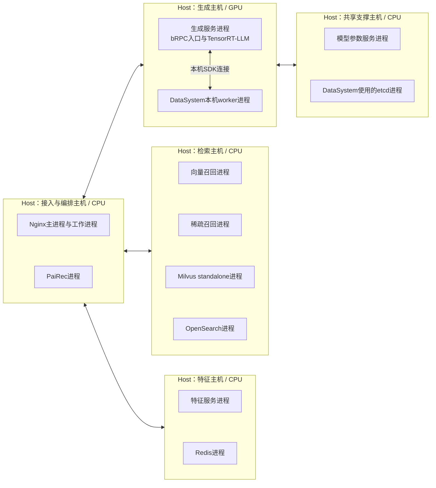
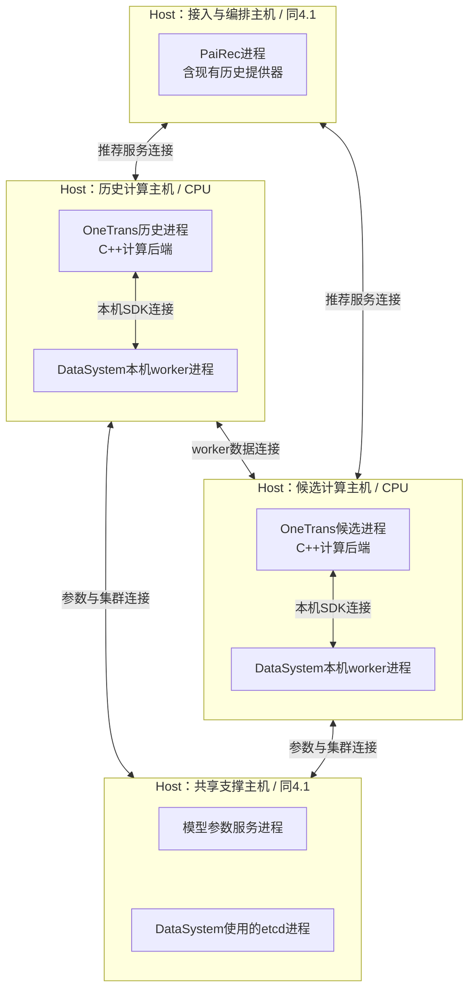
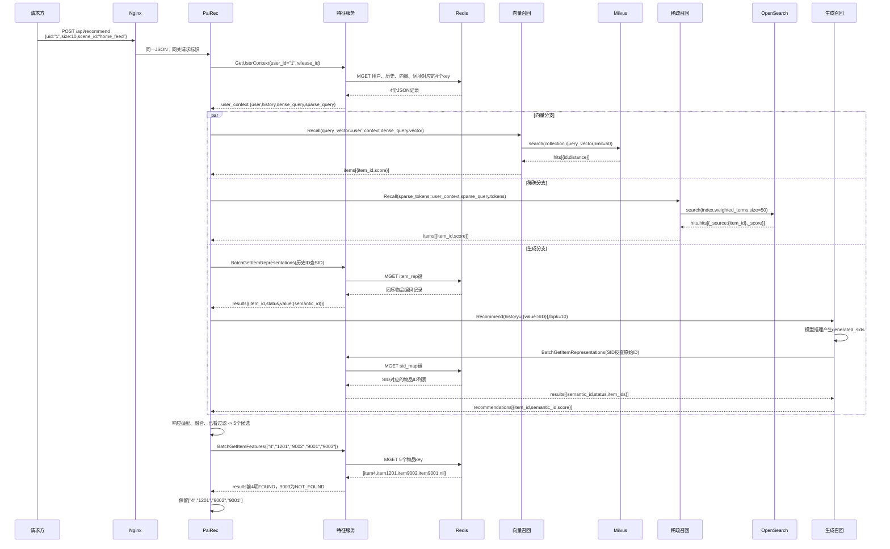
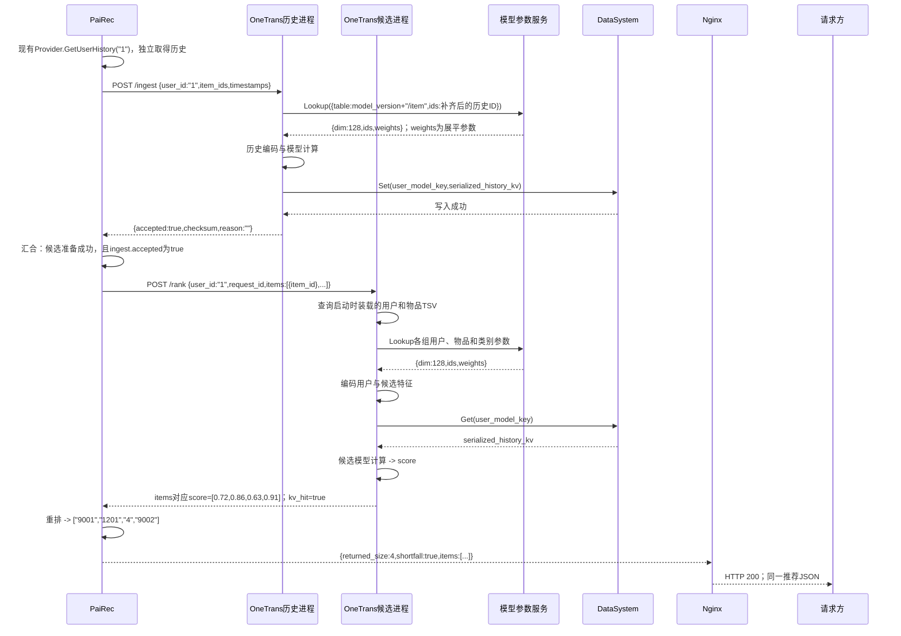

# 系统 4+1 视图

图中符号与连线遵循[图法与 UML 约定](DIAGRAM_NOTATION.md)，每张图前注明使用的图法。

本版按 4+1 的关注点重新组织：逻辑视图描述核心业务抽象及其职责、接口与关系；开发视图描述代码的静态组织；进程视图描述独立执行、并发与同步；物理视图描述运行进程及其执行环境到主机的部署映射；场景用关键用例检验这四种设计。划分依据为 [Kruchten 的 4+1 原文](https://arxiv.org/pdf/2006.04975)。

本系统的约束保持不变：Nginx 统一入口；PaiRec 编排；其他模块通过独立特征服务查询业务数据；OneTrans 按当前源码保留历史提供器、本地特征表和 HTTP 接口；离线装载真实数据与模型资产；人工配置可审阅；压力回放放在系统外部。本文给出目标架构，并明确保留的源码行为，不表示已完成部署。

| 视图 | 图中节点与连线的含义 | 应帮助工程师作出的判断 |
|---|---|---|
| 逻辑 | 业务职责、接口与对象；归属和能力依赖 | 哪些核心抽象承担功能，它们需要哪些业务能力 |
| 开发 | 源码模块、库、接口定义；导入或编译依赖 | 怎样分工开发、复用和构建，改动影响哪些模块 |
| 进程 | 进程、请求任务、工作队列；通信、等待、同步 | 哪些工作并行，状态谁持有，失败会影响什么 |
| 物理 | 主机、执行环境、进程实例与存储；部署归属和网络连接 | 哪些进程同机或跨机，CPU/GPU与数据卷分配在哪里 |
| 场景（+1） | 具体参与者、请求和返回；有先后的交互 | 功能、代码、执行和部署的选择能否共同满足用例 |

“层级”在每个视图内部展开，例如整体逻辑职责再展开为各自的子功能；不同视图是同一系统的不同观察角度，不是前后处理阶段。

## 1. 逻辑视图：核心职责、业务接口与依赖

逻辑视图回答“系统由哪些核心抽象组成，它们各自负责什么，需要其他部分提供什么能力”。本文以业务职责为逻辑单元，用接口及业务对象说明协作。处理顺序与并发放在第 3 节和[请求时序](08_request_walkthrough.md)；源码如何分包、编译放在第 2 节。此处不按进程或机器提前切分职责。

### 1.1 整体逻辑结构

图中的框是逻辑单元；箭头 `A --> B` 统一表示“A 需要 B 提供的业务能力”，不表示先执行 A 再执行 B，也不表示源码导入。推荐编排协调各项能力；召回合并与重排不直接依赖召回算法或精排模型的内部实现。

图法：逻辑结构示意图（非 UML，箭头表示业务能力依赖）。



这些逻辑单元不与独立服务一一对应。例如召回合并、重排可在 PaiRec 内实现；召回算法与特征查询可在独立服务中实现。实现在哪个进程、部署在哪台主机，分别由进程视图与物理视图决定。

| 逻辑单元 | 提供的业务操作 | 拥有的责任与约束 |
|---|---|---|
| 推荐编排 | `recommend(request, policy) -> result` | 持有本次请求上下文，固定场景与版本；取得特征并协调其他能力，核对候选与分数的对应关系 |
| 召回 | `recall(user_context, policy) -> candidates_by_source` | 封装向量、词项、生成三种候选获取方式；保留各路次序、来源与原始分数；生成候选需要物品编码反查 |
| 召回合并 | `merge(candidates_by_source, history, item_features, policy) -> candidates` | 管理唯一候选集合及全部命中来源；按来源策略选取，执行已看过滤、候选限量和属性资格规则；本期没有粗排模型 |
| 精排 | `prepare_history(user_id, history)`；`score(user_id, candidate_ids) -> scored_items` | 管理模型需要的历史表示，产生与候选 ID 一一对应的分数；不决定最终展示顺序 |
| 重排 | `rerank(scored_items, item_features, policy, size) -> result` | 组织最终有序列表，管理同分次序、人工规则与结果数量；不足时返回实际数量 |
| 特征服务 | `GetUserContext`、`BatchGetItemFeatures`、`BatchGetItemRepresentations` | 提供用户上下文、物品属性及编码映射，统一版本与缺失语义；不负责推荐分数或候选资格决策 |

表中的操作表示业务契约，不要求源码存在同名类或网络方法。`request` 含用户、场景和数量；`policy` 是人工场景配置，含发布版本、召回开关、数量及规则。`user_context` 含用户字段、历史和查询表示；`candidates` 保留物品 ID 与来源；`scored_items` 为与候选对应的评分条目；`result` 为最终有序列表及实际数量。

**特征的数据责任与查询责任分开**：特征服务提供事实；编排为召回、候选资格检查和重排取得所需数据，后两者复用已查得的物品属性。生成服务在推理后才知道候选编码，因此直接使用特征服务的编码反查能力。逻辑图中只有需要查询能力的单元依赖特征服务，不把所有使用查询结果的单元都画成查询方。

**当前 OneTrans 保留独立取数边界**：历史来自 PaiRec 现有历史提供器，用户和候选字段来自 OneTrans 本地表，因此不画精排到特征服务的依赖。两套历史需要另行核对；不能因为逻辑上都称为“历史”，就认为它们已经统一。

### 1.2 各逻辑单元内部怎样协作

本层展开内部职责之间的关系。以召回和精排为例：召回策略需要三种候选获取能力；候选评分需要历史表示和模型输入。箭头仍表示能力依赖；图中没有请求的开始、结束或时间顺序。

图法：逻辑结构示意图（非 UML；外框表示职责归属，箭头表示业务能力依赖）。



“历史表示”是历史模型产生、供候选评分使用的中间结果；当前 OneTrans 用注意力键和值张量表示，具体存储不属于这层逻辑图。三种召回对外都形成候选记录，但接口适配保留各路原始分数含义，不把向量分、BM25 分和生成分直接相加。

| 逻辑单元 | 内部职责及依赖 | 对外保持的边界 |
|---|---|---|
| 推荐编排 | 请求上下文管理使用场景策略，并协调各业务接口 | 上下文保存请求 ID、固定版本和已取得特征；不承担检索或模型计算 |
| 召回 | 策略协调使用向量、词项、生成候选获取；生成能力使用特征服务的编码映射 | 输入为用户查询表示或历史编码，输出为带来源的候选 |
| 召回合并 | 候选集合管理使用来源选取策略和候选资格规则 | 重复物品只有一个候选，保留所有来源；资格规则使用编排传入的历史与物品属性 |
| 精排 | 候选评分使用历史表示管理和模型输入装配 | 历史准备产生模型中间结果；候选评分使用它。当前 OneTrans 的取数边界保持 1.1 所述例外 |
| 重排 | 推荐列表组织使用分数次序和人工规则 | 同分时保留合并后的相对次序；最终 `size` 限量区别于召回合并的候选限量 |
| 特征服务 | 查询入口提供用户上下文、物品属性、物品编码三类查询，并共同使用版本与缺失校验规则 | 返回事实与缺失状态，不在特征查询中决定候选去留 |

物品语义编码简称 SID，是模型使用的一组离散整数。编码正查为 `item_id -> semantic_id`，反查为 `semantic_id -> item_ids`，一个编码可能对应多个物品。查询映射记录属于特征服务；产生编码的模型与分词器属于模型资产。完整字段见[特征字典](10_feature_catalog.md)，用户 1 的具体数据传递见[请求推演](08_request_walkthrough.md)。

## 2. 开发视图：源码模块、静态依赖与构建产物

本层按可分别开发和构建的源码范围分组。实线箭头 `A -> B` 只表示 A 导入或编译时依赖 B；不画服务之间的网络调用。公共接口与特征记录定义是复用的代码或规范，不单独部署为服务。

图法：源码依赖示意图（非 UML，连线含义见本节）。



图只保留项目级共享依赖。各程序内部的模型库、数据库 SDK 和通信库在模块文档展开；OneTrans 使用自己的现有 HTTP 类型与计算代码，没有因新增公共接口而自动接入特征服务。三个召回实现合画为一组源码，仍分别交付三个服务程序。

| 源码或配置范围 | 包含的代码职责 | 构建或交付产物 |
|---|---|---|
| PaiRec 推荐应用 | 请求入口、`RecommendEngine`、召回合并与重排规则、特征及模型客户端、现有历史提供器 | 推荐程序及人工可编辑的场景配置；固定依赖官方 PaiRec v2.6.2 |
| 特征服务 | 三种查询方法、批读、记录解码、缺失与版本检查、Redis 适配 | 独立特征服务程序 |
| 三种召回服务 | 向量检索、加权词项检索、生成推理与 SID 反查；各自的后端适配 | 向量、稀疏、生成三个服务程序及索引/模型绑定配置 |
| OneTrans | 现有 `/ingest`、`/rank`、本地特征装配、参数及历史状态访问、模型计算 | OneTrans 服务程序；以不同角色配置启动历史和候选两个进程；配套权重与本地表 |
| 公共接口与数据定义 | 特征及召回请求响应、目标 protobuf、特征记录格式、版本清单格式 | 接口文件、生成代码和共享类型；由相应程序导入或编译，不单独启动 |
| 离线加工与装载 | Tenrec 预处理、特征与表示导出、索引装载、读回核对 | 离线工具、可重放装载文件、索引及模型资产、发布清单 |
| 网关与场景配置 | Nginx 路由；服务地址、版本绑定、召回数量与规则 | Nginx 配置和场景配置；由人工审阅发布 |

编排只依赖业务客户端和规则，不导入 Redis 键名或数据库访问实现。原生 bRPC、Go 与 C/C++ 的调用封装以及现有 HTTP 客户端归入各自程序的通信适配代码，细节见[RPC 视图](06_rpc.md)。构建产生程序与配置；运行时的调用关系另见下一节。

这里规定的是目标源码职责，不要求照图新建同名目录，也不表示代码已经全部具备。当前生成接口的 `history[{value}]`、`recommendations` 结构仍保留，版本字段与特征反查待补；当前 OneTrans `/rank` 仍只收用户与候选 ID。开发缺口与源码证据见[证据与主要缺口](09_evidence_and_gaps.md)。

## 3. 进程视图：独立执行、并发与状态所有权

### 3.1 哪些执行单元相互通信

本层的框表示服务进程或数据库服务组，箭头表示运行时调用；数据库服务组内部可有多个进程，部署映射见第 4 节。历史提供器和原生客户端在 PaiRec 进程内部；它们不增加远程服务跳数。

图法：进程通信示意图（非 UML，连线含义见本节）。



目标特征与召回 RPC 使用原生 bRPC；当前 OneTrans 业务接口使用 HTTP。数据库仍使用各自协议。旧后端需要协议桥时，桥是另一个进程，和后端间的通信见[通信视图](06_rpc.md)。

### 3.2 一个请求在 PaiRec 中怎样并行与汇合

本层只展开 PaiRec 进程中的请求任务，框内的远程方法是该任务等待的调用。向量、稀疏、生成三个分支在取得公共上下文后并行；独立的历史任务可以更早开始。

图法：结构或流程示意图（非 UML，连线含义见本节）。



这是目标编排。当前配套调用方会先 `/rank`，未命中才等待历史任务结束并重查；本设计要求等待结果携带成功或错误，不能仅等一个“任务已结束”的信号。候选为空时跳过打分，返回真实空列表。

| 状态或并发资源 | 所有者及规则 | 故障影响 |
|---|---|---|
| 请求上下文、候选、已取得特征 | PaiRec 单个请求任务持有；并行分支返回后汇合；无重复召回扇出 | 必需分支错误则整请求失败并取消其余等待，不伪装成零候选 |
| 特征查询批次 | 特征服务限制条数、字节和在途数；按原输入位置合并 | 数据库错误与缺键分开；不跨版本补齐 |
| 召回队列和模型执行资源 | 各服务管理自己的有界队列；满载返回错误 | 按剩余期限结束等待；默认不自动重试模型请求 |
| OneTrans 计算任务 | 历史线程池独立；候选内部参数查询、编码、KV 读取与攒批 | KV 未命中时当前候选前向可能不执行，返回的 0.5 不能充当成功证据 |
| 历史注意力缓存 | DataSystem 按当前模型版本与用户 ID 保存；两个 OneTrans 进程读写同一键 | 同用户并发可能覆盖；命中不保证读到本次历史 |
| 生成注意力缓存 | 生成运行时按实际缓存块生命周期管理 | 换入换出按需发生；不能给每个推荐请求固定读写次数 |

正常样例有 PaiRec 三次、生成服务一次特征 RPC；底层 Redis 拆批另计。总预算初值 25 秒，阶段超时取“阶段上限与总剩余时间的较小值”。取消客户端等待不等于远端计算停止；当前 OneTrans 没有请求级释放接口。联调可限制同用户串行并核对历史，但该限制不等于已实现并发隔离。

## 4. 物理视图：进程怎样部署到主机

本节给出一套**目标跨机联调布局**，用 `Host → 进程实例` 明确部署归属。每个 Host 外框表示一台独立 Linux 主机或虚拟机；框内列出部署在该主机上的进程。它不是当前机器清单，也不预设已采用容器或 Kubernetes。

两图使用同一套主机名称：接入与编排、特征、检索、生成、历史计算、候选计算、共享支撑，共七台。相同名称表示同一台主机，不是新增副本。该单副本布局用于验证真实跨机取数和计算，容量与高可用配置另行确定；其他角色可按资源合并，**历史计算与候选计算必须保持不同 Host**。

所有 Host 接入同一业务内网。图中只画主要网络连接，双向实线表示连通要求，不表示调用顺序；框内的连线表示本机连接。完整服务访问关系见第 3 节，不能仅按物理图的几条连线配置访问控制。

### 4.1 入口、特征与召回的主机部署

图法：部署映射示意图（非 UML；Host 外框包含实际部署的进程，连线表示网络连通）。



本布局中 Nginx 与 PaiRec 同机但属于不同进程；特征服务与 Redis 同机，查询仍经过特征服务接口。检索主机承载两个召回前端及其索引服务。Milvus 选用独立部署模式（standalone），采用内嵌 etcd 和本地数据目录；它与 DataSystem 的 etcd 分开。[已有 Milvus 配置](assets/source_snapshots/pairec4tigerllm/k8s/deployment-milvus-standalone.yaml.html#L53)。

生成主机的进程采用当前原生 C++ 后端：bRPC 入口和 TensorRT-LLM 执行器在同一服务进程内，GPU 分配给该进程；DataSystem worker 是同机的另一个存储进程，管理该节点的键值数据。[执行器装配源码](assets/source_snapshots/pairec4tigerllm/cpp/brpc_gateway/brpc_inference_server.cpp.html#L1006)。该主机的 worker 与下一图的两个 worker 加入同一 DataSystem 集群。

### 4.2 OneTrans 两个计算进程与共享状态的跨机部署

图法：部署映射示意图（非 UML；外框为 Host，内框为进程实例）。



两个 OneTrans 进程使用同一服务程序，以调用地址区分历史与候选角色。两端须编入 PS/DataSystem 支持，配置 `embedding_source=ps`、`kv_backend=datasystem`，并使用一致的 `model_version`、参数表及 DataSystem 集群。本基线显式选择 `--compute-backend cpp`，历史与候选均使用 CPU；选择其他后端时应修改进程与设备分配，不能仅在主机名中加上 GPU 就视为已使用。[当前后端选择](assets/source_snapshots/OneTrans_HSE_project/cpp/tools/server_main.cpp.html#L146)。

这里共享的是 **DataSystem 集群中的键值数据**。每台模型主机的 worker 使用自己的本机内存，worker 之间通过网络传输数据；etcd 保存集群元数据，不保存历史注意力张量。三个 worker 必须使用一致的集群配置，所在主机之间须双向网络可达；图中仅展开历史与候选之间的数据通道。三个 worker 不等于三份容灾副本。[已有 worker 集群配置](assets/source_snapshots/pairec4tigerllm/k8s/deployment-datasystem-pool-hostnetwork.yaml.html#L217)。本方案选择本机 worker，不限制 SDK 的其他连接模式；仍需验证 OneTrans 跨机读写及 SDK/worker 版本兼容。

### 4.3 文件、存储与执行环境的归属

| 主机 | 需要部署的数据或资源 | 使用进程及约束 |
|---|---|---|
| 接入与编排 | Nginx 路由、场景配置、当前历史 JSON | Nginx 与 PaiRec 各自读取配置；历史提供器在 PaiRec 内。此基线使用本地 JSON，若改用 Kafka，另配置外部消息服务 |
| 特征 | 版本化 Redis 数据及恢复目录 | 特征服务查询 Redis；离线工具装载数据，重启后可恢复或重载 |
| 检索 | Milvus 数据及依赖存储、OpenSearch 索引目录 | 两个索引服务各自管理；索引版本与本次发布绑定 |
| 生成 | TensorRT-LLM 模型文件、GPU、worker 本机内存与工作目录 | 生成进程使用 GPU 和模型；worker 管理缓存，不把业务 SID 映射替换成模型缓存 |
| 历史计算、候选计算 | 每台均部署同版模型文件、用户 TSV 和物品 TSV；各自的 worker 资源 | 两个 OneTrans 进程启动均读取两份 TSV；文件分别位于本机，不表示共用一个文件系统 |
| 共享支撑 | 参数装载文件、etcd 持久数据目录 | 参数服务启动后装载内存表；etcd 保存集群元数据。现有样例的临时 etcd 目录需改为持久目录 |
| 离线构建环境 | Tenrec 原始快照、加工结果、装载文件、发布清单 | 不承担在线请求；保留可重放与回退的版本资产，发布到以上相应主机或存储 |

`TSV` 是制表符分列表。历史计算实际使用调用方发送的历史 ID；历史进程也装载两份 TSV，是当前程序的启动要求。[当前部署说明](assets/source_snapshots/OneTrans_HSE_project/docs/%E5%8D%95%E6%9C%BA%E5%A4%9A%E8%8A%82%E7%82%B9%E9%83%A8%E7%BD%B2.md.html)。该源码说明中的单机多进程示例，不等于本节跨机布局已验证。

如果采用容器，部署层次应补为 `Host → 容器 → 进程`；采用 Kubernetes 时补为 `Host（Node）→ Pod → 容器 → 进程`。容器或 Pod 的隔离不能替代主机分离：历史与候选必须分配到不同主机；模型进程与所用本机 worker 则保持同机，并核对 SDK 所需的网络与共享内存访问条件。此处只规定容器化后的映射要求，未将已有局部部署脚本视为整套系统的部署清单。[Pod 与容器的关系](https://kubernetes.io/docs/concepts/workloads/pods/)。

### 4.4 同一项能力在四个视图中的位置

| 逻辑职责 | 开发单元 | 运行执行者 | 本基线部署归属 |
|---|---|---|---|
| 推荐编排、召回合并与重排 | 推荐程序、候选与列表规则模块 | PaiRec 请求任务 | 接入与编排主机中的 PaiRec 进程 |
| 特征查询 | 特征程序、记录定义与访问适配 | 特征服务及 Redis | 特征主机中的两个独立进程 |
| 三种候选获取 | 三种召回程序及算法适配 | 两个检索前端、索引服务、生成服务 | 检索主机、生成主机 |
| 历史表示与候选评分 | OneTrans 现有程序与模型模块 | 两个 OneTrans 进程；参数与共享状态服务 | 历史与候选分别在不同主机；各有本机 worker，共用共享支撑主机 |
| 场景与版本策略 | 配置定义、离线/发布工具、入口装配 | 离线任务与推荐请求任务 | 离线构建环境、接入与编排主机，以及各数据所在主机 |

## 5. 场景视图（+1）：用具体用例检验四个视图

### 5.1 正常推荐：用户 1 请求 10 项

前提：所选发布已就绪，三路召回启用；本例单个用户串行请求，OneTrans 历史与本地表覆盖已另行核对。教学请求 `request_id="demo-user-1-001"`、`release_id="demo_tenrec_v1"` 的具体数据见[请求推演](08_request_walkthrough.md)。两张图表示同一请求，历史计算可与召回并行开始。图中保留关键业务参数，省略重复的版本头；完整参数和数值在请求推演中展开。

图法：UML 时序图；同一交互片段 1/2。 PaiRec 代表含并行子任务的编排进程，各分支内同步等待，分支之间可以交错。



图中 `user_context` 就是特征查询返回的用户上下文；历史正查保持物品顺序，生成反查允许一个 SID 对应多个物品。生成响应由客户端从 `recommendations` 转成统一 `items`，并将物品 ID 转为字符串。生成运行时按需读写 DataSystem 缓存，具体调用见生成模块；不把可选换入换出画成每请求必经步骤。

图法：UML 时序图；同一交互片段 2/2。



这里的 Provider 是 PaiRec 内部现有历史读取代码；`user_model_key` 由模型版本与用户 ID 构造，不含请求 ID。`serialized_history_kv` 是历史模型产生的注意力张量字节，参数服务的 `weights` 则是模型参数，二者用途不同。最终 Nginx 将业务 JSON 返回请求方；本例没有够用的十个候选，实际返回四项。

### 5.2 异常和人工发布用例

| 用例及触发 | 动作与可观察结果 | 检验的设计 |
|---|---|---|
| 候选 `9003` 没有物品记录 | 特征响应保留该位置且标 `NOT_FOUND`；召回合并剔除；四个 ID 与分数仍一一对应 | 逻辑候选资格；开发响应契约；进程结果合并 |
| 历史写入失败，或精排 KV 未命中 | 写入失败不提交精排；当前 `/rank` 未命中可能返回 0.5，目标编排检查 `kv_hit` 并判失败 | 进程同步与失败传播；两个物理节点是否真实共享存储 |
| 同用户两个请求使用不同历史 | 当前用户级键有覆盖风险，标记一致性缺口；未补身份设计前不能宣布并发隔离通过 | 逻辑历史对应关系；进程共享状态；部署共享数据域 |
| 数据库超时或必需表示版本错误 | 返回明确失败并停止后续必需阶段；不换另一版本或伪造空输入 | 逻辑版本约束；通信与数据库模块；期限控制 |
| 人工发布新数据或规则 | 新版本完整装载并核对后供新请求选择；在途请求仍使用旧版本；保留可回退的完整旧资产 | 版本管理职责；离线构建与配置代码；请求状态；持久存储 |

人工发布的最小操作如下。`READY` 表示必需数据与索引已经核对就绪，不表示当前 OneTrans 本地资产已自动一致；其文件、PS 表与模型版本需要另外校验。

```python
release = build_release(source_snapshot, feature_recipe, model_bindings)
load_features_and_retrieval_indexes(release)
verify_readback_and_coverage(release)
verify_current_onetrans_assets(release)
mark_ready(release)
activate_for_new_requests(release)
# 旧请求继续使用旧绑定；旧请求结束后才允许回收旧版本。
```

以上场景解释架构应如何工作；真实数据库访问、模型前向、历史一致性和长期缓存容量仍需运行证据。完整字段和教学数值集中在请求文档，不在本篇重复每个载荷。
