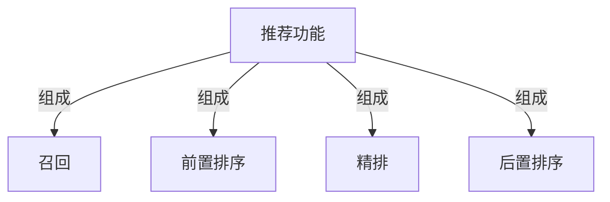
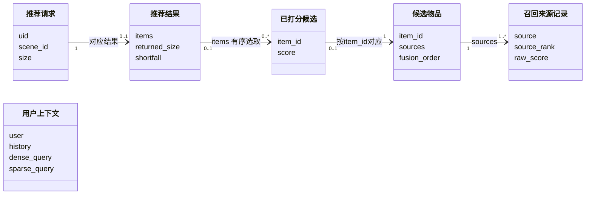
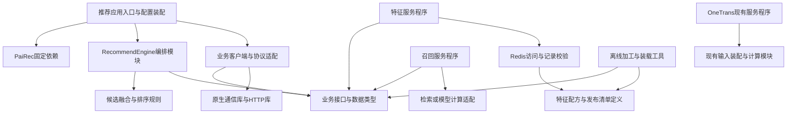
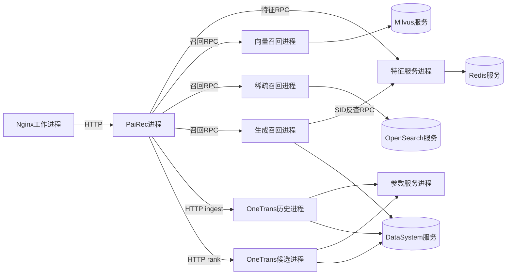
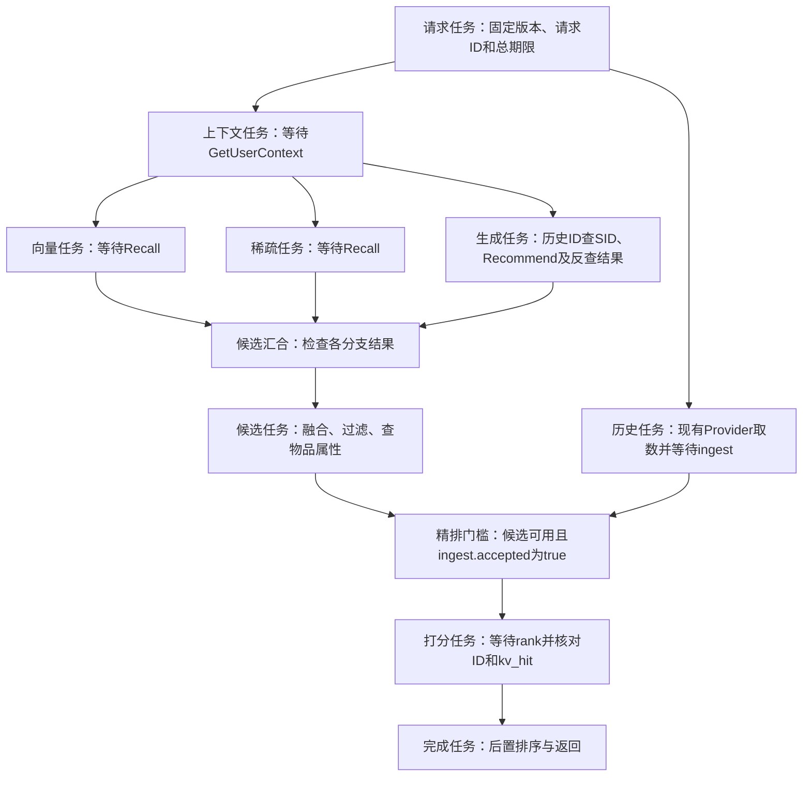
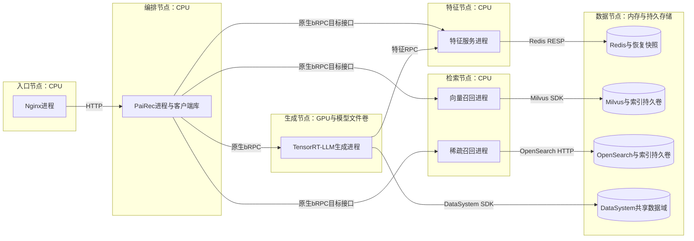
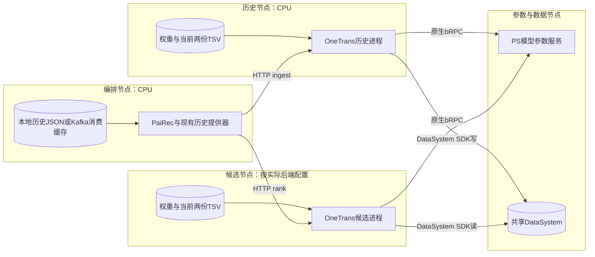
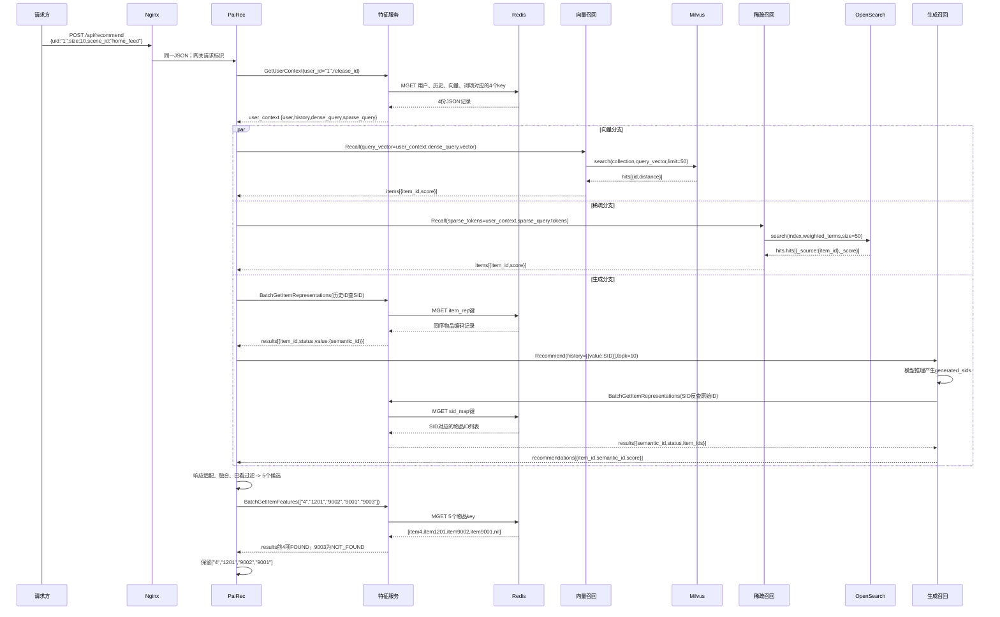

# 系统 4+1 视图

图中符号与连线遵循[图法与 UML 约定](DIAGRAM_NOTATION.md)，每张图前注明使用的图法。

本版按 4+1 的关注点重新组织：逻辑视图描述功能所需的领域抽象；开发视图描述代码的静态组织；进程视图描述独立执行、并发与同步；物理视图描述软件到硬件的映射；场景用关键用例检验这四种设计。划分依据为 [Kruchten 的 4+1 原文](https://arxiv.org/pdf/2006.04975)。

本系统的约束保持不变：Nginx 统一入口；PaiRec 编排；其他模块通过独立特征服务查询业务数据；OneTrans 按当前源码保留历史提供器、本地特征表和 HTTP 接口；离线装载真实数据与模型资产；人工配置可审阅；压力回放放在系统外部。本文给出目标架构，并明确保留的源码行为，不表示已完成部署。

| 视图 | 图中节点与连线的含义 | 应帮助工程师作出的判断 |
|---|---|---|
| 逻辑 | 业务职责、领域对象；组成、关联、使用 | 功能怎样划分，数据与规则归谁负责 |
| 开发 | 源码模块、库、接口定义；导入或编译依赖 | 怎样分工开发、复用和构建，改动影响哪些模块 |
| 进程 | 进程、请求任务、工作队列；通信、等待、同步 | 哪些工作并行，状态谁持有，失败会影响什么 |
| 物理 | 部署节点及其软件分配；网络连接 | CPU/GPU、持久存储和分离部署如何满足运行要求 |
| 场景（+1） | 具体参与者、请求和返回；有先后的交互 | 功能、代码、执行和部署的选择能否共同满足用例 |

“层级”在每个视图内部展开，例如逻辑职责再展开为领域对象；不同视图是同一系统的不同观察角度，不是前后处理阶段。

## 1. 逻辑视图：功能职责与领域模型

### 1.1 推荐功能由哪些职责组成

下图的连线统一表示“组成”。四项职责处于同一抽象层；这里不指定进程数量、调用先后或数据库产品。

图法：职责分解示意图（非 UML，连线含义见本节）。



| 职责 | 业务操作及输入 → 输出 | 内部划分与规则 |
|---|---|---|
| 召回 | `recall(user_context) -> candidates_by_source` | 向量、词项、生成三种候选获取方式；保留来源次序和原始分数 |
| 前置排序 | `select(candidates_by_source, history, item_features, rules) -> candidates` | 融合、合并重复来源、已看过滤、候选限量、属性资格检查；本期不增加粗排模型 |
| 精排 | `prepare_history(user_id, history)`；`score(user_id, candidate_ids) -> scored_items` | 历史计算与候选打分两项能力；打分与候选 ID 对应，不决定最终展示次序 |
| 后置排序 | `order(scored_items, item_features, rules, size) -> recommendation` | 按分数稳定排序，执行人工规则，按实际数量返回 |

这些是业务操作名称，不是已实现的类或网络接口。例：前置排序负责判断候选是否可用，属性查询负责提供事实；前置排序不负责如何读取数据库。精排的历史输入单独取得，不能因为召回也使用“历史”就假定两者来源相同。

推荐功能还使用两项公共能力。它们为上述职责提供输入和规则，不作为额外的排序阶段。

| 公共能力 | 提供的对象或操作 | 责任边界 |
|---|---|---|
| 业务特征查询 | 用户画像、行为历史、用户向量与词项、物品属性、物品语义编码正反查 | 按实体 ID 与发布版本返回事实，区分缺失和错误；不产生推荐分数 |
| 场景与版本管理 | `scene_id -> {release_id, limits, enabled_recalls, rules}`；发布、激活、回退 | 人工选择数据与模型绑定、召回数量和规则；同一请求保持绑定不变 |

物品语义编码简称 SID，是模型使用的一组离散整数；“原始物品 ID 与 SID 的对应关系”属于可查询表示，“怎样计算或解释编码的模型与分词器”属于模型资产。

### 1.2 这些职责围绕哪些领域对象工作

下图采用 UML 概念类图：每个框表示一类业务对象，不要求与网络接口同名或采用面向对象语言。实线箭头表示可导航的关联，不表示请求流转；端点数字表示可关联的对象数量。图中不使用带生命周期约束的组合关系。入口的 `uid` 在内部对应 `user_id`。编排按用户标识取得上下文，这是一项查询行为，因此不画成请求类到上下文类的依赖。

图法：UML 概念类图。



类图中的数量约束只针对单次请求：一个候选可以尚未评分，一个评分条目也可以未被最终结果选中；一个请求可以尚未得到结果。`sources` 保存命中过该物品的召回来源记录。`fusion_order` 是候选第一次被融合选中的位置，用于精排同分时保持稳定次序；`source_rank` 是该物品在某一路召回中的位置。`raw_score` 保留该路原始分数，不能将向量分、BM25 分和生成分直接相加。这些是本文定义的内部字段，由客户端与接口响应对应。候选缺失属性与属性值未知是不同状态，资格规则分别处理。

下面用断言表示业务约束：`selected_candidates` 是前置排序选出的候选，也就是精排输入 `rank_input`；`scored_items` 是精排响应；`result` 是后置排序产生的结果。`recall_history` 指召回使用的特征服务历史，与 OneTrans 自行取得的历史分开。

```python
# 跨职责不变量：描述必须保持的业务关系，不是一次请求的调度代码。
assert all(c.item_id not in recall_history.item_ids for c in selected_candidates)
assert [x.item_id for x in scored_items] == [c.item_id for c in rank_input]
assert set(x.item_id for x in result.items) <= set(x.item_id for x in scored_items)
assert result.returned_size == len(result.items) <= request.size
assert result.shortfall == (result.returned_size < request.size)
# sources保留多路证据；最终score来自精排。数据与模型版本在请求内固定。
```

完整的业务特征字段、缺失语义与版本关系见[特征字典](10_feature_catalog.md)。如何实现这些对象的查询与计算，分别在后续视图展开。

## 2. 开发视图：源码模块、静态依赖与构建产物

图中每个框是源码模块或库。箭头 `A -> B` 表示 A 导入或编译时依赖 B；网络上的请求不在这张图中表示。客户端和服务端依赖共同的接口定义，不互相导入对方的服务程序。

图法：模块关系示意图（非 UML，连线含义见本节）。



| 软件单元 | 负责的源码 | 构建或交付产物 |
|---|---|---|
| 推荐应用 | 入口、`RecommendEngine`、排序规则、历史提供器、各业务客户端 | PaiRec 推荐程序；固定上游 v2.6.2；人工可编辑场景配置 |
| 公共接口 | 三种特征查询、召回请求响应、字段与缺失定义 | 类型定义、目标 protobuf 及生成代码；现有 OneTrans HTTP 类型适配 |
| 通信适配 | Go 调 C/C++ 的进程内边界、原生 bRPC 客户端、HTTP 客户端 | 链入调用方的库；必要的旧后端协议桥可执行程序 |
| 特征服务 | 查询处理、批读、版本与历史指纹检查 | 独立特征服务程序 |
| 三种召回 | 向量搜索、加权词项查询、生成与 SID 反查 | 三种服务程序及模型/索引绑定配置 |
| OneTrans | 现有 `/ingest`、`/rank`、本地 TSV 装配、参数查询、计算 | 同一服务程序分配给历史与候选两个进程；模型及本地数据文件 |
| 离线与发布工具 | 快照加工、向量/SID 导出、数据库装载、读回核对 | 可重放的装载文件、模型资产、版本清单、校验结果 |

特征查询接口为 `GetUserContext`、`BatchGetItemRepresentations` 和 `BatchGetItemFeatures`。各客户端负责将业务对象映射为接口字段，例如 `query_vector = user_context.dense_query.vector`；接口和完整教学对象见[请求推演](08_request_walkthrough.md)。

```text
静态依赖规则
  编排模块 -> 业务接口与规则；不依赖Redis键名或数据库SDK
  特征服务 -> 特征记录定义与Redis适配
  召回服务 -> 公共接口、自己的检索/模型适配
  生成服务 -> 特征客户端，负责模型输出SID的反查
  OneTrans -> 当前本地数据装配、参数与计算状态访问
```

这里列的是目标代码职责，不把旧分支名作为系统模块名。当前生成接口已有 `history[{value}]` 与 `recommendations` 结构；新增版本元数据与特征反查仍需开发。当前 OneTrans `/rank` 仍只收用户、候选 ID，不能由公共特征接口的存在推定它已接入。

## 3. 进程视图：独立执行、并发与状态所有权

### 3.1 哪些执行单元相互通信

本层每个框代表可独立启动的服务进程或数据库服务。箭头表示运行时调用，未决定它们在哪台机器上。历史提供器和原生客户端在 PaiRec 进程内部；它们不增加远程服务跳数。

图法：进程通信示意图（非 UML，连线含义见本节）。



目标特征与召回 RPC 使用原生 bRPC；当前 OneTrans 业务接口使用 HTTP。数据库仍使用各自协议。旧后端需要协议桥时，桥是另一个进程，和后端间的通信见[通信视图](06_rpc.md)。

### 3.2 一个请求在 PaiRec 中怎样并行与汇合

本层只展开 PaiRec 进程中的请求任务，框内的远程方法是该任务等待的调用。向量、稀疏、生成三个分支在取得公共上下文后并行；独立的历史任务可以更早开始。

图法：结构或流程示意图（非 UML，连线含义见本节）。



这是目标编排。当前配套调用方会先 `/rank`，未命中才等待历史任务结束并重查；本设计要求等待结果携带成功或错误，不能仅等一个“任务已结束”的信号。候选为空时跳过打分，返回真实空列表。

| 状态或并发资源 | 所有者及规则 | 故障影响 |
|---|---|---|
| 请求上下文、候选、已取得特征 | PaiRec 单个请求任务持有；并行分支返回后汇合；无重复召回扇出 | 必需分支错误则整请求失败并取消其余等待，不伪装成零候选 |
| 特征查询批次 | 特征服务限制条数、字节和在途数；按原输入位置合并 | 数据库错误与缺键分开；不跨版本补齐 |
| 召回队列和模型执行资源 | 各服务管理自己的有界队列；满载返回错误 | 按剩余期限结束等待；默认不自动重试模型请求 |
| OneTrans 计算任务 | 历史线程池独立；候选内部参数查询、编码、KV 读取与攒批 | KV 未命中时当前候选前向可能不执行，返回的 0.5 不能充当成功证据 |
| 历史注意力缓存 | DataSystem 按当前模型版本与用户 ID 保存；两个 OneTrans 进程读写同一键 | 同用户并发可能覆盖；命中不保证读到本次历史 |
| 生成注意力缓存 | 生成运行时按实际缓存块生命周期管理 | 换入换出按需发生；不能给每个推荐请求固定读写次数 |

正常样例有 PaiRec 三次、生成服务一次特征 RPC；底层 Redis 拆批另计。总预算初值 25 秒，阶段超时取“阶段上限与总剩余时间的较小值”。取消客户端等待不等于远端计算停止；当前 OneTrans 没有请求级释放接口。联调可限制同用户串行并核对历史，但该限制不等于已实现并发隔离。

## 4. 物理视图：把执行单元分配到硬件节点

每个外框是一种可配置的部署节点角色，框内是分配到它的进程及资源。两图中的 PaiRec 和 DataSystem 表示同一系统的共享节点角色。首条链路可将部分角色放在同一主机；验证跨机通信时，OneTrans 历史与候选进程分别部署到两个节点。

### 4.1 推荐入口、特征与召回的部署映射

图法：部署映射示意图（非 UML，连线含义见本节）。



### 4.2 OneTrans 分离部署的映射

图法：部署映射示意图（非 UML，连线含义见本节）。



TSV 是制表符分列表。当前 OneTrans 启动的两个进程都会加载用户和物品 TSV；历史模型的输入仍由调用方发送。历史计算使用 C++ CPU；候选可选择 C++ CPU 或 Python 桥等已有后端，实际设备和回退行为必须记录，不以部署图宣称 GPU 已执行。

| 物理或运维约束 | 本系统的配置要求 |
|---|---|
| 两阶段共享状态 | 显式编入并启用 PS/DataSystem，两端模型版本、用户 ID 与共享数据域一致；进程本地存储不满足跨进程共享 |
| 数据可恢复 | 离线文件卷或对象存储保留 Tenrec、加工结果、装载文件和清单；Redis 可持久化恢复或重载，索引使用持久卷 |
| 模型可重现 | 权重、词表、SID 版本、索引与特征发布绑定；OneTrans 本地文件另行核对 |
| 容量与故障边界 | 按资源测量增加服务副本；只画了单个角色不等于具备高可用，数据库和共享状态的可用性需单独配置 |
| 人工操作 | 可选择版本、服务后端、召回开关与数量、屏蔽规则和回退版本；外部回放器产生测试负载 |

### 4.3 同一项能力在四个视图中的位置

| 逻辑职责 | 开发单元 | 运行执行者 | 部署节点 |
|---|---|---|---|
| 前置、后置排序 | 候选融合与排序规则模块 | PaiRec 请求任务 | 编排节点 |
| 业务特征查询 | 特征程序、记录定义与访问适配 | 特征服务及 Redis | 特征节点、数据节点 |
| 三种候选获取 | 三种召回程序与算法适配 | 召回服务及其数据库/模型运行时 | 检索节点、生成节点、数据节点 |
| 历史计算与候选评分 | OneTrans 现有程序及模型模块 | 两个 OneTrans 进程、PS、DataSystem | 历史节点、候选节点、参数与数据节点 |
| 版本与场景管理 | 离线/发布工具、配置定义、入口装配 | 离线任务及请求开始时的版本选择 | 离线构建环境、编排与数据节点 |

## 5. 场景视图（+1）：用具体用例检验四个视图

### 5.1 正常推荐：用户 1 请求 10 项

前提：所选发布已就绪，三路召回启用；本例单个用户串行请求，OneTrans 历史与本地表覆盖已另行核对。教学请求 `request_id="demo-user-1-001"`、`release_id="demo_tenrec_v1"` 的具体数据见[请求推演](08_request_walkthrough.md)。两张图表示同一请求，历史计算可与召回并行开始。图中保留关键业务参数，省略重复的版本头；完整参数和数值在请求推演中展开。

图法：UML 时序图；同一交互片段 1/2。 PaiRec 代表含并行子任务的编排进程，各分支内同步等待，分支之间可以交错。



图中 `user_context` 就是特征查询返回的用户上下文；历史正查保持物品顺序，生成反查允许一个 SID 对应多个物品。生成响应由客户端从 `recommendations` 转成统一 `items`，并将物品 ID 转为字符串。生成运行时按需读写 DataSystem 缓存，具体调用见生成模块；不把可选换入换出画成每请求必经步骤。

图法：UML 时序图；同一交互片段 2/2。


这里的 Provider 是 PaiRec 内部现有历史读取代码；`user_model_key` 由模型版本与用户 ID 构造，不含请求 ID。`serialized_history_kv` 是历史模型产生的注意力张量字节，参数服务的 `weights` 则是模型参数，二者用途不同。最终 Nginx 将业务 JSON 返回请求方；本例没有够用的十个候选，实际返回四项。

### 5.2 异常和人工发布用例

| 用例及触发 | 动作与可观察结果 | 检验的设计 |
|---|---|---|
| 候选 `9003` 没有物品记录 | 特征响应保留该位置且标 `NOT_FOUND`；前置排序剔除；四个 ID 与分数仍一一对应 | 逻辑候选资格；开发响应契约；进程结果合并 |
| 历史写入失败，或精排 KV 未命中 | 写入失败不提交精排；当前 `/rank` 未命中可能返回 0.5，目标编排检查 `kv_hit` 并判失败 | 进程同步与失败传播；两个物理节点是否真实共享存储 |
| 同用户两个请求使用不同历史 | 当前用户级键有覆盖风险，标记一致性缺口；未补身份设计前不能宣布并发隔离通过 | 逻辑历史对应关系；进程共享状态；部署共享数据域 |
| 数据库超时或必需表示版本错误 | 返回明确失败并停止后续必需阶段；不换另一版本或伪造空输入 | 逻辑版本约束；通信与数据库模块；期限控制 |
| 人工发布新数据或规则 | 新版本完整装载并核对后供新请求选择；在途请求仍使用旧版本；保留可回退的完整旧资产 | 版本管理职责；离线构建与配置代码；请求状态；持久存储 |

人工发布的最小操作如下。`READY` 表示必需数据与索引已经核对就绪，不表示当前 OneTrans 本地资产已自动一致；其文件、PS 表与模型版本需要另外校验。

```python
release = build_release(source_snapshot, feature_recipe, model_bindings)
load_features_and_retrieval_indexes(release)
verify_readback_and_coverage(release)
verify_current_onetrans_assets(release)
mark_ready(release)
activate_for_new_requests(release)
# 旧请求继续使用旧绑定；旧请求结束后才允许回收旧版本。
```

以上场景解释架构应如何工作；真实数据库访问、模型前向、历史一致性和长期缓存容量仍需运行证据。完整字段和教学数值集中在请求文档，不在本篇重复每个载荷。
