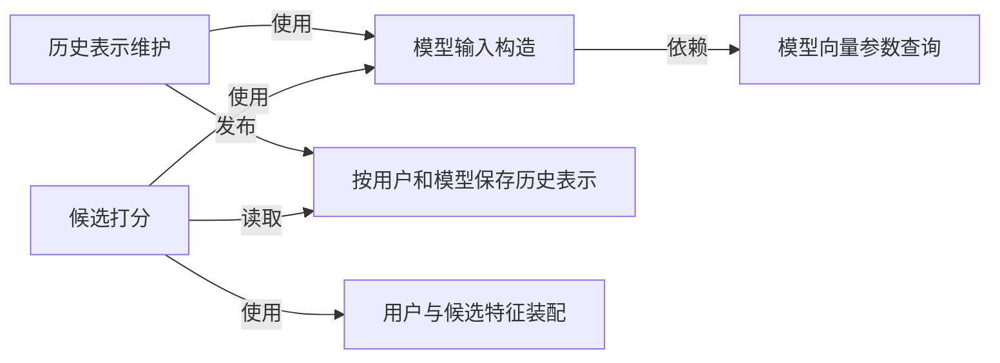
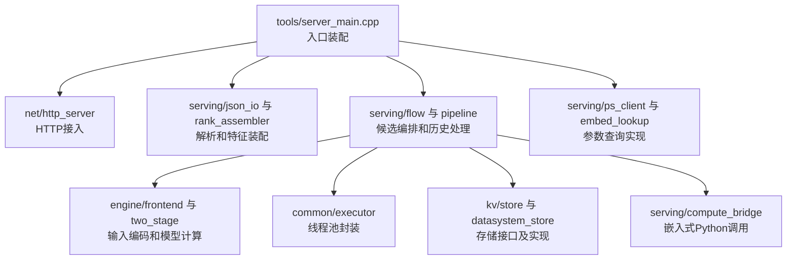
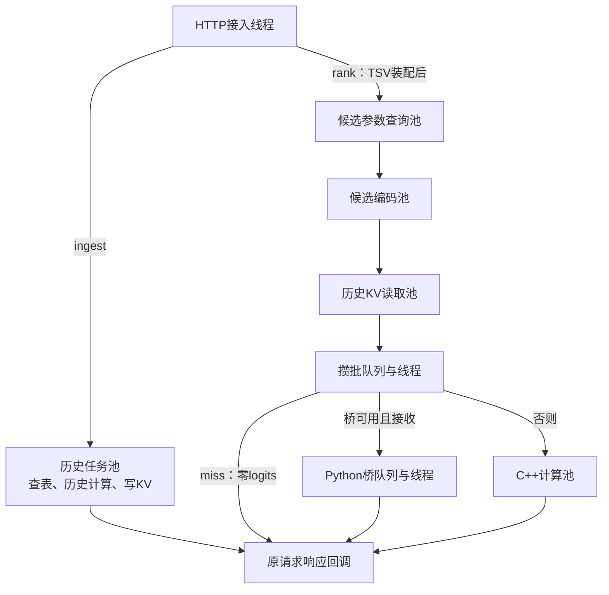
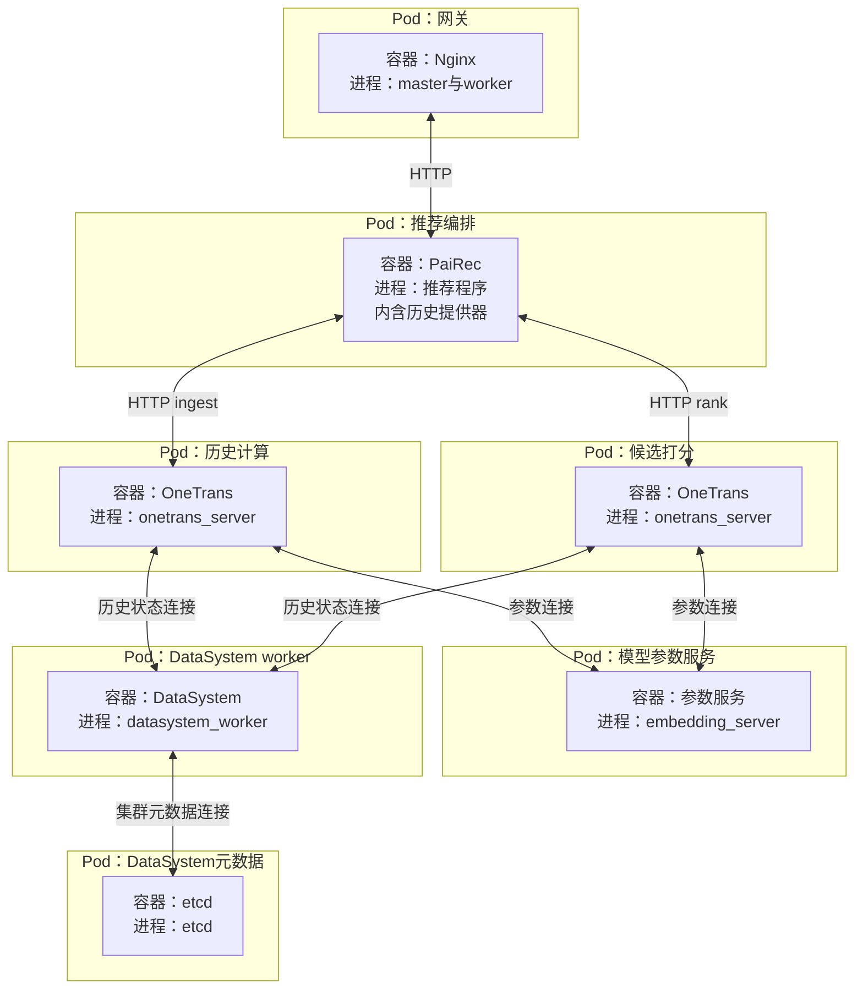

# OneTrans 精排：按现有源码描述的 4+1 视图

图中符号与连线遵循[图法与 UML 约定](DIAGRAM_NOTATION.md)，每张图前注明使用的图法。

本文以当前代码的数据来源和接口为准。OneTrans **目前不调用统一特征服务**：历史由调用方发送，用户和候选业务特征由本地文件装配，模型向量参数通过参数服务或本地权重读取。其他模块按统一特征服务规划，不能反推 OneTrans 已完成相同改造。

```yaml
module: OneTrans 精排
input_from: PaiRec 编排
public_entry: Nginx -> PaiRec
main_path: POST /ingest -> 历史计算结果 -> POST /rank
alternative_interface: POST /score   # 已有完整字段接口，当前配套精排调用方用 /rank
business_features: 本地 TSV 文件     # TSV 是以制表符分列的文本表
history_source: 调用方发送的有序物品 ID
model_parameters: PS 或进程内权重    # PS：Parameter Server，模型参数服务
intermediate_result: DataSystem 或进程内存储
final_ordering: PaiRec               # 精排服务逐候选打分，PaiRec 执行重排规则
```

源码中的 S 是历史序列阶段，NS 是用户与候选特征阶段；部署文档的 P/D 分别对应这两个计算进程。本文统一称“历史计算”和“候选打分”。注意力 K/V 是模型的键张量、值张量；数据库 key/value 则表示存储键和值，两者不要混用。本文只审阅源码与文档，没有重新运行模型、PS 或 DataSystem。

## 1. 逻辑视图：两个计算阶段，各自使用什么数据

本图表示能力之间的依赖：箭头从使用方指向所需能力，不表示一次请求的执行顺序。数据来源见 1.1，线程与处理顺序见第 3 节。

图法：逻辑结构示意图（非 UML，箭头表示能力依赖）。



历史表示维护负责将有序历史变成可复用的注意力状态；候选打分负责结合该状态和候选特征产生分数。它不决定推荐列表顺序，也不产生召回候选。配套代码虽然借用 PaiRec 的召回节点触发历史计算，也不能把它画成一路召回。[触发器职责](assets/source_snapshots/pairec4tigerllm_8506/services/recall/onetrans_s_stage.go.html#L212)。

### 1.1 数据来源与 key/value

| 数据 | 当前承载位置 | 查找键 key | 返回值 value / 用途 |
|---|---|---|---|
| 用户历史 | PaiRec 历史提供器：Kafka 消费缓存，或配置指定的 `user_features.json` | 原始用户 ID 字符串 | 有序点击物品 ID；调用方转为 `/ingest.item_ids` |
| 用户业务特征 | 启动读取 `artifacts/domain_features/user_features.tsv`，放入 OneTrans 内存表 | 第 1 列 `user_id`，解析为整数 | 第 2、3 列 `gender, age`；文件中的 `hist` 不在 `/rank` 路径使用 |
| 候选业务特征 | 启动读取 `artifacts/domain_features/item_rank_lookup.tsv`，放入 OneTrans 内存表 | 第 1 列 `item_id`，解析为整数 | 类别兼容槽及 15 个数值特征，具体配方见下节 |
| 模型向量参数 | PS；也支持进程内权重表 | `(table, id)`，表名为 `{model_version}/user、item、artist、album` | 每个 ID 对应 128 维浮点向量；128 来自当前模型配置 |
| 历史计算结果 | DataSystem；也支持进程内存储 | `kv:{b64url(model_version)}:{b64url(user_id)}` | 序列化的逐层注意力 K/V、有效历史长度和张量形状 |
| Transformer 权重与数值编码参数 | 模型权重文件，启动加载 | 模型制品中的张量名 | 常驻计算参数；不从业务特征服务逐请求读取 |

`b64url` 表示 URL 安全的 Base64 编码，并去除末尾填充符。历史结果 key **不包含请求 ID 或历史版本**。同一用户、同一模型版本再次写入时覆盖同一个键。[存储键实现](assets/source_snapshots/OneTrans_HSE_project/cpp/src/kv/store.cpp.html#L43)。

```python
# 配套 PaiRec 当前历史来源；Provider 是进程内代码，不是统一特征服务的远程调用。
if kafka_is_configured and kafka_consumer_cache.contains(user_id):
    history = kafka_consumer_cache[user_id].ClickHistory
else:
    # 首次使用时加载整份 JSON 到进程内存。
    history = parse_comma_separated_ids(user_features_json[user_id]["click_history"])
ingest_body = {
    "user_id": user_id,
    "item_ids": history,
    "timestamps": list(range(len(history))),  # 0..n-1，调用方生成的占位序号；不参与模型位置编码
}
```

来源：[历史提供器](assets/source_snapshots/pairec4tigerllm_8506/services/feature/provider.go.html#L50)、[JSON 字段](assets/source_snapshots/pairec4tigerllm_8506/services/feature/provider.go.html#L108)、[调用方构造请求](assets/source_snapshots/pairec4tigerllm_8506/services/recall/onetrans_s_stage.go.html#L72)。无历史时当前触发器不发送 `/ingest`。

### 1.2 当前 `/rank` 实际输入配方

下面按当前默认 15 + 15 维模型配置写出运行行为，不能替换成旧设计中的 `feature_v1` 配方。

```python
# user_features.tsv：表头 user_id, gender, age, hist；实际只读前三列。
users[int(user_id)] = {"gender": float(gender), "age": float(age)}

# item_rank_lookup.tsv：表头 item_id, artist_ids, album_ids, d1, ..., d15。
# 实际解析器把第二列同时用作两个类别槽，第三列不参与装配。
items[int(row[0])] = {
    "artist_ids": [int(row[1])],
    "album_ids": [int(row[1])],
    "dense": pad_right_with_zero(list(map(float, row[3:18])), 15),
}

# 收到 /rank 后的装配结果。
uid_sparse = parse_integer(user_id)
user_dense = [users[uid_sparse]["gender"], users[uid_sparse]["age"]] + [0.0] * 13
candidates = [{"item_id": item_id, **items[item_id]} for item_id in candidate_ids]
# 用户缺失：user_dense 全 0。
# 物品缺失：artist_ids=[]、album_ids=[]、dense 为 15 个 0。
```

这里的 `artist/album` 是沿用模型原字段名的兼容槽，当前都装视频类型值，**不表示有歌手或专辑业务数据**。装配器不执行标准化，也不做 `category + 1`。字符串 ID 目前由 `strtoll` 宽松解析，不能视为已做严格 ID 校验。[TSV 读取](assets/source_snapshots/OneTrans_HSE_project/cpp/src/serving/rank_assembler.cpp.html#L18)；[请求装配](assets/source_snapshots/OneTrans_HSE_project/cpp/src/serving/rank_assembler.cpp.html#L78)。

现有部署说明将 `item_features.tsv` 重排为下列 15 列；服务器只按列位置读取，不验证业务列名。

```python
candidate_dense_columns = [
    "video_category", "n", "ctr", "like_rate", "follow_rate", "share_rate",
    "watch_mean", "watch_max", "watch_sum", "log1p_watch_sum",
    "male_ratio", "avg_age", "click", "like", "follow",
]
# n：样本数；click/like/follow：对应行为计数；*_rate、ctr：计数除以样本数。
# watch_*：watching_times 字段统计；不要误称为视频观看时长。
# video_category：数据集视频类型编码；不扩写成不存在的主题分类。
```

来源为[部署说明中的转换命令](assets/source_snapshots/OneTrans_HSE_project/docs/%E5%8D%95%E6%9C%BA%E5%A4%9A%E8%8A%82%E7%82%B9%E9%83%A8%E7%BD%B2.md.html#L94)。这只是“按该命令生成时”的配方，本地没有实际部署的这两份 TSV，未验证线上文件内容。还需注意[原始聚合脚本](assets/source_snapshots/OneTrans_HSE_project/onetrans/tools/build_domain_features.awk.html#L33)将第 9 列性别累加到 `iage`，导致输出名为 `avg_age` 的列与其名称不符；该问题作为数据制品缺口保留，不在本轮修改模型或数据脚本。

独立的 [Tenrec 回放适配器](assets/source_snapshots/OneTrans_HSE_project/onetrans/tools/tenrec_adapter.py.html#L155)调用 `/score`，采用另一套配方：用户性别、年龄标准化后加 13 个历史统计均值；候选 15 个统计量标准化并裁至 ±5；`album_ids=[]`。它不是当前 PaiRec `/rank` 主路径，不能把两套配方合并描述。

### 1.3 模型输入与历史状态的结构

```python
# 当前随库模型的形状；M 是本请求候选数，H 是注意力头数。
history_input_shape = [1, 50, 128]
history_layer_lengths = [50, 38, 27, 16]
history_kv_shape = [[1, length, 4, 32] for length in history_layer_lengths]  # K、V 各一组
candidate_numeric_shape = [M, 15 + 15]  # 用户数值 + 候选数值
candidate_piecewise_shape = [M, 240]   # 30个数值特征，每项8个分段编码值
candidate_token_shape = [M, 5, 128]
candidate_output_shape = [M, 2]
```

token 在这里是一组模型输入向量；logit 是模型输出头的原始数值。当前配置：模型宽度 128、4 个注意力头、4 层、历史上限 50、候选 5 个 token。历史 K/V 的序列维度依次为 50、38、27、16；补空位由有效长度掩码排除。[权重配置](assets/source_snapshots/OneTrans_HSE_project/cpp/artifacts/weights/manifest.json.html#L2)；[历史编码](assets/source_snapshots/OneTrans_HSE_project/cpp/src/engine/frontend.cpp.html#L78)。

```python
# 候选的五组输入；多值类别参数取均值，空列表得到零向量。
groups = [encoded_dense, user_embedding, item_embedding, artist_embedding, album_embedding]
tokens = encode_groups(groups)                  # 每候选形状 [5, 128]
logits = transformer(tokens, history_kv)        # M 个候选 -> [M, 2]
rank_score = sigmoid(logits[:, 0])              # 首个原始输出转换到 0~1，不自动代表点击概率
# 各候选独立成行，不对候选列表做相互注意力；最终分数排序由 PaiRec 完成。
```

上述五组与分段编码见[候选前端](assets/source_snapshots/OneTrans_HSE_project/cpp/src/engine/frontend.cpp.html#L123)。时间戳只记录最后一个值，不进入历史模型计算：[历史处理](assets/source_snapshots/OneTrans_HSE_project/cpp/src/serving/pipeline.cpp.html#L103)。

## 2. 开发视图：代码模块和现有接口

本图表示源文件的静态使用关系，不表示请求经过它们的先后顺序。`server_main.cpp` 负责装配，公共实现编入 `onetrans_core` 静态库，再链接成 `onetrans_server`。

图法：源码依赖示意图（非 UML，箭头表示静态使用关系）。



| 文件/模块 | 当前职责 |
|---|---|
| [server_main.cpp](assets/source_snapshots/OneTrans_HSE_project/cpp/tools/server_main.cpp.html#L214) | 装载 TSV；注册 `/ingest`、`/rank`、`/score`；返回业务结果 |
| [json_io.cpp](assets/source_snapshots/OneTrans_HSE_project/cpp/src/serving/json_io.cpp.html#L12) | 解析请求；`/ingest` 只检查历史 ID 与 timestamps 等长，不检查时间升序；序号不参与模型计算，详见[请求推演](08_request_walkthrough.md) |
| [rank_assembler.cpp](assets/source_snapshots/OneTrans_HSE_project/cpp/src/serving/rank_assembler.cpp.html#L78) | 将用户、候选 ID 转成完整候选输入；不调用 Redis 或特征服务 |
| [pipeline.cpp](assets/source_snapshots/OneTrans_HSE_project/cpp/src/serving/pipeline.cpp.html#L98) | 执行历史计算、序列化、写存储，形成 accepted 回执 |
| [flow.cpp](assets/source_snapshots/OneTrans_HSE_project/cpp/src/serving/flow.cpp.html#L78) | 查询参数、编码、读历史结果、攒批、计算与拆分返回 |
| [ps_client.cpp](assets/source_snapshots/OneTrans_HSE_project/cpp/src/serving/ps_client.cpp.html#L41) | 使用原生 bRPC 查询模型向量参数；bRPC 是这里采用的远程调用框架 |
| [datasystem_store.cpp](assets/source_snapshots/OneTrans_HSE_project/cpp/src/kv/datasystem_store.cpp.html#L46) | 用 DataSystem 客户端读写序列化历史结果 |

| 构建或发布产物 | 来源与条件 |
|---|---|
| `onetrans_core`、`onetrans_server` | C++20、Folly；入口与核心库分别构建、链接 |
| PS 客户端及生成的 protobuf 代码 | `ONETRANS_WITH_PS=ON` 且找到 bRPC；参数服务本身是另一个程序 |
| DataSystem 存储实现 | `ONETRANS_WITH_DATASYSTEM=ON` 且找到 SDK；`ONETRANS_DATASYSTEM_MOCK` 只用于模拟接入，不能作为真实存储证据 |
| Python 计算桥 | `ONETRANS_PYTHON_BRIDGE=ON` 且找到 Python Development；运行还需匹配的 Python、PyTorch 和可导入的 `bridge_score.py`、`onetrans` 包 |
| 模型与业务数据 | `manifest.json`、`weights.bin`、用户 TSV、物品 TSV 独立发布；运行参数不能替代这些文件 |

以上开关控制的是可用代码，不证明实际请求使用了该后端。构建没有找到 PS 或 DataSystem 依赖时可退回本地实现；运行前应记录构建选项、SDK/worker、Folly、bRPC、Python/PyTorch 和 CUDA 版本。仓库 CMake 没有统一锁定这些运行时的版本，不能从机器上的最新安装反推已验证组合。[构建定义](assets/source_snapshots/OneTrans_HSE_project/cpp/CMakeLists.txt.html#L49)。

```typescript
// 已有 HTTP 接口类型；省略计时字段，不添加尚未实现的 ready 或请求唯一 key。
type IngestRequest = { user_id: string; item_ids: number[]; timestamps: number[] };
type IngestResponse = { accepted: boolean; shard: number; checksum: string; reason: string };

type RankRequest = { request_id?: string; user_id: string; items: { item_id: string }[] };
type RankResponse = {
  code: number; msg: string; request_id: string; model_version: string; model_role: string;
  items: { item_id: string; score: number }[];
  trace: { kv_hit: boolean; n_candidates: number };
};

type ScoreRequest = {
  user_id: string; uid_sparse: number; user_dense: number[];
  candidates: { item_id: number; artist_ids: number[]; album_ids: number[]; dense: number[] }[];
};
type ScoreResponse = { user_id: string; shard: number; kv_hit: boolean; logits: number[][] };
```

`/ingest` 在计算与写入返回后才响应，写入成功时 `accepted=true`；不是仅入队就成功。`/score` 接收完整字段，绕过 TSV 装配，但**进程启动仍无条件加载两份 TSV**。`/rank` 按输入候选顺序返回分数；`/score` 按候选顺序返回原始输出值，没有逐行物品 ID。[三个路由](assets/source_snapshots/OneTrans_HSE_project/cpp/tools/server_main.cpp.html#L234)。

## 3. 进程视图：历史与候选的执行边界

HTTP 接入线程负责收包、解析；`/rank` 还在该线程查已加载的 TSV 内存表。提交异步任务后，接入线程可继续处理下一连接。历史任务在一个历史线程内顺序完成查参数、编码、历史前向和 KV 写入；候选请求则在几个池之间交付，随后攒批并选择一个计算后端。

图法：进程内任务流示意图（非 UML）。箭头表示任务交付或完成回调，不表示额外服务；响应对象是代码，不是一个独立发送线程。



候选的四表查询在本请求内顺序执行，不同请求可由线程池并发处理；Get 每请求一次，批内历史去重发生在读取之后。Python 解释器嵌在同一进程，CUDA 是否可用决定该后端设备；历史 `/ingest` 始终走 C++。HTTP 回调由完成或失败所在的线程直接发送并关闭连接，慢发送可能占住历史、计算、桥或攒批线程。

以上是执行结构，不是容量结论。默认线程数不等于实际部署值，`queue_cap` 是 pending 快照的软检查，攒批队列没有独立容量上限；Python 桥满时可回退 C++。每个同步点、对象的复制/移动/释放、慢与失败路径、数值循环及高并发工作量，集中在[OneTrans 进程内部源码专题](13_onetrans_process_analysis.md)。

## 4. 物理视图：容器、进程与共享数据域

下图沿用[系统物理视图](01_system.md)的目标 Pod 分组；每个外框表示一种部署单元，内框表示容器及其主要进程，不表示实例数量或主机位置。OneTrans 当前资料是多进程启动示例，历史与候选的镜像及 Pod 配置仍需补齐。未规定主机分配、调度、worker 数量，或把 worker 与模型放在同一 Pod。

图法：部署映射示意图（非 UML）。双向连线表示网络连通要求，不表示请求顺序。



历史和候选容器运行同一程序，均注册三个 HTTP 接口，通过调用地址区分职责。Python 后端把解释器及 PyTorch 嵌入 `onetrans_server`，不另启动 Python 服务进程；C++ 后端使用 CPU，Python 后端按 CUDA 是否可用选择 GPU 或 CPU，设备分配由部署确定。[嵌入调用](assets/source_snapshots/OneTrans_HSE_project/cpp/src/serving/compute_bridge.cpp.html#L28)、[设备选择](assets/source_snapshots/OneTrans_HSE_project/cpp/tools/bridge_score.py.html#L26)。

| 使用方 | 必要资源与一致性要求 |
|---|---|
| PaiRec | 现有历史提供器的 JSON 文件或 Kafka 连接；这不是统一特征服务取数 |
| 两个 OneTrans 容器 | 匹配的 `manifest.json`、`weights.bin`、用户 TSV、物品 TSV；两个程序启动均读取两份 TSV。挂载或分发方式待定 |
| 参数服务 | 按模型版本装载 user/item/artist/album 参数表；维度与模型一致 |
| DataSystem | 两个模型进程访问同一数据域，键中的模型版本与用户 ID 一致；不要求连接同一个 worker。独立本地 KVStore 不满足共享 |
| 可选 Python 环境 | 包、解释器 ABI、PyTorch 和设备运行时匹配；C++ 计算代码仍保留用于回退 |

```yaml
split_process_requirements:
  binary: 编入真实PS与DataSystem支持，检查构建日志与加载的动态库
  embedding_source: ps
  kv_backend: datasystem
  model_version: 两端一致，同时用于参数表前缀和历史结果键
  candidate_compute_backend: 显式选择cpp或python，核对实际执行路径
  shared_state_check: 历史端写入，候选端取回匹配payload并完成前向
```

`/healthz` 只能辅助检查，不能替代上述共享读写验证：DataSystem 实现的 `size()` 固定返回 0；`compute_backend=python` 表示桥可用，不说明设备，也不排除某批因桥队列拒绝而走 C++。本轮没有启动这些服务或验证资源容量。[存储计数实现](assets/source_snapshots/OneTrans_HSE_project/cpp/src/kv/datasystem_store.h.html#L40)、[后端标记](assets/source_snapshots/OneTrans_HSE_project/cpp/src/serving/flow.cpp.html#L48)。

## 5. 场景视图：一次候选打分的输入输出

以下统一使用[整条请求样例](08_request_walkthrough.md)中的用户 1。十个历史 ID 来自已有 Tenrec 样例；候选 4、1201、9002、9001 仅为构造接口示例，均不是实际召回输出。**尚未证明现有历史提供器返回这组历史，也未证明当前 TSV 覆盖该用户与候选**；不能由特征服务样例推断 OneTrans 已加载相同数据。

```python
# 接口构造示例；不是现有 Provider 已读取的运行结果。
example_user_id = "1"
example_history_ids = [2, 3, 80936, 781, 111774, 1230, 26403, 991, 2362, 1202]
example_timestamps = list(range(10))   # 0..9，与现有调用方的序位构造方式一致
example_candidate_ids = [4, 1201, 9002, 9001]
```

下图展示调用方提供上述样例输入时的数据传递，并使用“历史成功返回后再打分”的顺序表达依赖；配套代码的先查、等待、重查行为见[内部源码专题](13_onetrans_process_analysis.md)。

图法：UML 时序图。


```json
{"request_id":"demo-user-1-001","user_id":"1","items":[{"item_id":"4"},{"item_id":"1201"},{"item_id":"9002"},{"item_id":"9001"}]}
```

PS 的 value 是模型参数，不是用户画像；DataSystem 的 value 是历史模型计算结果，不是原始历史。DataSystem 实际存 `rec.payload`，只包含序列化格式头和张量，不保存完整 `UserKVRecord` 中的 `created_at/seq_ts_last`。[序列化格式](assets/source_snapshots/OneTrans_HSE_project/cpp/src/kv/serialize.h.html#L1)；[实际写入](assets/source_snapshots/OneTrans_HSE_project/cpp/src/kv/datasystem_store.cpp.html#L46)。

### 5.1 当前限制与人工验收

| 观察到的情况 | 当前代码行为 | 验收时如何解释 |
|---|---|---|
| 未找到历史 K/V | 候选模型不执行，输出全零 logits；`/rank` 分数全部 0.5 | HTTP 200 不等于完成真实精排，要检查 `kv_hit` 与计算证据 |
| 存在同用户旧 K/V | 按用户和模型键直接读取，不核对本次历史 | 命中不能证明使用的是本次请求历史；并发新旧历史有覆盖风险 |
| PS 未装某行 | 参数服务返回零向量 | 先核对物品、用户、类别参数覆盖；不能凭服务存活证明参数完整 |
| 用户或物品 TSV 缺行 | 按上文默认值补零 | 应单独记录输入覆盖，避免误认为所有业务特征已加载 |
| DataSystem 初始化/读取异常 | 初始化结果未强制检查；读取错误、格式头无法解析与不存在统一为未命中 | 需要外部探测、服务日志和跨进程读写证据 |
| 期待请求结束后释放对象 | 只有底层删除接口，没有请求级 `/release` 路由 | 当前按用户覆盖，可配置过期时间；默认 0 表示不过期 |

证据：[未命中不做前向](assets/source_snapshots/OneTrans_HSE_project/cpp/src/serving/flow.cpp.html#L205)、[PS 缺行补零](assets/source_snapshots/OneTrans_HSE_project/deploy/ps/embedding_server.cc.html#L181)、[DataSystem 错误处理](assets/source_snapshots/OneTrans_HSE_project/cpp/src/kv/datasystem_store.cpp.html#L31)。

```python
# 用同一组人工核对过的真实数据做检查，不靠“分数必须不同”推断模型执行。
assert user_exists_in_tsv and all_candidate_items_exist_in_tsv
assert parameter_rows_cover_user_history_candidates_and_categories
assert ingest_response.accepted
assert observed_history_writer_backend == "datasystem"
assert observed_candidate_reader_backend == "datasystem"
assert rank_response.trace.kv_hit
assert observed_candidate_forward_completed
assert returned_item_ids == input_item_ids
assert all_scores_are_finite
# 当前没有历史版本绑定：固定历史、串行回放可核对；不能由此宣布并发隔离已通过。
```

未来若统一 OneTrans 的业务特征来源，可让调用方从特征服务取历史、用户和候选字段后使用已有 `/ingest`、`/score`；这需要先冻结与模型匹配的输入配方。本轮保留上述实际路径，不要求同步改 OneTrans。请求唯一历史键、历史版本校验、显式完成回执和释放接口仍是可单独推进的工程改造，均不是已实现能力。

## 6. 内部实现、负载与验证的阅读入口

[OneTrans 进程内部专题](13_onetrans_process_analysis.md)按以下顺序展开，架构文档不重复这些细节：

1. 接入和历史路径：fd 队列、阻塞收包、历史任务、PS 查询、历史前向、序列化、写入和回调。
2. 候选路径：`Ctx` 所有权、参数/编码/KV 阶段、条件变量与攒批、C++ 和 Python 两种计算路径。
3. 负载与验证：用户 1 的十项历史/四候选工作量、复制量与峰值、慢响应和过载传播、指标盲区、改进措施及语义代价。

本轮结论来自源码审阅，未运行模型或压测。验收须同时证明使用真实参数与共享历史、完成前向、输入输出 ID 对齐，并记录实际后端与设备；不能仅凭 HTTP 200、KV 命中或几项分数不同认定完整链路成功。
