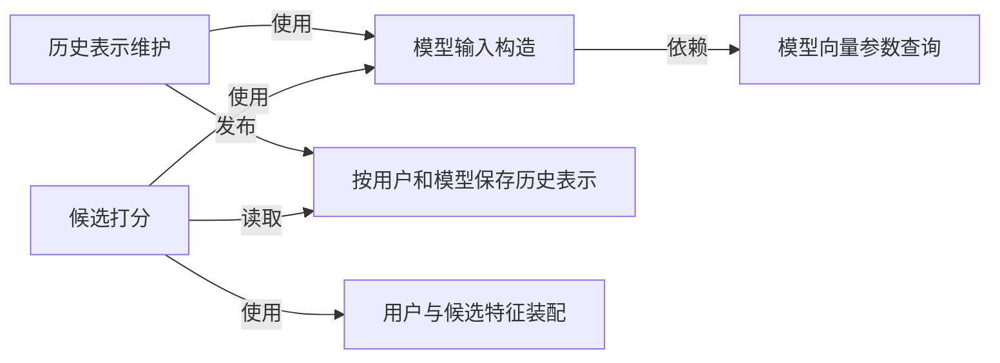
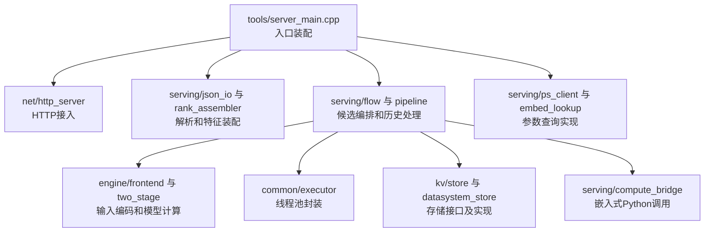
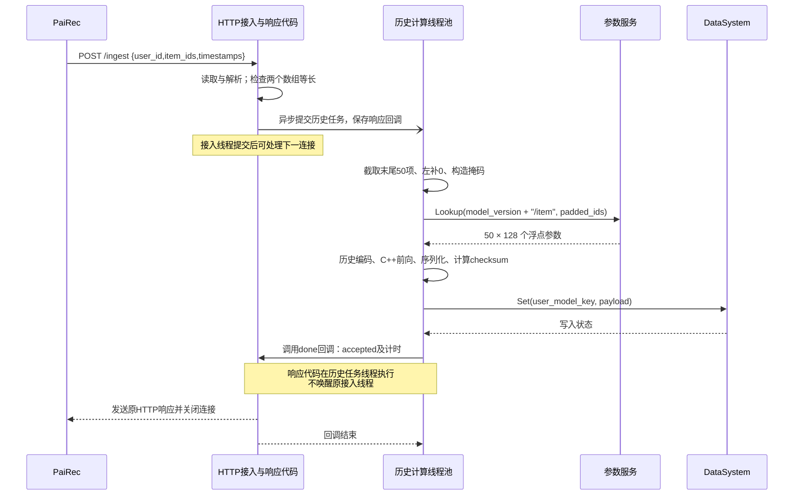
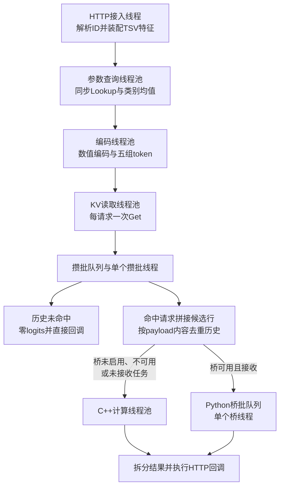
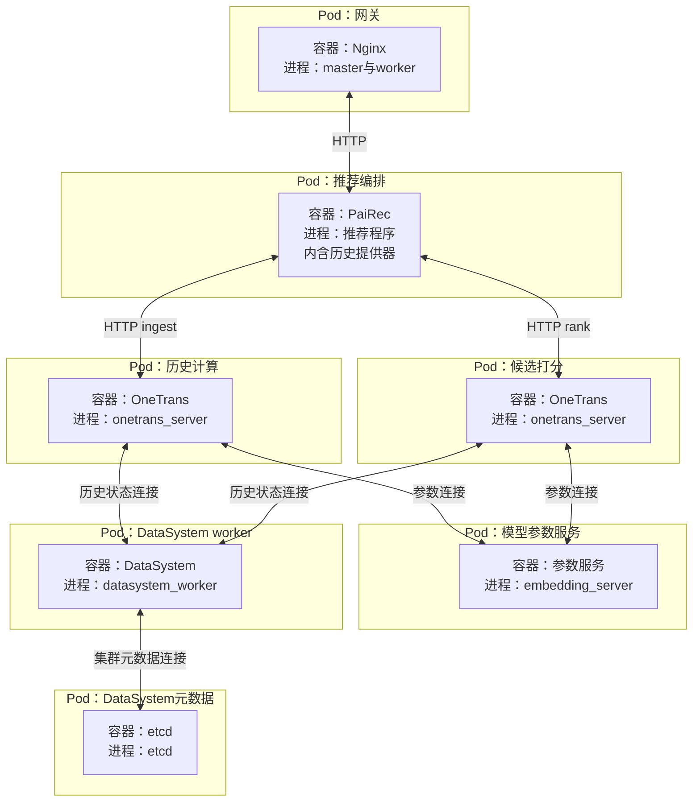

# OneTrans 精排：按现有源码描述的 4+1 视图

图中符号与连线遵循[图法与 UML 约定](DIAGRAM_NOTATION.md)，每张图前注明使用的图法。

本文以当前代码的数据来源和接口为准。OneTrans **目前不调用统一特征服务**：历史由调用方发送，用户和候选业务特征由本地文件装配，模型向量参数通过参数服务或本地权重读取。其他模块按统一特征服务规划，不能反推 OneTrans 已完成相同改造。

```yaml
module: OneTrans 精排
input_from: PaiRec 编排
public_entry: Nginx -> PaiRec
main_path: POST /ingest -> 历史计算结果 -> POST /rank
alternative_interface: POST /score   # 已有完整字段接口，当前配套精排调用方用 /rank
business_features: 本地 TSV 文件     # TSV 是以制表符分列的文本表
history_source: 调用方发送的有序物品 ID
model_parameters: PS 或进程内权重    # PS：Parameter Server，模型参数服务
intermediate_result: DataSystem 或进程内存储
final_ordering: PaiRec               # 精排服务逐候选打分，PaiRec 执行重排规则
```

源码中的 S 是历史序列阶段，NS 是用户与候选特征阶段；部署文档的 P/D 分别对应这两个计算进程。本文统一称“历史计算”和“候选打分”。注意力 K/V 是模型的键张量、值张量；数据库 key/value 则表示存储键和值，两者不要混用。本文只审阅源码与文档，没有重新运行模型、PS 或 DataSystem。

## 1. 逻辑视图：两个计算阶段，各自使用什么数据

本图表示能力之间的依赖：箭头从使用方指向所需能力，不表示一次请求的执行顺序。数据来源见 1.1，线程与处理顺序见第 3 节。

图法：逻辑结构示意图（非 UML，箭头表示能力依赖）。



历史表示维护负责将有序历史变成可复用的注意力状态；候选打分负责结合该状态和候选特征产生分数。它不决定推荐列表顺序，也不产生召回候选。配套代码虽然借用 PaiRec 的召回节点触发历史计算，也不能把它画成一路召回。[触发器职责](assets/source_snapshots/pairec4tigerllm_8506/services/recall/onetrans_s_stage.go.html#L212)。

### 1.1 数据来源与 key/value

| 数据 | 当前承载位置 | 查找键 key | 返回值 value / 用途 |
|---|---|---|---|
| 用户历史 | PaiRec 历史提供器：Kafka 消费缓存，或配置指定的 `user_features.json` | 原始用户 ID 字符串 | 有序点击物品 ID；调用方转为 `/ingest.item_ids` |
| 用户业务特征 | 启动读取 `artifacts/domain_features/user_features.tsv`，放入 OneTrans 内存表 | 第 1 列 `user_id`，解析为整数 | 第 2、3 列 `gender, age`；文件中的 `hist` 不在 `/rank` 路径使用 |
| 候选业务特征 | 启动读取 `artifacts/domain_features/item_rank_lookup.tsv`，放入 OneTrans 内存表 | 第 1 列 `item_id`，解析为整数 | 类别兼容槽及 15 个数值特征，具体配方见下节 |
| 模型向量参数 | PS；也支持进程内权重表 | `(table, id)`，表名为 `{model_version}/user、item、artist、album` | 每个 ID 对应 128 维浮点向量；128 来自当前模型配置 |
| 历史计算结果 | DataSystem；也支持进程内存储 | `kv:{b64url(model_version)}:{b64url(user_id)}` | 序列化的逐层注意力 K/V、有效历史长度和张量形状 |
| Transformer 权重与数值编码参数 | 模型权重文件，启动加载 | 模型制品中的张量名 | 常驻计算参数；不从业务特征服务逐请求读取 |

`b64url` 表示 URL 安全的 Base64 编码，并去除末尾填充符。历史结果 key **不包含请求 ID 或历史版本**。同一用户、同一模型版本再次写入时覆盖同一个键。[存储键实现](assets/source_snapshots/OneTrans_HSE_project/cpp/src/kv/store.cpp.html#L43)。

```python
# 配套 PaiRec 当前历史来源；Provider 是进程内代码，不是统一特征服务的远程调用。
if kafka_is_configured and kafka_consumer_cache.contains(user_id):
    history = kafka_consumer_cache[user_id].ClickHistory
else:
    # 首次使用时加载整份 JSON 到进程内存。
    history = parse_comma_separated_ids(user_features_json[user_id]["click_history"])
ingest_body = {
    "user_id": user_id,
    "item_ids": history,
    "timestamps": list(range(len(history))),  # 0..n-1，调用方生成的占位序号；不参与模型位置编码
}
```

来源：[历史提供器](assets/source_snapshots/pairec4tigerllm_8506/services/feature/provider.go.html#L50)、[JSON 字段](assets/source_snapshots/pairec4tigerllm_8506/services/feature/provider.go.html#L108)、[调用方构造请求](assets/source_snapshots/pairec4tigerllm_8506/services/recall/onetrans_s_stage.go.html#L72)。无历史时当前触发器不发送 `/ingest`。

### 1.2 当前 `/rank` 实际输入配方

下面按当前默认 15 + 15 维模型配置写出运行行为，不能替换成旧设计中的 `feature_v1` 配方。

```python
# user_features.tsv：表头 user_id, gender, age, hist；实际只读前三列。
users[int(user_id)] = {"gender": float(gender), "age": float(age)}

# item_rank_lookup.tsv：表头 item_id, artist_ids, album_ids, d1, ..., d15。
# 实际解析器把第二列同时用作两个类别槽，第三列不参与装配。
items[int(row[0])] = {
    "artist_ids": [int(row[1])],
    "album_ids": [int(row[1])],
    "dense": pad_right_with_zero(list(map(float, row[3:18])), 15),
}

# 收到 /rank 后的装配结果。
uid_sparse = parse_integer(user_id)
user_dense = [users[uid_sparse]["gender"], users[uid_sparse]["age"]] + [0.0] * 13
candidates = [{"item_id": item_id, **items[item_id]} for item_id in candidate_ids]
# 用户缺失：user_dense 全 0。
# 物品缺失：artist_ids=[]、album_ids=[]、dense 为 15 个 0。
```

这里的 `artist/album` 是沿用模型原字段名的兼容槽，当前都装视频类型值，**不表示有歌手或专辑业务数据**。装配器不执行标准化，也不做 `category + 1`。字符串 ID 目前由 `strtoll` 宽松解析，不能视为已做严格 ID 校验。[TSV 读取](assets/source_snapshots/OneTrans_HSE_project/cpp/src/serving/rank_assembler.cpp.html#L18)；[请求装配](assets/source_snapshots/OneTrans_HSE_project/cpp/src/serving/rank_assembler.cpp.html#L78)。

现有部署说明将 `item_features.tsv` 重排为下列 15 列；服务器只按列位置读取，不验证业务列名。

```python
candidate_dense_columns = [
    "video_category", "n", "ctr", "like_rate", "follow_rate", "share_rate",
    "watch_mean", "watch_max", "watch_sum", "log1p_watch_sum",
    "male_ratio", "avg_age", "click", "like", "follow",
]
# n：样本数；click/like/follow：对应行为计数；*_rate、ctr：计数除以样本数。
# watch_*：watching_times 字段统计；不要误称为视频观看时长。
# video_category：数据集视频类型编码；不扩写成不存在的主题分类。
```

来源为[部署说明中的转换命令](assets/source_snapshots/OneTrans_HSE_project/docs/%E5%8D%95%E6%9C%BA%E5%A4%9A%E8%8A%82%E7%82%B9%E9%83%A8%E7%BD%B2.md.html#L94)。这只是“按该命令生成时”的配方，本地没有实际部署的这两份 TSV，未验证线上文件内容。还需注意[原始聚合脚本](assets/source_snapshots/OneTrans_HSE_project/onetrans/tools/build_domain_features.awk.html#L33)将第 9 列性别累加到 `iage`，导致输出名为 `avg_age` 的列与其名称不符；该问题作为数据制品缺口保留，不在本轮修改模型或数据脚本。

独立的 [Tenrec 回放适配器](assets/source_snapshots/OneTrans_HSE_project/onetrans/tools/tenrec_adapter.py.html#L155)调用 `/score`，采用另一套配方：用户性别、年龄标准化后加 13 个历史统计均值；候选 15 个统计量标准化并裁至 ±5；`album_ids=[]`。它不是当前 PaiRec `/rank` 主路径，不能把两套配方合并描述。

### 1.3 模型输入与历史状态的结构

```python
# 当前随库模型的形状；M 是本请求候选数，H 是注意力头数。
history_input_shape = [1, 50, 128]
history_layer_lengths = [50, 38, 27, 16]
history_kv_shape = [[1, length, 4, 32] for length in history_layer_lengths]  # K、V 各一组
candidate_numeric_shape = [M, 15 + 15]  # 用户数值 + 候选数值
candidate_piecewise_shape = [M, 240]   # 30个数值特征，每项8个分段编码值
candidate_token_shape = [M, 5, 128]
candidate_output_shape = [M, 2]
```

token 在这里是一组模型输入向量；logit 是模型输出头的原始数值。当前配置：模型宽度 128、4 个注意力头、4 层、历史上限 50、候选 5 个 token。历史 K/V 的序列维度依次为 50、38、27、16；补空位由有效长度掩码排除。[权重配置](assets/source_snapshots/OneTrans_HSE_project/cpp/artifacts/weights/manifest.json.html#L2)；[历史编码](assets/source_snapshots/OneTrans_HSE_project/cpp/src/engine/frontend.cpp.html#L78)。

```python
# 候选的五组输入；多值类别参数取均值，空列表得到零向量。
groups = [encoded_dense, user_embedding, item_embedding, artist_embedding, album_embedding]
tokens = encode_groups(groups)                  # 每候选形状 [5, 128]
logits = transformer(tokens, history_kv)        # M 个候选 -> [M, 2]
rank_score = sigmoid(logits[:, 0])              # 首个原始输出转换到 0~1，不自动代表点击概率
# 各候选独立成行，不对候选列表做相互注意力；最终分数排序由 PaiRec 完成。
```

上述五组与分段编码见[候选前端](assets/source_snapshots/OneTrans_HSE_project/cpp/src/engine/frontend.cpp.html#L123)。时间戳只记录最后一个值，不进入历史模型计算：[历史处理](assets/source_snapshots/OneTrans_HSE_project/cpp/src/serving/pipeline.cpp.html#L103)。

## 2. 开发视图：代码模块和现有接口

本图表示源文件的静态使用关系，不表示请求经过它们的先后顺序。`server_main.cpp` 负责装配，公共实现编入 `onetrans_core` 静态库，再链接成 `onetrans_server`。

图法：源码依赖示意图（非 UML，箭头表示静态使用关系）。



| 文件/模块 | 当前职责 |
|---|---|
| [server_main.cpp](assets/source_snapshots/OneTrans_HSE_project/cpp/tools/server_main.cpp.html#L214) | 装载 TSV；注册 `/ingest`、`/rank`、`/score`；返回业务结果 |
| [json_io.cpp](assets/source_snapshots/OneTrans_HSE_project/cpp/src/serving/json_io.cpp.html#L12) | 解析请求；`/ingest` 只检查历史 ID 与 timestamps 等长，不检查时间升序；序号不参与模型计算，详见[请求推演](08_request_walkthrough.md) |
| [rank_assembler.cpp](assets/source_snapshots/OneTrans_HSE_project/cpp/src/serving/rank_assembler.cpp.html#L78) | 将用户、候选 ID 转成完整候选输入；不调用 Redis 或特征服务 |
| [pipeline.cpp](assets/source_snapshots/OneTrans_HSE_project/cpp/src/serving/pipeline.cpp.html#L98) | 执行历史计算、序列化、写存储，形成 accepted 回执 |
| [flow.cpp](assets/source_snapshots/OneTrans_HSE_project/cpp/src/serving/flow.cpp.html#L78) | 查询参数、编码、读历史结果、攒批、计算与拆分返回 |
| [ps_client.cpp](assets/source_snapshots/OneTrans_HSE_project/cpp/src/serving/ps_client.cpp.html#L41) | 使用原生 bRPC 查询模型向量参数；bRPC 是这里采用的远程调用框架 |
| [datasystem_store.cpp](assets/source_snapshots/OneTrans_HSE_project/cpp/src/kv/datasystem_store.cpp.html#L46) | 用 DataSystem 客户端读写序列化历史结果 |

| 构建或发布产物 | 来源与条件 |
|---|---|
| `onetrans_core`、`onetrans_server` | C++20、Folly；入口与核心库分别构建、链接 |
| PS 客户端及生成的 protobuf 代码 | `ONETRANS_WITH_PS=ON` 且找到 bRPC；参数服务本身是另一个程序 |
| DataSystem 存储实现 | `ONETRANS_WITH_DATASYSTEM=ON` 且找到 SDK；`ONETRANS_DATASYSTEM_MOCK` 只用于模拟接入，不能作为真实存储证据 |
| Python 计算桥 | `ONETRANS_PYTHON_BRIDGE=ON` 且找到 Python Development；运行还需匹配的 Python、PyTorch 和可导入的 `bridge_score.py`、`onetrans` 包 |
| 模型与业务数据 | `manifest.json`、`weights.bin`、用户 TSV、物品 TSV 独立发布；运行参数不能替代这些文件 |

以上开关控制的是可用代码，不证明实际请求使用了该后端。构建没有找到 PS 或 DataSystem 依赖时可退回本地实现；运行前应记录构建选项、SDK/worker、Folly、bRPC、Python/PyTorch 和 CUDA 版本。仓库 CMake 没有统一锁定这些运行时的版本，不能从机器上的最新安装反推已验证组合。[构建定义](assets/source_snapshots/OneTrans_HSE_project/cpp/CMakeLists.txt.html#L49)。

```typescript
// 已有 HTTP 接口类型；省略计时字段，不添加尚未实现的 ready 或请求唯一 key。
type IngestRequest = { user_id: string; item_ids: number[]; timestamps: number[] };
type IngestResponse = { accepted: boolean; shard: number; checksum: string; reason: string };

type RankRequest = { request_id?: string; user_id: string; items: { item_id: string }[] };
type RankResponse = {
  code: number; msg: string; request_id: string; model_version: string; model_role: string;
  items: { item_id: string; score: number }[];
  trace: { kv_hit: boolean; n_candidates: number };
};

type ScoreRequest = {
  user_id: string; uid_sparse: number; user_dense: number[];
  candidates: { item_id: number; artist_ids: number[]; album_ids: number[]; dense: number[] }[];
};
type ScoreResponse = { user_id: string; shard: number; kv_hit: boolean; logits: number[][] };
```

`/ingest` 在计算与写入返回后才响应，写入成功时 `accepted=true`；不是仅入队就成功。`/score` 接收完整字段，绕过 TSV 装配，但**进程启动仍无条件加载两份 TSV**。`/rank` 按输入候选顺序返回分数；`/score` 按候选顺序返回原始输出值，没有逐行物品 ID。[三个路由](assets/source_snapshots/OneTrans_HSE_project/cpp/tools/server_main.cpp.html#L234)。

## 3. 进程视图：请求、线程与同步

### 3.1 HTTP 接入与历史计算

当前 HTTP 服务由一个 `accept` 循环和固定接入线程池组成。接入线程阻塞读取请求头、请求体，解析 JSON；`/rank` 还在该线程中查询已加载的 TSV 内存表。成功提交异步任务后，接入线程便可处理下一连接，不等待模型计算完成。请求体的 `Content-Length` 上限为 16 MiB，尚无单独的候选条数限制。[接入实现](assets/source_snapshots/OneTrans_HSE_project/cpp/src/net/http_server.cpp.html#L127)。

图法：UML 时序图。接入与响应代码、历史任务位于同一进程，PS 和 DataSystem 是外部服务；代码角色不等于固定线程。



历史任务中的参数查询、CPU 计算和存储写入**串行占用同一个历史线程**；未另投递到候选的参数查询池或 KV 池。每次 `/ingest` 重算完整的截断历史，不是增量追加。`timestamps` 是调用方生成的等长序号；只把末项记到临时记录中，不参与截断、掩码或位置编码，也不随 DataSystem payload 保存。[历史实现](assets/source_snapshots/OneTrans_HSE_project/cpp/src/serving/pipeline.cpp.html#L98)。

响应回调在哪个线程完成，就由哪个线程直接序列化并 `send` 响应；没有独立响应发送池。每个响应都使用 `Connection: close`。因此慢请求体可能占用接入线程，慢响应接收方可能占用历史线程、候选计算线程或 Python 桥线程。[响应写回](assets/source_snapshots/OneTrans_HSE_project/cpp/src/net/http_server.cpp.html#L251)。

### 3.2 候选请求的分阶段处理

图法：进程内任务流示意图（非 UML）。箭头表示提交到下一个执行者；数据库访问发生在相应任务内部。



候选参数查询按 `user → item → artist → album` 顺序同步执行，通常是每请求四次 PS `Lookup`；空类别组不发对应请求。不同请求可由查询池并发处理，同一请求内没有并行四表查询。查表发生在攒批之前，批内相同用户也不会合并这些 RPC。[参数前端](assets/source_snapshots/OneTrans_HSE_project/cpp/src/engine/frontend.cpp.html#L123)、[同步客户端与超时](assets/source_snapshots/OneTrans_HSE_project/cpp/src/serving/ps_client.cpp.html#L24)。

KV 池也是每请求一次 `Get`；注释中的“mget”不能理解成跨请求批量读取。批内历史去重发生在读取之后，并以完整 payload 字节为键，减少后续反序列化次数，不减少已发出的存储查询。[实际读取](assets/source_snapshots/OneTrans_HSE_project/cpp/src/serving/flow.cpp.html#L130)、[去重与拼接](assets/source_snapshots/OneTrans_HSE_project/cpp/src/serving/flow.cpp.html#L230)。

```python
# 攒批单位是请求；计算单位是候选行。
request_count = len(jobs)                     # 至多 max_batch
candidate_rows = sum(len(job.items) for job in hit_jobs)
# KV未命中的请求不进入前向，/rank将其零logits转换为0.5。
```

攒批线程等到首个请求后，最多再等待 `max_wait_ms`，或收够 `max_batch` 个请求便取批。该时间是一次取批的等待窗口，不是排队时延上限；队列已有积压、拼接耗时或响应写回阻塞时，请求可等待更久。候选行数、字节数没有对应的独立批上限。[取批实现](assets/source_snapshots/OneTrans_HSE_project/cpp/src/serving/flow.cpp.html#L174)。

### 3.3 线程池、队列与锁的边界

| 执行者 | 等待与唤醒 | 当前容量或同步机制 |
|---|---|---|
| 接入线程 | 等待已接收的连接；随后阻塞 `recv` | 连接队列使用 mutex 和条件变量；无显式队列容量。监听 backlog 为 512，不能代替应用队列上限 |
| 历史、编码、C++ 计算池 | Folly CPU 线程池调度任务 | `Executor::add` 先读 pending 数，再入队；检查与入队不是同一个原子操作 |
| 参数查询、KV 读取池 | Folly IO 线程池执行同步外部调用 | 虽名为 IO 池，任务仍等待 PS/SDK 返回；不能按纯非阻塞事件处理估算容量 |
| 攒批线程 | `batch_cv` 等待首项、满批或超时 | `batch_mu` 保护 deque；该 deque 无显式容量限制 |
| Python 桥线程 | `cv` 等待批次；取出后执行 Python | mutex 保护队列；最多等待 16 个批次，正在执行的批次不计入队列容量 |
| HTTP 完成回调 | 在任务完成或失败线程中执行 | atomic 标记防止同一响应重复写回；不保证所有异常路径都能完成 |

[线程池封装](assets/source_snapshots/OneTrans_HSE_project/cpp/src/common/executor.cpp.html#L7)使用普通线程工厂，未设置绑核。其 `queue_cap` 是 pending 快照的软限制，不能称为整个服务的严格在途上限。其他共享锁包括指标汇总 mutex、进程内 KV 表 mutex，以及 PS 的表注册锁和分片锁；TSV 在启动后只读，没有逐请求文件锁。[指标锁](assets/source_snapshots/OneTrans_HSE_project/cpp/src/serving/pipeline.cpp.html#L23)、[本地 KV 锁](assets/source_snapshots/OneTrans_HSE_project/cpp/src/kv/store.cpp.html#L49)、[PS 分片锁](assets/source_snapshots/OneTrans_HSE_project/deploy/ps/embedding_server.cc.html#L60)。

以下是 `server_main.cpp` 的默认值，不是部署建议，也不是已部署配置。入口会覆盖 `ScoreFlow::Config` 自身的默认值，例如后者的 `max_batch=16`，入口实际默认传入 32。

```yaml
server_defaults:
  http_threads: 8
  nearline_threads: 2
  lookup_threads: 4
  encode_threads: 2
  kv_threads: 4
  compute_threads: 0       # 由hardware_concurrency取值；不可用时取4
  queue_cap: 1024         # 各Executor的pending软限制
  max_batch: 32           # 请求数，不是候选行数
  max_wait_ms: 5
  compute_backend: auto
  embedding_source: local
  kv_backend: local
  kv_ttl_seconds: 0
bridge_waiting_batches: 16  # 类成员固定值，不受queue_cap控制
```

同一二进制总会构造候选流水线和历史池；按入口地址分工，不会自动裁掉另一角色的线程池。`nearline_threads=0` 也不是关闭历史池：通用 Executor 将非正线程数转换为 1。启用 Python 后仍构造 C++ 计算池，供回退使用。具体活跃线程数、SDK 内部线程和算子线程要在运行中观测。[入口默认值](assets/source_snapshots/OneTrans_HSE_project/cpp/tools/server_main.cpp.html#L52)、[计算池创建](assets/source_snapshots/OneTrans_HSE_project/cpp/src/serving/flow.cpp.html#L19)。

### 3.4 过载、后端回退与异常

| 条件 | 当前实际处理 | 需要注意的边界 |
|---|---|---|
| 历史池拒绝入队 | 路由捕获异常并返回 HTTP 400 | 当前未将过载单独分类为 429/503 |
| 候选参数、编码或 KV 池拒绝入队 | `fail_ctx` 经 HTTP 回调返回 503 | 无服务级总截止时间；已开始的同步调用仍按各自超时完成 |
| KV 不存在、读取错误或 payload 损坏 | 统一为 miss，候选返回零 logits | `/rank` 可返回 HTTP 200 和 0.5，不能当作正常模型结果 |
| Python 不可用，或桥队列拒绝提交 | 进入 C++ 计算池 | 队列回退也可能发生在显式 `python` 模式；桥内执行异常则报错，不自动重算 |
| C++ 计算池拒绝入队 | `dispatch_cpp` 的 `add` 在当前批线程调用链中无异常捕获 | 异常可能逃出线程并终止进程；不能承诺过载一定返回 503 |

另外两处需要专项验证：Python 初始化超时后，分离的初始化线程仍可能继续并置 `ready=true`，但 `start` 已返回、计算线程未创建；Python 调用抛异常时，也可能跳过末尾的 GIL 释放。它们是根据控制流发现的缺口，本轮未通过故障注入复现。GIL 是解释器访问锁，不是 GPU 锁。[桥初始化](assets/source_snapshots/OneTrans_HSE_project/cpp/src/serving/compute_bridge.cpp.html#L106)、[桥执行与异常](assets/source_snapshots/OneTrans_HSE_project/cpp/src/serving/compute_bridge.cpp.html#L185)、[未保护的计算提交](assets/source_snapshots/OneTrans_HSE_project/cpp/src/serving/flow.cpp.html#L285)。

### 3.5 与 PaiRec 的同步关系

```python
# gate 是一次历史投递的完成闸门；以下是配套PaiRec当前行为。
enqueue_ingest(history, gate)
response = post_rank(user_id, items)       # 先尝试打分
if not response.trace.kv_hit and gate is not None:
    gate.wait(timeout)
    response = post_rank(user_id, items)  # 等待超时也会再查
```

历史投递成功、失败或被丢弃都可能打开闸门，因此闸门打开不等于写入成功。旧历史已存在时，首查命中便不等新历史；首次 miss 后重查则增加一次真实 `/rank` 的查表与取数负载。客户端停止等待也不会取消已提交的 OneTrans 任务或删除用户级 KV。[历史投递](assets/source_snapshots/pairec4tigerllm_8506/services/recall/onetrans_s_stage.go.html#L230)、[候选重查](assets/source_snapshots/pairec4tigerllm_8506/services/sort/onetrans_rank_sort.go.html#L159)。

## 4. 物理视图：容器、进程与共享数据域

下图沿用[系统物理视图](01_system.md)的目标 Pod 分组；每个外框表示一种部署单元，内框表示容器及其主要进程，不表示实例数量或主机位置。OneTrans 当前资料是多进程启动示例，历史与候选的镜像及 Pod 配置仍需补齐。未规定主机分配、调度、worker 数量，或把 worker 与模型放在同一 Pod。

图法：部署映射示意图（非 UML）。双向连线表示网络连通要求，不表示请求顺序。



历史和候选容器运行同一程序，均注册三个 HTTP 接口，通过调用地址区分职责。Python 后端把解释器及 PyTorch 嵌入 `onetrans_server`，不另启动 Python 服务进程；C++ 后端使用 CPU，Python 后端按 CUDA 是否可用选择 GPU 或 CPU，设备分配由部署确定。[嵌入调用](assets/source_snapshots/OneTrans_HSE_project/cpp/src/serving/compute_bridge.cpp.html#L28)、[设备选择](assets/source_snapshots/OneTrans_HSE_project/cpp/tools/bridge_score.py.html#L26)。

| 使用方 | 必要资源与一致性要求 |
|---|---|
| PaiRec | 现有历史提供器的 JSON 文件或 Kafka 连接；这不是统一特征服务取数 |
| 两个 OneTrans 容器 | 匹配的 `manifest.json`、`weights.bin`、用户 TSV、物品 TSV；两个程序启动均读取两份 TSV。挂载或分发方式待定 |
| 参数服务 | 按模型版本装载 user/item/artist/album 参数表；维度与模型一致 |
| DataSystem | 两个模型进程访问同一数据域，键中的模型版本与用户 ID 一致；不要求连接同一个 worker。独立本地 KVStore 不满足共享 |
| 可选 Python 环境 | 包、解释器 ABI、PyTorch 和设备运行时匹配；C++ 计算代码仍保留用于回退 |

```yaml
split_process_requirements:
  binary: 编入真实PS与DataSystem支持，检查构建日志与加载的动态库
  embedding_source: ps
  kv_backend: datasystem
  model_version: 两端一致，同时用于参数表前缀和历史结果键
  candidate_compute_backend: 显式选择cpp或python，核对实际执行路径
  shared_state_check: 历史端写入，候选端取回匹配payload并完成前向
```

`/healthz` 只能辅助检查，不能替代上述共享读写验证：DataSystem 实现的 `size()` 固定返回 0；`compute_backend=python` 表示桥可用，不说明设备，也不排除某批因桥队列拒绝而走 C++。本轮没有启动这些服务或验证资源容量。[存储计数实现](assets/source_snapshots/OneTrans_HSE_project/cpp/src/kv/datasystem_store.h.html#L40)、[后端标记](assets/source_snapshots/OneTrans_HSE_project/cpp/src/serving/flow.cpp.html#L48)。

## 5. 场景视图：一次候选打分的输入输出

以下统一使用[整条请求样例](08_request_walkthrough.md)中的用户 1。十个历史 ID 来自已有 Tenrec 样例；候选 4、1201 仅为构造接口示例，均不是实际召回输出。**尚未证明现有历史提供器返回这组历史，也未证明当前 TSV 覆盖该用户与候选**；不能由特征服务样例推断 OneTrans 已加载相同数据。

```python
# 接口构造示例；不是现有 Provider 已读取的运行结果。
example_user_id = "1"
example_history_ids = [2, 3, 80936, 781, 111774, 1230, 26403, 991, 2362, 1202]
example_timestamps = list(range(10))   # 0..9，与现有调用方的序位构造方式一致
example_candidate_ids = [4, 1201]
```

下图展示调用方提供上述样例输入时的数据传递，并使用“历史成功返回后再打分”的顺序表达依赖；配套代码的先查、等待、重查行为见进程视图。

图法：UML 时序图。


```json
{"request_id":"req-001","user_id":"1","items":[{"item_id":"4"},{"item_id":"1201"}]}
```

PS 的 value 是模型参数，不是用户画像；DataSystem 的 value 是历史模型计算结果，不是原始历史。DataSystem 实际存 `rec.payload`，只包含序列化格式头和张量，不保存完整 `UserKVRecord` 中的 `created_at/seq_ts_last`。[序列化格式](assets/source_snapshots/OneTrans_HSE_project/cpp/src/kv/serialize.h.html#L1)；[实际写入](assets/source_snapshots/OneTrans_HSE_project/cpp/src/kv/datasystem_store.cpp.html#L46)。

### 5.1 当前限制与人工验收

| 观察到的情况 | 当前代码行为 | 验收时如何解释 |
|---|---|---|
| 未找到历史 K/V | 候选模型不执行，输出全零 logits；`/rank` 分数全部 0.5 | HTTP 200 不等于完成真实精排，要检查 `kv_hit` 与计算证据 |
| 存在同用户旧 K/V | 按用户和模型键直接读取，不核对本次历史 | 命中不能证明使用的是本次请求历史；并发新旧历史有覆盖风险 |
| PS 未装某行 | 参数服务返回零向量 | 先核对物品、用户、类别参数覆盖；不能凭服务存活证明参数完整 |
| 用户或物品 TSV 缺行 | 按上文默认值补零 | 应单独记录输入覆盖，避免误认为所有业务特征已加载 |
| DataSystem 初始化/读取异常 | 初始化结果未强制检查；读取错误、损坏与不存在统一为未命中 | 需要外部探测、服务日志和跨进程读写证据 |
| 期待请求结束后释放对象 | 只有底层删除接口，没有请求级 `/release` 路由 | 当前按用户覆盖，可配置过期时间；默认 0 表示不过期 |

证据：[未命中不做前向](assets/source_snapshots/OneTrans_HSE_project/cpp/src/serving/flow.cpp.html#L205)、[PS 缺行补零](assets/source_snapshots/OneTrans_HSE_project/deploy/ps/embedding_server.cc.html#L181)、[DataSystem 错误处理](assets/source_snapshots/OneTrans_HSE_project/cpp/src/kv/datasystem_store.cpp.html#L31)。

```python
# 用同一组人工核对过的真实数据做检查，不靠“分数必须不同”推断模型执行。
assert user_exists_in_tsv and all_candidate_items_exist_in_tsv
assert parameter_rows_cover_user_history_candidates_and_categories
assert ingest_response.accepted
assert observed_history_writer_backend == "datasystem"
assert observed_candidate_reader_backend == "datasystem"
assert rank_response.trace.kv_hit
assert observed_candidate_forward_completed
assert returned_item_ids == input_item_ids
assert all_scores_are_finite
# 当前没有历史版本绑定：固定历史、串行回放可核对；不能由此宣布并发隔离已通过。
```

未来若统一 OneTrans 的业务特征来源，可让调用方从特征服务取历史、用户和候选字段后使用已有 `/ingest`、`/score`；这需要先冻结与模型匹配的输入配方。本轮保留上述实际路径，不要求同步改 OneTrans。请求唯一历史键、历史版本校验、显式完成回执和释放接口仍是可单独推进的工程改造，均不是已实现能力。

## 6. 负载分析：计算、拷贝和操作系统资源

本节把源码可确认的工作量与待测瓶颈分开。它用于设计观测和选择测试变量，不提供未经实测的 QPS、延迟或硬件配置。先记录实际模型形状、请求候选数、历史长度、KV 命中率、后端和并发度；只有这些条件一致，结果才可比较。

### 6.1 两种后端实际执行什么

| 路径 | 计算与数据移动 | 负载含义 |
|---|---|---|
| 历史 C++ 路径 | 50 个槽位的查表、输入编码、四层历史前向；生成各层 K/V，序列化并计算 SHA256，然后写存储 | 每请求一个历史任务。短历史仍按固定张量宽度投影、分配和存储；掩码不等于把张量压成有效项长度 |
| 候选 C++ 路径 | 请求特征张量先拼成 `BridgeBatch`；随后仍进入 C++ 分支，反序列化去重历史，再复制并拼成计算批；各层为每个候选复制历史 K/V 与候选 K/V | 当前 C++ 分支也支付了先构造桥输入的开销；复用历史指针不等于所有计算都零复制 |
| 候选 Python 路径 | C++ blob → Python `bytes`；候选再经 `bytearray` 构造张量；历史逐个反序列化；按设备执行 `.to(device)`；逐候选 stack/cat 后前向；结果 `.to("cpu")` 并转 bytes 返回 C++ | 有 CUDA 时包含 CPU→GPU 输入与 GPU→CPU 输出传输；批内去重不跨批保存设备历史缓存。Python 后端使用 CPU 时不发生这些 GPU 传输 |
| 启动及常驻内存 | C++ 读取整份权重 blob，并复制出模型、前端和参数表；选择 PS 前已经加载本地参数表。Python 启用后还会加载其模型；TSV 全量装入内存 | 不能认为使用 PS 就自动省掉本地参数表内存，也不能只用模型文件大小估算进程 RSS |

C++ 数值原语直接用循环实现矩阵乘、归一化、注意力和前馈网络，源码没有显式调用 BLAS 或把单个前向拆到多个算子线程。任务间并行来自计算池；编译器向量化与实际 CPU 效率需测量。Python 则调用 PyTorch 算子，实际线程数和注意力内核选择依赖 PyTorch、设备与输入形状，不由 `compute_threads` 控制。[C++ 原语](assets/source_snapshots/OneTrans_HSE_project/cpp/src/engine/model.cpp.html#L14)、[矩阵循环及权重复制](assets/source_snapshots/OneTrans_HSE_project/cpp/src/common/tensor.cpp.html#L11)。

Python 只有一个桥消费线程按批调用 Python；底层算子的并行度另由运行时决定，不能从桥线程数推断。C++ 通过 GIL 进入解释器；本实现要等这一批返回并完成回调后，桥线程才取下一批。回调在 `call_score` 正常释放 GIL 后执行。[桥字节边界](assets/source_snapshots/OneTrans_HSE_project/cpp/src/serving/compute_bridge.cpp.html#L206)、[Python 输入与输出](assets/source_snapshots/OneTrans_HSE_project/cpp/tools/bridge_score.py.html#L111)、[按候选复制历史](assets/source_snapshots/OneTrans_HSE_project/onetrans/serving/two_stage.py.html#L191)。

### 6.2 可由形状计算的负载基数

下面的数字只适用于随库的 128 维、4 层、float32 模型。`M` 是单请求候选数，`C` 是一次命中计算批的候选总行数，`U` 是批内不同历史 payload 数；`S_l` 是第 l 层保存的历史宽度。

```python
D = 128
Ns = 5
S = [50, 38, 27, 16]
float_bytes = 4
history_tensor_bytes = 2 * sum(S) * D * float_bytes  # 134144 B = 131 KiB
# 实际payload还包含魔数、长度字段和JSON格式头，不含原始历史ID、请求ID或timestamps。
candidate_input_bytes = C * Ns * D * float_bytes   # 2560 × C B
candidate_output_bytes = C * 2 * float_bytes       # 8 × C B
unique_history_input_bytes = U * history_tensor_bytes

# PS响应浮点值的大小，不含protobuf和传输开销。
ingest_parameter_bytes = 50 * D * float_bytes      # 25600 B
rank_parameter_bytes = (1 + M + artist_id_count + album_id_count) * D * float_bytes
# 例如4个候选、每项两个类别槽各1个ID：13行参数，共6656 B。
```

用户 1 的十项历史会左补 40 项，仍产生上述固定宽度的历史张量；四个候选编码输入是 10,240 B，模型原始输出仅 32 B。小输出不代表请求轻：参数回包、约 131 KiB 历史读取、重复张量复制和计算都发生在输出之前。[历史张量产生](assets/source_snapshots/OneTrans_HSE_project/cpp/src/engine/two_stage.cpp.html#L53)、[序列化格式](assets/source_snapshots/OneTrans_HSE_project/cpp/src/kv/serialize.cpp.html#L41)。

按张量形状看，历史注意力的乘加规模随 `sum(S_l² × D)` 增长；候选注意力随 `C × sum(Ns × (S_l + Ns) × D)` 增长。它们只描述注意力部分，未包含投影、前馈网络、编码及复制；C++ 掩码还会跳过部分点积，不能把公式当成精确 FLOPs 或延迟。候选 K/V 拼接会为每行复制历史，即使 `U=1`，临时张量规模仍随 `C` 增长。[候选前向](assets/source_snapshots/OneTrans_HSE_project/cpp/src/engine/two_stage.cpp.html#L129)。

```python
# 用实际OneTrans调用率估算应用边界的数据量；不等于网卡实际流量。
kv_write_bytes_per_second = ingest_calls_per_second * average_payload_bytes
kv_read_bytes_per_second = rank_calls_per_second * kv_hit_rate * average_payload_bytes
# rank_calls应包含PaiRec重查；实际网络还受同机访问、worker转发、协议与缓存行为影响。
```

存储 SDK 内部是否用共享内存、网络复制或其他传输，须按部署版本和连接方式验证。OneTrans 当前只设置 DataSystem host/port，没有提供足以断言“远端零复制”或“每次一定走网卡”的证据。[SDK 接入边界](assets/source_snapshots/OneTrans_HSE_project/cpp/src/kv/datasystem_store.cpp.html#L31)。

### 6.3 操作系统资源与待测瓶颈

| 子系统 | 源码已确认的负载 | 如何验证是否成为瓶颈；尚未实测 |
|---|---|---|
| CPU 调度 | 多个 Folly 池、攒批线程、HTTP 线程、可选桥线程同时存在；同步 I/O 占用任务执行者，CPU 回退会突然增加计算工作 | 分线程 CPU、运行队列、上下文切换、CPU 配额节流；核对慢的是执行还是等候，不先把线程数设成核数倍数 |
| 锁与同步 | 连接队列、攒批队列、桥队列使用 mutex/条件变量；指标使用共享 mutex；PS 热门 ID 可能落在同一分片锁 | 采样等待栈、锁等待时间、各队列深度；“锁存在”不能直接推导“锁已成为瓶颈” |
| 内存与分配器 | 特征、payload、批拼接、反序列化、逐层中间张量均分配或复制；无界连接和攒批队列可持有大量请求数据 | RSS、分配热点、页错误、内存带宽、队列驻留字节；区分常驻模型与积压请求 |
| 网络与 socket | HTTP 每响应关闭连接；PS 每请求多次同步查表；DataSystem 逐请求读写；回调直接发送 HTTP | 连接建立次数、打开的 fd、TCP 队列、重传、PS/SDK耗时与发送阻塞；HTTP短连接负载需单独计入 |
| 文件与页缓存 | 模型和 TSV 在启动时读入；`/rank` 的 TSV 查询是内存访问 | 分开记录启动文件 I/O 与稳态请求；不能把每次 TSV 查表计为一次磁盘读。DataSystem/etcd的磁盘行为另看其配置 |
| GPU及设备传输 | 仅启用 CUDA 的 Python 候选路径涉及；桥进行输入搬运、算子提交及结果回传 | GPU利用率、算子时间、传输量、同步等待与显存峰值；小批可能受提交和复制开销影响，需用剖析结果确认 |

对一个稳定阶段，可用 `到达率 × 平均占用时间 / 并行执行数` 粗看饱和趋势。同步 RPC 占用时间包含外部等待；接近饱和后排队会放大尾延迟。该估算不包含批处理、回退、共享锁及多阶段竞争，不能当作容量承诺。`max_batch` 变大可能提高 Python 算子批量，也会增加临时内存和等待；C++ 分支的候选循环不保证同样收益。

当前 HTTP 还缺少 socket 读写超时、完整短写重试和总在途限制；关闭阶段也需要单独验证：HTTP 等待异步请求最多约 10 秒，但 Flow 先停攒批线程再等待池排空，没有明确逐项拒绝所有遗留批任务。不要据此宣称已实现完整的优雅退出。[HTTP 生命周期](assets/source_snapshots/OneTrans_HSE_project/cpp/src/net/http_server.cpp.html#L172)、[流水线停止顺序](assets/source_snapshots/OneTrans_HSE_project/cpp/src/serving/flow.cpp.html#L37)。

### 6.4 哪些指标现在能用，哪些仍需补

| 现有输出 | 实际含义与限制 |
|---|---|
| `ingest_us` | 历史任务开始后的编码、查表、前向、序列化和写入总时间；不含 HTTP 接收、历史池排队和响应发送 |
| `lookup_us`、`encode_us`、`kv_us` | 相应任务内部耗时；不含此前线程池排队。`feature_us=lookup_us+encode_us`，不含接入线程上的 TSV 装配 |
| `backend_rpc_us` | 命中路径当前累加 KV 读取耗时，不是所有后端 RPC 总和，PS 查询在 `lookup_us` 内 |
| `batch_wait_us`、`batch_size` | 从进入攒批队列到取批后的等待；大小是请求数，包含本批 miss 请求 |
| `compute_us`、`batch_compute_us` | C++ 路径记录前向时间，前者按命中请求数均摊；反序列化、拼接和计算池排队不在内。Python 路径当前未写这些字段，零值不能解释成未计算 |
| `flow.backend.python/cpp`、`flow.bridge_overflow` | 后端提交或回退计数；不是实际设备与成功完成证明。`online.batch_size` 则记录命中候选行数，与响应的 `batch_size` 单位不同 |
| `/metrics` 中的直方图 | 当前桶只增加命中桶，输出未转成累计桶；不能直接按标准 Prometheus 累计直方图求分位数。`online.qps` 也是累加计数且全 miss 批不增加，不能当作总入口 QPS |

依据：[批次计数和回填](assets/source_snapshots/OneTrans_HSE_project/cpp/src/serving/flow.cpp.html#L192)、[C++计时](assets/source_snapshots/OneTrans_HSE_project/cpp/src/serving/flow.cpp.html#L316)、[指标桶实现](assets/source_snapshots/OneTrans_HSE_project/cpp/src/serving/pipeline.cpp.html#L39)。

首轮观测应补齐每阶段的入队、开始、结束时间，候选行数与字节数，桥排队及设备执行时间，DataSystem 错误类型，以及 HTTP 接收至发送完成的总时长。测量由外部回放产生负载，不往模型服务加入压力模拟模块。按以下少量变量逐项改变即可定位主要限制：

```yaml
measurement_cases:
  calculation: C++ / Python-CPU / Python-CUDA；记录实际后端与设备
  request_size: 固定并分别增加候选数；历史分别取短序列与50项
  reuse: KV命中 / 缺失；相同payload / 不同用户payload
  concurrency: 从无积压开始增加；同时记录各队列和内存
  failures: PS超时、DataSystem错误、桥拒绝、计算池过载、客户端断开、退出时在途请求
success_evidence:
  - 真实参数与历史覆盖；模型前向完成，不能以HTTP200或分数不同替代
  - 延迟、拒绝率、内存、队列增长同时可解释
  - 固定历史串行回放不代表已解决用户级KV并发覆盖
```
