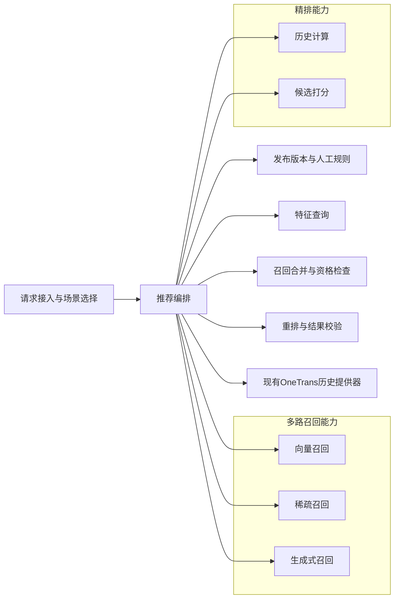
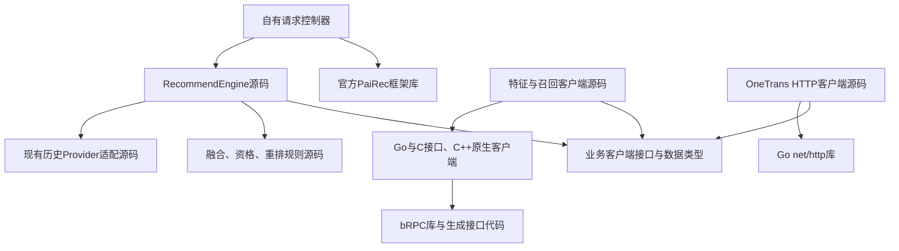
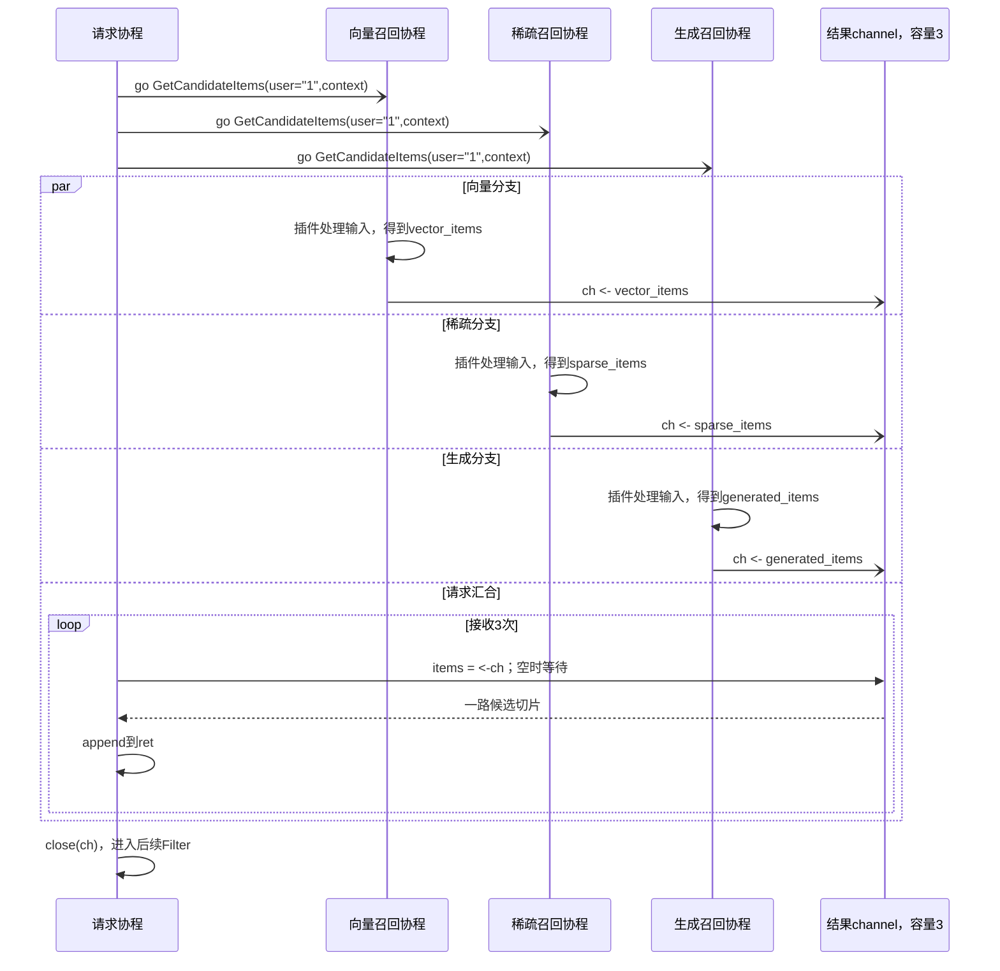
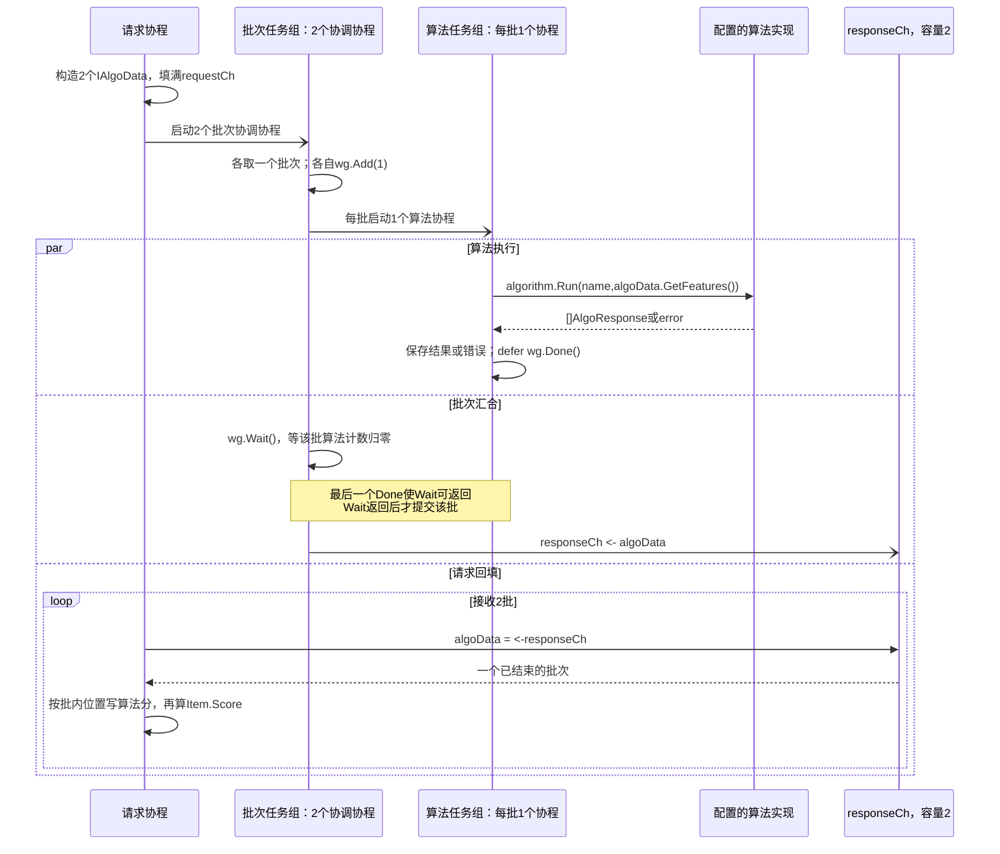
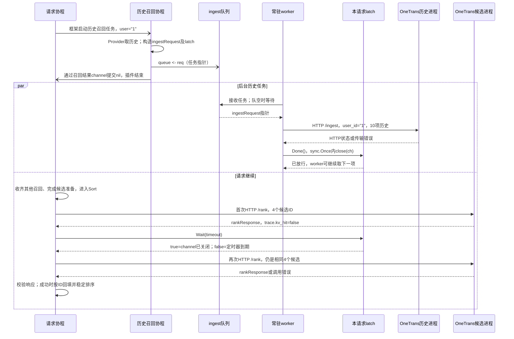
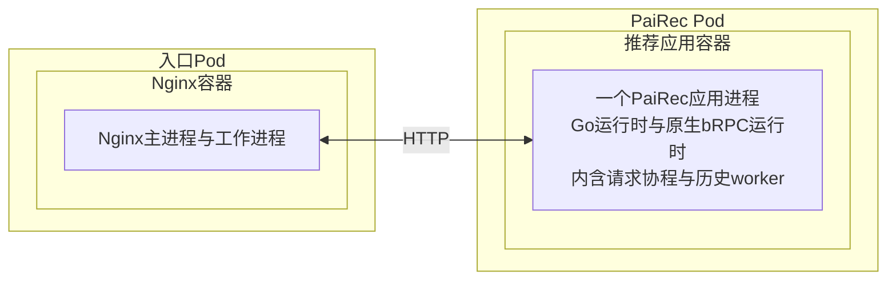
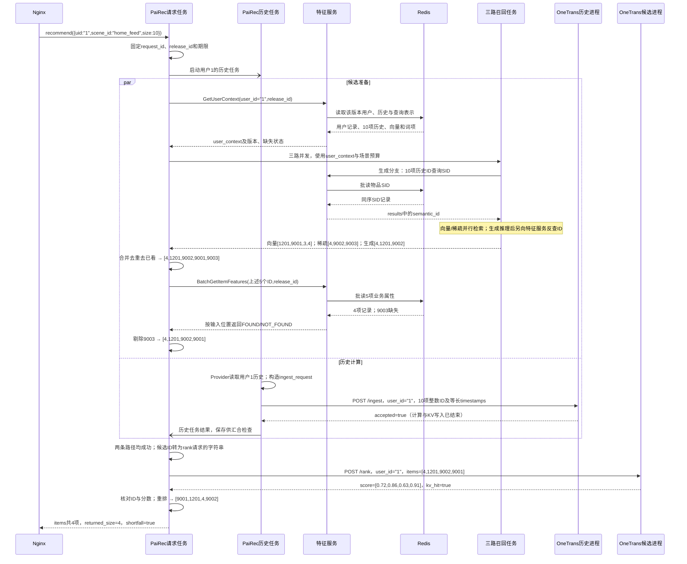

# PaiRec 内部编排：4+1 视图

图中符号与连线遵循[图法与 UML 约定](DIAGRAM_NOTATION.md)。本章展开 PaiRec 如何组织任务、持有数据并等待结果；整体服务边界见[系统视图](01_system.md)。**目标架构与已有源码行为分开描述，负载分析是机制推导，不是性能实测。**

| 本文的依据 | 用来回答什么 | 不能据此认定什么 |
|---|---|---|
| 官方 PaiRec v2.6.2 源码 | 默认入口怎样分支、汇合、加载特征和调用算法 | 本场景已经配置或执行全部默认阶段 |
| 当前 OneTrans 配套编排及原生客户端源码 | Provider、队列、闸门、HTTP 与 Go/C++ 调用的实际行为 | 已满足目标的严格错误传播、版本和取消约束 |
| 本文的 `RecommendEngine` 设计 | 本场景应怎样取数、组织召回和精排、控制并发 | 新接口和完整链路已经实现 |

官方版本单独核对，避免把工程内改过的 `vendor` 当作原版。[前期编排分析](assets/source_snapshots/prior_design/pairec-orchestration-analysis.md.html)作为问题清单使用；涉及线程、等待和负载的结论以下文核对为准。

```yaml
统一入口: Nginx → PaiRec
一般取数: PaiRec → 独立FeatureService → Redis
OneTrans本轮例外:
  历史: 现有历史提供器 → HTTP /ingest
  用户与候选字段: OneTrans本地TSV → HTTP /rank内部装配
请求约束: 固定release_id和人工场景规则；总期限约束所有阶段
开发边界: 官方PaiRec固定依赖；自有Controller与RecommendEngine承载本场景
压力回放: 系统外部工具，不进入推荐核心
```

`FeatureService` 是独立特征服务；源码中的 `service/feature.FeatureService` 是框架内部特征加载器，两者不能混用。`SID` 是物品语义编码；OneTrans 的 `KV` 是注意力键和值张量；`PS` 是模型参数服务。数据库及键值定义见[特征服务](05_feature_data.md)。

## 1. 逻辑视图：编排职责及业务能力依赖

框表示逻辑职责，箭头统一表示“使用对方提供的能力”，不表示先后顺序、源码导入或网络调用。召回合并和重排属于 PaiRec；模型计算属于被编排的能力。

图法：逻辑结构示意图（非 UML）。



特征查询提供事实，召回合并与重排使用已查得的数据，不再自行查数据库。生成服务推理后才知道候选 SID，其反查由生成服务调用特征服务完成，内部关系见[生成召回](04_generative_recall.md)。OneTrans 保留独立取数边界，不画成已接入新特征服务。

| 责任 | 主要业务输入 → 输出 | 谁拥有和修改数据 |
|---|---|---|
| 请求接入、场景选择 | `{uid,scene_id,size}` → 请求 ID、固定版本、规则、总期限 | 单请求持有；人工发布后形成只读配置快照 |
| 特征查询 | 用户 ID／候选 ID／历史 ID → 上下文、物品属性、SID | PaiRec 保存本请求结果；远端解释缺失和版本 |
| 三路召回 | 查询向量／加权词项／历史 SID → 本路候选及原始分数 | 各分支独占结果；合并前不共写候选数组 |
| 召回合并 | 分来源候选、已看历史、候选属性 → 合格候选 | 汇合后由请求任务统一去重、过滤和限量 |
| 历史准备与候选打分 | Provider 历史 → 写入结果；用户与候选 ID → 分数 | OneTrans 管理历史 KV、本地特征和模型参数；PaiRec 检查结果 |
| 重排、结果校验 | 同 ID 的分数、属性、人工规则、`size` → 有序列表 | 请求任务核对 ID、有限数值、顺序与实际数量 |

业务上有“召回前”和“候选确定后”两个取数阶段。正常请求中 PaiRec 调用特征服务三次：`GetUserContext`、历史 ID 查 SID 的 `BatchGetItemRepresentations`、`BatchGetItemFeatures`；生成服务另作一次 SID 反查，共四次逻辑 RPC，底层数据库拆批另计。

**两份历史不能默认为相同。**特征服务历史用于召回和已看过滤，现有 Provider 历史用于 OneTrans。当前 `/rank` 只发送以下字段，不把新特征服务返回的数组直接传入模型。

```python
rank_request = {
    "request_id": "demo-user-1-001", "user_id": "1",
    "items": [{"item_id": x} for x in ["4", "1201", "9002", "9001"]],
}
# OneTrans自行装配用户和候选字段；items响应逐项带item_id、score。
# score是首个模型输出经sigmoid的排序分，未验证校准时不称为点击概率。
```

## 2. 开发视图：源码依赖与交付物

图中只放源码模块与库，箭头表示导入或编译依赖；远端特征、召回、数据库进程不放入此图。图为目标组织，不要求新建所有同名目录。

图法：源码依赖示意图（非 UML）。



控制器的装配代码向 `RecommendEngine` 注入客户端实现；引擎只依赖业务接口。当前直接访问 Redis 的 DAO 只作为迁移证据，目标中 Redis 键名、批读和解码留在远端特征服务。

```go
// 目标接口摘录；每个Query都带固定版本及请求标识。
// ctx负责本地期限/取消；OneTrans沿用现有HTTP字段，不宣称已支持release_id。
type FeatureClient interface {
    GetUserContext(ctx context.Context, q UserQuery) (UserContext, error)
    BatchGetItemRepresentations(ctx context.Context, q RepresentationQuery) (RepresentationBatch, error)
    BatchGetItemFeatures(ctx context.Context, q ItemQuery) (ItemFeatureBatch, error)
}
type RecallClient interface {
    Recall(ctx context.Context, in RecallInput) (RecallResult, error)
}
type OneTransClient interface {
    Ingest(ctx context.Context, in IngestRequest) (IngestResponse, error)
    Rank(ctx context.Context, in RankRequest) (RankResponse, error)
}
```

这些 `Query`、`Request` 和 `Response` 是各业务请求、响应类型的占位名，字段以[请求样例](08_request_walkthrough.md)为准。代码说明职责边界，不是一份可直接编译的 SDK。

| 源码范围 | 交付物与关键要求 |
|---|---|
| 控制器、引擎、规则、Provider、HTTP 客户端 | 编入一个 PaiRec 应用；显式错误、确定顺序；复用 Provider 来源但不沿用“结束即成功” |
| 特征与召回客户端、公共类型 | 编入应用；业务数据按调用复制或只读共享，结果按输入 ID 对齐 |
| Go/C/C++ 原生客户端 | 原生库及链接依赖随应用镜像交付；已有 `stageClient` 使用 `libstageclients`、bRPC 等，目标业务接口不能只改地址 |
| 官方 PaiRec v2.6.2 | 固定版本依赖；本场景走自有入口，不同时触发另一条默认完整推荐链 |
| 场景及发布配置 | 人工可审阅的候选预算、版本绑定、超时、开关和屏蔽列表；请求内不热切换 |

当前原生库的构建、字符串复制和释放见 [Go 封装](assets/source_snapshots/pairec_sh/pairec-demo/src/stageClient/stageClient.go.html#L17)与 [C 接口](assets/source_snapshots/pairec_sh/pairec-demo/src/cpp/stageBridge_c.cpp.html#L63)。源码里的客户端不是独立服务进程。

## 3. 进程视图：沿已实现代码追踪一次请求

本节先说明已实现的内部机制，再说明目标编排。IPO 指 Input／Process／Output，即输入、处理和输出。样例仍用用户 `"1"`；候选和分数是教学值，不是运行记录。框架例子假设相应插件与算法已配置，不表示当前场景已经启用它们。

### 3.1 默认入口：数据在哪些阶段改变

官方 `UserRecommendService.Recommend` 先加载用户特征，再并行执行主路径和可选的额外完整推荐路径。源码里的 `pipeline` 指后一种配置路径，不是泛指每个处理步骤。

```text
请求协程：User{Id:"1"} + RecommendContext{RecommendId:"demo-user-1-001", ...}
  LoadUserFeatures → 修改User.Properties
  ├─ 额外路径入口协程 → 启动场景配置的各条pipeline → 收齐结果
  │    每条路径可自行召回、过滤、加载特征、打分与排序
  └─ 当前协程：Recall → Filter → GeneralRank → Features → Rank
       wg.Wait()：额外路径未结束则等待，入口协程Done后才能继续
       mergePipelineItems → Sort → 按size截断 → 返回[]*module.Item
       特征日志、样本日志等另起后台任务
```

| 已实现阶段 | 输入 → 处理 → 输出 | 执行者与数据边界 |
|---|---|---|
| 用户与候选特征加载 | `User/Item` 指针 → DAO 取数及解码 → 更新 `Properties` | 加载器可按 `async` 配置起协程，以 WaitGroup 汇合；不是目标独立特征服务 |
| 召回 | 用户对象、场景选出的插件 → 每路调用一次 → 多路 `[]*Item` 拼接 | 子协程共享用户和上下文指针；请求协程接收结果，见 3.2 |
| 默认 Rank | 候选及其特征 → 分批、调用算法、按批内位置写分 → 修改原 `Item` 的算法分和 `Score` | 批次协调协程、算法协程与请求协程分工，见 3.3 |
| 额外路径汇合、Sort | 主路径与额外路径物品 → 按 ID 合并属性、排序、截断 → 最终列表 | 请求协程等待后执行；同 ID 合并属性，不是把两路分数直接相加 |

`GeneralRank` 是框架的通用前置打分调用；目标场景没有新增粗排模型。当前 OneTrans 适配位于 `Sort`，不能把默认 `Rank` 的批次×算法并发当作 OneTrans 当前行为。额外完整路径只有配置了才产生业务工作；目标场景不再叠加第二套完整推荐链。[官方主链](assets/source_snapshots/pairec_v2.6.2/service/user_recommend.go.html#L45)、[额外路径](assets/source_snapshots/pairec_v2.6.2/service/pipeline/pipeline.go.html#L45)、[内部特征加载器](assets/source_snapshots/pairec_v2.6.2/service/feature/feature_service.go.html#L77)

### 3.2 召回：三个生产者怎样把候选交给请求协程

`RecallService.GetItems(user, context)` 根据场景、类别和配置选出召回插件，再启动协程。下例用“向量／稀疏／生成”标识三个插件结果；框架只负责分发，不理解各插件内部的模型协议。

```python
# 输入是进程内User和RecommendContext对象，下列字典仅展示相关字段。
recall_input = {"user.Id":"1", "context.RecommendId":"demo-user-1-001",
                "context.scene":"home_feed", "context.category":"feed"}
# 输出实际是[]*module.Item；以下摘录Id、RetrieveId字段。
vector_items = [{"Id":x,"RetrieveId":"vector"} for x in ["1201","9001","3","4"]]
sparse_items = [{"Id":x,"RetrieveId":"sparse"} for x in ["4","9002","9003"]]
generated_items = [{"Id":x,"RetrieveId":"generation"} for x in ["4","1201","9002"]]
# 一种完成顺序下：ret = sparse_items + vector_items + generated_items
# GetItems本身不去重，因此"1201"在ret中仍有两项；此例只说明内部容器。
```

```go
// 对应service/recall.go:119-143；省略查配置及panic恢复代码。
ch := make(chan []*module.Item, len(recalls)) // 三路时容量为3
for _, plugin := range recalls {
    go func(plugin recall.Recall) {
        items := plugin.GetCandidateItems(user, context)
        ch <- items                        // 每路只提交一次结果
    }(plugin)
}
for i := 0; i < len(recalls); i++ {
    items := <-ch                          // 队列为空才挂起请求协程
    ret = append(ret, items...)             // 复制元素指针，不深拷贝Item
}
close(ch)
```

图法：UML 时序图。三个召回参与者是同进程协程，channel 是同步对象，不是服务；`-)` 表示启动任务或投递缓冲结果。图中插件计算用自调用表示，其内部可以计算、访问缓存或等待后端。



- **等待与唤醒**：父协程可能多次在 `<-ch` 等待；任何一路发送后，等待条件满足。已收到结果时直接取缓冲，不必挂起。三路各发一次、容量为三，结果发送本身不需要等父协程逐项消费。
- **数据所有权**：channel 传递切片，`append` 传递物品指针；框架没有深拷贝或强制只读。插件返回后继续修改同一物品会破坏交接约定。共享 User／Context 的短锁也不意味着其所有字段都能任意并发修改。
- **失败与取消**：原实现的 `defer recover` 会发送 `nil`，使接收计数仍能完成，但不会返回结构化错误；接收循环没有 `select` 监听请求取消。插件不返回时，这一层不能自行完成。不能把“收到空切片”和“该召回执行成功”混为一谈。[对应源码](assets/source_snapshots/pairec_v2.6.2/service/recall.go.html#L119)

### 3.3 默认 Rank：批次协调、算法执行与回填

这是官方 Rank 的独立教学例子，**不是当前 OneTrans HTTP 打分路径**。假设四个候选进入默认算法、`BatchCount=2`、仅配置一个算法 `score_model`，没有自定义打分分流。

```python
rank_items = ["4", "1201", "9002", "9001"]  # 对应四个已有Item指针
batches = [["4","1201"], ["9002","9001"]]  # 每批同时持有特征与Item列表
algorithm_results = [[0.72,0.86], [0.63,0.91]]
# 算法返回形状为[]response.AlgoResponse，普通单分值路径使用GetScore()。
# 第j个响应写到该批第j个Item：例如"1201".AlgoScores["score_model"] = 0.86。
# 配置的RankScore表达式再计算Item.Score；Rank本身不决定最终排序次序。
```

框架先准备好所有 `IAlgoData` 批次，放入容量为批数的 `requestCh`；每批一个协调协程，再为每个算法起一个子协程。本例新建 `2 + 2×1 = 4` 个协程，不包含请求协程、日志及其他阶段。[批次构造](assets/source_snapshots/pairec_v2.6.2/service/rank/rank_service.go.html#L163)、[启动与汇合](assets/source_snapshots/pairec_v2.6.2/service/rank/rank_service.go.html#L248)

图法：UML 时序图。批次任务组和算法任务组生命线分别汇总其明确标注的协程实例，不代表一个协程串行处理两批；两批可交错执行，每批的 `WaitGroup` 是独立对象。“算法实现”是被调用对象，可能内部访问后端，不表示另建了一个服务进程。



数据交接有两层：算法协程写该批的结果容器，`Done` 使批次协调者可继续；协调者发送 `algoData` 后，请求协程才读取并回填 Item。请求协程可能先拿到第二批，但该批自带 Item 列表，因此不会写到第一批。框架按响应位置回填，循环取“响应数与候选数的较小值”，不是目标 OneTrans 的逐 ID 完整性校验；不能宣称默认 Rank 已拒绝缺分或多分。[位置回填](assets/source_snapshots/pairec_v2.6.2/service/rank/rank_service.go.html#L303)

`WaitGroup` 不带取消，也不保存错误；算法错误另存于 `algoData`。每批有独立结果容器，`SetAlgoResult` 用 mutex 保护结果map写入；但 `SetError` 是未加锁赋值，多算法同时报错存在并发写风险。这个问题不能靠最后一次 `Wait` 修复。批内算法共享输入，应按只读使用；完成写入后再 `Done`，批次发出后不再修改。[结果与错误字段](assets/source_snapshots/pairec_v2.6.2/service/rank/algo_data.go.html#L42)、[批次浅拷贝](assets/source_snapshots/pairec_v2.6.2/service/rank/algo_data.go.html#L119)

### 3.4 当前 OneTrans：入队不等于历史完成，闸门也不等于成功

当前历史阶段借用召回插件入口，不返回候选。其输入先经过 Provider，再成为独立的 `ingestRequest`；精排由之后的 `OneTransRankSort.Sort` 执行。

```python
# 假定Provider覆盖用户1；用于说明格式，不证明本地文件已有该用户。
provider_history = [2,3,80936,781,111774,1230,26403,991,2362,1202]
ingest_request = {"user_id":"1", "item_ids":provider_history,
                  "timestamps":list(range(10))}
# timestamps是等长占位序号，不是Unix时间，也不参与模型位置编码。
rank_request = {"request_id":"demo-user-1-001", "user_id":"1",
                "items":[{"item_id":x} for x in ["4","1201","9002","9001"]]}
# 这里只摘录HTTP业务字段；rank适配器另带context观测字段。
# ingestRequest还持有latch指针，但json:"-"保证它不进入HTTP请求。
```

| Input／Process／Output | 代码中的处理和数据交接 |
|---|---|
| 用户 ID → Provider → 历史整数数组 | 可选 Kafka `sync.Map` 命中则读缓存；否则首次 `sync.Once` 内全文件读取、解码，随后按用户查找并解析 `click_history` |
| 历史数组 → BuildIngest → 队列任务 | 复制为新的 `[]int64`、构造等长 timestamps；创建请求自己的 latch，任务与 RecommendContext 引用同一 latch |
| 队列任务 → worker → HTTP结果及结束通知 | worker独占取出的任务，同步等待 `/ingest`；只检查状态码，未解析 `accepted`；无论成功失败都关闭 latch channel |
| 候选指针 → Sort → 更新分数和顺序 | 检查候选 ID，构造 JSON；首次 `/rank` miss 且有 latch 时才等待，再查一次；校验响应后按 ID 回填，稳定排序 |

图法：UML 时序图。展示“任务成功入队、首次 rank 未命中”的一种交互；三个本地执行者分别是请求协程、历史召回协程和常驻 worker，队列及闸门是同步对象。其他召回及中间阶段省略，但请求仍会等待它们完成。



等待和唤醒须按实际代码理解：

1. `select { case queue <- req: ...; default: ... }` **不会等队列腾位**。队满默认丢弃并 `Done`；开启 `injectSync` 时由历史召回协程同步发 ingest，随后也 `Done`。入队正常时，`queue` 唤醒一个等待接收的 worker；该 worker 不固定对应某个用户。
2. worker 空闲时等待队列，拿到任务后等待 HTTP。返回、错误或客户端超时后执行 `Done`；`close(ch)` 使等待此 latch 的 `Wait` 可返回。如果已关闭，后来的 `Wait` 立即返回；没有必要再挂起。
3. 第一次 rank 命中时不等 latch。未命中且有 latch 时，关闭或定时器到期都能结束等待；调用方忽略 true／false，**两种情况都会再次 rank**。当前代码注释与此处实现有差异，以实现为准。
4. 该 latch 每请求创建，既不是用户互斥锁，也不包含写入成功信息；队列满、HTTP失败仍能放行。Provider无历史时不建 latch。当前 ingest 用 `context.Background()`，rank也未绑定前端请求 context，因此请求结束不保证队列中的历史任务和 HTTP 调用已取消。

每个历史阶段实例默认 `queue_size=1024, worker_num=4`，配置可以覆盖；同步兜底开启后在途 ingest 可超过 worker 数。首次 Provider 冷加载还会让同一 Provider 的其他首次调用等待 `sync.Once` 完成；这是在线请求可能经历的文件 I/O、解码和同步等待，不是每请求读一个小文件。[Provider](assets/source_snapshots/pairec4tigerllm_8506/services/feature/provider.go.html#L108)、[构造、队列及worker](assets/source_snapshots/pairec4tigerllm_8506/services/recall/onetrans_s_stage.go.html#L72)、[入队与队满](assets/source_snapshots/pairec4tigerllm_8506/services/recall/onetrans_s_stage.go.html#L230)、[Latch](assets/source_snapshots/pairec4tigerllm_8506/services/scachelatch/scachelatch.go.html#L24)、[rank及回填](assets/source_snapshots/pairec4tigerllm_8506/services/sort/onetrans_rank_sort.go.html#L108)

### 3.5 目标 RecommendEngine：要改变的是交接契约

目标保留 Provider 来源和现有 OneTrans 字段，但要求任务返回结果或错误；先确认历史写入成功，再提交唯一一次 rank。下列为**目标控制流伪代码，不是当前已实现路径**；具体用户 1 场景见第 5 节。

```python
# 参数来自已校验请求及固定的场景配置；辅助函数不是现有SDK方法。
user_id, release_id = "1", "demo_tenrec_v1"
history_task = start_task(lambda: ingest_from_existing_provider(user_id))
user_context = features.GetUserContext({"user_id":user_id,"release_id":release_id})
recall_results = wait_three_required_recalls(user_context, fixed_policy)
candidates = merge_by_source_and_remove_seen(recall_results, user_context.history)
item_features = features.BatchGetItemFeatures(query_for(candidates))
rankable = apply_eligibility(candidates, item_features)
ingested = history_task.wait()    # 剩余期限内取结果；错误向上传播
require(ingested.accepted)        # 解析业务响应，不能只看HTTP 200
if not rankable:
    return empty_response(reason="no_eligible_candidates")
scores = onetrans.Rank(user_id, ids(rankable))
require(scores.trace.kv_hit and same_ids_and_finite_scores(scores, rankable))
return rerank(scores, item_features, fixed_policy)
```

`fixed_policy` 是请求开始固定的规则，`ids` 提取 ID，`require` 失败即终止请求。目标的并发结果容器由各分支独占，汇合后由请求任务统一修改候选；必需任务失败触发取消。取消后子任务仍须能结束和回收，不能向无人接收的无缓冲 channel 永久发送。`WaitGroup` 本身不能替代错误传播、超时或容量限制。

融合最多保留 10 个生成候选，再由稀疏、向量轮询补至最多 50 个；不同召回的原始分数不相加。重排按 OneTrans 分数降序，同分保留合并顺序；人工屏蔽默认空。候选属性缺失按规则剔除；缺历史、必需召回错误、ingest失败或rank未命中，严格场景报告明确错误。

请求总期限初值为 25 秒；特征 RPC 各 1 秒，向量／稀疏各 5 秒，生成／历史／精排各 10 秒，均受剩余总时间约束。这是联调配置，不是性能目标。默认不自动重试模型请求；取消本地等待不证明远端计算停止。当前 KV 按模型版本和用户存储，单请求 latch 不能防止同用户覆盖；仍须明确串行约束或补充版本校验，也不宣称已有请求级 KV 释放。

### 3.6 同步 CGO：同一进程内还有另一种等待

不能把上述 channel 等待套用到原生 RPC。当前 Redis／OpenSearch 适配是同步 `Go → C ABI → C++ → bRPC`，以一次 `MGet(keys)` 为例：

```text
输入：keys[] → 输出：与输入对齐的values[]或error
调用协程执行：C.CString逐键复制，准备C指针数组
  → C.Clis_RedisMGet：进入原生调用，Go调用点尚未返回
  → C++构造请求，CallMethod(..., done=NULL)等待响应/错误/超时
  → C++分配结果数组及字符串，返回C接口
  → Go用C.GoString复制结果，调用Clis_FreeStringArray释放原生结果
  → defer释放输入C字符串，返回Go的[]string
```

这条路径既有网络等待，也有两侧分配和复制。同步 C 调用期间，原生调用线程仍被占用，不能用来执行另一段普通 Go 代码；Go运行时允许其他线程推进其他协程。bRPC后台工作线程也在同一进程内。大量慢原生调用可能增加线程、线程栈和调度负担；是否、增加多少必须测量，不能假定每个RPC都会新建线程。[CGO 实现](https://go.dev/src/runtime/cgocall.go)、[bRPC 同步调用](https://brpc.apache.org/docs/client/basics/#synchronous-call)、[实际Go封装](assets/source_snapshots/pairec_sh/pairec-demo/src/stageClient/stageClient.go.html#L119)、[原生Redis调用](assets/source_snapshots/pairec_sh/pairec-demo/src/cpp/brpcClients/redis_client.cpp.html#L130)

已有 Redis 物品 DAO 按 100 项顺序 MGET，并非每项派一个协程，也不是已完成的独立特征服务。当前封装没有供请求 context 直接取消原生调用的接口；返回前的内存不能提前释放。目标封装的生命周期要求见[通信视图](06_rpc.md)。

Go将协程称为G、OS线程称为M、执行Go代码的调度资源称为P；`GOMAXPROCS`决定P的数量，不是整进程线程或原生CPU上限。channel／WaitGroup条件满足仅使等待协程**可运行**，之后仍要获得调度；Go网络可轮询等待可挂起协程，不要求每个等待独占线程。这里不把每次唤醒等同于一次内核futex，也不把业务请求称作运行时的g0。[Go调度说明](https://go.dev/src/runtime/HACKING)、[网络等待实现](https://go.dev/src/internal/poll/fd_poll_runtime.go)

共享对象仍须遵守锁和所有权：User／Item属性、Context参数各有短锁；算法注册表只在查找时持读锁，执行算法前已释放。锁不能代替任务完成同步；后端慢也不能直接归因为锁争用。[User](assets/source_snapshots/pairec_v2.6.2/module/user.go.html#L88)、[Item](assets/source_snapshots/pairec_v2.6.2/module/item.go.html#L262)、[Context](assets/source_snapshots/pairec_v2.6.2/context/recommend_context.go.html#L88)、[算法注册表](assets/source_snapshots/pairec_v2.6.2/algorithm/algorithm.go.html#L107)

## 4. 物理视图：Pod、容器与进程

这里只展开入口和 PaiRec 的目标部署单元；其他服务的映射见[系统物理视图](01_system.md)。没有主机分配和副本数证据，因此不填 Host；图中每种 Pod 可有多个实例。

图法：部署映射示意图（非 UML）；嵌套框表示包含，双向连线表示 HTTP 网络连通。进程内执行者已在进程视图展开，这里只标明它们归属同一进程。



两个运行时共享进程地址空间和容器资源，不是两个守护进程；C ABI 不增加网络跳数。目标特征与召回 RPC 的原生适配仍有开发工作，图不证明它们已部署。原生库随镜像交付；本地 JSON 的来源、版本与覆盖作为 OneTrans 例外保留。

| 容器内资源 | 部署时应固定或记录 |
|---|---|
| CPU 与线程 | 容器 CPU 配额、实际 `GOMAXPROCS`、Go／原生线程数、CPU 节流时间；不拿其中一个代替全部 |
| 内存 | 容器限额、RSS、Go heap、原生分配、Provider 缓存、队列和连接缓冲；不能只监控 Go heap |
| 网络 | 连接复用、在途调用上限、超时、字节数和错误；原生 bRPC 与 HTTP 分开观察 |
| 出站服务 | 原生 bRPC 访问独立特征服务与召回服务；现有 HTTP 访问 OneTrans 历史进程与候选进程，部署映射见系统图 |
| 挂载文件 | 只读场景与发布配置；OneTrans 例外所用 Provider 后备 JSON。读取和缓存归属 PaiRec 进程，不是独立服务 |
| 多副本 | 每进程自己的 Provider 缓存和队列；单进程用户锁不能保证跨副本的同用户历史隔离 |

## 5. 场景视图：用户 1 如何穿过内部编排

以下为与[完整请求样例](08_request_walkthrough.md)一致的教学数据，不是执行记录。为演示成功路径，假定现有 Provider 能提供以下历史；这不构成其本地 JSON 已覆盖用户 1 的证明。

```python
request = {"uid":"1", "scene_id":"home_feed", "size":10}
request_id, release_id = "demo-user-1-001", "demo_tenrec_v1"
history_item_ids = [2,3,80936,781,111774,1230,26403,991,2362,1202]
ingest_request = {"user_id":"1", "item_ids":history_item_ids,
                  "timestamps":list(range(10))}  # 等长占位序号timestamps
```

图法：UML 时序图。请求任务与历史任务是同一 PaiRec 进程中的两个执行者；“三路召回任务”代表任务组，不是新增服务。`-)` 表示异步消息，`->>`／`-->>` 表示同步调用／返回。数据库取数由独立特征服务执行。



图中方括号仅列 ID；实际 `/rank.items` 为 `[{"item_id":"4"},...]`，第 1 节已完整给出。向量来自 `user_context.dense_query.vector`，词项来自 `user_context.sparse_query.tokens`，候选上限来自场景配置；不是凭空产生的额外输入。生成反查是第四次特征 RPC，完整交互见[请求时序](08_request_walkthrough.md)。

历史任务成功只证明该次 `/ingest` 返回成功，当前模型版本＋用户的 KV 键可能被另一请求覆盖；`kv_hit=true` 不能证明读到本次历史。验收还要核对两套历史、OneTrans TSV 与参数覆盖，并遵守同用户并发约束。

| 需验证的场景 | 预期可见结果 |
|---|---|
| 正常用户 1 | 候选来源、缺失剔除、4项分数与最终次序可按请求 ID 对齐；完整模型阶段确实执行 |
| 历史队满或 ingest 失败 | 目标返回历史阶段错误；不能把现有闸门放行作为成功 |
| 某路返回慢或失败 | 期限内结束，其他任务能回收；无遗留无限等待或无界重试 |
| 人工发布、屏蔽或预算切换 | 新请求使用新配置，已开始的请求仍用旧快照；诊断停用阶段须明确标记 |

## 6. 高并发负载：由调用数和等待时间推到资源需求

本节只推导 PaiRec 进程的需求；模型服务计算和数据库执行另见对应模块。以下数值是**演算输入，不是实测配置或性能承诺**。先数实际执行的任务，再乘其存活时间，不能用 QPS 直接当并发数。

### 6.1 单请求工作量与在途数

```python
# 官方框架例子，与3.2/3.3对应；不含可选pipeline、自定义打分、日志和插件内部任务。
recall_count = 3
candidate_count, batch_size, algorithm_count = 4, 2, 1
batch_count = 2
new_recall_goroutines = recall_count                       # 3
new_rank_goroutines = batch_count * (1 + algorithm_count)  # 4
algorithm_calls = batch_count * algorithm_count           # 2
# 这是阶段创建总数；召回结束后才进入Rank，不表示7个协程一直同时存活。

# 目标链路正常业务调用；不是上述默认Rank例子。
pairec_outbound_calls = 3 + 3 + 1 + 1  # 特征、召回、ingest、rank，共8次
# 生成服务另向特征服务反查一次；数据库拆批、模型内部调用不计在此。
```

当前 OneTrans 的 miss 分支额外发一次 rank，且首次 rank、闸门等待、第二次 rank各有等待成本；不能只用一个 rank 超时代表这条旧路径的总时长。目标 Engine改为先汇合历史与候选、只发一次rank，关键路径为：

```text
Tc = 用户特征查询 + max(向量召回, 稀疏召回, 历史SID查询+生成召回)
     + 候选合并 + 属性查询 + 资格检查
Th = Provider读取 + 历史任务排队 + ingest
Trequest ≈ 入口处理 + max(Tc, Th) + rank + 重排与响应
```

每段是墙钟时间，包含本段排队、执行和等待；生成召回含服务端SID反查。下式用于稳定采样窗口；`λ` 是实际进入该实例的请求率，`W` 是平均停留秒数。

```text
平均在途请求 N ≈ λ × W
示例：λ=1000/s、W=0.2s → N≈200
      相同请求率、W=2s → N≈2000

某类任务的平均存活数 ≈ 该类任务每秒启动数 × 平均存活秒数
原生同步调用在途 C ≈ 每秒原生调用数 × 平均C调用停留秒数
```

后端变慢，即使每请求候选数不变，等待中的请求、协程、特征引用和响应缓冲也会增加。若这些请求的响应集中到达，会出现一批协程同时变为可运行，随后还要解码、回填和排序；网络完成与业务完成之间的调度排队因此值得单独观察。不能据此直接认定CPU已经饱和。

### 6.2 历史队列：固定worker如何被高请求率压满

```python
# 当前代码有界队列的假设演算：未开启同步兜底，起始为空。
worker_count, queue_capacity = 4, 1024
mean_ingest_seconds = 0.1
history_arrivals_per_second = 100
service_per_second = worker_count / mean_ingest_seconds   # 约40
backlog_growth_per_second = 100 - 40                      # 约60
seconds_to_fill = 1024 / 60                               # 约17.1秒
# 忽略启动瞬间、时延波动和失败，不能作为告警阈值或容量测试结果。
```

队列限制的是等待任务数，不限制每项历史长度，也不替前端做入站限流。队满时默认丢弃历史任务并放行latch；开启同步兜底则把等待移回召回协程，可能增加在途HTTP数和推荐延迟。仅增加队列容量会让更多任务及其历史驻留、更晚得到处理，不提高worker的处理速度。

这类积压还可能超出原请求生命周期：当前队列任务未携带前端取消，旧请求结束后仍可能发ingest、写入用户级KV。操作系统无法知道这次历史计算是否已失去业务意义，需要应用决定过期丢弃、取消传播、同用户顺序及容量策略。

### 6.3 内存与网络：哪些数据随等待保留

```text
Q = 排队的ingest任务数；H = 每任务平均历史项数
队列中两组int64数组的有效数据至少为 Q × H × (8+8) 字节
  # item_ids与timestamps；还没算slice容量、任务对象、用户ID和latch。

进程活跃内存约由以下部分组成：
  Provider常驻缓存
  + 在途请求各自的User、Item、特征、序列化缓冲
  + 队列与worker持有的ingest任务
  + Go协程栈、OS线程栈、原生客户端内存及连接缓冲
  # 分项统计时排除共享指针的重复计数；这不是RSS的精确加法公式。

出站应用字节率 = 各方法实际调用率 × 该方法平均请求/响应字节数，再求和
  # TCP/TLS开销、重传另计；不能用RPC次数代替带宽。
```

默认召回channel传递物品指针，并未复制整份特征，但会让其继续存活到消费者释放引用。默认Rank准备多个批次，各批保留Item列表和算法输入直到回填；更多候选或算法增加序列化与结果容器。当前Provider后备JSON全量装入内存，Kafka缓存也未设置淘汰上限；这部分不随请求结束释放。[Provider缓存](assets/source_snapshots/pairec4tigerllm_8506/services/feature/provider.go.html#L108)、[Kafka写入](assets/source_snapshots/pairec4tigerllm_8506/services/feature/consumer.go.html#L160)

同步CGO同时保留Go对象、C/C++副本和调用线程；调用变慢时，这些资源的驻留时间增加。Go heap不能覆盖原生堆和线程栈，RSS与Go heap之间的差额也不能全部认定为泄漏。复制、分配及GC的CPU成本与网络等待应分开测量。

### 6.4 操作系统诉求与应用职责分开验收

| 从哪条执行路径观察 | 对操作系统／运行时的资源诉求 | 应用自身必须完成的工作与观测 |
|---|---|---|
| 召回、Rank结果集中返回 | 调度可运行协程与线程；提供CPU配额和公平的执行机会 | 限制实际扇出；记录响应到达至结果消费的时间；用trace区分可运行排队和后端等待 |
| JSON、特征复制、分数回填、排序 | CPU时间、内存分配与带宽 | 控制候选、字段和批次字节；用CPU/分配profile确认热点，不能假定当前50候选必然受排序限制 |
| HTTP及原生bRPC等待 | 网络就绪通知、连接缓冲、线程与文件描述符资源 | 连接复用、在途上限、阶段期限和取消；记录连接等待、调用字节及错误，不用“增加线程”替代容量设计 |
| Provider首次读取及常驻缓存 | 文件读取、页缓存、内存容量 | 记录冷加载时间及缓存大小；决定装载时机、失败处理与淘汰；不能让OS推断哪些用户记录可丢弃 |
| channel、WaitGroup、latch及短锁 | 高效等待与唤醒；唤醒后的调度 | 保证结果交接、计数、成功状态和所有权正确；block/mutex profile定位具体等待点 |
| 慢下游、高并发、前端断连 | 可观测的CPU节流、线程数、RSS及网络状态 | 有界接纳和队列、过期任务处置、停止无用调用、安全释放原生内存；测请求结束后的剩余工作 |

每次验证固定版本、历史长度、召回数、批大小、算法数、候选数、请求率及队列配置；至少记录 `request_id, stage, enqueue_at, start_at, rpc_done_at, consumed_at, result_status`。这些是**建议新增或统一的观测字段**：分别计算排队、调用、结果等待消费时间，不声称现有代码已全部埋点。不能用客户端总时长减模型计算时长直接推算网络时延。

Go的CPU／heap／goroutine／block／mutex profile和执行trace负责解释Go侧，进程及原生采样补充CGO、bRPC线程和内存，工具作用与观测开销见[官方诊断说明](https://go.dev/doc/diagnostics)。本轮未运行压测；各阶段延迟分布、调度等待、队满阈值、线程增长、内存峰值及取消后的回收时间仍须实测。
