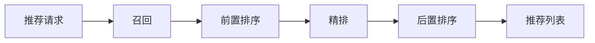
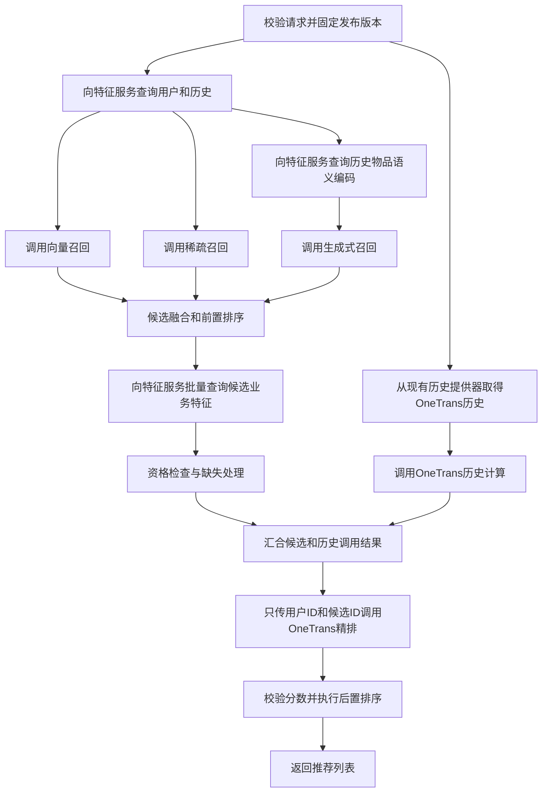
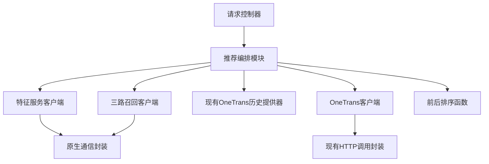
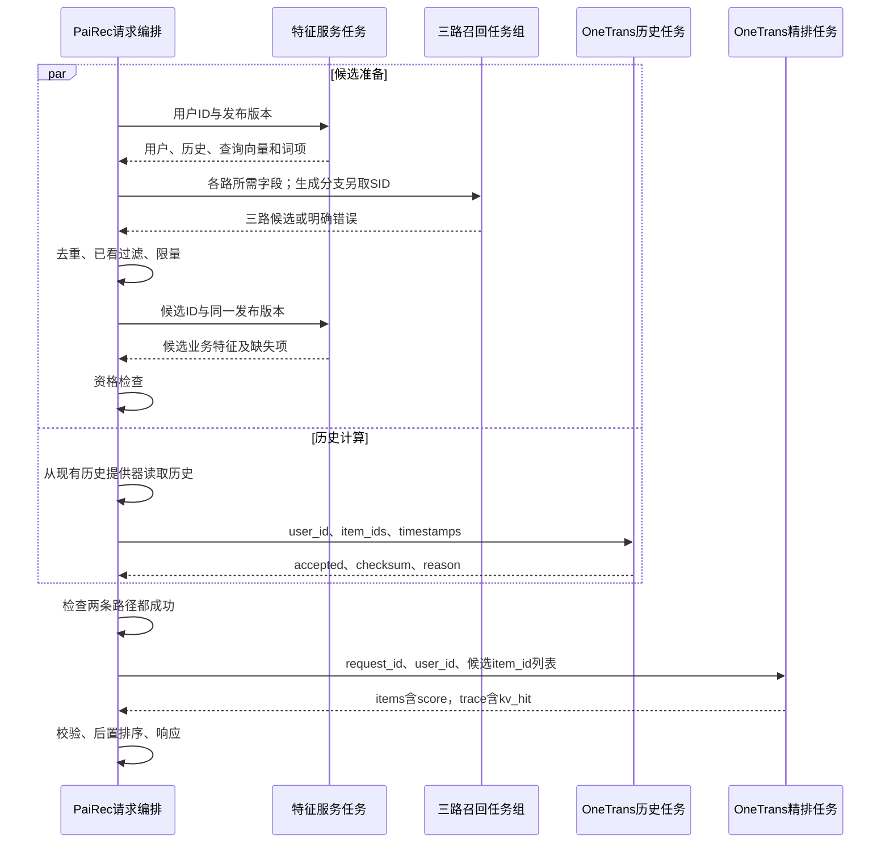
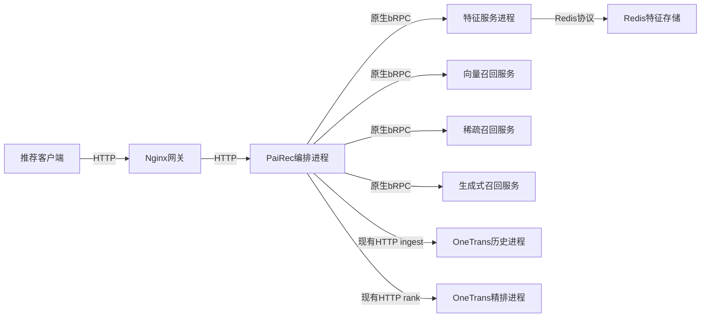

# PaiRec 内部编排：4+1 视图

图中符号与连线遵循[图法与 UML 约定](DIAGRAM_NOTATION.md)，每张图前注明使用的图法。

本文规定**目标编排方式**，保留 **OneTrans 当前代码的数据入口**作为本轮例外。除 OneTrans 外，用户、物品、历史及其派生表示统一由独立特征服务提供。本文不是已运行系统的报告。

```yaml
统一入口: Nginx → PaiRec
一般取数路径: PaiRec → FeatureService → Redis
模型子服务: 默认使用PaiRec传入的字段；确需专属字段时按ID批量查询FeatureService
OneTrans本轮例外:
  历史: 配套PaiRec历史提供器 → HTTP /ingest
  用户和候选字段: OneTrans启动装载的TSV → HTTP /rank内部装配
  模型参数: OneTrans自身或PS模型参数服务
发布规则: 请求固定release_id；特征版本、检索索引和模型资产由发布清单绑定
```

`FeatureService` 是独立特征服务；`PS` 是模型参数查询服务；`SID` 是生成模型使用的物品语义编码；`KV` 在 OneTrans 中指注意力计算的键和值张量。它们都不等同于业务特征数据库。详细的数据库、键和值见[特征服务](05_feature_data.md)。

## 1. 逻辑视图：业务步骤和取数责任

### 1.1 业务层

图法：结构或流程示意图（非 UML，连线含义见本节）。



前置排序负责候选融合、去重、已看过滤和限量，本期没有新增粗排模型。精排负责模型打分；后置排序根据分数、人工屏蔽规则和返回数量形成列表。

### 1.2 PaiRec 内部的目标步骤

图法：结构或流程示意图（非 UML，连线含义见本节）。



这张图的并行与错误汇合属于目标编排；OneTrans 的历史来源及精排请求字段按现有代码保留。**特征服务返回的历史用于召回和已看过滤；本轮不能声称它与 OneTrans 的历史相同。**需要在发布验收中核对两者覆盖及差异。

业务上有两个取数阶段：召回前取用户及历史相关输入，候选确定后取候选业务特征。正常主链中 PaiRec 调用特征服务三次，生成服务推理后反查物品 ID 一次，共四次逻辑 RPC；分批或缓存会影响实际访问次数，不能理解成两次网络调用。

### 1.3 谁取什么，谁负责使用

| 执行者 | 调用或数据源 | 获得的数据 | 用途 |
|---|---|---|---|
| PaiRec | `GetUserContext(release_id, user_id)` | 用户字段、历史、DSSM 查询向量、稀疏词项 | 三路召回输入与已看过滤 |
| PaiRec 的生成分支 | `BatchGetItemRepresentations`，输入历史 ID 和所需 SID 版本 | 与历史 ID 对齐的语义编码及缺失项 | 构造生成模型输入 |
| 生成式召回服务 | `BatchGetItemRepresentations`，按生成 SID 反向查询 | 每个 SID 对应的原始物品 ID 集合 | 输出业务候选；同一 SID 可能对应多个物品 |
| PaiRec | `BatchGetItemFeatures(release_id, item_ids)` | 候选类型、类型是否已知、统计特征及缺失项 | 资格检查、后置排序和结果解释 |
| 各召回服务 | PaiRec 传入的必要字段 | 本路计算所需输入 | 不重复查询同一用户和历史 |
| 子服务，可选 | 特征服务的批量查询接口 | 尚未取得的专属字段或物品表示 | 使用相同 `release_id`，不得自行读取 Redis |
| OneTrans 历史提供器，当前例外 | Kafka 历史缓存；未命中再读本地用户 JSON | `click_history` 中的物品 ID 序列 | 构造 `/ingest` 输入 |
| OneTrans 候选精排，当前例外 | 启动装载的用户 TSV 与物品 TSV | 用户数值字段、候选数值与类别输入槽 | `/rank` 内部装配模型输入 |

离线生成的用户向量与 item→SID 映射属于可按实体查询的**派生特征**，由特征服务发布。模型权重、embedding 参数表、检索索引和推理 KV 分别由模型、参数、检索和计算状态服务管理；不因为包含物品 ID 就全部搬进 Redis。

### 1.4 精排接口边界

```python
# 本轮主接口：按现有C++ HTTP /rank实现。
rank_request = {
    "request_id": request_id,
    "user_id": uid,
    "items": [{"item_id": item.item_id} for item in eligible_candidates],
}
# OneTrans自装配用户和物品字段；不是把Redis的15维数组直接送入该接口。
rank_response = {
    "request_id": request_id,
    "items": [{"item_id": item_id, "score": score}],
    "trace": {"kv_hit": kv_hit},
    # 省略现有model_version、model_role和耗时字段。
}
```

`score` 是首个模型输出经过 sigmoid 得到的排序分；没有校准与效果证据时不称为点击概率。现有 `/score` 也能接收完整用户、候选字段，但本轮不切换到该接口，不新增 Redis 特征到 OneTrans 的映射。

## 2. 开发视图：编排依赖的业务接口

图法：模块关系示意图（非 UML，连线含义见本节）。



图中都是 PaiRec 内部代码模块。特征服务客户端负责发 RPC 和验证响应；它不包含 Redis 查询实现。Redis 键名、批量读取、解码和缓存属于远端特征服务。

```go
// 目标业务封装；特征与召回请求携带context及固定release_id。
// OneTrans HTTP字段按现有接口，不额外宣称它已支持release_id。
type FeatureClient interface {
    GetUserContext(context.Context, UserQuery) (UserContext, error)
    BatchGetItemRepresentations(context.Context, RepresentationQuery) (RepresentationBatch, error)
    BatchGetItemFeatures(context.Context, ItemQuery) (ItemFeatureBatch, error)
}
type RecallClient interface {
    Recall(context.Context, RecallInput) (RecallResult, error)
}
type OneTransClient interface {
    Ingest(context.Context, IngestRequest) (IngestResponse, error)
    Rank(context.Context, RankRequest) (RankResponse, error)
}
type LegacyHistoryProvider interface {
    GetUserHistory(uid string) ([]int64, error)
}
```

`LegacyHistoryProvider` 的名字在此仅表示“保留现有数据来源”；它不是新特征服务的实现。可以复用读取逻辑，但要把原有“无论成功失败都放行”的闸门替换为携带结果或错误的异步任务，这是目标编排的开发工作。现有代码无历史时不投递 `/ingest`；目标严格编排要报告历史不可用，不能误记为历史计算成功。

```text
建议代码职责
  controller/       参数校验、请求标识、响应
  engine/           固定流程、并行调用、等待与错误传播
  feature_client/   特征服务接口、批量响应对齐和版本检查
  recall_clients/   向量、稀疏、生成式召回输入输出
  onetrans_client/  现有ingest/rank字段适配和响应检查
  history_provider/ 保留现有OneTrans历史来源
  ranking_rules/    融合、资格过滤、稳定排序、人工规则
  transport/        Go/C++进程内调用、原生bRPC连接和超时
```

模型算法、Redis 数据装载和检索索引构建不进入编排模块。官方 PaiRec 作为固定依赖，自有控制器与 `RecommendEngine` 承担本场景；不另建通用工作流平台。

## 3. 进程视图：并行、等待与失败

图法：UML 时序图。 PaiRec 代表含并行子任务的编排进程，各分支内同步等待，分支之间可以交错。



此处 `/ingest` 的 `accepted=true` 来自历史前向及 KV 写入完成后的返回。它不是新设计的 ready 句柄，也不证明稍后 `/rank` 读取的仍是这次历史：现有 KV 按模型版本与用户 ID 存储，同用户并发写可能覆盖。

```python
# 目标控制流；不是当前工程已经完成的端到端实现。
release = pin_ready_release()
request = validate_request(uid, scene_id, size)
# 必需任务失败时立即取消其余业务任务；结果仍由任务对象保存。
ingest_task = start_required_task(
    lambda: onetrans.ingest(build_existing_history_input(uid)))

context = features.GetUserContext(release_id=release.id, user_id=uid)
# 三路并发；生成分支先从特征服务批量取历史SID。
recalled = parallel_recalls(context, release)
candidates = fuse_deduplicate_and_remove_seen(recalled, context.history)
item_features = features.BatchGetItemFeatures(release.id, ids(candidates))
rankable = apply_eligibility(candidates, item_features)

ingested = ingest_task.wait_remaining_deadline()
require(ingested.accepted)
if not rankable:
    return empty_response(reason="no_eligible_candidates")
result = onetrans.rank(request.id, uid, ids(rankable))
require(result.trace.kv_hit)
require_same_candidate_ids_and_finite_scores(result, rankable)
return post_sort_with_rules(result, item_features, request.size)
```

本期融合规则保持：生成候选最多 10 个；稀疏与向量按轮询补至最多 50 个；原始分数不跨来源相加；各候选保留全部来源。后置排序按 OneTrans 返回 `score` 降序，同分按融合次序、原始 ID 确定顺序；人工屏蔽规则默认空。

| 情形 | 目标编排行为 | 当前代码的边界 |
|---|---|---|
| 用户特征缺失、版本或维度错误 | 停止召回，报告特征阶段错误 | 特征服务接口尚需开发 |
| 某路必需召回失败 | 取消其他业务任务并报告错误 | 不能拿空候选伪装成功 |
| 部分候选业务特征不存在 | 按明确规则剔除，记录缺失 ID | 不把未知库存、价格填成真实值 |
| `/ingest` 失败 | 不提交 `/rank`，传播历史阶段错误 | 原有闸门只表示结束，须改为携带结果 |
| `/rank` 的 `kv_hit=false` | 严格场景判失败 | 现有后端返回零 logits，随后 `/rank` 转成 0.5 |
| 同用户并发请求使用不同历史 | 联调前明确串行约束或补充版本校验 | 当前协议不能证明历史快照一致 |
| 用户或物品不在 OneTrans TSV | 发布前检查覆盖；不能当完整特征验收 | 现有装配器会补零，未强制报错 |
| 超时或用户断连 | 停止提交新阶段，取消客户端等待 | 不假定已中断远端模型计算 |

全请求联调上限仍为 25 秒；每次特征 RPC 上限 1 秒，向量/稀疏 5 秒，生成/历史/精排各 10 秒，都受剩余期限约束。这是联调配置，不是性能目标。本轮不声明已有按请求释放 KV、正 TTL 或自动回收能力；现有 OneTrans KV 的复用和到期方式必须按实际部署配置确认。

## 4. 物理视图：进程和协议

图法：部署映射示意图（非 UML，连线含义见本节）。



该图是目标部署边界，但 OneTrans 保留已有 HTTP 路径；未来可以增加原生 bRPC 桥，仍应转发现有 `/ingest`、`/rank` 字段。特征与召回客户端的 Go→C→C++ 调用在同一进程内，不是额外网络服务。向量、稀疏内部检索连接见[其他服务](07_other_services.md)。

| 进程或状态 | 部署要求 |
|---|---|
| Nginx | 外部统一入口；转发业务请求和关联 ID，不进行召回编排 |
| PaiRec | 多副本可用；固定本请求版本和规则；只有现有 OneTrans 例外保留本地历史来源 |
| 特征服务 | 可独立扩容；统一 Redis 访问、字段解释、版本校验、缺失语义 |
| 召回服务 | 接收所需特征；管理自己的模型和索引，不重复装载业务用户库 |
| OneTrans 两个进程 | 各自按配置装载模型、TSV和参数客户端；历史 KV 使用双方可访问的后端 |
| 运维配置 | 明确 Redis 发布、索引版本、OneTrans TSV 与 PS 覆盖；只固定 release_id 不会自动修复现有数据差异 |

## 5. 场景视图：用户 1 的首页推荐

```json
{"uid":"1","scene_id":"home_feed","size":10}
```

| 步骤 | 本请求使用的输入 | 可检查的输出 |
|---|---|---|
| 特征服务用户查询 | 用户 1、固定发布 | 实际样例历史 10 项、查询表示及版本；未装载要报缺失 |
| 三路召回 | 用户向量、类型词项、特征服务给出的历史 SID | 各路实际候选 ID；本文不预填模型输出 |
| 候选特征查询 | 融合候选 ID | 对齐的物品属性、状态、缺失信息 |
| OneTrans 历史计算 | 现有历史提供器对用户 1 的实际返回 | 写入结果；本地历史是否覆盖用户 1 尚需验证 |
| OneTrans 精排 | 用户 1 与合格候选 ID | TSV 装配后的实际排序分及 `kv_hit` |
| 后置排序 | 排序分、候选属性和人工规则 | 最多 10 个实际物品，实际数量及不足标记 |

完整逐服务时序见[一次请求](08_request_walkthrough.md)。其中特征服务历史有真实数据证据，但不能用它推断现有 OneTrans JSON 与 TSV 已覆盖用户 1。

人工可以调整各路候选预算、超时、场景开关及明确的物品屏蔽列表；配置版本在请求开始时固定。正式验收必须保留必要召回和精排步骤，诊断场景停用阶段时要返回明确原因，不能冒称该阶段已执行。

源码依据：[历史提供器接入](assets/source_snapshots/pairec4tigerllm_8506/services/recall/onetrans_s_stage.go.html#L72)、[现有 HTTP 接口](assets/source_snapshots/OneTrans_HSE_project/cpp/tools/server_main.cpp.html#L234)、[TSV 装配器](assets/source_snapshots/OneTrans_HSE_project/cpp/src/serving/rank_assembler.cpp.html#L83)、[KV 缺失行为](assets/source_snapshots/OneTrans_HSE_project/cpp/src/serving/flow.cpp.html#L205)。
