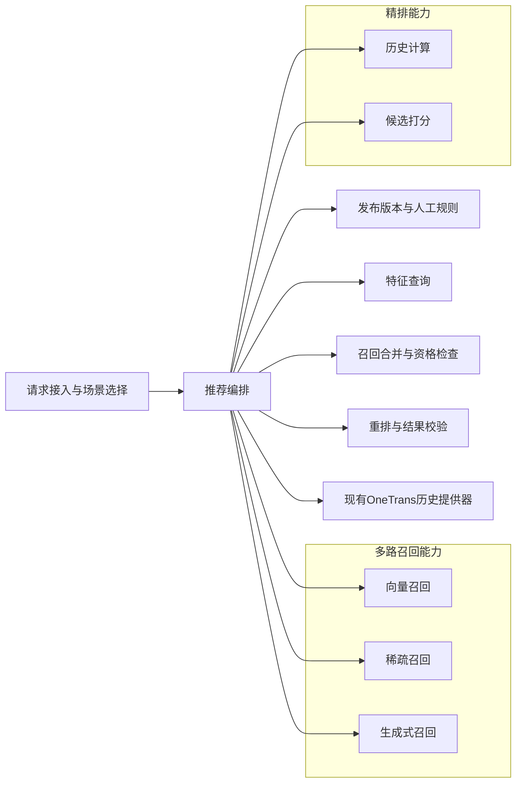
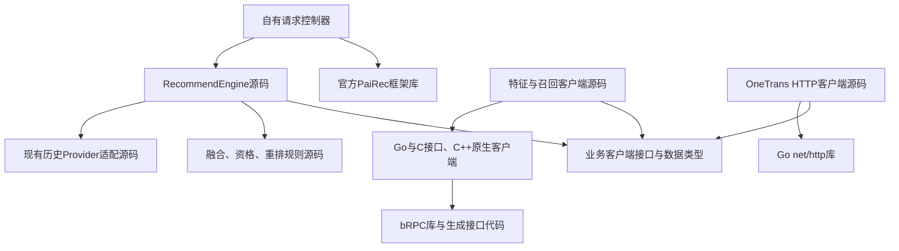
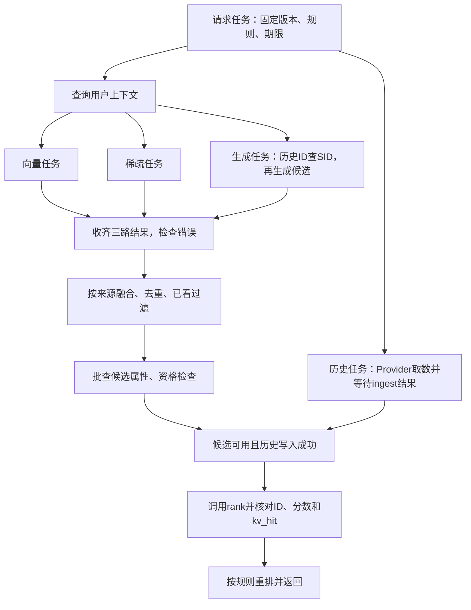
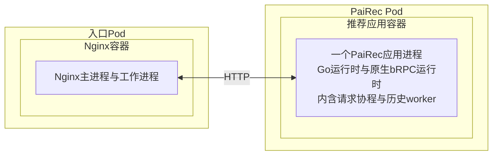
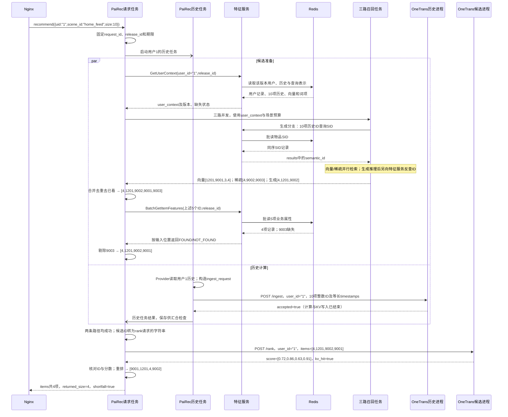

# PaiRec 内部编排：4+1 视图

图中符号与连线遵循[图法与 UML 约定](DIAGRAM_NOTATION.md)。本章展开 PaiRec 如何组织任务、持有数据并等待结果；整体服务边界见[系统视图](01_system.md)。**目标架构与已有源码行为分开描述，负载分析是机制推导，不是性能实测。**

| 本文的依据 | 用来回答什么 | 不能据此认定什么 |
|---|---|---|
| 官方 PaiRec v2.6.2 源码 | 默认入口怎样分支、汇合、加载特征和调用算法 | 本场景已经配置或执行全部默认阶段 |
| 当前 OneTrans 配套编排及原生客户端源码 | Provider、队列、闸门、HTTP 与 Go/C++ 调用的实际行为 | 已满足目标的严格错误传播、版本和取消约束 |
| 本文的 `RecommendEngine` 设计 | 本场景应怎样取数、组织召回和精排、控制并发 | 新接口和完整链路已经实现 |

官方版本单独核对，避免把工程内改过的 `vendor` 当作原版。[前期编排分析](assets/source_snapshots/prior_design/pairec-orchestration-analysis.md.html)作为问题清单使用；涉及线程、等待和负载的结论以下文核对为准。

```yaml
统一入口: Nginx → PaiRec
一般取数: PaiRec → 独立FeatureService → Redis
OneTrans本轮例外:
  历史: 现有历史提供器 → HTTP /ingest
  用户与候选字段: OneTrans本地TSV → HTTP /rank内部装配
请求约束: 固定release_id和人工场景规则；总期限约束所有阶段
开发边界: 官方PaiRec固定依赖；自有Controller与RecommendEngine承载本场景
压力回放: 系统外部工具，不进入推荐核心
```

`FeatureService` 是独立特征服务；源码中的 `service/feature.FeatureService` 是框架内部特征加载器，两者不能混用。`SID` 是物品语义编码；OneTrans 的 `KV` 是注意力键和值张量；`PS` 是模型参数服务。数据库及键值定义见[特征服务](05_feature_data.md)。

## 1. 逻辑视图：编排职责及业务能力依赖

框表示逻辑职责，箭头统一表示“使用对方提供的能力”，不表示先后顺序、源码导入或网络调用。召回合并和重排属于 PaiRec；模型计算属于被编排的能力。

图法：逻辑结构示意图（非 UML）。



特征查询提供事实，召回合并与重排使用已查得的数据，不再自行查数据库。生成服务推理后才知道候选 SID，其反查由生成服务调用特征服务完成，内部关系见[生成召回](04_generative_recall.md)。OneTrans 保留独立取数边界，不画成已接入新特征服务。

| 责任 | 主要业务输入 → 输出 | 谁拥有和修改数据 |
|---|---|---|
| 请求接入、场景选择 | `{uid,scene_id,size}` → 请求 ID、固定版本、规则、总期限 | 单请求持有；人工发布后形成只读配置快照 |
| 特征查询 | 用户 ID／候选 ID／历史 ID → 上下文、物品属性、SID | PaiRec 保存本请求结果；远端解释缺失和版本 |
| 三路召回 | 查询向量／加权词项／历史 SID → 本路候选及原始分数 | 各分支独占结果；合并前不共写候选数组 |
| 召回合并 | 分来源候选、已看历史、候选属性 → 合格候选 | 汇合后由请求任务统一去重、过滤和限量 |
| 历史准备与候选打分 | Provider 历史 → 写入结果；用户与候选 ID → 分数 | OneTrans 管理历史 KV、本地特征和模型参数；PaiRec 检查结果 |
| 重排、结果校验 | 同 ID 的分数、属性、人工规则、`size` → 有序列表 | 请求任务核对 ID、有限数值、顺序与实际数量 |

业务上有“召回前”和“候选确定后”两个取数阶段。正常请求中 PaiRec 调用特征服务三次：`GetUserContext`、历史 ID 查 SID 的 `BatchGetItemRepresentations`、`BatchGetItemFeatures`；生成服务另作一次 SID 反查，共四次逻辑 RPC，底层数据库拆批另计。

**两份历史不能默认为相同。**特征服务历史用于召回和已看过滤，现有 Provider 历史用于 OneTrans。当前 `/rank` 只发送以下字段，不把新特征服务返回的数组直接传入模型。

```python
rank_request = {
    "request_id": "demo-user-1-001", "user_id": "1",
    "items": [{"item_id": x} for x in ["4", "1201", "9002", "9001"]],
}
# OneTrans自行装配用户和候选字段；items响应逐项带item_id、score。
# score是首个模型输出经sigmoid的排序分，未验证校准时不称为点击概率。
```

## 2. 开发视图：源码依赖与交付物

图中只放源码模块与库，箭头表示导入或编译依赖；远端特征、召回、数据库进程不放入此图。图为目标组织，不要求新建所有同名目录。

图法：源码依赖示意图（非 UML）。



控制器的装配代码向 `RecommendEngine` 注入客户端实现；引擎只依赖业务接口。当前直接访问 Redis 的 DAO 只作为迁移证据，目标中 Redis 键名、批读和解码留在远端特征服务。

```go
// 目标接口摘录；每个Query都带固定版本及请求标识。
// ctx负责本地期限/取消；OneTrans沿用现有HTTP字段，不宣称已支持release_id。
type FeatureClient interface {
    GetUserContext(ctx context.Context, q UserQuery) (UserContext, error)
    BatchGetItemRepresentations(ctx context.Context, q RepresentationQuery) (RepresentationBatch, error)
    BatchGetItemFeatures(ctx context.Context, q ItemQuery) (ItemFeatureBatch, error)
}
type RecallClient interface {
    Recall(ctx context.Context, in RecallInput) (RecallResult, error)
}
type OneTransClient interface {
    Ingest(ctx context.Context, in IngestRequest) (IngestResponse, error)
    Rank(ctx context.Context, in RankRequest) (RankResponse, error)
}
```

这些 `Query`、`Request` 和 `Response` 是各业务请求、响应类型的占位名，字段以[请求样例](08_request_walkthrough.md)为准。代码说明职责边界，不是一份可直接编译的 SDK。

| 源码范围 | 交付物与关键要求 |
|---|---|
| 控制器、引擎、规则、Provider、HTTP 客户端 | 编入一个 PaiRec 应用；显式错误、确定顺序；复用 Provider 来源但不沿用“结束即成功” |
| 特征与召回客户端、公共类型 | 编入应用；业务数据按调用复制或只读共享，结果按输入 ID 对齐 |
| Go/C/C++ 原生客户端 | 原生库及链接依赖随应用镜像交付；已有 `stageClient` 使用 `libstageclients`、bRPC 等，目标业务接口不能只改地址 |
| 官方 PaiRec v2.6.2 | 固定版本依赖；本场景走自有入口，不同时触发另一条默认完整推荐链 |
| 场景及发布配置 | 人工可审阅的候选预算、版本绑定、超时、开关和屏蔽列表；请求内不热切换 |

当前原生库的构建、字符串复制和释放见 [Go 封装](assets/source_snapshots/pairec_sh/pairec-demo/src/stageClient/stageClient.go.html#L17)与 [C 接口](assets/source_snapshots/pairec_sh/pairec-demo/src/cpp/stageBridge_c.cpp.html#L63)。源码里的客户端不是独立服务进程。

## 3. 进程视图：执行单元、并发与同步

### 3.1 官方默认链路实际怎样分支

以下是官方 `UserRecommendService.Recommend` 的执行结构。`pipeline` 是框架中“额外完整推荐路径”的配置名，不泛指每个处理步骤；场景配置了额外路径，才会有对应业务工作。

```text
处理当前请求的协程
  LoadUserFeatures（先完成用户特征加载）
  ├─ 额外路径入口协程 → 按场景启动各条pipeline → 收齐各路径结果
  │    每条路径可自行召回、过滤、特征加载、打分与排序
  └─ 当前协程：主路径召回 → Filter → GeneralRank → Features → Rank
       等待额外路径入口的WaitGroup
       按ID合并主路径与额外路径物品 → Sort → 截断
       派生特征日志、样本日志等后台任务
```

`GeneralRank` 是框架的通用前置打分阶段；本场景没有新增粗排模型，不能因为框架存在调用就宣称本场景执行了它。[官方主链](assets/source_snapshots/pairec_v2.6.2/service/user_recommend.go.html#L45)及[额外路径入口](assets/source_snapshots/pairec_v2.6.2/service/pipeline/pipeline.go.html#L45)给出了上述分支和汇合。

| 官方代码中的并发点 | 实际执行与等待 | 对本场景的意义 |
|---|---|---|
| 召回分发 | 每个已选召回一个协程；容量为召回数的 channel 收结果，父任务固定次数接收 | 返回先后影响原始拼接次序；目标按来源规则重组，不拿完成顺序作业务排序 |
| 特征加载器 | `async=true` 时每个加载器及可选回调起协程，`WaitGroup.Wait` 等待；否则顺序加载 | 配置和 DAO 内部分批决定并发，不能只数顶层框 |
| 默认 Rank | 每个候选批次一个协程；每批再按算法列表派生协程；批内 WaitGroup、批间结果 channel | 批数×算法数可放大调用量；当前 OneTrans 适配位于 Sort，不能直接套用此 Rank 扇出 |
| 额外完整路径 | 与主路径共享用户和请求上下文，各走自己的阶段后汇合 | 配错场景可能重复取数与计算；目标本场景不启用第二套完整编排 |

依据：[召回 channel](assets/source_snapshots/pairec_v2.6.2/service/recall.go.html#L119)、[特征并发](assets/source_snapshots/pairec_v2.6.2/service/feature/feature_service.go.html#L77)、[Rank 分批与嵌套协程](assets/source_snapshots/pairec_v2.6.2/service/rank/rank_service.go.html#L250)。这些固定次数 channel 接收和 `WaitGroup.Wait` 本身不带请求取消；召回 panic 被转换为空结果，不能代替目标的显式错误传播。

### 3.2 当前 OneTrans：后台队列与请求闸门

现有历史计算借用召回插件入口，但不返回候选。Provider 优先读取可选 Kafka 消费者的内存缓存，未命中再查本地 JSON 缓存。第一次访问本地后备数据会在 `sync.Once` 内读取并解码整个文件；后续按用户查询，并解析 `click_history`。这是实际存在的本地 I/O 和常驻内存，不能把当前编排描述成无本地数据状态。[Provider 源码](assets/source_snapshots/pairec4tigerllm_8506/services/feature/provider.go.html#L108)

当前调用方构造的 `timestamps` 是与历史 ID 等长的占位序号 `0..n-1`，不是 Unix 时间，也不参与模型位置编码。

```go
// 按当前源码简化：说明现状，不是目标实现。
req := provider.BuildIngest(user)  // 整数item_ids；等长占位序号timestamps
if len(req.ItemIDs) == 0 { return } // 当前不投递，也不创建闸门
latch := NewLatch()                // 每个请求一个；不是跨请求的用户锁
select {
case queue <- req:                 // 非阻塞尝试入队，交给后台worker
default:
    if injectSync { ingest(req) }  // 队满可同步兜底，错误未传播给主请求
    latch.Done()                   // 丢弃任务也会放行
}
// 后台worker：从queue取任务 → HTTP ingest → 无论成功失败都latch.Done()
// 精排侧：先HTTP rank；kv_hit=false且有latch时，等待后再HTTP rank一次。
```

上面省略的关联是：`req` 和请求上下文保存同一 `latch`。实际[闸门](assets/source_snapshots/pairec4tigerllm_8506/services/scachelatch/scachelatch.go.html#L25)用 `sync.Once` 保证 channel 只关闭一次；`Wait` 用 `select` 等 channel 关闭或定时器。**关闭代表这次投递已结束，不能证明历史写入成功。**

| 现状细节 | 负载和正确性含义 |
|---|---|
| 每个历史阶段实例默认队列 1024、worker 4，可被配置覆盖 | 长驻 worker 池真实存在；队列限制待处理数，每个 worker 顺序发 HTTP；同步兜底开启后在途数可超过 4 |
| HTTP ingest 只检查状态码，不解析 `accepted`；成功或失败都放行 | 目标须解析业务结果，并把成功或错误带回等待方 |
| 首次 rank miss 后忽略 `Wait` 返回值，再查一次 | 即使等待超时也会重查；注释与实现有差异，以实现为准；单请求可能增加一次 rank RPC |
| ingest 使用 `context.Background()`，rank 使用无请求上下文的 `NewRequest` | 当前主要靠各 HTTP Client 超时，不能宣称前端断连已取消后端请求 |
| Kafka 用后台协程消费并以 `sync.Map` 替换用户记录 | 与在线请求共享内存；容量随已见用户增长，源码未设置淘汰上限 |

依据：[队列、worker 与放行](assets/source_snapshots/pairec4tigerllm_8506/services/recall/onetrans_s_stage.go.html#L154)、[HTTP ingest](assets/source_snapshots/pairec4tigerllm_8506/services/recall/onetrans_s_stage.go.html#L104)、[miss 后重查](assets/source_snapshots/pairec4tigerllm_8506/services/sort/onetrans_rank_sort.go.html#L154)、[HTTP rank](assets/source_snapshots/pairec4tigerllm_8506/services/sort/onetrans_rank_sort.go.html#L245)、[Kafka 缓存](assets/source_snapshots/pairec4tigerllm_8506/services/feature/consumer.go.html#L100)。

### 3.3 目标请求任务怎样并行、汇合

图中“任务”是一次业务工作，可以由协程执行；图不是固定线程分配，也不要求每个阶段增加一层 worker 池。请求处理协程负责候选合并和重排，历史任务与三个召回分支是主要并发点。

图法：任务与同步示意图（非 UML，箭头表示执行依赖）。



目标任务须返回**结果和错误**。可以采用有界结果 channel 与单一汇合方；`WaitGroup` 只表达“任务都结束”，不保存错误、不会自动取消，也不限制任务数。父请求取消后，子任务仍须有退出及结果回收路径，不能向无人接收的无缓冲 channel 永久发送。结果容器由分支独占，成功汇合后交给请求任务；共享上下文只读，避免几个分支同时改同一 map 或候选分数。

```python
# 控制流伪代码；start_task启动任务并保存其结果或错误。
# wait在请求剩余期限内取结果；任一必需任务失败会触发取消。
history_task = start_task(lambda: ingest_from_existing_provider(user_id))
user_context = features.GetUserContext(user_query)
recall_results = wait_three_required_recalls(user_context, fixed_policy)
candidates = merge_by_source_and_remove_seen(recall_results, user_context.history)
item_features = features.BatchGetItemFeatures(query_for(candidates))
rankable = apply_eligibility(candidates, item_features)
ingested = history_task.wait()
require(ingested.accepted)  # 已解析业务响应，不能只看HTTP 200
if not rankable:
    return empty_response(reason="no_eligible_candidates")
scores = onetrans.Rank(user_id, ids(rankable))
require(scores.trace.kv_hit and same_ids_and_finite_scores(scores, rankable))
return rerank(scores, item_features, fixed_policy)
```

`fixed_policy` 是请求开始固定的规则，`ids` 提取物品 ID，`require` 失败即终止请求；它们不是框架 API。融合最多保留 10 个生成候选，再由稀疏、向量轮询补至最多 50 个；原始分数不跨来源相加。重排按 OneTrans 分数降序，同分保留合并顺序；人工屏蔽默认空。

| 汇合或异常 | 目标行为 |
|---|---|
| 用户特征缺失、版本错误或必需召回失败 | 返回明确阶段错误，停止提交新阶段，取消其他任务的可取消等待 |
| 候选属性缺失 | 按明确规则剔除并记录 ID；不伪造库存、价格或零向量 |
| 历史不存在、ingest 失败、rank 未命中 KV | 严格场景判失败；不把未执行历史计算或统一 0.5 分当作成功 |
| 同用户并发写不同历史 | 联调先明确串行约束或补充版本校验；当前 KV 按模型版本与用户存储，闸门不能隔离不同请求 |
| 超时、前端断连 | 取消本地等待不等于远端计算停止；在途原生调用安全结束后释放内存 |

全请求联调上限 25 秒；特征 RPC 各 1 秒，向量／稀疏各 5 秒，生成／历史／精排各 10 秒，每次取阶段上限与剩余总时间的较小值。这些是联调配置，不是性能目标。目标默认不自动重试模型请求，也没有承诺 OneTrans 已支持请求级 KV 释放。

### 3.4 协程、线程和等待究竟消耗什么

Go 的 goroutine 是可调度的协程，OS thread 是操作系统线程，两者不是一一对应。Go 运行时通常用 `G` 表示协程、`M` 表示线程、`P` 表示执行 Go 代码所需的调度资源；`GOMAXPROCS` 决定 P 的数量，**不限制整进程的线程数或原生代码 CPU 使用量**。本文称业务执行者为“请求协程”，不借用运行时系统栈的 `g0` 名字。[Go 调度器说明](https://go.dev/src/runtime/HACKING)

| 工作 | 等待位置与恢复条件 | 资源判断 |
|---|---|---|
| Go HTTP 客户端等待可轮询网络连接 | 网络未就绪时可挂起协程；连接就绪或超时后恢复为可运行状态 | 不要求每个等待各占一个线程；仍占请求对象、连接、缓冲和协程栈 |
| channel 收结果、WaitGroup 汇合 | 无结果／计数未归零时挂起；发送、关闭或最后一次 Done 满足等待条件 | 唤醒不等于立即获得 CPU；不能把每次交接说成一次固定的内核 futex 操作 |
| Go Mutex／RWMutex | 保护共享对象，竞争时等待持有者释放 | 锁内只做短操作；不要把远程等待放进共享锁区间 |
| 同步 CGO 调用原生 bRPC | 请求协程等待 C 函数返回；调用线程留在原生调用栈 | Go 可让其他线程继续执行 Go；不能按 Go netpoll 模型视作已释放调用线程 |
| JSON 解码、复制、哈希去重、排序 | 获得 CPU 后执行，与其他可运行任务竞争 | 后端已返回，本地排队、GC 和解码仍会延长等待 |

Go 官方定义了挂起与重新进入可运行队列的区别；`WaitGroup` 等待计数归零的行为见 [sync 文档](https://pkg.go.dev/sync#WaitGroup)。Go HTTP 可轮询网络读写使用运行时网络等待，见 [Go 网络 FD 等待](https://go.dev/src/internal/poll/fd_poll_runtime.go)。不能据此推出“整个 PaiRec 的网络 I/O 都不会增加线程”：本工程还有 CGO 和本地文件读取。

当前原生客户端是 `Go → C ABI → C++ → bRPC CallMethod(..., done=NULL)` 的**同步调用**。bRPC 收到响应、错误或超时后才返回；其后台工作线程与 Go 调度器在同一进程内各自工作。Go 会进入外部调用状态，使其他 Go 工作可以推进，但 C 调用尚未完成。[CGO 实现](https://go.dev/src/runtime/cgocall.go)与 [bRPC 同步调用约定](https://brpc.apache.org/docs/client/basics/#synchronous-call)

现有 Redis／OpenSearch 适配证明了这种调用形式，未实现目标业务 RPC 的异步完成通知。请求字符串通过 `C.CString` 复制，响应经过 C 分配、`C.GoString` 复制和显式释放；大批量数据会经过 Go 与原生内存。已有 Redis 物品 DAO 按 100 项顺序 MGET，不能描述成一项一条协程或已完成独立特征服务。[原生调用](assets/source_snapshots/pairec_sh/pairec-demo/src/cpp/brpcClients/redis_client.cpp.html#L37)、[数据复制](assets/source_snapshots/pairec_sh/pairec-demo/src/stageClient/stageClient.go.html#L115)、[DAO 分批](assets/source_snapshots/pairec_sh/pairec-demo/src/dao/feature_brpc_redis_dao.go.html#L122)

源码还有请求对象的短锁：[User 属性](assets/source_snapshots/pairec_v2.6.2/module/user.go.html#L88)、[Item 属性](assets/source_snapshots/pairec_v2.6.2/module/item.go.html#L262)、[上下文参数](assets/source_snapshots/pairec_v2.6.2/context/recommend_context.go.html#L88)。[算法注册表](assets/source_snapshots/pairec_v2.6.2/algorithm/algorithm.go.html#L107)只在查找时持读锁，调用算法前释放；不能写成全程持有全局锁。争用程度须测量，不能仅因看见锁就认定它是瓶颈。

## 4. 物理视图：Pod、容器与进程

这里只展开入口和 PaiRec 的目标部署单元；其他服务的映射见[系统物理视图](01_system.md)。没有主机分配和副本数证据，因此不填 Host；图中每种 Pod 可有多个实例。

图法：部署映射示意图（非 UML）；嵌套框表示包含，双向连线表示 HTTP 网络连通。进程内执行者已在进程视图展开，这里只标明它们归属同一进程。



两个运行时共享进程地址空间和容器资源，不是两个守护进程；C ABI 不增加网络跳数。目标特征与召回 RPC 的原生适配仍有开发工作，图不证明它们已部署。原生库随镜像交付；本地 JSON 的来源、版本与覆盖作为 OneTrans 例外保留。

| 容器内资源 | 部署时应固定或记录 |
|---|---|
| CPU 与线程 | 容器 CPU 配额、实际 `GOMAXPROCS`、Go／原生线程数、CPU 节流时间；不拿其中一个代替全部 |
| 内存 | 容器限额、RSS、Go heap、原生分配、Provider 缓存、队列和连接缓冲；不能只监控 Go heap |
| 网络 | 连接复用、在途调用上限、超时、字节数和错误；原生 bRPC 与 HTTP 分开观察 |
| 出站服务 | 原生 bRPC 访问独立特征服务与召回服务；现有 HTTP 访问 OneTrans 历史进程与候选进程，部署映射见系统图 |
| 挂载文件 | 只读场景与发布配置；OneTrans 例外所用 Provider 后备 JSON。读取和缓存归属 PaiRec 进程，不是独立服务 |
| 多副本 | 每进程自己的 Provider 缓存和队列；单进程用户锁不能保证跨副本的同用户历史隔离 |

## 5. 场景视图：用户 1 如何穿过内部编排

以下为与[完整请求样例](08_request_walkthrough.md)一致的教学数据，不是执行记录。为演示成功路径，假定现有 Provider 能提供以下历史；这不构成其本地 JSON 已覆盖用户 1 的证明。

```python
request = {"uid":"1", "scene_id":"home_feed", "size":10}
request_id, release_id = "demo-user-1-001", "demo_tenrec_v1"
history_item_ids = [2,3,80936,781,111774,1230,26403,991,2362,1202]
ingest_request = {"user_id":"1", "item_ids":history_item_ids,
                  "timestamps":list(range(10))}  # 等长占位序号timestamps
```

图法：UML 时序图。请求任务与历史任务是同一 PaiRec 进程中的两个执行者；“三路召回任务”代表任务组，不是新增服务。`-)` 表示异步消息，`->>`／`-->>` 表示同步调用／返回。数据库取数由独立特征服务执行。



图中方括号仅列 ID；实际 `/rank.items` 为 `[{"item_id":"4"},...]`，第 1 节已完整给出。向量来自 `user_context.dense_query.vector`，词项来自 `user_context.sparse_query.tokens`，候选上限来自场景配置；不是凭空产生的额外输入。生成反查是第四次特征 RPC，完整交互见[请求时序](08_request_walkthrough.md)。

历史任务成功只证明该次 `/ingest` 返回成功，当前模型版本＋用户的 KV 键可能被另一请求覆盖；`kv_hit=true` 不能证明读到本次历史。验收还要核对两套历史、OneTrans TSV 与参数覆盖，并遵守同用户并发约束。

| 需验证的场景 | 预期可见结果 |
|---|---|
| 正常用户 1 | 候选来源、缺失剔除、4项分数与最终次序可按请求 ID 对齐；完整模型阶段确实执行 |
| 历史队满或 ingest 失败 | 目标返回历史阶段错误；不能把现有闸门放行作为成功 |
| 某路返回慢或失败 | 期限内结束，其他任务能回收；无遗留无限等待或无界重试 |
| 人工发布、屏蔽或预算切换 | 新请求使用新配置，已开始的请求仍用旧快照；诊断停用阶段须明确标记 |

## 6. 负载模型：怎样判断瓶颈，怎样验证

以下公式用于选择观测项，不预测 QPS 或硬件数量。计数必须对应选定场景和实际开关，不能把默认框架的最大扇出直接算到目标链路。

```text
λ = 每秒进入该PaiRec实例的请求数；W = 请求平均在该实例停留的秒数
N ≈ λ × W                 # 稳定负载下的平均在途请求数，不是每秒创建数

框架某一Rank阶段：n=进入默认算法的候选数，b=每批上限，a=算法数，B=ceil(n/b)
  算法调用数 = B × a       # 每算法每批一次；不含内部重试/扇出
  新建协程数 = B + B×a    # 批次协调＋算法任务；不含另行配置的自定义打分及日志
  多条完整路径启用时，各路径分别计算后相加

当前历史队列：w=worker数，s=一次ingest平均占用worker的秒数
  worker服务能力约为 w/s 次每秒（不含队满同步兜底）
  到达速度持续超过此值 → 队列增长 → 队满丢弃或同步兜底
```

`N` 是按请求停留时间统计的并发量；框架公式是一次请求创建的任务数量，两者不能直接相乘当成某时刻存活协程数。目标要求一次三路召回、一次 ingest 和一次 rank，不继承默认 Rank 的批次×算法扇出；模型服务内部是否分批由服务自己决定。

目标正常请求的 PaiRec 出站业务调用为 `3次特征 + 3次召回 + 1次ingest + 1次rank = 8次`，生成服务另作一次特征反查。计数不含拆批、重试、数据库访问及模型服务内部通信；历史为空或阶段失败不会执行完整的 8 次。当前旧 OneTrans 调用方在 miss 路径可能再增加一次 rank。

```text
Tc = 用户特征耗时
     + max(向量耗时, 稀疏耗时, 历史SID查询耗时+生成召回耗时)
     + 合并耗时 + 候选属性查询耗时 + 资格检查耗时
Th = Provider读取耗时 + 历史任务排队耗时 + ingest调用耗时
Trequest ≈ 入口耗时 + max(Tc, Th) + rank调用耗时 + 重排及响应耗时
```

每段耗时是墙钟时间，包含段内调度、排队和网络等待；生成召回包含服务端反查。公式假定成功路径、历史与候选并行、单次 rank，不适用于旧版“先 rank 再等闸门”。客户端总耗时减服务端计算耗时，也不能直接当成网络耗时，中间还有排队、序列化和调度。

| 可能受限的资源 | 源码支持的机制与增长因素 | 确认所需观测 |
|---|---|---|
| CPU 与可运行任务 | 编解码、C/Go 字符串复制、历史解析、候选哈希去重和排序；多请求争用 Go 与原生线程 | CPU profile、trace中的可运行等待、容器CPU节流、Go／原生分别占用多少 |
| I/O 与工作队列 | 三路取最慢必需分支；历史 worker 被长 ingest 占用；首次 Provider 全文件读取 | 阶段起止、队列长度及排队时间、队满次数；首请求与缓存命中分开 |
| 同步与共享状态 | channel、WaitGroup、请求属性锁、算法注册表锁；唤醒后仍可能排队 | block／mutex profile及调用栈；不把正常等待远端误判为锁热点 |
| Go 与原生内存 | 在途请求、候选、特征、JSON字节、复制缓冲、协程栈；Provider全量缓存和队列 | RSS与Go heap、分配速率、GC时间、队列字节、缓存用户数；差值不全是泄漏 |
| 网络与连接 | 字节随历史长、候选数、向量维度增长；连接复用和在途上限影响等待 | 分方法请求数及字节、连接创建/复用、错误与超时；远端耗时与本地等待分开 |
| 原生调用线程 | 同步CGO调用在途时间增加，调用线程停留原生栈；bRPC运行时也用CPU和内存 | OS线程数、CGO次数和耗时、原生栈采样；不能只看goroutine数 |

去重通常随输入候选总数线性增长，排序开销随候选数增加。目标候选上限为 50，没有依据声称某个复杂重排算法已成为瓶颈，也不加入放大压力的额外循环。

验证时固定版本、历史长度、三路预算、候选数、请求并发和历史队列配置，关联同一 `request_id` 下的阶段事件。用 Go 的 CPU／heap／goroutine／block／mutex profile、执行 trace 与进程级原生采样区分计算、等待、调度和内存；工具作用及观测开销见 [Go 官方诊断说明](https://go.dev/doc/diagnostics)。本轮没有运行压测，仍需实测各阶段延迟分布、线程增长、队满阈值、内存峰值和取消后的回收时间。
