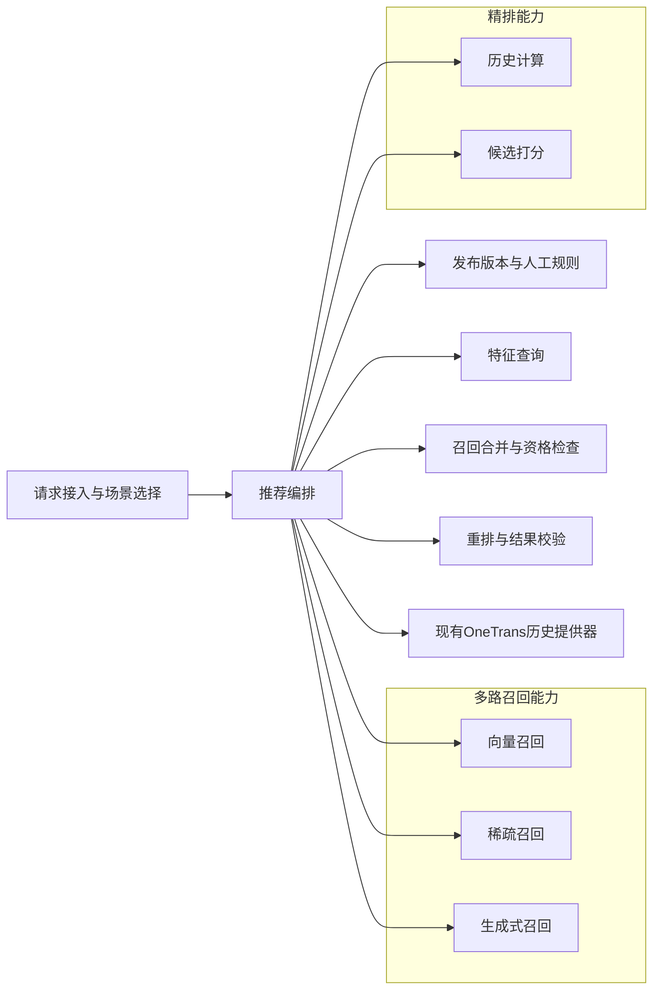
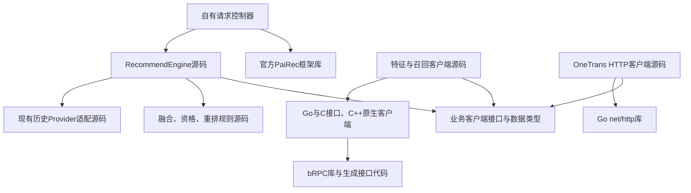
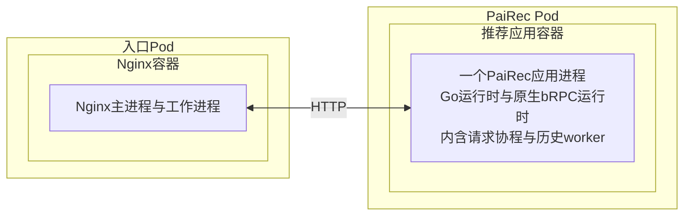
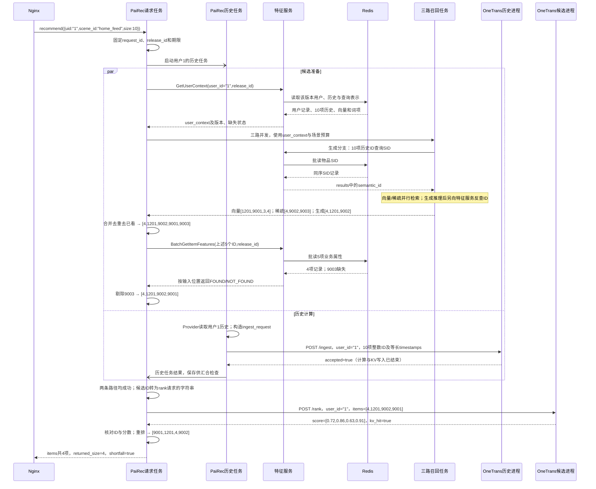

# PaiRec 内部编排：4+1 视图

图中符号与连线遵循[图法与 UML 约定](DIAGRAM_NOTATION.md)。本章展开 PaiRec 如何组织任务、持有数据并等待结果；整体服务边界见[系统视图](01_system.md)。**目标架构与已有源码行为分开描述，负载分析是机制推导，不是性能实测。**

| 本文的依据 | 用来回答什么 | 不能据此认定什么 |
|---|---|---|
| 官方 PaiRec v2.6.2 源码 | 默认入口怎样分支、汇合、加载特征和调用算法 | 本场景已经配置或执行全部默认阶段 |
| 当前 OneTrans 配套编排及原生客户端源码 | Provider、队列、闸门、HTTP 与 Go/C++ 调用的实际行为 | 已满足目标的严格错误传播、版本和取消约束 |
| 本文的 `RecommendEngine` 设计 | 本场景应怎样取数、组织召回和精排、控制并发 | 新接口和完整链路已经实现 |

官方版本单独核对，避免把工程内改过的 `vendor` 当作原版。[前期编排分析](assets/source_snapshots/prior_design/pairec-orchestration-analysis.md.html)作为问题清单使用；涉及线程、等待和负载的结论以下文核对为准。

```yaml
统一入口: Nginx → PaiRec
一般取数: PaiRec → 独立FeatureService → Redis
OneTrans本轮例外:
  历史: 现有历史提供器 → HTTP /ingest
  用户与候选字段: OneTrans本地TSV → HTTP /rank内部装配
请求约束: 固定release_id和人工场景规则；总期限约束所有阶段
开发边界: 官方PaiRec固定依赖；自有Controller与RecommendEngine承载本场景
压力回放: 系统外部工具，不进入推荐核心
```

`FeatureService` 是独立特征服务；源码中的 `service/feature.FeatureService` 是框架内部特征加载器，两者不能混用。`SID` 是物品语义编码；OneTrans 的 `KV` 是注意力键和值张量；`PS` 是模型参数服务。数据库及键值定义见[特征服务](05_feature_data.md)。

## 1. 逻辑视图：编排职责及业务能力依赖

框表示逻辑职责，箭头统一表示“使用对方提供的能力”，不表示先后顺序、源码导入或网络调用。召回合并和重排属于 PaiRec；模型计算属于被编排的能力。

图法：逻辑结构示意图（非 UML）。



特征查询提供事实，召回合并与重排使用已查得的数据，不再自行查数据库。生成服务推理后才知道候选 SID，其反查由生成服务调用特征服务完成，内部关系见[生成召回](04_generative_recall.md)。OneTrans 保留独立取数边界，不画成已接入新特征服务。

| 责任 | 主要业务输入 → 输出 | 谁拥有和修改数据 |
|---|---|---|
| 请求接入、场景选择 | `{uid,scene_id,size}` → 请求 ID、固定版本、规则、总期限 | 单请求持有；人工发布后形成只读配置快照 |
| 特征查询 | 用户 ID／候选 ID／历史 ID → 上下文、物品属性、SID | PaiRec 保存本请求结果；远端解释缺失和版本 |
| 三路召回 | 查询向量／加权词项／历史 SID → 本路候选及原始分数 | 各分支独占结果；合并前不共写候选数组 |
| 召回合并 | 分来源候选、已看历史、候选属性 → 合格候选 | 汇合后由请求任务统一去重、过滤和限量 |
| 历史准备与候选打分 | Provider 历史 → 写入结果；用户与候选 ID → 分数 | OneTrans 管理历史 KV、本地特征和模型参数；PaiRec 检查结果 |
| 重排、结果校验 | 同 ID 的分数、属性、人工规则、`size` → 有序列表 | 请求任务核对 ID、有限数值、顺序与实际数量 |

业务上有“召回前”和“候选确定后”两个取数阶段。正常请求中 PaiRec 调用特征服务三次：`GetUserContext`、历史 ID 查 SID 的 `BatchGetItemRepresentations`、`BatchGetItemFeatures`；生成服务另作一次 SID 反查，共四次逻辑 RPC，底层数据库拆批另计。

**两份历史不能默认为相同。**特征服务历史用于召回和已看过滤，现有 Provider 历史用于 OneTrans。当前 `/rank` 只发送以下字段，不把新特征服务返回的数组直接传入模型。

```python
rank_request = {
    "request_id": "demo-user-1-001", "user_id": "1",
    "items": [{"item_id": x} for x in ["4", "1201", "9002", "9001"]],
}
# OneTrans自行装配用户和候选字段；items响应逐项带item_id、score。
# score是首个模型输出经sigmoid的排序分，未验证校准时不称为点击概率。
```

## 2. 开发视图：源码依赖与交付物

图中只放源码模块与库，箭头表示导入或编译依赖；远端特征、召回、数据库进程不放入此图。图为目标组织，不要求新建所有同名目录。

图法：源码依赖示意图（非 UML）。



控制器的装配代码向 `RecommendEngine` 注入客户端实现；引擎只依赖业务接口。当前直接访问 Redis 的 DAO 只作为迁移证据，目标中 Redis 键名、批读和解码留在远端特征服务。

```go
// 目标接口摘录；每个Query都带固定版本及请求标识。
// ctx负责本地期限/取消；OneTrans沿用现有HTTP字段，不宣称已支持release_id。
type FeatureClient interface {
    GetUserContext(ctx context.Context, q UserQuery) (UserContext, error)
    BatchGetItemRepresentations(ctx context.Context, q RepresentationQuery) (RepresentationBatch, error)
    BatchGetItemFeatures(ctx context.Context, q ItemQuery) (ItemFeatureBatch, error)
}
type RecallClient interface {
    Recall(ctx context.Context, in RecallInput) (RecallResult, error)
}
type OneTransClient interface {
    Ingest(ctx context.Context, in IngestRequest) (IngestResponse, error)
    Rank(ctx context.Context, in RankRequest) (RankResponse, error)
}
```

这些 `Query`、`Request` 和 `Response` 是各业务请求、响应类型的占位名，字段以[请求样例](08_request_walkthrough.md)为准。代码说明职责边界，不是一份可直接编译的 SDK。

| 源码范围 | 交付物与关键要求 |
|---|---|
| 控制器、引擎、规则、Provider、HTTP 客户端 | 编入一个 PaiRec 应用；显式错误、确定顺序；复用 Provider 来源但不沿用“结束即成功” |
| 特征与召回客户端、公共类型 | 编入应用；业务数据按调用复制或只读共享，结果按输入 ID 对齐 |
| Go/C/C++ 原生客户端 | 原生库及链接依赖随应用镜像交付；已有 `stageClient` 使用 `libstageclients`、bRPC 等，目标业务接口不能只改地址 |
| 官方 PaiRec v2.6.2 | 固定版本依赖；本场景走自有入口，不同时触发另一条默认完整推荐链 |
| 场景及发布配置 | 人工可审阅的候选预算、版本绑定、超时、开关和屏蔽列表；请求内不热切换 |

当前原生库的构建、字符串复制和释放见 [Go 封装](assets/source_snapshots/pairec_sh/pairec-demo/src/stageClient/stageClient.go.html#L17)与 [C 接口](assets/source_snapshots/pairec_sh/pairec-demo/src/cpp/stageBridge_c.cpp.html#L63)。源码里的客户端不是独立服务进程。

## 3. 进程视图：执行角色与同步边界

本视图给出进程内执行单元的全貌。逐函数代码、数据对象、锁范围、挂起与唤醒、阶段工作量及 OS 分析独立放在 [12：PaiRec 进程内部分析](12_pairec_process_analysis.md)，避免一张架构图同时承担全部代码解释。

### 3.1 当前源码中的执行角色

| 执行角色 | 创建及生命期 | 交付与同步 |
|---|---|---|
| HTTP 请求处理协程 | HTTP 服务器调入处理函数 | 顺序推进主路径；各阶段可在内部创建并发任务 |
| 召回子协程 | 每个实际召回实例一次；请求内 | 用结果 channel 交付候选指针切片；调用者按固定次数收齐 |
| 特征任务与 DAO 子协程 | 随具体加载器配置和候选量创建 | 用户异步特征计数、加载器 WaitGroup、DAO WaitGroup 是不同同步边界 |
| 默认 Rank 批次与算法协程 | 每请求按批数和算法数创建 | 算法汇合到批次，批次经 channel 交付请求协程；无跨请求固定池 |
| 附加 pipeline 协程 | 外层协调者加配置的完整处理链 | 与主路径共享 User/Context；主路径在最终合并前等待 |
| 当前 OneTrans 历史 worker | 每个触发器实例启动时创建，长期消费 | 有界队列交付 ingestRequest；完成、失败或丢弃都可能关闭本请求 latch |
| 日志与清理任务 | 部分按请求派生，部分是日志库后台工作 | 不一定在响应前结束，仍可能保留请求数据和占用进程资源 |

这些是协程或代码角色，不是一个角色对应一个 OS 线程。原生 Go 网络等待、channel 等待和同步 CGO 保留原生线程的机制不同，见 [12 §8](12_pairec_process_analysis.md)。当前 OneTrans 调用位于 Sort 插件，不能把默认 Rank 的批次数也计入它的一次 HTTP 调用。

### 3.2 目标 RecommendEngine：要改变的是交接契约

目标保留 Provider 来源和现有 OneTrans 字段，但要求任务返回结果或错误；先确认历史写入成功，再提交唯一一次 rank。下列为**目标控制流伪代码，不是当前已实现路径**；具体用户 1 场景见第 5 节。

```python
# 参数来自已校验请求及固定的场景配置；辅助函数不是现有SDK方法。
user_id, release_id = "1", "demo_tenrec_v1"
history_task = start_task(lambda: ingest_from_existing_provider(user_id))
user_context = features.GetUserContext({"user_id":user_id,"release_id":release_id})
recall_results = wait_three_required_recalls(user_context, fixed_policy)
candidates = merge_by_source_and_remove_seen(recall_results, user_context.history)
item_features = features.BatchGetItemFeatures(query_for(candidates))
rankable = apply_eligibility(candidates, item_features)
ingested = history_task.wait()    # 剩余期限内取结果；错误向上传播
require(ingested.accepted)        # 解析业务响应，不能只看HTTP 200
if not rankable:
    return empty_response(reason="no_eligible_candidates")
scores = onetrans.Rank(user_id, ids(rankable))
require(scores.trace.kv_hit and same_ids_and_finite_scores(scores, rankable))
return rerank(scores, item_features, fixed_policy)
```

`fixed_policy` 是请求开始固定的规则，`ids` 提取 ID，`require` 失败即终止请求。目标的并发结果容器由各分支独占，汇合后由请求任务统一修改候选；必需任务失败触发取消。取消后子任务仍须能结束和回收，不能向无人接收的无缓冲 channel 永久发送。`WaitGroup` 本身不能替代错误传播、超时或容量限制。

融合最多保留 10 个生成候选，再由稀疏、向量轮询补至最多 50 个；不同召回的原始分数不相加。重排按 OneTrans 分数降序，同分保留合并顺序；人工屏蔽默认空。候选属性缺失按规则剔除；缺历史、必需召回错误、ingest失败或rank未命中，严格场景报告明确错误。

请求总期限初值为 25 秒；特征 RPC 各 1 秒，向量／稀疏各 5 秒，生成／历史／精排各 10 秒，均受剩余总时间约束。这是联调配置，不是性能目标。默认不自动重试模型请求；取消本地等待不证明远端计算停止。当前 KV 按模型版本和用户存储，单请求 latch 不能防止同用户覆盖；仍须明确串行约束或补充版本校验，也不宣称已有请求级 KV 释放。

## 4. 物理视图：Pod、容器与进程

这里只展开入口和 PaiRec 的目标部署单元；其他服务的映射见[系统物理视图](01_system.md)。没有主机分配和副本数证据，因此不填 Host；图中每种 Pod 可有多个实例。

图法：部署映射示意图（非 UML）；嵌套框表示包含，双向连线表示 HTTP 网络连通。进程内执行者已在进程视图展开，这里只标明它们归属同一进程。



两个运行时共享进程地址空间和容器资源，不是两个守护进程；C ABI 不增加网络跳数。目标特征与召回 RPC 的原生适配仍有开发工作，图不证明它们已部署。原生库随镜像交付；本地 JSON 的来源、版本与覆盖作为 OneTrans 例外保留。

| 容器内资源 | 部署时应固定或记录 |
|---|---|
| CPU 与线程 | 容器 CPU 配额、实际 `GOMAXPROCS`、Go／原生线程数、CPU 节流时间；不拿其中一个代替全部 |
| 内存 | 容器限额、RSS、Go heap、原生分配、Provider 缓存、队列和连接缓冲；不能只监控 Go heap |
| 网络 | 连接复用、在途调用上限、超时、字节数和错误；原生 bRPC 与 HTTP 分开观察 |
| 出站服务 | 原生 bRPC 访问独立特征服务与召回服务；现有 HTTP 访问 OneTrans 历史进程与候选进程，部署映射见系统图 |
| 挂载文件 | 只读场景与发布配置；OneTrans 例外所用 Provider 后备 JSON。读取和缓存归属 PaiRec 进程，不是独立服务 |
| 多副本 | 每进程自己的 Provider 缓存和队列；单进程用户锁不能保证跨副本的同用户历史隔离 |

## 5. 场景视图：用户 1 如何穿过内部编排

以下为与[完整请求样例](08_request_walkthrough.md)一致的教学数据，不是执行记录。为演示成功路径，假定现有 Provider 能提供以下历史；这不构成其本地 JSON 已覆盖用户 1 的证明。

```python
request = {"uid":"1", "scene_id":"home_feed", "size":10}
request_id, release_id = "demo-user-1-001", "demo_tenrec_v1"
history_item_ids = [2,3,80936,781,111774,1230,26403,991,2362,1202]
ingest_request = {"user_id":"1", "item_ids":history_item_ids,
                  "timestamps":list(range(10))}  # 等长占位序号timestamps
```

图法：UML 时序图。请求任务与历史任务是同一 PaiRec 进程中的两个执行者；“三路召回任务”代表任务组，不是新增服务。`-)` 表示异步消息，`->>`／`-->>` 表示同步调用／返回。数据库取数由独立特征服务执行。



图中方括号仅列 ID；实际 `/rank.items` 为 `[{"item_id":"4"},...]`，第 1 节已完整给出。向量来自 `user_context.dense_query.vector`，词项来自 `user_context.sparse_query.tokens`，候选上限来自场景配置；不是凭空产生的额外输入。生成反查是第四次特征 RPC，完整交互见[请求时序](08_request_walkthrough.md)。

历史任务成功只证明该次 `/ingest` 返回成功，当前模型版本＋用户的 KV 键可能被另一请求覆盖；`kv_hit=true` 不能证明读到本次历史。验收还要核对两套历史、OneTrans TSV 与参数覆盖，并遵守同用户并发约束。

| 需验证的场景 | 预期可见结果 |
|---|---|
| 正常用户 1 | 候选来源、缺失剔除、4项分数与最终次序可按请求 ID 对齐；完整模型阶段确实执行 |
| 历史队满或 ingest 失败 | 目标返回历史阶段错误；不能把现有闸门放行作为成功 |
| 某路返回慢或失败 | 期限内结束，其他任务能回收；无遗留无限等待或无界重试 |
| 人工发布、屏蔽或预算切换 | 新请求使用新配置，已开始的请求仍用旧快照；诊断停用阶段须明确标记 |

## 6. 内部负载分析入口

[12：PaiRec 进程内部分析](12_pairec_process_analysis.md)按以下顺序展开：HTTP 输入与对象生命期 → 主路径及附加 pipeline → 召回 channel → 特征加载器与 Redis DAO → 默认 Rank → 当前 OneTrans 历史队列及候选重查 → CPU、调度、IO、内存、网络与高并发。

其中区分官方框架、当前适配和目标固定编排；每个瓶颈判断给出触发条件、需要观察的证据及可能推翻判断的现象。参考资料保留为[前期分析快照](assets/source_snapshots/prior_design/pairec-orchestration-analysis.md.html)，不直接沿用其中的线程数、连接上限或固定性能阈值。
