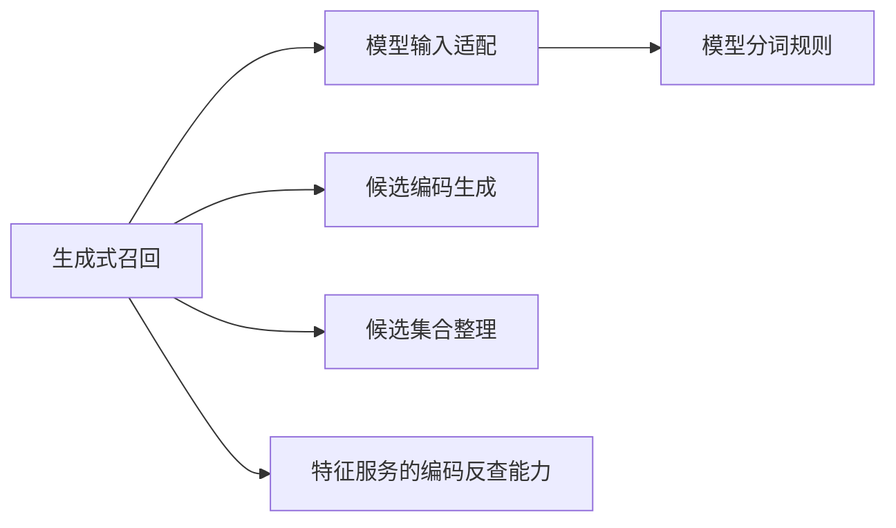
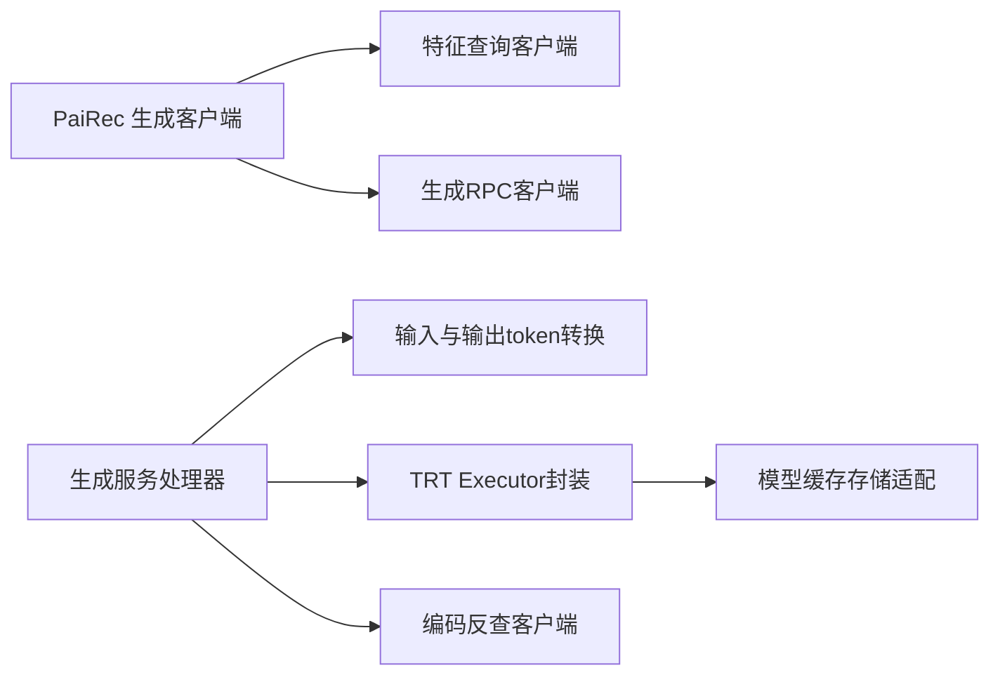
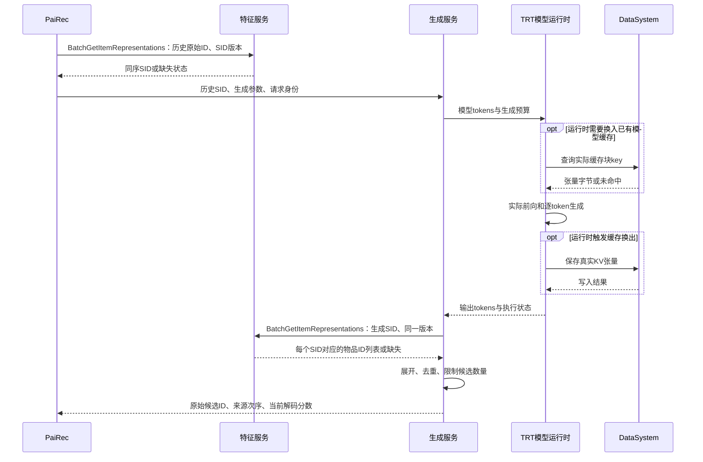
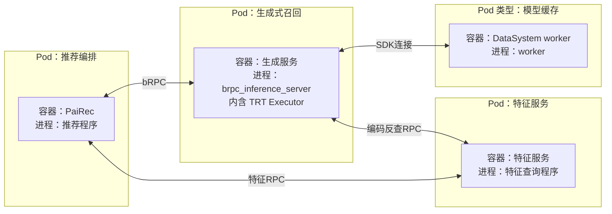
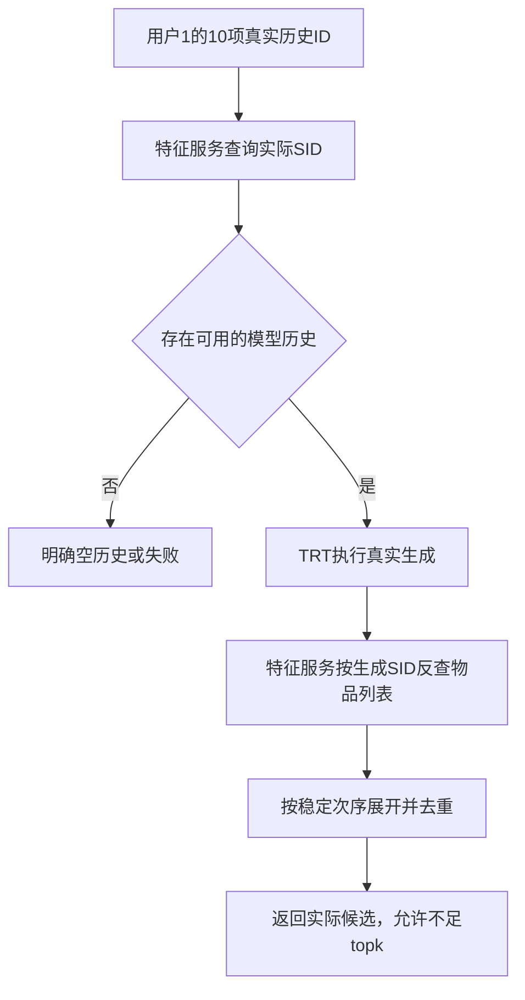

# 生成式召回：4+1 视图

图中符号与连线遵循[图法与 UML 约定](DIAGRAM_NOTATION.md)，每张图前注明使用的图法。

本模块按目标设计更新：历史与物品编码关系来自特征服务；模型引擎、分词器和编码模型属于模型资产。当前源码仍使用本地映射文件，新查询接口尚待实现。OneTrans 的实际取数例外不延伸到本模块。

```yaml
职责: 从用户历史生成候选物品
输入: 历史物品语义编码、候选数、生成参数、请求与版本身份
输出: 原始物品ID、来源内次序、解码器分数、实际执行状态
物品语义编码: semantic_id，简称SID；当前模型使用四个整数表示一个物品
模型资产: TensorRT-LLM引擎、tokenizer分词器、编码模型或码本
业务表示数据: 原始物品ID与SID的双向绑定，统一由特征服务查询
计算缓存: 模型注意力KV，由运行时产生，使用DataSystem管理
```

## 1. 逻辑视图

图法：逻辑结构示意图（非 UML）。箭头表示需要对方提供的能力，不表示执行顺序；历史 ID 正查由编排负责，输入本模块时已经是历史 SID。



| 职责 | 输入 → 输出 | 责任边界 |
|---|---|---|
| 历史物品编码查询 | 历史原始 ID → 有效 SID 列表、缺失位置 | PaiRec 调用特征服务 |
| 模型输入适配 | SID 列表 → 模型 tokens | 使用与引擎匹配的 tokenizer，不在线训练编码模型 |
| 候选编码生成 | tokens、生成参数 → 输出 tokens | 模型计算；不把输出编码直接当作原始物品 ID |
| 编码反查 | 有效输出 SID → 每个 SID 对应的 `item_ids[]` | 特征服务拥有业务映射，生成服务查询它 |
| 候选整理 | 映射结果 → 去重后的原始 ID 与来源次序 | 保存来源次序及缺失状态，不决定全局展示顺序 |


历史正查与生成反查的缺失处理不同：首期历史输入要求编码完整；生成输出中没有目录关联的 SID 则记录并丢弃，全部无法还原时返回真实空候选。

多个物品可能共享 SID。反查必须保留一个 SID 对应的物品列表，不能把它们写进单值 map 后只留下最后一个。稳定规则为：先保留生成 SID 的来源次序，同一 SID 内按原始 ID 的十进制数值排序，再去重和限量。该规则提供确定性，不代表编码碰撞已消失或生成质量提高。

## 2. 开发视图

图法：源码依赖示意图（非 UML）。节点是源码模块；箭头表示导入、链接或编译依赖，客户端模块不代表远端服务进程。



| 源码范围 | 交付产物 |
|---|---|
| PaiRec 生成客户端与字段适配 | 编入推荐程序的客户端代码 |
| 生成处理器、token 转换、Executor 封装及特征客户端 | 原生生成服务程序，配套引擎、tokenizer 与版本配置 |
| 模型缓存适配与依赖库 | 链接到生成程序或其运行库的代码；DataSystem worker 另行部署 |

```yaml
目标接口元数据:
  request_id: 全链路关联ID
  release_id: 固定的数据发布版本
  sid_version: 原始ID与SID绑定版本
  remaining_timeout_ms: 扣除已用时间后的调用预算
历史编码缺失: 首期固定fail_branch；任一历史ID缺SID则报告ID并使生成分支失败
编码反查缺失: 新生成SID可能无目录关联；记录缺失SID并不产生候选，禁止伪造原始ID
版本不匹配: 明确失败，不能回退到另一份本地映射文件
```

现有 [Recommend proto](assets/source_snapshots/pairec4tigerllm/proto/recommend.proto.html#L11)接收 `user_id/history/topk/temperature/beam_width/request_id`，历史每项是整数数组；返回 `item_id:int32`、`semantic_id` 和 `score`。它**没有完整的上述版本元数据**。增加字段或建立经过验证的服务启动绑定是开发工作，不能在文档中直接当作已有 wire schema。原始 ID 在新接口使用字符串；转入旧 `int32` 返回路径前必须检查范围。

| 当前实现依据 | 与目标的差距 |
|---|---|
| [TRT 推理初始化](assets/source_snapshots/pairec4tigerllm/cpp/brpc_gateway/brpc_inference_server.cpp.html#L989) | 有真实模型执行基础；仍须绑定实际引擎、分词器、GPU 与运行库 |
| [本地反向映射](assets/source_snapshots/pairec4tigerllm/cpp/brpc_gateway/brpc_inference_server.cpp.html#L970) | 改为特征服务批量反查；解决单值覆盖，报告映射覆盖率 |
| [当前候选构造](assets/source_snapshots/pairec4tigerllm/cpp/brpc_gateway/brpc_inference_server.cpp.html#L1428) | 分层 token 收集后组合，不是完整 SID 序列概率 top-k；当前候选分数为常量 1.0 |
| [原生 DataSystem 接入说明](assets/source_snapshots/pairec4tigerllm/docs/F19_NATIVE_DATASYSTEM_ATTRIBUTION.md.html#L77) | 需要实际 TRT 基础修改与构建产物，归因补丁本身不足以复现 |

PaiRec 首期按来源配额和来源次序融合，不把生成的常量分数与向量、BM25 原始分数直接相加。完整约束解码与模型效果改进后置。

## 3. 进程视图

图法：UML 时序图。生成服务处理器与 TRT 模型运行时是同一进程内的两个执行角色，二者间的消息不是额外网络调用；PaiRec、特征服务与 DataSystem 是外部角色。



```python
# 目标数据流伪代码；前一段在PaiRec，后一段在生成服务执行。
# PaiRec：批量查询历史SID，再作为生成请求输入。
history_repr = feature.BatchGetItemRepresentations(
    lookup_by="raw_item_id", item_ids=history.item_ids,
    release_id=release_id, sid_version=sid_version)
require_all_history_codes_found(history_repr)  # 缺失即报告ID并使生成分支失败
history_sids = values_in_history_order(history_repr)
# 请求构造还须符合引擎输入容量；仅保留末尾完整物品，不能切断四层编码。
# 生成服务：使用收到的history_sids推理，再批量反查输出编码。
output_tokens = engine.generate(tokenizer.encode(history_sids), generation_options)
generated_sids = decode_complete_valid_sids(output_tokens)
raw_items = feature.BatchGetItemRepresentations(
    lookup_by="semantic_id", semantic_ids=stable_unique(generated_sids),
    release_id=release_id, sid_version=sid_version)
return expand_in_generated_order_then_deduplicate(raw_items, limit=topk)
```

模型缓存读写由真实块生命周期触发，不能要求每请求固定若干次 Set/Get。特征服务反查是业务数据查询，与模型缓存访问是两种不同操作。模型执行成功但反查数据库失败，应返回阶段失败；反查成功但无合法物品，可以返回真实空候选。

当前原生实现的请求处理器同步调用后端；后端对 `trt_num_samples` 次采样逐次提交 Executor、等待最终结果，再进入下一次采样。等待循环每次向 `awaitResponses` 传入 10 ms 上限，这不是“每 10 ms 忙等一次”，也不是每个请求只执行一次模型。[当前提交与等待](assets/source_snapshots/pairec4tigerllm/cpp/brpc_gateway/brpc_inference_server.cpp.html#L1074)、[Executor 响应循环](assets/source_snapshots/pairec4tigerllm/cpp/brpc_gateway/brpc_inference_server.cpp.html#L1358)。

因此容量评估须记录采样次数、输入和输出 token 数、Executor 排队及执行时间、实际缓存传输字节。当前进程内等待是否占住 bRPC 工作线程，还取决于所链接 Executor 的等待实现，不能仅凭入口使用 bthread 就宣称等待不占 OS 线程。GPU 计算、CPU 编解码、外部缓存传输与特征反查应分别观测；本轮没有测得它们的占比或吞吐上限。

## 4. 物理视图

图法：部署映射示意图（非 UML）。目标 Pod 包含容器，容器列出进程；双向连线表示网络连通。主机与副本数未定，DataSystem 内部部署见系统文档。



生成容器挂载匹配的模型引擎与 tokenizer，并获得所需 GPU；两者不是独立进程。原生生成容器已有[部署配置](assets/source_snapshots/pairec4tigerllm/k8s/deployment-inference-brpc-trtllm.yaml.html#L35)，特征客户端及完整联调仍待补。特征服务所用 Redis、worker 所用 etcd 的容器边界见[系统物理视图](01_system.md)，此图不重复展开。

```yaml
启动检查:
  模型: engine与GPU、TRT运行库匹配
  特征: release_id和sid_version已发布，绑定到同一模型编码空间
  数据库: 特征服务真实读回、DataSystem真实连接
  调用预算: 预留推理后的SID反查时间，不能推理耗尽全部请求预算
  容量: GPU缓存和外部缓存分别设上限
模型缓存回收: 遵循块引用关系；可能跨请求复用，不按业务特征TTL删除
```

当前外部缓存的有界回收仍需验证，见[缓存生命周期记录](assets/source_snapshots/pairec4tigerllm/docs/PERSISTENT_NATIVE_KEY_LIFECYCLE.md.html#L19)。不能仅凭一次推理成功宣布长期运行无泄漏。

## 5. 场景视图（+1）

图法：结构或流程示意图（非 UML，连线含义见本节）。



真实历史 ID 见[请求推演](08_request_walkthrough.md)。第 08 篇提供明确标记的教学 SID 与候选，用于说明字段和顺序；这些数值不是本地已发布的模型产物。验收需分别证明：历史编码版本正确、TRT 实际执行、反向查询返回真实物品、碰撞处理稳定、缓存容量有界。
