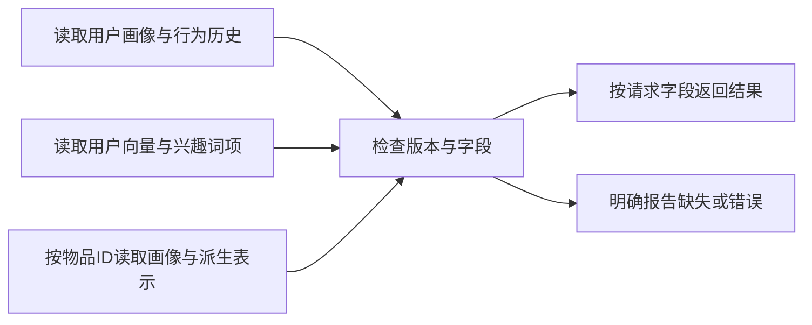
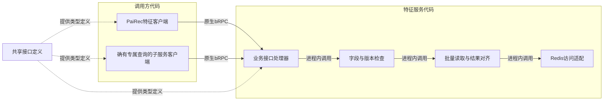
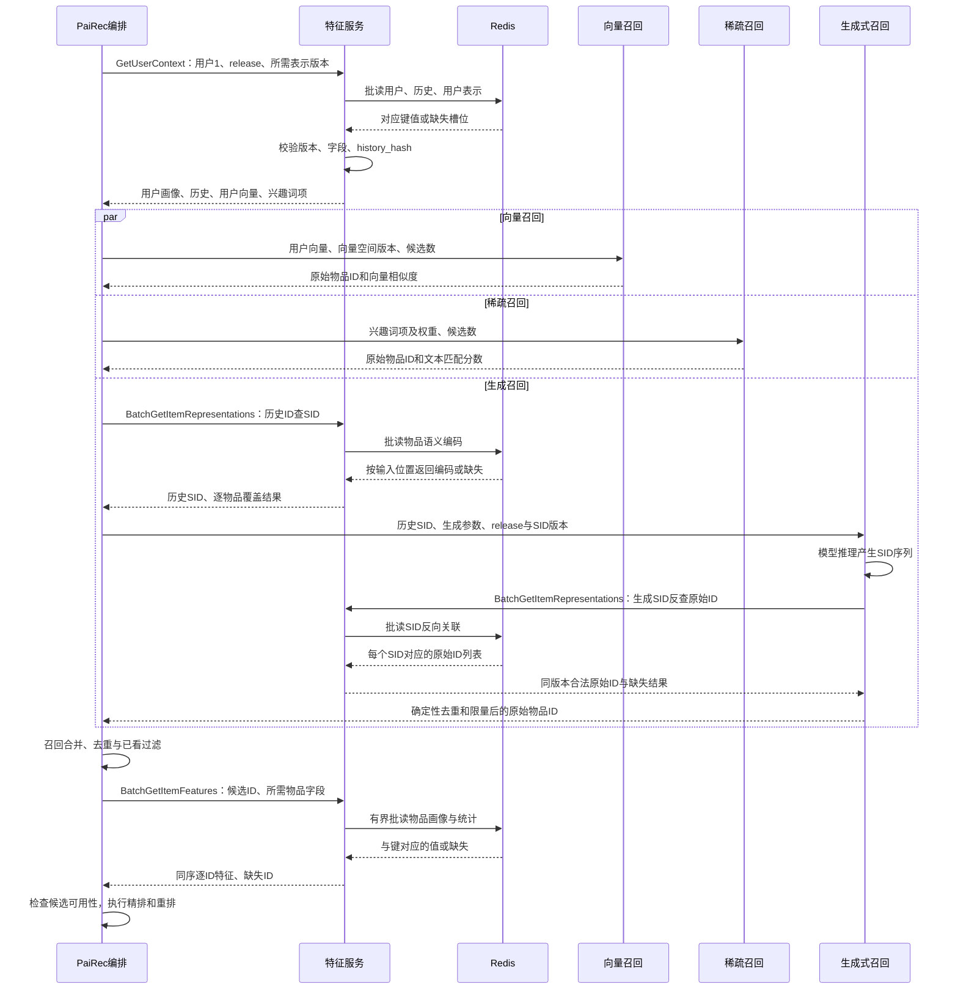
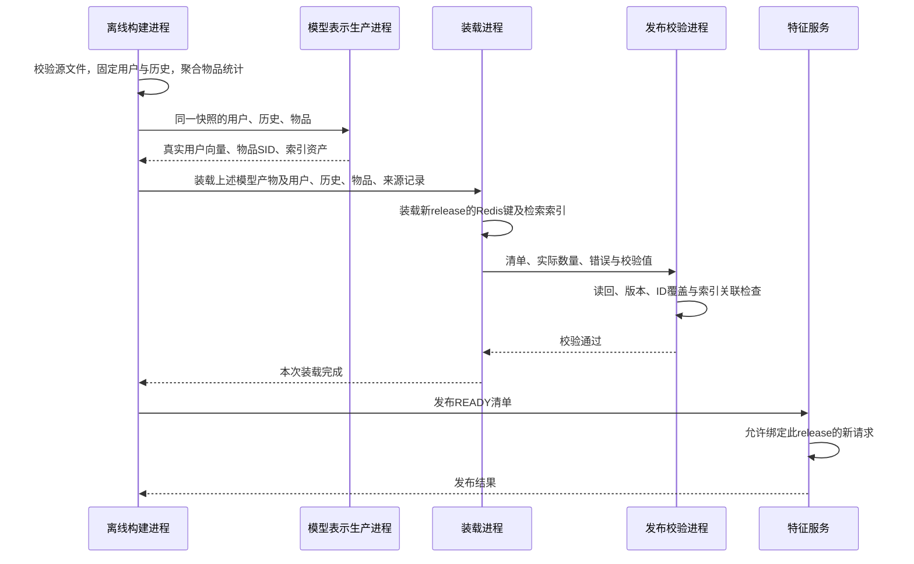
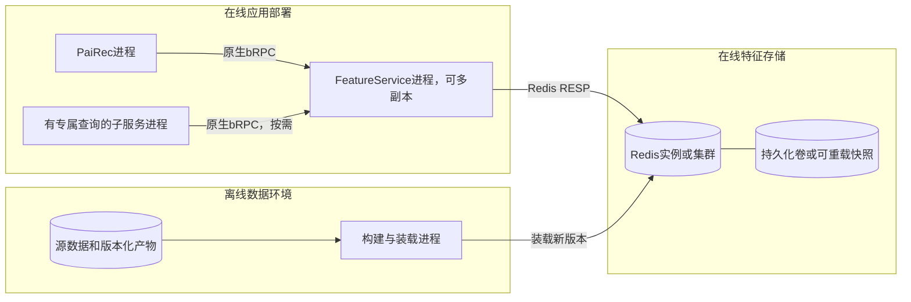
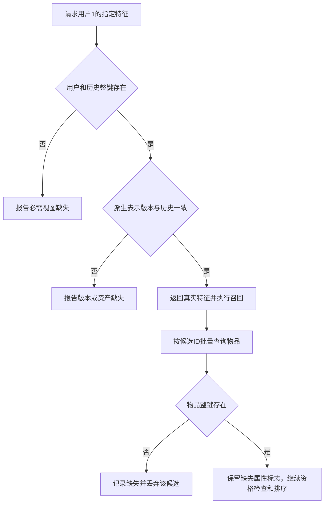

# 特征服务与数据发布：4+1 视图

图中符号与连线遵循[图法与 UML 约定](DIAGRAM_NOTATION.md)，每张图前注明使用的图法。

**目标是独立的特征服务 `FeatureService`：PaiRec 和计算服务通过业务接口取特征，只有特征服务访问在线特征库。** 用户画像、物品画像、用户历史，以及由它们产生的用户向量、兴趣词项、物品语义编码，统一由该服务查询。模型权重、参数表和一次推理产生的注意力状态分别归模型服务、参数服务和 DataSystem 管理。

本轮保留一个明确例外：**OneTrans 的数据路径按现有代码描述，不以接入特征服务为前提。** 它接收 `/ingest` 传入的历史，`/rank` 从本地已装载的 TSV 数据装配用户和候选特征，参数向量从参数服务查询。具体字段、顺序和缺失行为见 [OneTrans 文档](02_onetrans.md)。理想状态下其他排序模型也应使用特征服务，但不能把这个原则写成 OneTrans 已实现的事实。

```yaml
design_status: 目标设计，独立FeatureService及完整数据发布链仍需开发
feature_service: 独立进程，可部署多个副本
public_protocol: 原生bRPC业务接口
database_protocol: FeatureService到Redis使用RESP
pairec_database_access: 通过FeatureServiceClient，不直接连接Redis
feature_schema: feature_v1
request_version: 整个请求固定release_id
onetrans_this_round: 按实际代码使用本地特征文件、外部传入历史、模型参数服务
```

每种键和值、字段类型、生产者、更新与缺失规则见 [特征数据库与接口字典](10_feature_catalog.md)。本文说明服务职责及运行方式。

## 1. 逻辑视图：统一查询业务数据，计算仍归各模型

### 1.1 在线职责

图法：结构或流程示意图（非 UML，连线含义见本节）。



| 业务数据集合 | 存什么 | 首期是否需要 | 使用方式 |
|---|---|---|---|
| 用户画像 | 用户 ID、性别编码、年龄分组编码、字段缺失标志 | 是 | PaiRec 按用户查询；需要这些字段的模型由 PaiRec 转交 |
| 物品画像及统计 | 原始物品 ID、视频长短类型、曝光和交互统计、来源与缺失标志 | 是 | 候选产生后批查，供可用性检查、人工规则和重排 |
| 用户行为历史 | 有序物品 ID、有效长度、序列位置、历史内容校验值 | 是 | 同一份历史供召回；需要时转交计算服务 |
| 派生表示与兴趣 | DSSM 用户向量、稀疏兴趣词项、物品 SID 及反向关联 | 是 | 在线查询已经算好的结果；离线重新计算后发布 |
| 上下文、交叉特征、实时统计 | 设备/场景、用户与物品交互计数、窗口统计 | 有真实数据与业务需求后扩展 | 请求自带的上下文直接传递；只有需要查询的部分入库 |

这里是 **4 类核心业务数据集合**，不表示需要 4 个数据库。为适应按 ID 查询与按语义编码反查，在线分成 `user`、`history`、`item`、`user_rep`、`item_rep`、`sid_map` 六组业务键；发布清单另属管理数据。

```text
在线特征库：Redis，保存可按用户、物品或SID查询的业务值。
离线持久数据：源文件、清洗结果、特征快照、发布清单，保存在文件卷或对象存储。

Milvus / OpenSearch：检索索引，由离线产物装载，在线执行召回查询。
模型参数服务：保存模型embedding参数和其他权重。
DataSystem：保存一次模型计算产生的注意力状态。
```

向量索引中保存物品向量，是为了近邻检索；它不取代物品画像查询。索引需要的全量表示由离线流程批量装载，不在每次推荐时经过 PaiRec 搬运。离线算出的 **用户向量属于特征**；按训练 ID 查询的 **模型 embedding 表属于参数**。同样，`item_id → SID` 是模型版本绑定的物品派生表，通过特征服务查询；生成模型的码本、分词器和引擎仍是模型资产。

### 1.2 离线职责

图法：结构或流程示意图（非 UML，连线含义见本节）。


离线生产与在线特征查询共用同一字段定义和发布清单。Tenrec 是离线数据来源，不是在线推荐阶段逐请求扫描的数据库。

## 2. 开发视图：业务客户端、服务实现和存储适配分开

图法：模块关系示意图（非 UML，连线含义见本节）。



```typescript
// 目标接口草案，不代表当前工程已有这些服务方法。
type RequestMeta = {
  request_id: string;
  release_id: string;             // 绑定源数据、特征与依赖资产
  schema_version: "feature_v1";
  remaining_timeout_ms: number;   // 每一跳继续扣除，不能重置
};
type ResponseMeta = {
  request_id: string;
  release_id: string;
  schema_version: "feature_v1";
};
type UserViewName = "USER" | "HISTORY" | "DENSE_QUERY" | "SPARSE_QUERY";
type ViewStatus = "FOUND" | "NOT_FOUND" | "NOT_REQUESTED";
type RepresentationLookup =
  | { lookup_by: "raw_item_id"; item_ids: string[] }
  | { lookup_by: "semantic_id"; semantic_ids: number[][] };

interface FeatureService {
  GetUserContext(request: RequestMeta & {
    user_id: string;
    required_views: UserViewName[];
    representation_versions: {
      embedding_space_id?: string;
      sparse_recipe_id?: string;
    };
  }): UserContextResult;

  BatchGetItemRepresentations(request: RequestMeta & RepresentationLookup & {
    sid_version: string;
  }): ItemRepresentationBatch;

  BatchGetItemFeatures(request: RequestMeta & {
    item_ids: string[];
    fields: string[];             // 来自发布字段清单，不接受任意Redis键
  }): ItemFeatureBatch;
}

// UserProfile等业务记录的完整字段见第10篇数据字典。
type UserContextResult = ResponseMeta & {
  view_status: Record<UserViewName, ViewStatus>; // 四个状态始终返回
  user: UserProfile | null;
  history: UserHistory | null;
  dense_query: DenseUserRepresentation | null;
  sparse_query: SparseUserRepresentation | null;
};
type ItemResult<T> = {
  item_id: string;
  status: "FOUND" | "NOT_FOUND";
  value: T | null;                // FOUND有值，NOT_FOUND为null
};
type SemanticIdResult = {
  semantic_id: number[];
  status: "FOUND" | "NOT_FOUND";
  item_ids: string[];             // 一个SID可能关联多个原始物品，不能覆盖丢失
};
type ItemFeatureBatch = ResponseMeta & {
  results: ItemResult<Partial<ItemFeatures>>[];  // value只含请求的业务字段
};
type ItemRepresentationBatch = ResponseMeta & { sid_version: string } & (
  | { lookup_by: "raw_item_id"; results: ItemResult<ItemSemanticRepresentation>[] }
  | { lookup_by: "semantic_id"; results: SemanticIdResult[] }
);
// Batch结果与输入同顺序、同长度，保留重复ID的原位置。
// 超时、解析失败、版本不符是调用错误，不能伪装成NOT_FOUND。
```

`GetUserContext` 把用户画像、历史及所需用户表示组成一次业务响应。底层可读取多个键；客户端不需要知道 Redis 的键名。`user_rep.history_hash` 必须等于本次返回历史的 `history_hash`，避免“新历史配旧向量”。

响应的四个 `view_status` 与四个数据字段一一对应：找到记录为 `FOUND` 并返回记录；请求了但不存在为 `NOT_FOUND`、数据为 `null`；没有请求为 `NOT_REQUESTED`、数据同样为 `null`。PaiRec 检查 `required_views` 中每项都为 `FOUND` 后，才读取 `user_context.history.item_ids` 等业务字段。记录内某个属性未知仍属于 `FOUND`，由该记录的 `missing_fields` 表达；版本或解析错误则整次调用失败。

`BatchGetItemRepresentations` 有两种明确查询方向：PaiRec 在生成召回前用历史物品 ID 查 SID；生成服务推理后用 SID 反查原始 ID。两者都绑定 `release_id/sid_version`，访问不同数据，不属于重复查询。首期历史正查任一项缺失即报告原始 ID 并使生成分支失败；生成输出反查缺失则记录该 SID，不产生候选，全部缺失时返回真实空候选。`BatchGetItemFeatures` 则在候选融合后查询物品画像与统计。

业务客户端可以复用公共代码，但它只是 RPC 客户端，不在 PaiRec 进程内替换成 Redis 读取模块。

## 3. 进程视图：两个取数阶段，正常样例有四次特征 RPC

### 3.1 一次推荐请求的在线取数

图法：UML 时序图。 PaiRec 代表含并行子任务的编排进程，各分支内同步等待，分支之间可以交错。



“两个阶段”指 **召回准备与执行** 和 **候选产生后**。这个正常样例中，PaiRec 有三次特征 RPC，生成服务有一次反向查询，共四次；每次内部还可能按条数、字节上限或 Redis 分片拆成多批读取。不能用“两阶段取数”推导固定的两次网络调用。

图中最后的精排仍走当前 OneTrans 数据路径：PaiRec 给 `/rank` 用户 ID 和候选 ID，OneTrans 自行使用已装载的本地特征。新取得的候选特征用于 PaiRec 的可用性检查和重排，不能声称已进入 OneTrans。历史预计算与精排时序见 [完整请求流程](08_request_walkthrough.md)。

### 3.2 特征服务内部的批量处理

```python
def batch_get_items(request):
    manifest = require_ready_release(request.release_id)
    require_known_fields(manifest, request.fields)
    check_request_limits(request.item_ids, request.remaining_timeout_ms)
    unique_ids = stable_unique(request.item_ids)
    keys = [item_key(request.release_id, item_id) for item_id in unique_ids]

    # 单实例可MGET；集群按分片/哈希槽分组读取，再合并。
    # 拆批依据字节数、条数、剩余时间；缺失仍占原位置。
    values_by_id = read_and_validate_batches(keys, unique_ids, manifest)
    return [result_for(item_id, values_by_id) for item_id in request.item_ids]
```

缺用户整键、缺历史整键与“存在用户，但真实历史为空”是三种不同情况。首期完整数据场景缺少必需视图就明确失败；冷启动必须单独声明规则。物品整键缺失可按场景丢弃该候选并报告；物品存在但视频类型未知时保留 `null`，不能擅自变成类型 `0`。

### 3.3 离线装载与发布

图法：UML 时序图。



```python
release = create_release(source_hash, declared_row_scope, recipe_hash)
stream_validate_and_aggregate_tenrec(release)
export_real_user_vectors_and_item_semantic_ids(release)
load_feature_keys_without_expiry(release)
load_versioned_retrieval_indexes(release)
validate_counts_readback_history_hash_and_id_coverage(release)
mark_ready_if_all_required_assets_pass(release)
# 数据与模型产物未齐全：保持BUILDING或FAILED，不发布伪造向量/SID。
```

采用不可变快照；修改特征配方或模型表示后发布新 `release_id`。切换只影响新请求，旧请求继续使用旧版本；旧请求结束后再回收旧键。未来实时更新需要增加事件来源与版本规则，本轮不将 Tenrec 的序列位置解释成事件时间。

## 4. 物理视图：一个在线数据库类别，不是一种特征一套库

图法：部署映射示意图（非 UML，连线含义见本节）。



| 物理存储类别 | 首期配置 | 保存内容 |
|---|---|---|
| 在线键值数据库 | 一套 Redis；按容量选择单实例或集群 | 六组业务键、发布元数据；命名空间隔离 |
| 离线持久存储 | 一套文件卷或对象存储 | Tenrec 源文件、清洗产物、特征快照、模型和索引装载文件、发布清单 |
| 可选离线分析数据库 | 首期不必引入 | 数据规模或日常分析需求增加后，用于生产聚合与追溯 |

因此首期是 **两类存储，其中只有一类在线特征数据库**。无需为画像、历史、统计分别部署数据库，也无需单独引入关系库管理少量发布清单。检索索引、模型参数服务和 DataSystem 是系统的其他存储职责，不能算成三种用户特征库。

```yaml
redis_storage:
  type: String
  value_encoding: UTF-8 JSON
  namespaces: user / history / item / user_rep / item_rep / sid_map / release
  ttl_for_snapshot_keys: 不设置过期；按release整体回收
  recovery: 持久化恢复或从同版本快照重新装载
release_manifest:
  identity: release_id、schema_version、源文件hash、行范围、字段配方hash
  coverage: 用户/历史/物品数量、仅历史物品、缺失分布、派生表示覆盖
  representations: checkpoint、embedding_space_id、sid_version、sparse_recipe_id
  indexes: 对应Milvus collection、OpenSearch index、实际装载数量
  publication: BUILDING / READY / FAILED，回滚目标，读回校验结果
```

## 5. 场景视图：用户 1、历史缺少一种属性、候选按 ID 对齐

以下来自已保存的 [前 20 万行数据证据](assets/tenrec_sample_evidence.json)，只演示真实输入与确定性派生，未执行召回模型。

```json
{
  "user_id": "1",
  "gender_code": 1,
  "age_code": 4,
  "history_item_ids": ["2","3","80936","781","111774","1230","26403","991","2362","1202"],
  "history_positions": [1,2,3,4,5,6,7,8,9,10],
  "time_semantics": "ordinal",
  "sparse_tokens": [
    {"token":"video_type_0","weight":0.2222222222222222},
    {"token":"video_type_1","weight":0.7777777777777778}
  ],
  "known_history_type_count": 9,
  "missing_history_type_count": 1
}
```

历史物品 `111774` 在这个样本中没有可关联的视频类型，仍然保留在原历史第 5 位；类型词项只按已知的 9 项归一化。类型缺失不等于该物品 SID 或模型参数一定缺失，各自按对应资产检查覆盖。真实 DSSM 向量、SID 尚未在这个样例中提供，所以它不是可发布的完整用户上下文。

图法：结构或流程示意图（非 UML，连线含义见本节）。



```yaml
acceptance:
  service_boundary: PaiRec与目标召回服务不直接读取Redis或逐请求扫描CSV
  batch_alignment: 存在、缺失、存在三个位置保持ID对应，重复ID也不串位
  consistency: user/history/user_rep属于同release，派生表示history_hash相同
  real_data: 不把未知类型变成0，不伪造用户向量或SID
  observation: 记录特征RPC次数、Redis批次数、实际字节、缺失与失败原因
  onetrans_boundary: 当前本地TSV与参数查询如实保留，不报告为FeatureService使用方
  publication: 必需资产未齐全不可READY；可回滚、可重载、按版本回收
```

当前源码中已有用户特征前置加载注册和 Redis 客户端能力，但尚不足以证明独立特征服务、完整装载与发布已实现；原有 MGET 回复解析也需要修复。参见 [前置注册](assets/source_snapshots/pairec_sh/pairec-demo/src/dao/feature_brpc_redis_dao.go.html#L243)、[Redis 回复解析](assets/source_snapshots/pairec_sh/pairec-demo/src/cpp/brpcClients/redis_client.cpp.html#L136)与 [本轮缺口清单](09_evidence_and_gaps.md)。
