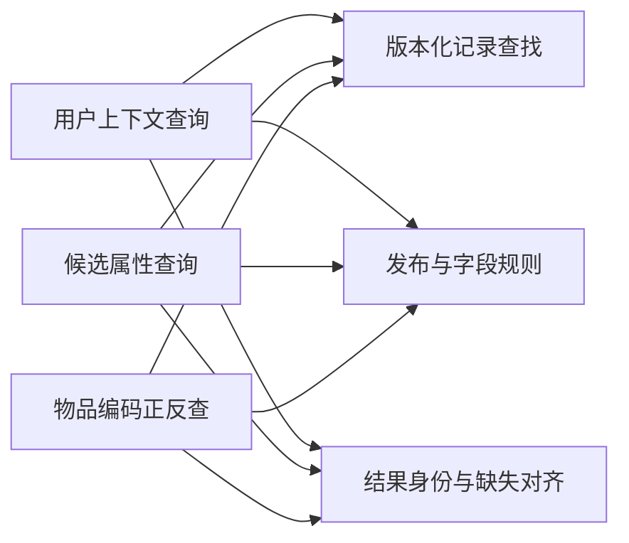
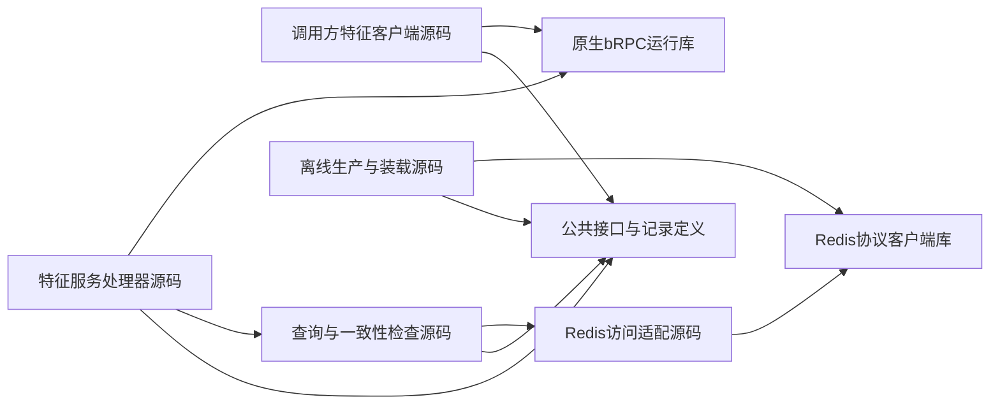
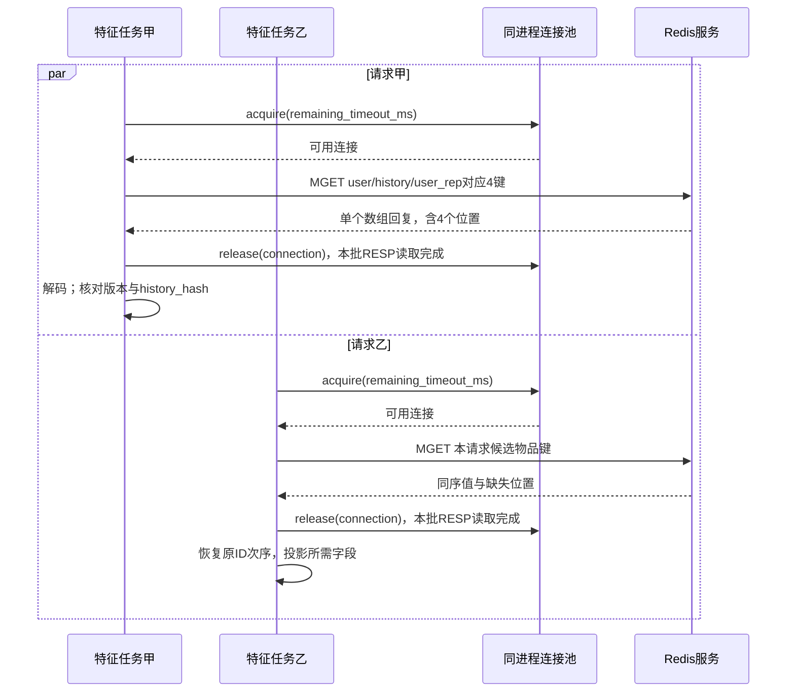
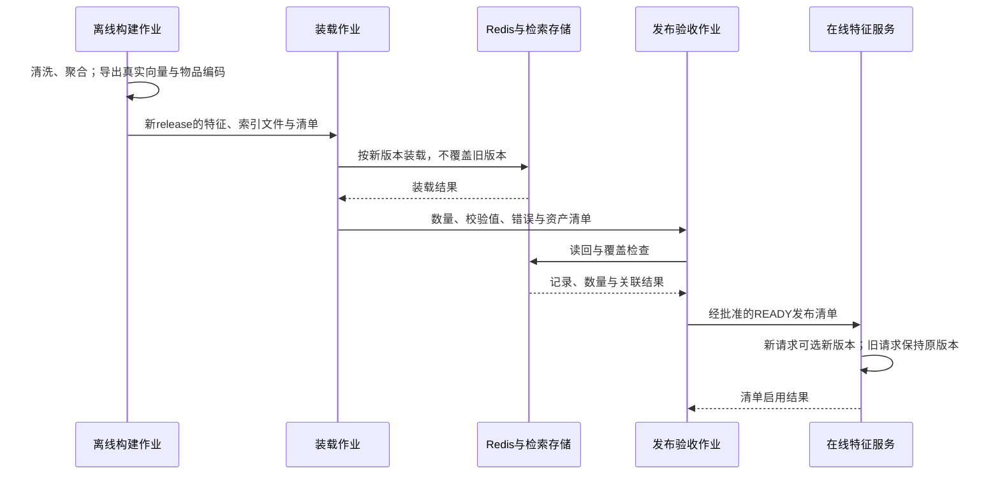
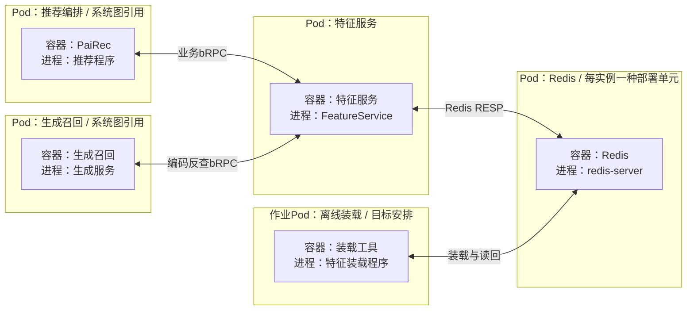
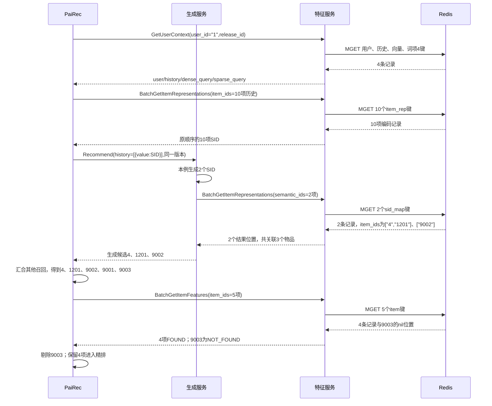

# 特征服务与数据发布：4+1 视图

**FeatureService 是目标中的独立特征查询服务，目前尚未完成实现和整体验收。** PaiRec 查询公共输入后传给召回服务；生成服务只在生成新编码后直接反查物品 ID。只有特征服务和离线装载工具连接在线特征库，计算服务不自行读取该库。

本轮保留 OneTrans 的现有路径：`/ingest` 接收现有历史提供器的数据，`/rank` 从已装载的本地 TSV 取用户和物品特征，模型向量从参数服务取。它不因此成为 FeatureService 的调用方，详见 [OneTrans](02_onetrans.md)。模型参数和 DataSystem 的注意力状态也不属于本章的业务特征。

本文按[系统五视图的划分](01_system.md)描述职责、代码、执行、部署和用例。字段与 key/value 的完整定义见[数据字典](10_feature_catalog.md)；一批查询怎样产生 Redis 与操作系统负载，见[Redis 执行与负载分析](11_redis_workload.md)。图法遵循[统一约定](DIAGRAM_NOTATION.md)。

```yaml
status: 目标设计
service_protocol: 原生bRPC
storage_protocol: Redis RESP
record_format: Redis String内保存UTF-8 JSON
consistency: 每个推荐请求固定release_id；发布记录不可变
online_storage: 一类在线特征库；单实例或集群尚未确定
physical_placement: Pod和容器边界为目标；副本、主机和资源配额待定
```

## 1. 逻辑视图：查询能力、记录和一致性规则

### 1.1 服务内部的职责依赖

图法：逻辑结构示意图（非 UML）。箭头从需要能力的职责指向提供方，**不表示读取顺序、网络调用或源码导入**。图中各节点均是特征服务内部的业务职责。



| 查询职责 | 业务接口 | 输入与输出 | 不承担的职责 |
|---|---|---|---|
| 用户上下文查询 | `GetUserContext` | 用户 ID、所需数据类别和表示版本 → 用户属性、原历史、预计算向量、兴趣词项 | 不在线重跑 DSSM，不替调用方选择另一份历史 |
| 候选属性查询 | `BatchGetItemFeatures` | 物品 ID 列表、字段名 → 按原位置返回属性、统计或缺失 | 不决定候选是否可推荐，不给模型打分 |
| 物品编码正反查 | `BatchGetItemRepresentations` | 原始 ID → SID，或 SID → 原始 ID 列表 | 不执行生成模型，不把一对多关系覆盖成一个物品 |
| 版本化记录查找 | 内部能力 | 发布版本、业务身份 → 对应记录 | 不向调用方暴露任意 Redis 键查询 |
| 发布与字段规则 | 内部能力 | 清单、请求和记录 → 可用性与一致性判断 | 不把格式错误或版本错误归为数据不存在 |
| 结果身份与缺失对齐 | 内部能力 | 输入次序、读回结果 → 等长、同序的业务结果 | 不删掉缺失位置而导致 ID 错位 |

`SID` 是生成模型使用的物品语义编码。正查为 `item_id → semantic_id`，反查为 `semantic_id → item_ids[]`。用户表示是已经计算好的业务值；模型 embedding 参数表则属于参数服务，两者不能因为都是向量就合并管理。

### 1.2 服务所管理的业务记录

| 逻辑数据集合 | 保存的信息 | 生产与使用责任 |
|---|---|---|
| 用户属性 | 原始用户 ID、性别和年龄分组编码、字段缺失标志 | 离线清洗生产；PaiRec 按需转交模型 |
| 用户历史 | 有序物品 ID、有效长度、序位与历史摘要 | 离线固定同源历史；召回使用，不虚构事件时间 |
| 物品属性与统计 | 类型、曝光和交互统计、来源及缺失标志 | 离线聚合；PaiRec 用于候选资格与重排 |
| 派生表示与关联 | 用户向量、兴趣词项、物品 SID、SID 反向关联 | 固定模型或配方离线生产；在线按业务身份查询 |

这是四类业务数据，不是四套数据库。在线键组为 `user/history/item/user_rep/item_rep/sid_map`，发布清单为管理数据。设备信息等请求上下文直接传递；源数据没有的地域、库存或实时窗口统计不补造。

离线生产负责生成这些记录与索引装载文件；发布管理负责核对资产是否齐全、何时允许新请求使用。特征服务只读取已批准的发布版本。Milvus 和 OpenSearch 的全量索引由离线装载，不能逐请求经特征服务搬运整张物品表。

## 2. 开发视图：静态依赖与交付产物

图法：源码依赖示意图（非 UML）。箭头表示导入或编译依赖；图中没有网络调用。模块名是目标代码职责，不声称仓库已有同名目录。



原生 bRPC 运行库提供服务端接入和客户端调用能力。调用方客户端只依赖业务类型和 RPC 库，不导入 Redis 适配或键名拼装代码。

| 可开发的代码范围 | 交付物 | 需要保持的契约 |
|---|---|---|
| 公共接口与记录定义 | protobuf、生成代码、记录与发布清单规范 | 三个接口、版本头、缺失状态、两种编码查询方向 |
| 特征客户端 | PaiRec 与生成服务各自使用的客户端封装 | 传递同一版本及剩余时间；不暗中直连 Redis |
| 服务处理器及查询逻辑 | 独立 FeatureService 程序 | 限流、有界批查、字段检查、同序结果与错误传播 |
| Redis 访问适配 | 链接到服务的库或代码模块 | String/JSON 解码、连接复用、批次限制；需要集群时增加路由 |
| 离线生产与装载 | 可重放工具、特征快照、模型表示产物、清单 | 同一源范围、字段配方及表示版本；完整读回验证后发布 |
| 运维与场景配置 | 可审阅的配置文件 | 地址、时间预算、批次上限、发布绑定、恢复策略 |

接口骨架如下，完整字段不在本章重复，见[接口字典](10_feature_catalog.md)。

```typescript
interface FeatureService {
  GetUserContext(request: UserContextRequest): UserContextResult;
  BatchGetItemFeatures(request: ItemFeatureRequest): ItemFeatureBatch;
  BatchGetItemRepresentations(request: RepresentationRequest): ItemRepresentationBatch;
}

// 两种查询字段只能选一组；两种响应都保持原输入次序。
type RepresentationLookup =
  | { lookup_by: "raw_item_id"; item_ids: string[] }
  | { lookup_by: "semantic_id"; semantic_ids: number[][] };

type ItemResult<T> = {
  item_id: string;
  status: "FOUND" | "NOT_FOUND";
  value: T | null;
};
```

现有代码只能作为能力与缺口证据：已有[用户前置加载注册](assets/source_snapshots/pairec_sh/pairec-demo/src/dao/feature_brpc_redis_dao.go.html#L243)；现有 [Redis 客户端](assets/source_snapshots/pairec_sh/pairec-demo/src/cpp/brpcClients/redis_client.cpp.html#L5)使用连接池，但其 [MGET 回复解析](assets/source_snapshots/pairec_sh/pairec-demo/src/cpp/brpcClients/redis_client.cpp.html#L136)把一个数组回复误按多条顶层回复读取。独立服务、装载发布和集群适配仍需开发，不能直接把旧客户端包装成“已完成的特征服务”。

## 3. 进程视图：请求并发、等待与发布切换

### 3.1 在线请求怎样执行

下表是**目标执行方案**，不是从现有 FeatureService 源码测得的线程结构。首期采用独立 C++ bRPC 服务；处理任务由运行库调度，Redis 连接长期复用并限制在途请求。具体操作系统线程数、连接数和字节上限在部署与测量后确定。

| 执行者或状态 | 工作 | 并发与等待 |
|---|---|---|
| bRPC 接入与处理任务 | 解码接口、固定请求期限、调用查询逻辑 | 多请求并行；不得为每个 Redis 键创建一个线程 |
| Redis 客户端与连接池 | 路由、发送批量命令、匹配回复 | 等连接或回复时挂起相应任务；不把任务等待等同于占满一个 CPU 核 |
| 请求私有结果 | 保存输入顺序、唯一 ID 与读回映射 | 请求间不共享可变结果数组；一请求内可以合并重复 ID |
| 发布清单快照 | 提供版本、字段和表示规则 | 请求绑定一份只读快照；切换不改写已进入请求的版本 |
| Redis 服务进程 | 处理实际读命令并返回值 | 与特征服务独立执行；内部线程机制和版本差异见第 11 篇 |

图法：UML 时序图。甲、乙是特征服务中的两个独立请求任务，连接池是同进程组件。`par` 表示客户端任务可交错，**不表示一个 Redis 实例同时执行两条 MGET 的键查找**。



图展示两个请求都取得连接的成功分支。连接池耗尽时在剩余期限内等待；超时则终止本批，不能仍然继续发送。连接是否支持多个批次同时在途取决于选定客户端；必须保证回复对应正确，不把连接数当成线程数或 Redis 执行并行度。

```python
def batch_get_items(request):
    manifest = require_ready_release(request.release_id)
    require_known_fields(manifest, request.fields)
    check_deadline_and_limits(request)
    unique_ids = stable_unique(request.item_ids)
    keys = [item_key(request.release_id, item_id) for item_id in unique_ids]
    # 内部按条数、字节量及Redis路由拆批；每批继续扣除同一期限。
    records_by_id = read_validate_and_decode(keys, unique_ids, manifest)
    return [project_result(item_id, records_by_id, request.fields)
            for item_id in request.item_ids]
```

`FOUND` 表示整条记录存在，记录内属性未知由 `null/missing_fields` 表达；`NOT_FOUND` 保留原位置。网络、超时、版本或 JSON 解析错误均是调用失败。用户上下文四项数据和四项状态始终返回，未请求项为 `NOT_REQUESTED`。Redis 的批命令及 `nil` 的具体解释见[执行分析](11_redis_workload.md)。

### 3.2 离线作业与在线版本怎样同步

图法：UML 时序图。装载与查询是不同执行者；发布验收完成前，新版本不能被在线请求选中。



用户属性、历史和派生表示必须出自同一发布；用户表示的 `history_hash` 与历史摘要一致。各存储没有共同事务，采用“完整装载 → 读回验收 → READY → 切换新请求”的发布流程。旧请求结束并满足保留策略后，才分批回收旧键。数据或模型资产不齐全时保留 `BUILDING/FAILED`，不填随机向量或 SID。

## 4. 物理视图：Pod、容器、进程与持久数据

图法：部署映射示意图（非 UML）。外框是目标 Pod，内部节点明确容器与进程；双向实线表示网络连通要求。**不同 Pod 不代表位于不同主机**；同一 Pod 内的容器属于同一节点，实际主机映射与副本数未定。



| 使用方 | 所需资源 | 尚待确定 |
|---|---|---|
| FeatureService 容器 | 程序、服务配置、接口/记录版本、发布清单 | CPU/内存配额、任务并发、连接与批次上限、副本数 |
| Redis 容器 | 内存数据集；按恢复方案提供持久目录或重载入口 | 版本、单实例/集群、主从关系、持久化模式、存储后端、资源配额 |
| 离线构建与装载作业 | Tenrec 源文件、特征快照、模型产物、装载清单 | 作业容器配置、文件卷或对象存储、运行窗口 |
| 调用方容器 | 特征服务地址、场景与表示版本 | 连接参数和整体请求期限 |

首期仍是**两类存储**：Redis 在线特征库，加文件卷或对象存储中的离线持久产物。六组业务键不要求六个数据库；发布清单也无需另建关系库。若采用 Redis Cluster，上图 Redis Pod 按实例展开，不能把多个节点藏成一个进程，细节待选定部署后补齐。

```yaml
snapshot_records:
  redis_type: String
  encoding: UTF-8 JSON
  expiry: 不设逐键TTL；停用release后分批回收
recovery_options_to_choose:
  - Redis持久化恢复，再核对READY资产
  - 同版本离线快照重载，再核对READY资产
not_decided:
  - RDB与AOF是否启用及其策略
  - Redis版本与网络IO线程配置
  - 主从、集群分片、存储介质及Pod到主机的映射
```

这些是待落地的配置选择，不是已启用的部署事实。只读推荐请求仍可能受到离线装载、持久化或内存回收影响，具体机制见[Redis 负载分析](11_redis_workload.md)。

## 5. 场景视图（+1）：用户 1 的四次查询与缺失候选

本用例沿用[请求文档](08_request_walkthrough.md)的教学数据，不把示例向量、SID 或模型分数当成已装载资产。它检验：调用责任是否清楚、两个查询方向是否正确、缺失是否保留位置、版本能否贯穿。

图法：UML 时序图。只展开特征相关交互；三路召回与 OneTrans 的完整并行关系见请求文档。数据库回复标注关键业务字段，完整记录仍含版本头。



| 验收点 | 本例应看到的结果 | 对应的设计选择 |
|---|---|---|
| 查询责任 | PaiRec 三次，生成服务一次特征 RPC | 业务接口分工；客户端只查询自己负责的数据 |
| 数据库负载 | 单实例、不拆批时为四次 MGET，分别 4、10、2、5 个键 | 批量访问适配；实际拆批与重试另计 |
| 关联身份 | 全程固定 `demo_tenrec_v1` 与表示版本 | 请求持有发布快照，解码后复核记录 |
| 缺失位置 | 候选五个位置完整返回，第五项 `9003` 缺失 | 结果对齐；候选是否剔除由 PaiRec 决定 |
| 属性缺失 | 原历史中类型未知的 `111774` 仍在第 5 位 | 属性未知不等于整条历史或 SID 缺失 |
| 源码例外 | OneTrans 仍读现有 Provider、TSV 与参数服务 | 不把候选特征查询误称为已接入精排模型 |

业务取数有“召回前及召回内”“候选产生后”两个阶段，但这里有三个方法、四次 RPC；Redis 的命令数、网络批次数和连接等待必须另外记录。版本错误、数据损坏或超时应失败；只有真实缺记录才返回缺失状态。首期必需资产不齐全不能发布 READY。
