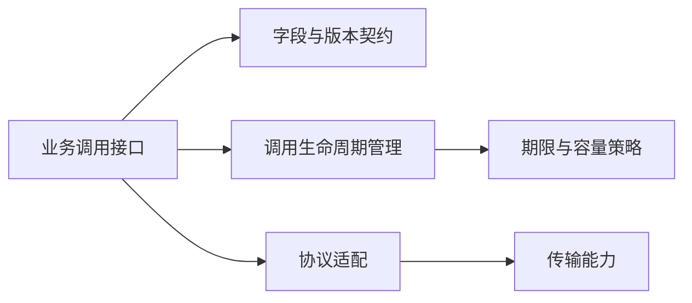
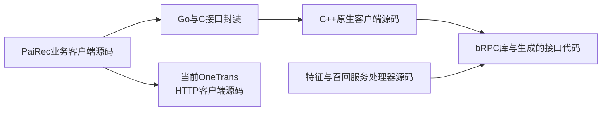
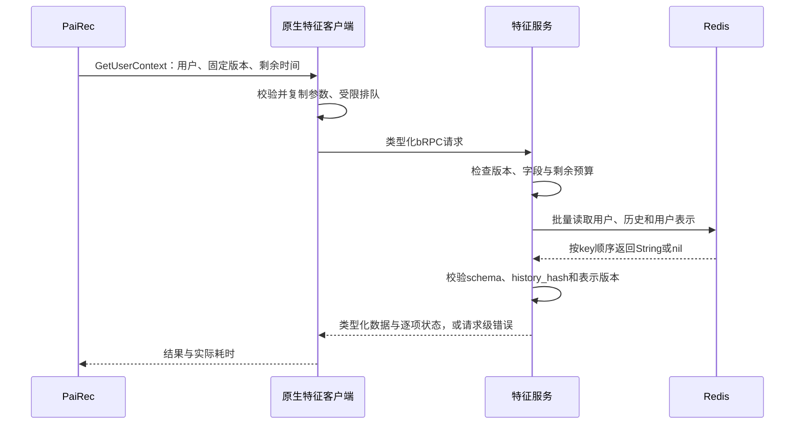
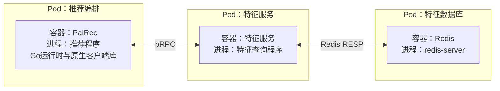
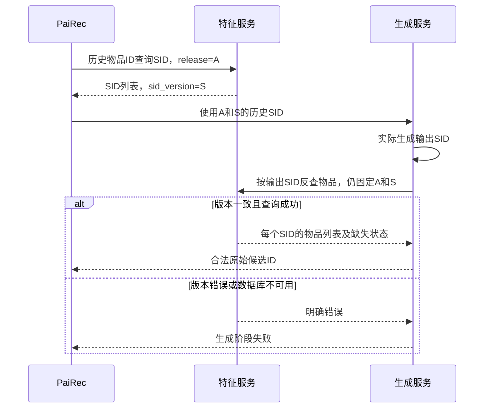

# 服务通信：4+1 视图

图中符号与连线遵循[图法与 UML 约定](DIAGRAM_NOTATION.md)，每张图前注明使用的图法。

通信分为三个边界：客户端到 Nginx/PaiRec 的 HTTP；服务间业务 RPC；服务到数据库的存储协议。特征服务是新增独立 RPC 服务。**OneTrans 当前保留 HTTP `/ingest` 与 `/rank`，不把计划中的 bRPC 桥、完整特征输入或资源释放接口写成已有能力。**

`RPC` 是跨进程调用。`bRPC` 是通信库；它可以支持多种协议。`CGO` 是 Go 调用 C 的进程内接口，`C ABI` 是 C 与 C++ 共享的函数边界；这两步不额外增加网络跳转。

## 1. 逻辑视图

图法：逻辑结构示意图（非 UML）。箭头表示通信能力依赖，不表示处理步骤；实际调用先后在第 3 节展开。



| 调用方 → 服务 | 方法及输入 → 输出 | 协议与状态 |
|---|---|---|
| PaiRec → 特征服务 | `GetUserContext`：用户与版本 → 用户、历史、用户表示 | 目标原生 bRPC |
| PaiRec → 特征服务 | `BatchGetItemRepresentations`：历史物品 ID → SID 等表示 | 目标原生 bRPC |
| 生成服务 → 特征服务 | 同一方法按 SID 查询 → 每个 SID 的物品 ID 列表 | 目标原生 bRPC |
| PaiRec → 特征服务 | `BatchGetItemFeatures`：候选 ID、字段集合 → 同序属性及状态 | 目标原生 bRPC |
| PaiRec → 向量召回 | 用户查询向量、向量空间版本、topk → 候选 ID 与分数 | 目标原生 bRPC，可用 HTTP 适配桥连接旧后端 |
| PaiRec → 稀疏召回 | 词项、权重、配方版本、topk → 候选 ID 与分数 | 目标原生 bRPC，可用 HTTP 适配桥连接旧后端 |
| PaiRec → 生成召回 | 历史 SID、生成参数 → 原始候选 ID | 已有原生 bRPC proto；版本字段及特征反查待补 |
| PaiRec → OneTrans 历史 | `/ingest`：`item_ids`、等长占位序号 `timestamps` → 写入结果 | 当前 HTTP；序号不参与模型位置编码 |
| PaiRec → OneTrans 精排 | `/rank`：用户 ID、候选 ID → ID 与 sigmoid 分数 | 当前 HTTP；服务内部读取 TSV |
| 特征服务 → Redis | 版本化 key → JSON String 或缺失 | Redis RESP 存储协议，无额外 Feature RPC |

OneTrans 的 `/score` 是另一个接收完整特征的已有 HTTP 入口，当前默认编排没有使用它接入特征服务。它不替代 `/rank` 作为本文主链。接口原样说明见[OneTrans 文档](02_onetrans.md)。

## 2. 开发视图

图法：源码依赖示意图（非 UML）。箭头为导入、链接或代码生成依赖，不表示 RPC；通信库编入相应程序，不作为服务部署。



客户端封装、原生库及 HTTP 客户端随 PaiRec 程序交付；服务处理器与协议定义生成的代码编入对应服务。公共接口文件是构建输入，不是网络中转服务。

```python
# 新特征接口的公共调用上下文；完整字段在数据字典中定义。
metadata = {
    "request_id": "本次请求ID",
    "release_id": "固定发布版本",
    "schema_version": "feature_v1",
    "remaining_timeout_ms": remaining_budget(),
}
# 查询结果逐项带状态；业务缺失不能伪装成RPC连接失败或全零有效向量。
status = one_of("FOUND", "NOT_FOUND")  # 属性未知用null和missing_fields表达
```

特征方法的批量返回必须维持请求顺序和重复项，不能只返回一个无位置的“成功记录集合”。SID 反查每项含 `item_ids[]`，零、一、多映射均可表达。版本错误或数据库不可用是请求级错误，不以逐项 `NOT_FOUND` 掩盖。

原生客户端保持“提交、等待、取消、释放”四种生命周期动作。实现要求如下；这些是客户端对象的动作，**不是 OneTrans HTTP 资源接口**。

```yaml
原生客户端约束:
  输入: 提交返回前复制入参，不保存Go内存指针
  结果: 调用终态最多发布一次，缓冲由分配方提供释放函数
  并发: 每次调用使用独立Controller和请求响应对象
  队列: 请求数、字节数、在途数有界
  异常: C++异常不跨越C函数边界
  关闭: 停止接单，等待回调与结果引用排空，再销毁客户端
  重试: 默认不自动重试模型请求
```

通信桥必须显式转换字段。当前 OneTrans `/ingest` 数组用 JSON 整数，`/rank` 的 ID 用字符串；不能把 protobuf 默认 JSON 的整数表示直接当成旧解析器可用的输入。当前解析器经浮点数承载数值的路径须限制精确整数范围。具体输入形状以源码和 OneTrans 文档为准。

## 3. 进程视图

图法：UML 时序图。



Redis `MGET` 对 String key 返回与请求顺序对应的数组；缺失项保留 `nil` 位置，不能删去后导致用户或物品错配。[Redis 官方 MGET 定义](https://redis.io/docs/latest/commands/mget/)。这是特征服务内部行为，PaiRec 不再解析 Redis 回复。当前参考 C++ 实现按顶层回复数处理多 key 的问题仍需修正，见[现有解析代码](assets/source_snapshots/pairec_sh/pairec-demo/src/cpp/brpcClients/redis_client.cpp.html#L125)。

```python
stage_budget = min(stage_limit_ms, request_deadline - monotonic_now_ms())
if stage_budget <= 0:
    raise DeadlineExceeded()
# 本地排队、RPC、后端数据库查询依次扣减，不在每跳重置完整时限。
```

超时、取消后，远端计算可能继续完成。当前 OneTrans 没有请求级释放协议；通信层不能承诺取消会删除 KV。目标编排必须区分运输成功与业务成功：例如 `/ingest` 需要检查实际返回的 `accepted`，`/rank` 则要核对 `trace.kv_hit` 及模型执行证据，不能要求不存在的 `ready/executed` 响应字段。

### 等待发生在哪里

| 执行边界 | 等待与唤醒 | 对负载判断的影响 |
|---|---|---|
| Go HTTP 客户端 | 使用 Go 网络轮询机制时，等待网络的 goroutine 暂停，网络就绪后恢复为可运行 | 等待的 goroutine 数不等于阻塞的 OS 线程数；具体连接行为见 PaiRec 与 OneTrans 文档 |
| Go 进入原生 C/C++ | 若适配函数同步等待 RPC 终态，调用所在 OS 线程可能一直留在原生代码中 | 原生线程、内存与 Go 共用容器资源；`GOMAXPROCS` 不是整个进程的线程或 CPU 上限 |
| bRPC 调用与回调 | bthread 在工作 pthread 上调度；同步等待是否让出工作线程取决于实际等待原语，普通阻塞库调用不能自动转换 | 不能把“用了 bthread”当作所有等待均非阻塞的证据；回调也不保证在提交线程执行 |
| 目标跨语言完成通知 | 必须明确谁持有请求、谁发布终态、谁唤醒 Go 等待者、谁释放结果；当前文档不假定该机制已实现 | 只有接口叫 `Submit` 并不能证明原生工作线程已释放；需要线程与队列证据 |

bRPC 的 Channel 可复用，但 Controller、请求、响应应按调用隔离；避免为了“线程安全”用一把客户端全局锁包住整个 RPC 等待。[bRPC 客户端约定](https://brpc.apache.org/docs/client/basics/)、[bthread 的调度与阻塞边界](https://brpc.apache.org/docs/bthread/bthread/)。Go 执行机制与实际旧客户端的串行锁分析见 [PaiRec 负载分析](03_pairec_orchestration.md)。

排查时将一次调用分成 `等待容量 → 编码/复制 → 发送 → 等待回复 → 解码 → 发布结果`，同时观测等待队列、线程数、字节数和 CPU 时间。客户端总耗时减服务端耗时仍含排队、调度、编解码与测量边界差异，不能直接命名为“网络时延”。

## 4. 物理视图

图法：部署映射示意图（非 UML）。以特征调用为例，Pod 内含容器、容器运行进程；双向连线表示网络连通。主机和副本数未定。



图中的 Go 封装、C 接口与原生 bRPC 库位于同一进程；原生库自己的工作线程也计入该容器。网关及模型服务的部署见[系统物理视图](01_system.md)，HTTP 适配桥的可选方案见[其他召回模块](07_other_services.md)。当前旧 Go TCP/PRPC 实现不能直接当作目标原生客户端，见[参考代码](assets/source_snapshots/pairec4tigerllm_8506/services/brpcwire/client.go.html#L155)。

```yaml
发布绑定:
  新特征服务: endpoint、协议、schema、release、客户端与服务端构建版本
  新召回前端: 类型化请求与旧HTTP字段的转换规则
  当前OneTrans: HTTP地址、backend配置、本地数据文件和模型版本
  存储后端: Redis、Milvus、OpenSearch、DataSystem各自连接与实际协议
未来OneTrans原生桥: 可另行适配现有ingest/rank；不得隐式改成完整特征score协议
```

## 5. 场景视图（+1）

图法：UML 时序图。



验收重点是跨语言字段、数组顺序、版本一致性、真实协议、期限传递与资源释放。特征服务测试应覆盖重复 key、缺失 key、多个物品共享 SID、数据库超时；这些比增加通用 RPC 框架更直接决定推荐结果是否正确。
