# 向量召回、稀疏召回与 Nginx：各模块 4+1 视图

图中符号与连线遵循[图法与 UML 约定](DIAGRAM_NOTATION.md)，每张图前注明使用的图法。

以下是目标系统的第三优先级模块视图。每个模块独立给出逻辑、开发、进程、物理、场景五个视图；本轮业务取数以独立特征服务为准，覆盖旧版由 PaiRec 直接查询 Redis 的决定。字段字典见[特征数据库与接口](10_feature_catalog.md)。特征读写见[特征与数据视图](05_feature_data.md)，生成 KV 见[生成式召回视图](04_generative_recall.md)。

下文画出“服务桥”的图展开的是可选 HTTP 适配方案：桥将原生 bRPC 请求转交 HTTP 后端。若召回程序内置原生 bRPC 处理器，则省去桥进程，对应[系统物理视图](01_system.md)的目标分组。采用适配方案也须补齐后端的 `query_vector` 或 `sparse_tokens` 契约，不能只加桥而沿用旧输入；桥与后端的容器分组及主机位置尚未确定。

## 1. 向量召回：DSSM 离线向量与 Milvus

### 1.1 逻辑视图

图法：逻辑结构示意图（非 UML）。箭头表示能力依赖，不表示执行顺序；索引表示可查询的业务集合，不在此规定数据库进程。

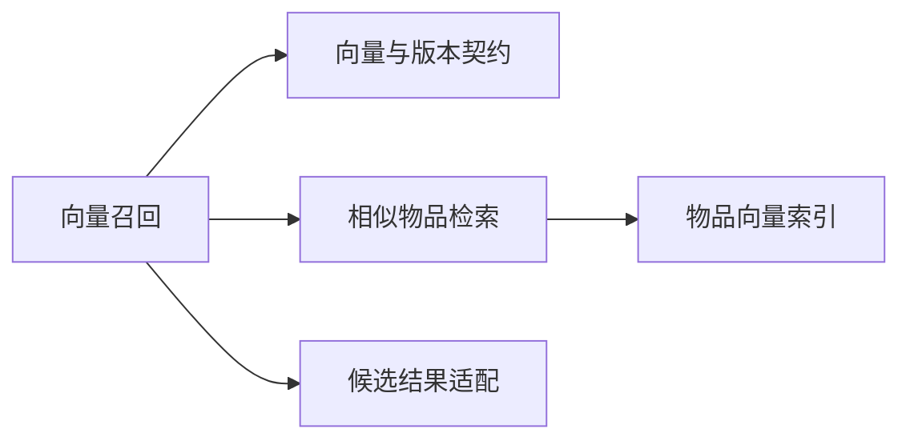

```yaml
input:
  request_id: string
  release_id: string
  embedding_space_id: string
  query_vector: 实际DSSM用户塔离线输出的有限浮点数组
  topk: 有上限的正整数
output:
  items: "[{item_id: string, score: finite_number}]"
  source: milvus
  executed: true
  versions: release_id与embedding_space_id
offline_state:
  user_vectors: 特征服务user_rep:dense，PaiRec每请求查询后传入
  item_vectors: Milvus常驻collection与索引
```

DSSM 表示用户塔和物品塔映射到同一向量空间的双塔模型。首期用户状态固定，用户塔移到离线；线上检索服务直接接收 `query_vector`，不再按 uid 读取本地画像或运行用户塔。

### 1.2 开发视图

图法：源码与配置依赖示意图（非 UML）。箭头表示代码依赖或静态配置引用，不表示服务调用或数据装载。

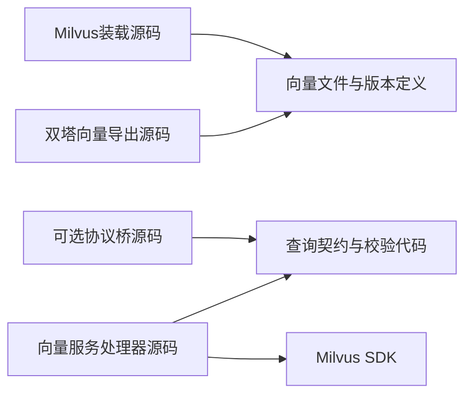

导出与装载源码交付离线工具、向量文件和发布清单；处理器交付向量召回程序，可选桥源码单独交付适配程序。文件从导出器交给装载器属于离线数据流，不是编译依赖。

```python
# 目标离线导出：同一checkpoint、词表、输入配方、输出维度与归一化规则。
user_vectors = dssm.user_tower(user_ids, gender_codes, age_codes, histories)
item_vectors = dssm.item_tower(item_ids, video_type_codes)
user_vectors = normalize_l2(user_vectors)
item_vectors = normalize_l2(item_vectors)
write_user_vectors_to_release(user_raw_ids, user_vectors, embedding_space_id)
write_item_vectors_to_release(item_raw_ids, item_vectors, embedding_space_id)
```

```python
# 目标在线处理；query_vector已经由PaiRec通过GetUserContext查询取得。
def recall(request, manifest, milvus):
    validate_release_and_vector_space(request, manifest)
    validate_finite_dimension_and_norm(request.query_vector, manifest)
    hits = milvus.search(
        collection=manifest.collection,
        vector=request.query_vector,
        limit=request.topk,
        metric=manifest.metric,
    )
    return real_candidates(hits, source="milvus", executed=True)
```

现有[导出器](assets/source_snapshots/pairec4tigerllm/training/dssm/export_embeddings.py.html#L75)只导出物品向量和用户画像；[在线服务](assets/source_snapshots/pairec4tigerllm/inference/dssm_recall_server.py.html#L80)仍读本地画像运行用户塔；[Milvus 装载器](assets/source_snapshots/pairec4tigerllm/scripts/load_item_embeddings_to_milvus.py.html#L43)已有建表、插入、建索引和自查询。因此是复用计算/灌库基础并补用户导出与接口，不是把现有系统认定为已满足目标。

### 1.3 进程视图

图法：UML 时序图。

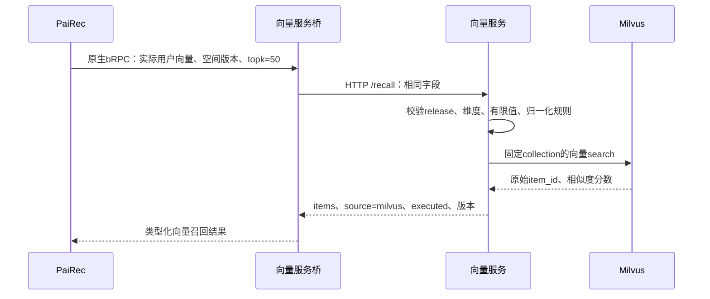

```text
Milvus不可用 → 明确错误
不能静默改成本地numpy矩阵检索后仍宣布Milvus已执行
返回原始ID → 统一融合 → 候选产生后通过BatchGetItemFeatures读取属性
```

上图是目标交互。当前 Python 进程的 IPO（输入、处理、输出）不同，需按实际函数拆分负载：

| 执行位置 | 输入 → 处理 → 输出 | 本进程负载与并发边界 |
|---|---|---|
| `load_resources`，启动阶段 | checkpoint、词表、画像文件 → 全量装入 → 常驻模型和字典 | 启动文件 I/O、主机内存、可选设备内存；不能计成逐请求读盘 |
| `recall → build_user_vector`，当前请求处理任务 | `user_id="1"` → 内存查画像、历史 ID 转索引、构造张量、用户塔前向 → `float32[D]` | 当前仍有在线模型计算；CUDA 路径还需取回 CPU 向量，目标离线用户向量将移除这一段 |
| `search_milvus`，同一任务 | 向量转列表、topk → 同步 `Collection.search` → ID/分数列表 | 编码和网络等待发生在召回进程，检索在 Milvus 进程；不把等待时间当本地 CPU 时间 |
| `search_local`，替代分支 | 常驻 `item_vectors[N,D]` 与查询向量 → 矩阵乘、选 top-k → 本地候选 | 一次扫描全部 N 项，分配 scores 与选择下标；它与 Milvus 是不同负载，目标禁止静默替换 |
| JSON 响应 | 候选列表 → 编码 → HTTP 返回 | 输出随返回候选数增长；模型、搜索和响应没有拆成自有阶段队列 |

`N` 为本地物品数，`D` 为实际向量维度。入口显式设置 `threaded=True`，请求处理函数内部仍顺序执行；PyTorch、NumPy、Milvus SDK 的内部线程由实际版本和运行配置决定，不能把一个 HTTP 任务等同于全部算子只有一条线程。[启动与画像](assets/source_snapshots/pairec4tigerllm/inference/dssm_recall_server.py.html#L47)、[前向与检索](assets/source_snapshots/pairec4tigerllm/inference/dssm_recall_server.py.html#L80)、[路由及启动入口](assets/source_snapshots/pairec4tigerllm/inference/dssm_recall_server.py.html#L146)。

高并发时，现状的用户塔、张量复制和 SDK 等待同时增加；目标则主要是校验、协议处理和远端检索等待。OS 侧应分别观察 CPU/调度等待、常驻与在途内存、设备传输、socket 和连接占用。若走本地分支，还要观察内存带宽和按 N 分配的临时数组；不能用该分支的吞吐预测 Milvus。Milvus 内部线程及索引扫描量需按选定版本、索引和实际 profile 另行分析，本地调用方源码不足以给出这些结论。

### 1.4 物理视图

图法：部署映射示意图（非 UML）。Pod 包含容器，容器列出进程；双向连线表示网络连通。图为目标部署边界，主机与副本数待定。

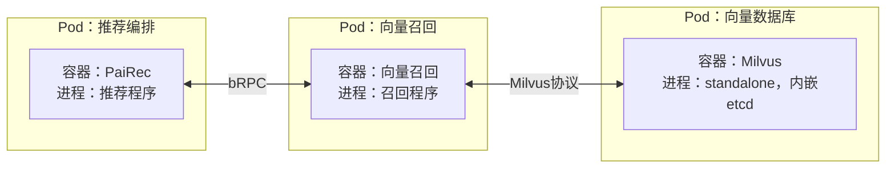

本图采用内置 bRPC 的目标召回程序，与系统图一致；若采用前面的 HTTP 桥方案，则多一个桥进程，其容器归属另行确定。Milvus 容器需要数据目录或持久卷，离线装载任务通过 Milvus 接口写入；数据卷后端与装载任务运行位置尚未指定。

```yaml
deployment:
  query_gpu_required: false
  collection: 按release版本化，启动时固定
  dimension: 从真实checkpoint读取，代码默认64不等于所有模型必须64
  score: 归一化向量内积；只有双方归一化时等价余弦相似度
  reload: 不向同名已发布collection反复insert；新版本装载验证后切换
  readiness: 数据数量、索引已加载、空间匹配、真实search可返回合法ID
```

### 1.5 场景视图

图法：结构或流程示意图（非 UML，连线含义见本节）。

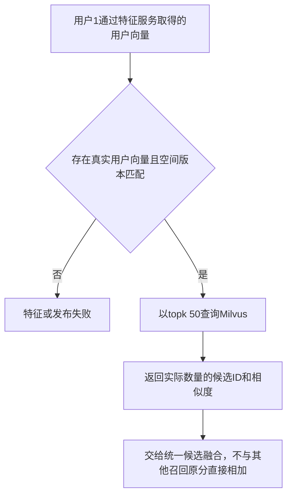

第 08 篇的完整向量是教学值；本地尚未核实样例用户的真实向量产物，[当前接口附件](assets/README.md)需要从发布资产补齐后才能发送。验收应证明离线与参考用户塔在同输入下数值一致、真实 Milvus 被调用、ID 可连接到特征服务的物品目录；训练准确率不阻塞工程贯通。

## 2. 稀疏召回：真实视频类型词项与 OpenSearch BM25

### 2.1 逻辑视图

图法：逻辑结构示意图（非 UML）。箭头表示能力依赖，不表示执行顺序；索引表示可查询的业务集合，不在此规定数据库进程。

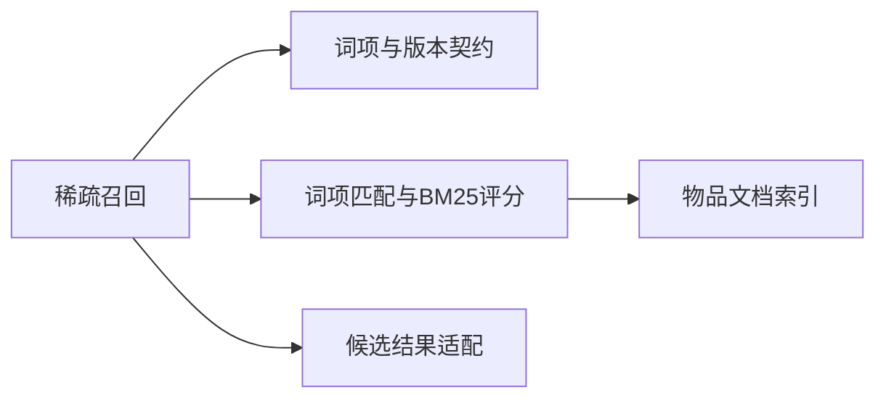

```yaml
input:
  request_id: string
  release_id: string
  sparse_recipe_id: video_type_binary_v1
  sparse_tokens: "[{token: video_type_0或video_type_1, weight: 非负有限值}]"
  topk: 有上限的正整数
output:
  items: "[{item_id: string, score: BM25分数}]"
  source: opensearch
  executed: true
  versions: release_id与sparse_recipe_id
offline_state:
  user_tokens: 特征服务user_rep:sparse，绑定同一历史内容校验值
  item_document: 原始item_id和实际类型词项
  index: 版本化mapping与倒排索引
```

BM25 是按词项在文档中的出现情况及文档分布计算匹配分数的方法。本场景只有 `video_type_0/1` 两个词项，语义为长短视频类型；它不是主题兴趣分类或自然语言搜索。类型未知的物品不生成假词项。

### 2.2 开发视图

图法：源码与配置依赖示意图（非 UML）。箭头表示代码依赖或静态配置引用，不表示服务调用或数据装载。

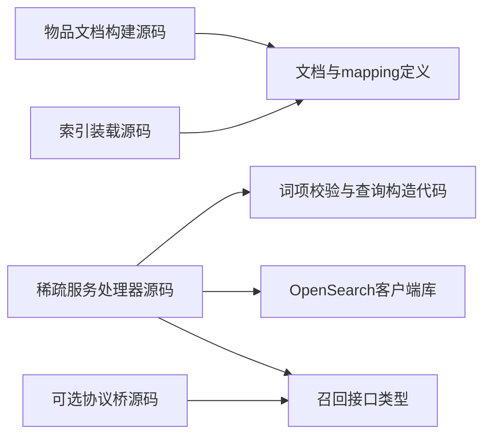

构建与装载代码交付文档生成工具、mapping 和可重放装载文件；服务处理器交付稀疏召回程序，可选桥单独构建。离线装载文档和在线 search 使用同一发布绑定，但没有编译依赖关系。

```json
{
  "mappings": {
    "properties": {
      "item_id": {"type": "keyword"},
      "tokens": {"type": "text", "analyzer": "whitespace", "similarity": "BM25"}
    }
  }
}
```

目标 mapping 使用 text 的词项分析与 BM25，不靠 keyword 默认评分猜测行为；部署时锁定 OpenSearch 版本与 mapping hash，并对固定样本执行评分解释。[OpenSearch text 官方说明](https://docs.opensearch.org/latest/mappings/supported-field-types/text/)。

```python
def make_document(item):
    if item.category_code is None:
        return None  # 保留缺失覆盖报告，不变成video_type_0
    assert item.category_code in (0, 1)
    return {"item_id": item.raw_id, "tokens": f"video_type_{item.category_code}"}

def make_query(tokens, topk):
    terms = merge_duplicates_and_validate(tokens)
    if not terms:
        return EmptyResult(reason="NO_KNOWN_VIDEO_TYPE")
    return {
        "size": topk,
        "query": {"bool": {
            "should": [{"term": {"tokens": {"value": t.token, "boost": t.weight}}}
                       for t in terms],
            "minimum_should_match": 1,
        }},
        "sort": [{"_score": "desc"}, {"item_id": "asc"}],
    }
```

补充 `_score` 相同后的 `item_id` 次序用于结果稳定性；这个 keyword 次序是字符串词典序，不当作数值大小比较。词项条数/长度和 topk 有界，索引从服务启动 manifest 固定，不允许请求自行选索引。返回只需候选字段，不把完整物品属性塞进 `_source` 替代候选产生后的特征查询。

**当前差距与旧审阅不同：** 当前[Go 实现](assets/source_snapshots/pairec_sh/pairec-demo/src/recall/brpc_sparse_recall.go.html#L65)取 `video_category` 字符串，[C++ 客户端](assets/source_snapshots/pairec_sh/pairec-demo/src/cpp/brpcClients/opensearch_client.cpp.html#L86)拼成 `match.content`；源码注释中的加权 sparse_tokens 已不能描述这条当前执行路径。目标仍需独立稀疏服务、结构化查询、真实文档与 mapping/bulk 装载，不能照抄旧“客户端已等于完整服务”的结论。

### 2.3 进程视图

图法：UML 时序图。

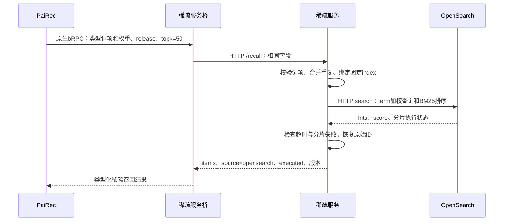

真实空词项可明确返回 `empty`，并标记此次未查询索引；不能同时声称 `executed=true` 代表完成了 OpenSearch 查询。真实查询后零命中与后端错误是不同结果。

当前可核对的内部路径仍位于 **PaiRec 进程**，尚无已完成的独立稀疏服务：

```text
Go召回任务：取video_category字符串
  → stageClient.Search：C.CString复制index与查询文本
  → Clis_OpensearchSearch：复制为std::string
  → Opensearch_Clientor::Search：拼接match.content，CallMethod(done=NULL)
  → 等HTTP终态：取得响应attachment，复制为std::string和C结果
  → GoString复制、释放C结果：解析JSON候选
```

这条 IPO 是“类型字符串 → 同步 HTTP 查询 → 响应 JSON 与候选”，不是目标中的“带权词项 → 结构化 term 查询”。复制和等待边界见[实际 Go/C++ 客户端](assets/source_snapshots/pairec_sh/pairec-demo/src/cpp/brpcClients/opensearch_client.cpp.html#L86)和[通信内部时序](06_rpc.md)。本地任务等 HTTP 期间仍保留查询及响应状态；OpenSearch 的评分工作发生在另一个 JVM 进程。

高并发分析应拆成两边：调用方需要 CPU 做字符串/JSON 处理，内存保存每调用缓冲，调度与网络资源承载同步原生调用；目标后端需要处理长倒排和大量同分候选。只有两种词项意味着某一词项可能匹配很多文档，**topk=50 不等于只检查 50 个文档**，实际检查量取决于索引及查询执行。记录调用方在途数/字节、OpenSearch 搜索队列与拒绝数、各分片查询时间、CPU/GC、页缓存及磁盘读取，才能区分网络等待、搜索计算和冷索引 I/O；本轮不臆测未固定版本的内部线程数。

### 2.4 物理视图

图法：部署映射示意图（非 UML）。Pod 包含容器，容器列出进程；双向连线表示网络连通。图为目标部署边界，主机与副本数待定。

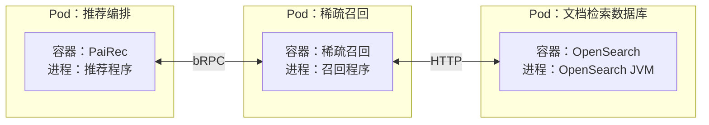

本图采用内置 bRPC 的目标程序；采用 HTTP 桥时另行增加桥进程。OpenSearch 容器需要索引数据卷，离线任务通过 mapping/bulk 接口装载；本图不指定磁盘介质、分片数或服务副本数。

```yaml
readiness:
  mapping: text + whitespace + BM25，与manifest一致
  bulk: 检查每条action的错误，不能只看HTTP 200
  refresh: 装载后完成refresh并抽样search
  coverage: 已知类型文档数、未知类型排除数、raw ID关联率
  query_validation: 固定样本explain与实际词项分布
```

### 2.5 场景视图

图法：结构或流程示意图（非 UML，连线含义见本节）。


```json
{
  "sparse_tokens": [
    {"token": "video_type_0", "weight": 0.2222222222222222},
    {"token": "video_type_1", "weight": 0.7777777777777778}
  ],
  "topk": 50
}
```

完整请求见[特征服务真实数据样例](10_feature_catalog.md)。本配方只有两种词项且每文档一个词项，倒排长、同分多，是数据本身决定的负载特征。验收记录词表大小、每文档长度、每查询词数、命中数和同分率，不用虚构标题改善分布。

## 3. Nginx 统一推荐入口

### 3.1 逻辑视图

图法：逻辑结构示意图（非 UML）。箭头表示能力依赖，不表示执行顺序；入口代理需要边界策略、上游选择和访问记录能力。

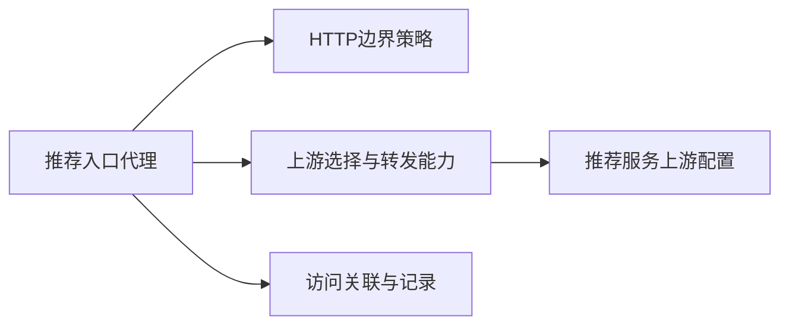

```yaml
public_business_route: POST /api/recommend
request_body:
  uid: 十进制字符串
  scene_id: home_feed
  size: 目标返回数量
  request_id: 可选外部关联ID；不直接作为模型临时KV唯一键
response_body: PaiRec实际响应，包含最终物品列表与实际返回数
request_identity:
  gateway_request_id: Nginx生成，关联入口日志
  internal_request_id: PaiRec生成并贯穿下游，关联特征和模型调用；当前OneTrans KV仍按模型与用户标识
gateway_responsibility: HTTP接入、转发、超时边界、访问记录
business_responsibility: PaiRec负责读特征、召回、排序和精排
```

### 3.2 开发视图

图法：源码与配置依赖示意图（非 UML）。箭头表示代码依赖或静态配置引用，不表示服务调用或数据装载。

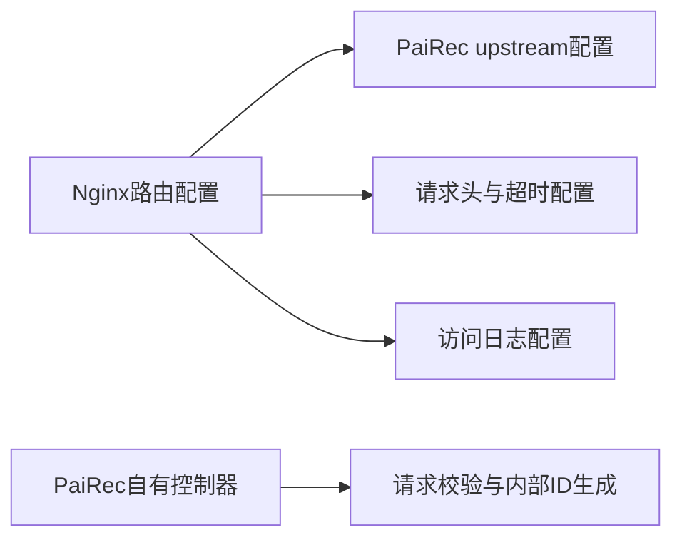

网关交付 Nginx 配置文件，控制器源码编入 PaiRec 程序；上游地址是配置引用，不是 Nginx 对 PaiRec 源码的编译依赖。

```nginx
# 目标配置片段；放在http块中，DNS、端口和容量值由部署清单替换。
upstream recommendation_api {
    server pairec:18080;
    keepalive 16;
}

server {
    listen 8080;
    client_max_body_size 8k;

    location = /api/recommend {
        proxy_pass http://recommendation_api;
        proxy_http_version 1.1;
        proxy_set_header Connection "";
        proxy_set_header Host $host;
        proxy_set_header X-Gateway-Request-ID $request_id;
        proxy_connect_timeout 1s;
        proxy_read_timeout 30s;
        proxy_send_timeout 30s;
        proxy_next_upstream off;
        proxy_cache off;
    }

    location / { return 404; }
}
```

入口片段不执行推荐策略、不启用结果缓存或自动上游重试。`proxy_read_timeout` 约束两次读取之间的等待，并不是整个推荐的总时限；实际业务总预算仍由 PaiRec 的 25 秒 deadline 控制。[Nginx 官方代理模块](https://nginx.org/en/docs/http/ngx_http_proxy_module.html#proxy_read_timeout)。生产域名、TLS 证书与地址应在实际部署清单中配置；上面 `8080/pairec:18080` 是与场景模板一致的建议角色地址，不是已盘点地址。

### 3.3 进程视图

图法：UML 时序图。

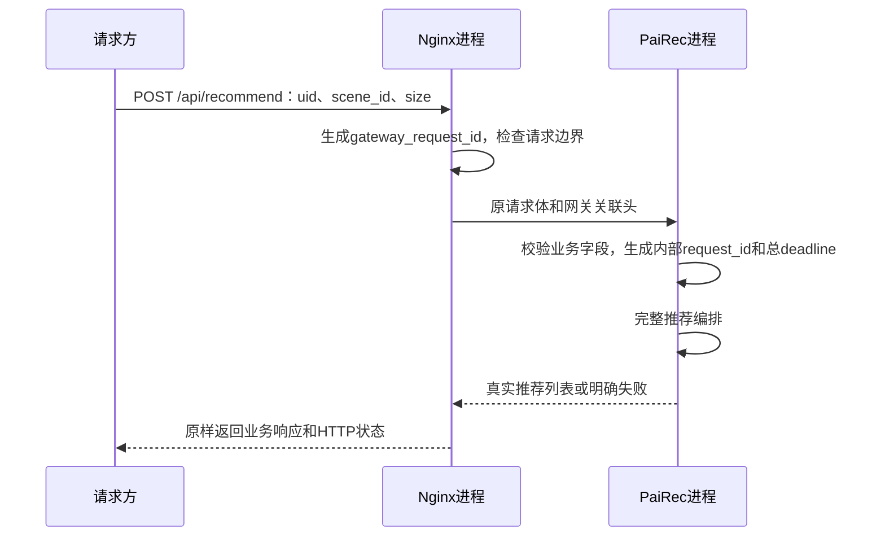

Nginx master 管理 worker 与配置，worker 通过事件机制处理多个连接；不能将每条请求理解为新建一个线程。等待上游时主要保留连接、请求缓冲和超时状态，具体 worker 数与连接上限由实际配置决定。[Nginx 进程模型](https://nginx.org/en/docs/beginners_guide.html)、[worker 与连接配置](https://nginx.org/en/docs/ngx_core_module.html#worker_connections)。这使入口的待处理连接数与 PaiRec 中的推荐任务数成为不同的容量指标。

单个 worker 的内部执行可以用以下程序结构理解。函数名来自 Nginx 官方开发说明；它是机制说明，项目尚未固定 Nginx 构建版本。不同连接的事件在同一个循环内交错，等待某个上游时保留该请求状态，worker 可处理其他就绪事件。

```c
// ngx_process_events_and_timers 的阶段摘要；不是完整可编译实现。
timeout = ngx_event_find_timer();       // 最近定时器决定最多等待多久
ngx_process_events(cycle, timeout, flags); // Linux常用epoll适配，处理就绪事件
ngx_event_expire_timers();              // 到期事件进入对应处理器
ngx_event_process_posted(...);          // 处理已投递事件
// 无就绪事件时可以在epoll_wait休眠；返回可运行后仍需OS分配CPU。
```

事件回调读写到暂不可继续时保存连接状态，后续由就绪事件或超时推进；不会为这一请求同步等待 PaiRec 完成整个推荐。主进程主要处理管理信号，推荐流量由 worker 处理。[Nginx 事件循环与进程源码说明](https://nginx.org/en/docs/dev/development_guide.html#event_loop)。

| IPO 中的工作 | OS 资源诉求与可能瓶颈 |
|---|---|
| HTTP 请求头/体 → 校验与代理请求 → PaiRec 连接 | CPU 解析/复制、socket/fd、请求缓冲；高并发需核对活动连接和容器限制 |
| 等待上游响应 → 就绪或超时事件 → 响应转发 | 调度延迟、事件处理预算、缓冲内存；上游慢会延长每请求驻留时间 |
| 响应体 → 发给慢客户端 → 完成及访问日志 | 网络发送缓冲、请求内存、日志 I/O；响应缓冲/临时文件行为取决于代理配置 |

示例中的 `keepalive 16` 是**每 worker 缓存的空闲上游连接数**，不是最多 16 个在途推荐。稳定条件下，入口平均在途请求约为到达率乘平均停留时间；扩大连接额度不能提升 PaiRec 或模型的处理能力。[Nginx keepalive 定义](https://nginx.org/en/docs/http/ngx_http_upstream_module.html#keepalive)

```yaml
logging:
  nginx: gateway_request_id、HTTP状态、request_time、upstream_response_time、上游地址
  pairec: gateway_request_id与internal_request_id关联、业务阶段、返回数、失败阶段
failure_handling:
  unavailable_upstream: 返回可辨认的网关错误，不伪造推荐列表
  business_error: 保留实际业务错误语义
  client_disconnect: 向PaiRec传播取消信号；远端模型资源仍按生命周期收尾
```

### 3.4 物理视图

图法：部署映射示意图（非 UML）。Pod 包含容器，容器列出进程；双向连线表示网络连通。图为目标部署边界，主机与副本数待定。

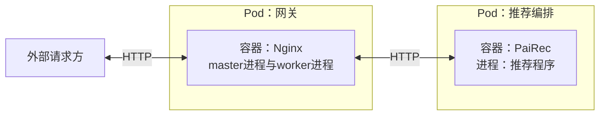

```yaml
deployment:
  public_entry: Nginx统一对外
  internal_entry: PaiRec仅作为网关上游
  replica_policy: 实例数量由容量与可用性要求确定，本图不指定数量
  publish_order: 数据READY → 模型和存储ready → PaiRecready → 网关上游接流量
  rollback: 切回已验证PaiRec配置或release，排空旧请求
  health: 网关存活与推荐依赖就绪分开检查
```

Nginx 与下游 bRPC 服务同处系统物理架构，但不在这张入口图中展开模型内部依赖，以保持单一层级。

### 3.5 场景视图

图法：结构或流程示意图（非 UML，连线含义见本节）。

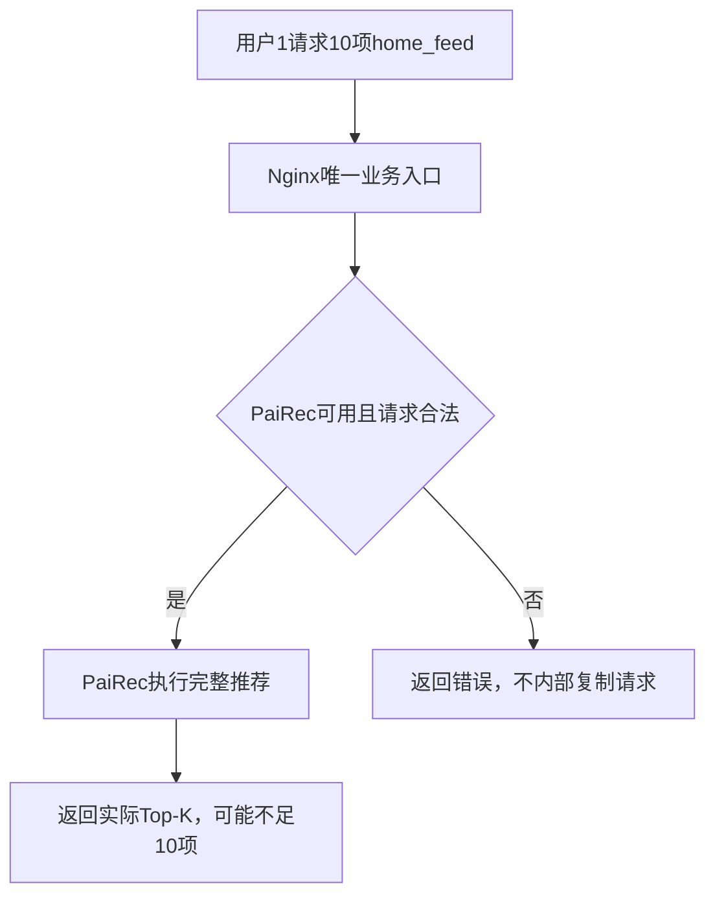

```json
{"uid":"1","scene_id":"home_feed","size":10}
```

验收最少包含：由网关发入的一条真实推荐请求、上游不可用、请求超限、总预算耗尽、客户端取消；每次能关联到真实 PaiRec 请求，正常路径只有一次业务转发。当前工作区没有已验证的业务 Nginx 部署交付，本节补齐目标角色与配置要求，不声称已上线。
