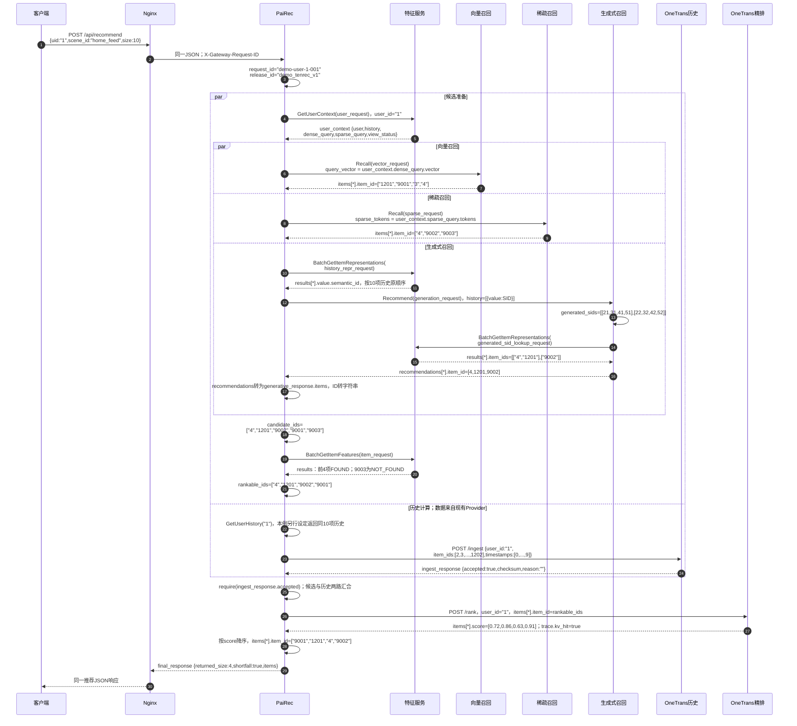
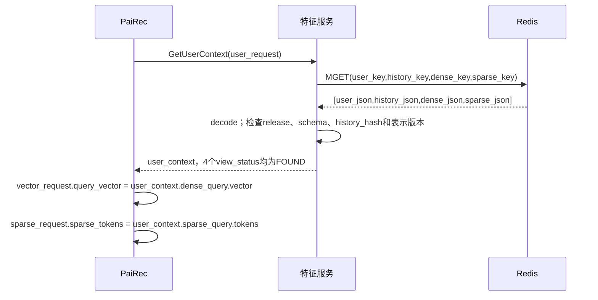
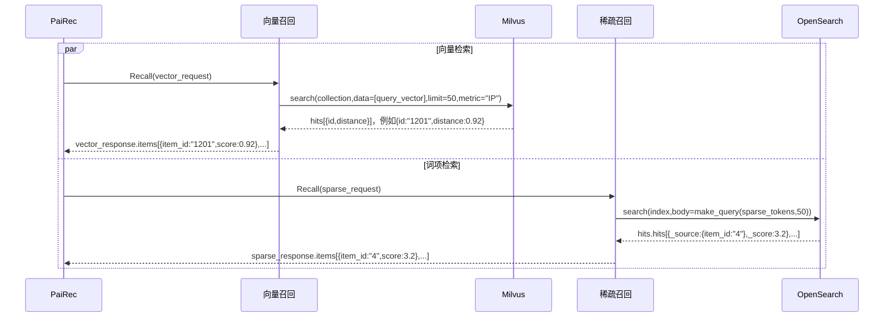
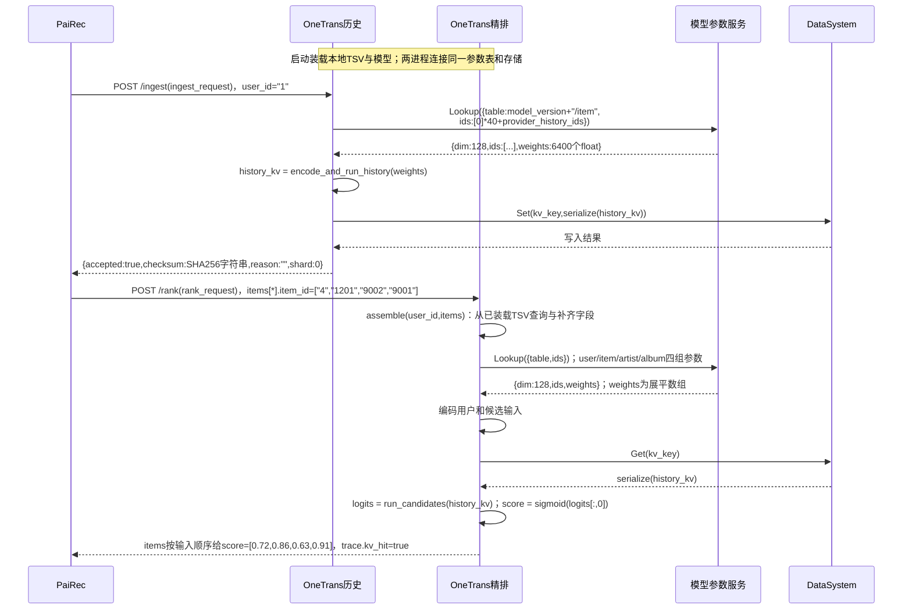

# 一次请求：用户 1 的时序、输入与输出

图中符号与连线遵循[图法与 UML 约定](DIAGRAM_NOTATION.md)，每张图前注明使用的图法。

本文用一组**教学样例**贯穿请求、取特征、三路召回、融合、精排和返回。用户与历史沿用已有样例；向量、语义编码、召回结果和模型分数为便于读图而设定，**不是数据库读回或模型运行记录**。所有 ID、顺序和字段对应关系在本文内保持一致。

特征服务和召回按目标接口设计；OneTrans 保留当前 HTTP `/ingest`、`/rank` 及本地取数路径。完整对象见[本次请求的 JSON 样例](assets/walkthrough_sample.json)，也可以直接查看[各业务接口的完整请求与响应](assets/request_example/README.md)。本文展示与理解流程有关的字段，省略重复版本头和计时字段时会注明。

代码采用 Python 表达数据构造，HTTP 和 JSON 表达服务接口；它们是设计样例，不是一份可直接运行的客户端。`{**header, ...}` 表示把公共字段合入对象，`[a, b] * 32` 表示重复这两个元素 32 次；Python 的 `True/None` 在 JSON 中对应 `true/null`。

## 1. 固定请求与配置

```http
POST /api/recommend HTTP/1.1
Content-Type: application/json

{"uid":"1","scene_id":"home_feed","size":10}
```

```python
external_request = {"uid":"1", "scene_id":"home_feed", "size":10}
request_id = "demo-user-1-001"          # PaiRec为本请求生成
release_id = "demo_tenrec_v1"          # 教学版本名，不是已发布数据
user_id = external_request["uid"]
scene = {"vector_topk": 50, "sparse_topk": 50,
         "generative_topk": 10, "candidate_limit": 50, "size": 10}
versions = {"embedding_space_id": "demo_dssm_64_v1",
            "sparse_recipe_id": "video_type_binary_v1",
            "sid_version": "demo_sid_v1"}
record_header = {"release_id": release_id, "schema_version": "feature_v1"}

# 以下两个函数是本文示意辅助函数：只拼装公共字段，不调用服务。
# remaining_budget_ms()读取编排层为本次请求维护的剩余总时间。
def call_meta(stage_limit_ms):
    return {**record_header, "request_id": request_id,
            "remaining_timeout_ms": min(stage_limit_ms, remaining_budget_ms())}

def feature_meta():
    return call_meta(1000)
```

上述常量是用户 1 请求选中配置后的教学值。PaiRec 在请求入口生成 `request_id`，用 `scene_id="home_feed"` 选择场景；从该场景绑定的发布清单取得 `release_id` 及三个表示版本，从特征接口约定取得 `schema_version`。`release_id` 固定整套特征与索引数据，`schema_version` 指字段格式；三个表示版本分别标识向量计算方式、兴趣词项配方和物品语义编码规则。

`call_meta` 和 `feature_meta` **都是本文定义的示意辅助函数，不是 SDK 方法或 RPC 接口**。后续代码省去重复公共字段时，都按这里的定义展开：

| 代码 | 含义 |
|---|---|
| `call_meta(5000)` | 生成含 `request_id/release_id/schema_version/remaining_timeout_ms` 的字典；`5000` 是本阶段的超时上限，单位为毫秒 |
| `**call_meta(5000)` | 在 Python 字典中展开上述四个字段，例如把返回的 `request_id` 直接放入召回请求；线上 JSON 中没有 `**` 或 `call_meta` 字段 |
| `feature_meta()` | 调用 `call_meta(1000)`，为特征查询设置最多 1000 毫秒的阶段上限；`**feature_meta()` 同样展开返回字典 |

剩余时间来自 PaiRec：进入请求时，以单调时钟的当前值加上场景总超时，得到本次截止时刻；发起每次调用前，重新计算“截止时刻减当前值”。单调时钟用于计时，不受系统日期调整影响。`remaining_timeout_ms` 取剩余总时间和阶段上限中的较小值；例如本次只剩 900 毫秒，`call_meta(5000)` 也只能给下游 900 毫秒。时间已耗尽时，编排层应停止调用。

`topk` 是场景配置规定的每路候选上限；本例 `size=10` 来自客户端请求，经场景校验后用于最终截断。物品与用户原始 ID 使用字符串；OneTrans `/ingest` 的历史数组按现有接口转为整数。

## 2. 完整主时序

图中使用实际字段路径；`items[*].item_id` 表示“items 数组中各项的 item_id”，不是新增响应字段。`vector_request` 等对象在后文逐个构造。数据库调用在第 3～5 节子图展开，避免在同一主图中加入十几个数据库和计算模块。

图法：UML 时序图。 PaiRec 代表含并行子任务的编排进程，各分支内同步等待，分支之间可以交错。



主图采用目标编排：检查 `/ingest.accepted` 后才提交 `/rank`。当前配套调用方则先尝试 `/rank`，未命中才等待历史任务并重查；两者区别见[现有 OneTrans 进程行为](02_onetrans.md)。

### 2.1 图中的字段从哪里来

| 下游请求字段 | 精确赋值来源 | 本例值或形状 |
|---|---|---|
| `user_request.user_id` | `external_request.uid` | `"1"` |
| `vector_request.query_vector` | `user_context.dense_query.vector` | `[0.125,-0.125]` 重复 32 次，64 维 |
| `vector_request.embedding_space_id` | `user_context.dense_query.embedding_space_id` | `"demo_dssm_64_v1"` |
| `sparse_request.sparse_tokens` | `user_context.sparse_query.tokens` | 两项 `{token,weight}` |
| `sparse_request.sparse_recipe_id` | `user_context.sparse_query.sparse_recipe_id` | `"video_type_binary_v1"` |
| `history_repr_request.item_ids` | `user_context.history.item_ids` | 10 个历史 ID |
| `generation_request.history[i].value` | `history_repr_response.results[i].value.semantic_id` | 一个物品的 4 个整数 |
| `generated_sid_lookup_request.semantic_ids` | 生成模型输出解析出的 `generated_sids` | 两个完整 SID |
| `item_request.item_ids` | PaiRec 融合、去重和已看过滤后的 `candidate_ids` | 5 个候选 ID |
| `rank_request.items[i].item_id` | 特征存在且通过资格规则的 `rankable_ids[i]` | 4 个候选 ID |
| `ingest_request.item_ids` | **现有历史 Provider** 的返回值 | 整数数组；不从特征服务响应赋值 |
| `*.topk` | `scene` 中对应一路的配置 | 向量 50、稀疏 50、生成 10 |

新特征接口携带 `request_id/release_id/schema_version/remaining_timeout_ms`；本例召回目标封装复用此调用头，并携带本路表示版本。**当前生成 protobuf 没有完整版本头**，需新增字段或明确的服务绑定；当前 OneTrans HTTP 也不接受这套特征版本头。不能将公共字段无条件塞进所有旧接口。

## 3. 用户特征：从 Redis 值到召回输入

`required_views` 指本次要查的四类数据：用户属性 `USER`、历史 `HISTORY`、向量查询输入 `DENSE_QUERY`、词项查询输入 `SPARSE_QUERY`。这里的“视图”是接口的数据类别，与 4+1 架构视图无关。两个查询输入都由离线任务预先计算，在线查询只取出并检查版本。

```python
user_request = {
    **feature_meta(), "user_id": user_id,
    "required_views": ["USER", "HISTORY", "DENSE_QUERY", "SPARSE_QUERY"],
    "representation_versions": {k: versions[k] for k in
                                ("embedding_space_id", "sparse_recipe_id")},
}
history_ids = ["2","3","80936","781","111774","1230","26403","991","2362","1202"]
history = {**record_header, "user_id": "1", "item_ids": history_ids,
           "positions": list(range(1, 11)), "valid_length": 10,
           "time_semantics": "ordinal", "source_data_row": 1,
           "history_hash": "e00b29132a8ba7bd36e4a7a8296f5d579a139832cc58ba64047518e1b5424177"}
# user_context：目标GetUserContext响应。向量为演示值；长度和单位范数真实可检验。
user_context = {
    **record_header, "request_id": request_id,
    "view_status": {v: "FOUND" for v in user_request["required_views"]},
    "user": {**record_header, "user_id": "1", "gender_code": 1, "age_code": 4,
             "missing_fields": [], "source_data_row": 1},
    "history": history,
    "dense_query": {**record_header, "user_id": "1",
        "embedding_space_id": versions["embedding_space_id"],
        "history_hash": history["history_hash"], "dimension": 64,
        "vector": [0.125, -0.125] * 32},
    "sparse_query": {**record_header, "user_id": "1",
        "sparse_recipe_id": versions["sparse_recipe_id"],
        "history_hash": history["history_hash"],
        "tokens": [{"token":"video_type_0", "weight":2/9},
                   {"token":"video_type_1", "weight":7/9}],
        "known_history_count": 9, "missing_history_count": 1},
}
```

图法：UML 时序图。



```python
# 特征服务内部拼键；PaiRec不依赖Redis键格式。
prefix = "rec:qkv:demo_tenrec_v1"
user_key    = prefix + ":user:1"
history_key = prefix + ":history:1"
dense_key   = prefix + ":user_rep:dense:demo_dssm_64_v1:1"
sparse_key  = prefix + ":user_rep:sparse:video_type_binary_v1:1"
```

Redis 的 `MGET` 按键顺序返回四个值，特征服务解析成响应中的 `user/history/dense_query/sparse_query`；它们是同一在线库中的四类记录。`FOUND` 表示对应记录存在，`missing_fields=[]` 表示这条记录没有已知的字段缺失。

`history_hash` 是按约定格式计算的历史摘要，用来核对预计算向量和词项是否基于这份历史。只有所需记录全部存在、版本与摘要均一致，PaiRec 才发起本例召回。历史位置 1～10 是序位，不是真实时间；`gender_code/age_code` 是数据集编码，`age_code=4` 不表示 4 岁。

`video_type_0/1` 是视频长短类型码，不是主题标签：本例 10 项历史中 9 项类型已知，其中 2 项为类型 0、7 项为类型 1，因此词项权重为 `2/9`、`7/9`。未知类型的物品仍保留在原始历史中。

## 4. 三路召回：同一上下文怎样形成不同请求

### 4.1 向量与稀疏请求

```python
# call_meta保持本次request_id、release_id不变，每次调用更新剩余时间。
vector_request = {
    **call_meta(5000), "query_vector": user_context["dense_query"]["vector"],
    "embedding_space_id": user_context["dense_query"]["embedding_space_id"],
    "topk": scene["vector_topk"],
}
sparse_request = {
    **call_meta(5000), "sparse_tokens": user_context["sparse_query"]["tokens"],
    "sparse_recipe_id": user_context["sparse_query"]["sparse_recipe_id"],
    "topk": scene["sparse_topk"],
}
```

下面把 `sparse_request` 和对应响应完全展开为 JSON，不再使用辅助函数、变量或省略号。它们是目标 RPC 消息的可读形式，不表示新增一个 HTTP 接口。词项来自 `GetUserContext(user_id="1")` 的 `sparse_query.tokens`；稀疏服务接收查询词项而不另传 `user_id`，共同的 `request_id="demo-user-1-001"` 将它与用户 1 的原始请求关联。本例发送时剩余 900 毫秒，因此超时字段为 `min(5000, 900)=900`。

PaiRec → 稀疏召回的完整请求：

```json
{
  "request_id": "demo-user-1-001",
  "release_id": "demo_tenrec_v1",
  "schema_version": "feature_v1",
  "remaining_timeout_ms": 900,
  "sparse_tokens": [
    {"token": "video_type_0", "weight": 0.2222222222222222},
    {"token": "video_type_1", "weight": 0.7777777777777778}
  ],
  "sparse_recipe_id": "video_type_binary_v1",
  "topk": 50
}
```

稀疏召回 → PaiRec 的完整响应。`score_semantics="bm25"` 表示 BM25 词项相关性评分，分数不是点击概率；本例只返回三个匹配物品，`topk=50` 不要求补足 50 个：

```json
{
  "request_id": "demo-user-1-001",
  "release_id": "demo_tenrec_v1",
  "schema_version": "feature_v1",
  "sparse_recipe_id": "video_type_binary_v1",
  "score_semantics": "bm25",
  "items": [
    {"item_id": "4", "score": 3.2},
    {"item_id": "9002", "score": 2.7},
    {"item_id": "9003", "score": 2.1}
  ]
}
```

以下子图说明上述服务请求如何转换成数据库查询：

图法：UML 时序图。 PaiRec 代表含并行子任务的编排进程，各分支内同步等待，分支之间可以交错。



上图只展示理解请求所需的数据库参数。`collection` 是 Milvus 中的物品向量集合，`index` 是 OpenSearch 中的物品词项索引；它们都由当前发布清单指定。`IP` 表示内积相似度；本例用户和物品向量都假定已单位化，故内积与余弦相似度一致。

`make_query` 是[稀疏服务](07_other_services.md)中的查询构造函数：为 `video_type_0/1` 各生成一个词项条件，用 `2/9`、`7/9` 作为权重，要求至少命中一个条件，最多返回 50 项。Milvus 的 `id/distance` 和 OpenSearch 的 `_source.item_id/_score` 都由召回服务转换为 `item_id/score`；转换统一字段名，保留各路分数含义。

### 4.2 历史原始 ID → SID → 生成候选原始 ID

`SID`（语义编码）是生成模型使用的物品表示，本例每个物品用四个整数表示。先把用户历史的原始物品 ID 转为 SID 供模型输入，再把模型新生成的 SID 反查成可推荐的原始物品 ID；两个查询方向由 `lookup_by` 区分。

```python
history_ids = user_context["history"]["item_ids"]  # 沿用前面的10项，保留顺序
history_repr_request = {
    **feature_meta(), "lookup_by": "raw_item_id", "item_ids": history_ids,
    "sid_version": versions["sid_version"],
}
# 以下循环只生成教学响应，真实服务从物品编码表查询，不按序号计算SID。
history_results = []
for position, item_id in enumerate(history_ids, start=1):
    semantic_id = [position, 10+position, 20+position, 30+position]
    history_results.append({"item_id": item_id, "status": "FOUND", "value": {
        **record_header, "item_id": item_id, "sid_version": versions["sid_version"],
        "semantic_id": semantic_id}})
history_repr_response = {
    **record_header, "request_id": request_id, "lookup_by": "raw_item_id",
    "sid_version": versions["sid_version"],
    "results": history_results,
}
# 批量结果与输入等长、同顺序；这里只取每项编码，适配生成接口的value字段。
generation_history = []
for result in history_repr_response["results"]:
    assert result["status"] == "FOUND"  # 任一历史编码缺失，生成分支失败
    generation_history.append({"value": result["value"]["semantic_id"]})
# 第1项为{"value":[1,11,21,31]}；第10项为{"value":[10,20,30,40]}。
generation_request = {
    **call_meta(10000), "user_id": "1", "sid_version": versions["sid_version"],
    "history": generation_history,
    "topk": 10, "temperature": 1.0, "beam_width": 1,
}
# 推理后的教学输出；反查时semantic_ids是二维数组，而非history的{value:...}结构。
generated_sids = [[21,31,41,51], [22,32,42,52]]
generated_sid_lookup_request = {
    **feature_meta(), "lookup_by": "semantic_id", "semantic_ids": generated_sids,
    "sid_version": versions["sid_version"],
}
generated_sid_lookup_response = {
    **record_header, "request_id": request_id, "lookup_by": "semantic_id",
    "sid_version": versions["sid_version"],
    "results": [
        {"semantic_id":[21,31,41,51], "status":"FOUND", "item_ids":["4","1201"]},
        {"semantic_id":[22,32,42,52], "status":"FOUND", "item_ids":["9002"]},
    ],
}
```

特征服务分别批读 `item_rep:<sid_version>:<item_id>` 和 `sid_map:<sid_version>:<四位编码>`，省略的公共前缀就是第 3 节的 `prefix`。第一个生成 SID 对应两个物品，因此按数值 ID 升序展开为 `4,1201`，再接第二个 SID 的 `9002`。这里两个 SID 得到三个原始物品，是因为一个编码允许关联多个物品；最终仍受 `topk` 限制。`temperature` 是生成采样温度，`beam_width` 是同时保留的生成路径数；这里只说明接口配置，不据此证明后端执行了哪种生成算法。这些绑定是演示数据，不声称已有编码资产与之相符。

```python
# 生成服务保留现有protobuf响应形状；省略计时/trace。
generation_wire_response = {"code": 200, "user_id": "1", "recommendations": [
    {"item_id": 4,    "semantic_id": [21,31,41,51], "score": 1.0},
    {"item_id": 1201, "semantic_id": [21,31,41,51], "score": 1.0},
    {"item_id": 9002, "semantic_id": [22,32,42,52], "score": 1.0},
]}
# PaiRec客户端做显式转换，后续融合才能统一使用items与字符串ID。
generative_response = {"items": [
    {"item_id": str(x["item_id"]), "score": x["score"]}
    for x in generation_wire_response["recommendations"]]}
```

目标生成服务新增特征反查；现有实现仍是本地映射。既有 protobuf 的 `history` 每项确为 `{value:[...]}`，返回确为 `recommendations`；目标版本头需要另外补齐。[生成协议源码](assets/source_snapshots/pairec4tigerllm/proto/recommend.proto.html#L7)。TensorRT-LLM 的模型缓存由实际块生命周期触发 DataSystem 读写，与上述业务映射查询分开，内部细节见[生成服务视图](04_generative_recall.md)。

### 4.3 三路完整候选与融合结果

下面各行都是 `response.items` 的完整教学值，数组次序就是该来源的返回次序。

```python
vector_response = {"items": [
    {"item_id":"1201", "score":0.92}, {"item_id":"9001", "score":0.89},
    {"item_id":"3", "score":0.82},    {"item_id":"4", "score":0.81}]}
sparse_response = {"items": [
    {"item_id":"4", "score":3.2}, {"item_id":"9002", "score":2.7},
    {"item_id":"9003", "score":2.1}]}
# generative_response.items = [{item_id:"4",score:1.0}, {item_id:"1201",score:1.0},
#                              {item_id:"9002",score:1.0}]
candidate_ids = ["4", "1201", "9002", "9001", "9003"]
```

| 融合动作 | 本例变化 |
|---|---|
| 先取生成路，最多 10 个 | 得到 `4,1201,9002` |
| 稀疏、向量逐项轮询补充 | 重复 ID 不重复加入；新增 `9001,9003` |
| 按特征服务历史过滤已看 | `3` 已在用户历史中，排除 |
| 总候选最多 50 个 | 本例只有 5 个，不补造不足的候选 |

本例的“融合”就是按上述来源优先级合并候选名单、去掉重复和已看物品，此时尚未按精排分数排序。同一物品保留全部来源用于解释；三路原始分数不直接相加。目标来源分数含义不同，生成路当前常量 `1.0` 也不能当作点击概率。

## 5. 候选取特征、OneTrans 打分与返回

### 5.1 候选属性批查：保留缺失位置

```python
item_request = {**feature_meta(), "item_ids": candidate_ids,
    "fields": ["category_code", "metadata_available", "statistics", "missing_fields"]}
# 以下为item_response.results；省略与其他特征响应相同的顶层版本头。
item_results = [
    {"item_id":"4", "status":"FOUND", "value":{"category_code":1,
     "metadata_available":True,"statistics":{"n":36,"ctr":1/6},"missing_fields":[]}},
    {"item_id":"1201", "status":"FOUND", "value":{"category_code":1,
     "metadata_available":True,"statistics":{"n":32,"ctr":0.25},"missing_fields":[]}},
    {"item_id":"9002", "status":"FOUND", "value":{"category_code":0,
     "metadata_available":True,"statistics":{"n":20,"ctr":0.10},"missing_fields":[]}},
    {"item_id":"9001", "status":"FOUND", "value":{"category_code":1,
     "metadata_available":True,"statistics":{"n":40,"ctr":0.20},"missing_fields":[]}},
    {"item_id":"9003", "status":"NOT_FOUND", "value":None},
]
# statistics在正文只显示n/ctr；完整教学对象见JSON附件。
rankable_ids = [r["item_id"] for r in item_results if r["status"] == "FOUND"]
# -> ["4", "1201", "9002", "9001"]；本例人工屏蔽集合为空。
```

特征服务批读 `prefix + ':item:' + item_id`，返回五个对应位置。`category_code` 仍是视频类型码，`metadata_available` 只表示该类型是否已知；`statistics.n` 是聚合曝光行数，`ctr` 是这些行的点击比例。它们是离线统计，不是本次精排分数。

“资格规则”决定物品是否允许进入打分。本例没有人工屏蔽物品，只排除整条特征缺失的 `9003`，所以候选从 5 个变为 4 个。上述命名业务属性供资格规则和后排序使用，**不传进当前 OneTrans `/rank`**。

### 5.2 OneTrans 历史与候选计算：现有字段，教学输入

OneTrans 的现有历史 Provider 是配套调用方的取历史组件：优先使用消息流缓存的点击历史，缺失时查询本地用户文件。本例另行假定它返回下面十项历史，且 OneTrans 已装载的本地 TSV（制表符分隔文件）覆盖四个候选；特征服务查到了用户 1，并不能证明这两个独立来源也具备相同数据。

下图的模型参数服务 `PS` 按模型表名和 ID 返回模型向量参数；`history_kv` 是历史 Transformer 计算产生的注意力键、值张量，存入 DataSystem 供候选计算复用。它不是原始历史，也不是特征服务的 key/value 记录。图中的计算函数只描述业务动作，不代表对外 RPC 接口。

```python
provider_history_ids = [2,3,80936,781,111774,1230,26403,991,2362,1202]
ingest_request = {"user_id":"1", "item_ids":provider_history_ids,
                  "timestamps":list(range(10))}  # 0..9；现有调用方的序位规则
rank_request = {"request_id":request_id, "user_id":"1",
                "items":[{"item_id":i} for i in rankable_ids]}
```

图法：UML 时序图。



```python
# 当前OneTrans装配方式；本例本地用户TSV另行设定gender=1、age=4。
user_dense = [1.0, 4.0] + [0.0] * 13
# 每个候选：artist_ids与album_ids均取物品TSV第2列；dense取第4～18列。
# 字段顺序和缺行补零见02，不使用item_results中的statistics替代。
model_version = "demo_onetrans_v1"
kv_key = "kv:" + base64url_no_padding(model_version) + ":MQ"  # MQ是用户"1"的编码
# 参数服务响应weights为展平数组：len(weights) == len(ids) * dim。
```

历史最多输入 50 项，本例只有 10 项，所以在左侧补 40 个零 ID，再查询 `50 × 128 = 6400` 个参数值；“展平数组”指把 50 行向量依次接成一个数组。模型用有效长度排除补空位。候选计算中的 `artist/album` 是沿用的参数槽名称，当前都使用物品 TSV 的视频类型值，不表示歌手或专辑。

`base64url_no_padding` 表示去掉末尾填充符的 URL 安全 Base64 编码；`kv_key` 因此由模型版本和用户 ID 两部分组成。候选参数查询发生在历史 KV 读取之前。

`/ingest` 成功响应有 `accepted/shard/checksum/reason/ingest_us`；`checksum` 是计算结果字节的 SHA256 字符串，不是原始历史的 `history_hash`；`shard` 是服务分片编号，`ingest_us` 是处理耗时，单位为微秒。现有 `/rank` 成功响应如下，省略耗时与部分 trace 字段：

```json
{
  "code": 200, "msg": "ok", "request_id": "demo-user-1-001",
  "model_version": "demo_onetrans_v1", "model_role": "engineering",
  "items": [
    {"item_id":"4", "score":0.72},
    {"item_id":"1201", "score":0.86},
    {"item_id":"9002", "score":0.63},
    {"item_id":"9001", "score":0.91}
  ],
  "trace": {"kv_hit":true,"n_candidates":4}
}
```

`logit` 是模型输出头的原始数值；`sigmoid(x)=1/(1+exp(-x))` 将它转换到 0～1。`score` 取第一个输出头的转换结果，不自动代表点击概率；精排响应保持输入顺序，**最终排序在 PaiRec**。`model_role` 是配置值，此处沿用源码默认值。现有 OneTrans 的缓存键只含模型与用户，`accepted=true`、`kv_hit=true` 不能独自证明并发时读到的是本次历史；这个教学成功路径假定用户 1 的请求串行处理。

### 5.3 后置排序与最终响应

```python
# rank_response为上面的响应；人工屏蔽规则为空，无其他业务加分。
score_by_id = {x["item_id"]: x["score"] for x in rank_response["items"]}
# Python稳定排序：按分数降序；同分时保留rankable_ids中的融合次序。
final_ids = sorted(rankable_ids, key=lambda item_id: -score_by_id[item_id])[:scene["size"]]
# -> ["9001", "1201", "4", "9002"]
```

```json
{
  "request_id":"demo-user-1-001", "release_id":"demo_tenrec_v1",
  "items":[
    {"item_id":"9001","score":0.91},
    {"item_id":"1201","score":0.86},
    {"item_id":"4","score":0.72},
    {"item_id":"9002","score":0.63}
  ],
  "returned_size":4, "shortfall":true
}
```

`returned_size` 是实际返回数，`shortfall=true` 表示少于请求的 `size`。客户端请求 10 项，本例实际返回 4 项：三路候选先融合为 5 项，缺失特征的 `9003` 被排除，其余 4 项全部打分后按分数返回。Nginx 转发这一响应，不再次排序。

## 6. 读图时需要检查的四个分支

前文演示成功路径。下表补充缺失与失败的处理；“严格”表示不能把没有实际完成的必需计算记为端到端成功。可选召回路失败后是否继续，由场景策略明确配置，不能由空数组暗示成功。

| 条件 | 此次请求应怎样结束 |
|---|---|
| 必需用户视图缺失、版本不匹配；历史 SID 任一缺失 | 停止相关必需阶段，明确失败；不静默替换用户历史 |
| 生成的 SID 没有物品关联 | 记录该 SID，不产生候选；可返回真实空候选 |
| 某个候选整条物品特征缺失 | 保留结果位置并由 PaiRec 剔除；本例 `9003` 就是此分支 |
| 当前 OneTrans 历史为空、写入失败或 KV 未命中 | 目标严格编排不算完整成功；当前未命中可能不执行候选模型，零 logit 经 sigmoid 后得到统一 0.5，需检查 `kv_hit` 和计算记录 |

接口依据：[特征完整类型与缺失语义](10_feature_catalog.md)、[历史输入构造](assets/source_snapshots/pairec4tigerllm_8506/services/recall/onetrans_s_stage.go.html#L72)、[OneTrans 路由与响应](assets/source_snapshots/OneTrans_HSE_project/cpp/tools/server_main.cpp.html#L234)、[PS 查询协议](assets/source_snapshots/OneTrans_HSE_project/deploy/ps/embedding_service.proto.html#L18)、[历史补齐与参数查询](assets/source_snapshots/OneTrans_HSE_project/cpp/src/engine/frontend.cpp.html#L84)。
