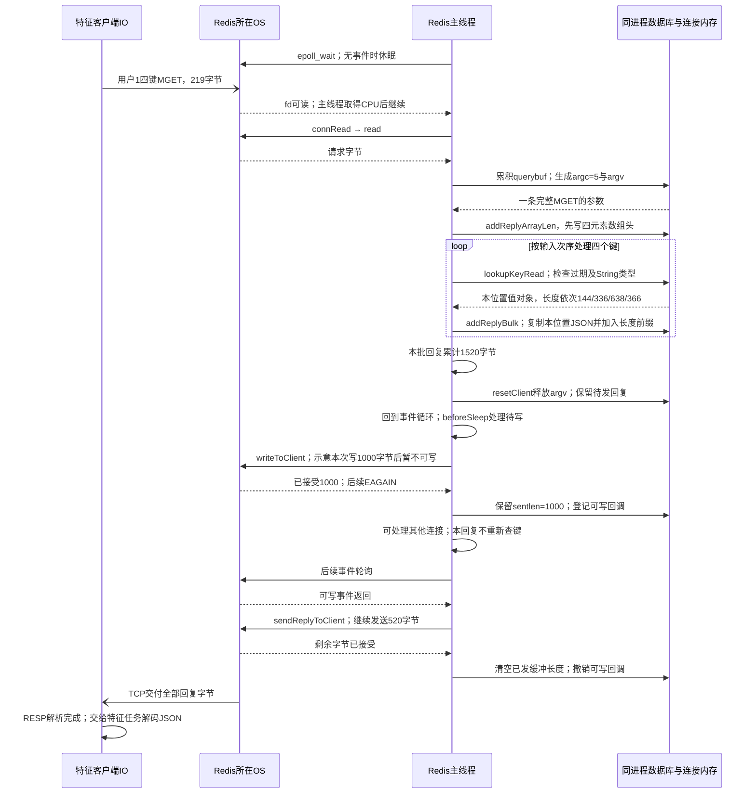
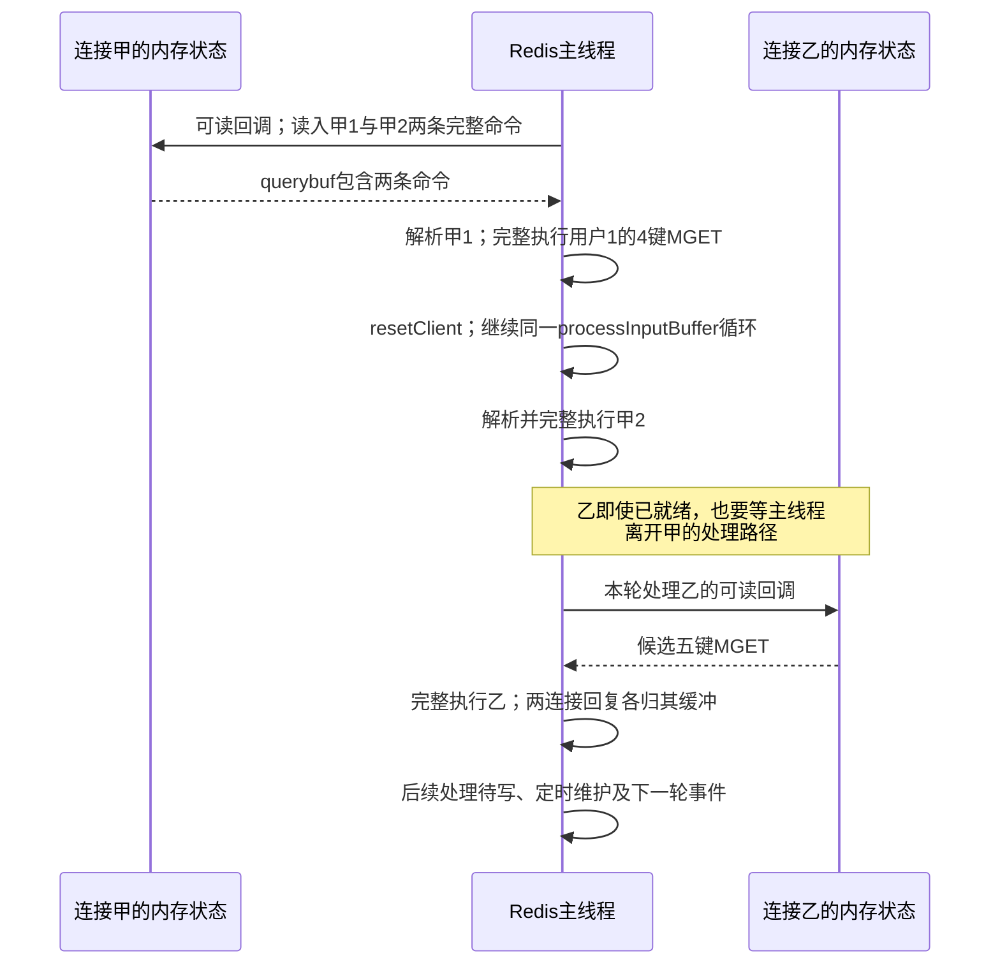
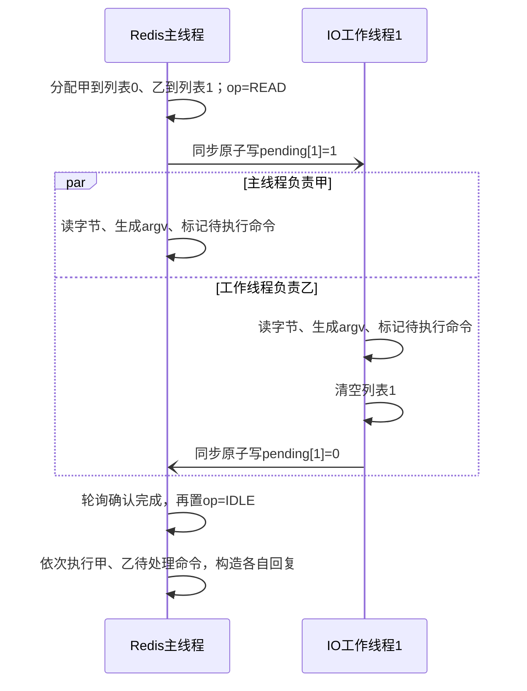

# Redis 特征查询：逐函数执行、同步与负载分析

本章追踪用户 1 的一次推荐请求：**业务接口查什么，产生多少 Redis 命令和字节，这些工作由哪些线程、进程与操作系统资源完成。** 它补充[特征服务五视图](05_feature_data.md)，不重复[键值字典](10_feature_catalog.md)。这里只分析特征服务的 Redis；DataSystem 中的模型注意力状态不在此数据路径内。

以下严格区分三种依据：接口和数据格式是目标设计；字节量由[现有教学样例](assets/walkthrough_sample.json)计算；Redis 内部机制依据官方文档及固定版本源码。**没有运行推荐服务或测得吞吐、时延、CPU、内存峰值。** 下文瓶颈是根据执行机制推导的待验证因素。 Redis 版本、单实例/集群、持久化及 IO 线程配置尚未选定，不能据此声称已经部署了某种线程结构。

## 1. 一次推荐实际读取什么

### 1.1 四次业务查询，基础情形为四条 MGET

假设：发布清单已在特征服务装载；业务键为不可变 Redis String；使用单实例、长期连接、不拆批、无重试。这里不计连接初始化、鉴权、健康检查和管理查询。

| 顺序 | 调用方与特征接口 | Redis 键组 | 本例键数 | 返回的数据 |
|---|---|---|---:|---|
| 1 | PaiRec：`GetUserContext("1")` | `user/history/user_rep:dense/user_rep:sparse` | 4 | 用户属性、10 项历史、64 维用户向量、2 项兴趣词项 |
| 2 | PaiRec：`BatchGetItemRepresentations(raw_item_id)` | `item_rep` | 10 | 历史物品 `2,3,80936,781,111774,1230,26403,991,2362,1202` 的编码 |
| 3 | 生成服务：`BatchGetItemRepresentations(semantic_id)` | `sid_map` | 2 | 两个生成编码分别关联 `["4","1201"]`、`["9002"]` |
| 4 | PaiRec：`BatchGetItemFeatures` | `item` | 5 | `4,1201,9002,9001` 的属性；`9003` 缺失 |
| 合计 | PaiRec 3 次、生成服务 1 次 RPC | 4 个读取批次 | **21** | 20 个值、1 个缺失位置 |

这四批在同一请求中有数据依赖：第 2 批要先取得历史 ID，第 3 批要等生成模型输出，第 4 批要等三路候选合并。**不能把四批提前放进一个 pipeline**。不同推荐请求可以交错；向量、稀疏服务查询自身索引不增加这份 Redis 账单。当前 OneTrans 的 Provider、TSV 和参数查询也不计入。

```python
release = "demo_tenrec_v1"
prefix = "rec:qkv:" + release
user_keys = [
    prefix + ":user:1",
    prefix + ":history:1",
    prefix + ":user_rep:dense:demo_dssm_64_v1:1",
    prefix + ":user_rep:sparse:video_type_binary_v1:1",
]
# 每个列表对应一次基础批读；实际客户端使用参数数组，不拼接命令文本。
user_records = redis.mget(user_keys)
# 返回一个数组，位置0..3分别对应上述四个键，而不是四条独立命令回复。
```

### 1.2 样例字节量：计算口径先于数字

采用紧凑 UTF-8 JSON，即 `json.dumps(value, ensure_ascii=False, separators=(",", ":"))`，不加空白或压缩。Redis 协议按 RESP2 计算：命令是字符串数组，MGET 回复是一个包含各值的数组，缺失项为 `$-1\r\n`。这是应用协议字节，不含 TCP/IP、TLS、容器网络、重传及连接建立开销。[RESP 官方规范](https://redis.io/docs/latest/develop/reference/protocol-spec/)。

用户、历史和物品编码使用样例中的完整记录。反查值按数据字典补入发布头与编码版本。**候选样例只有接口所选字段，因此候选行仅按“发布头＋物品 ID＋样例字段”计算**；完整物品记录还有来源、有效计数和缺失计数等字段，实际从 Redis 读取会更大。即使 RPC 只请求 `category_code`，当前 String/JSON 存储仍须读回整个值，再由特征服务投影字段。

| 批次 | JSON 值字节合计 | MGET 请求字节 | RESP2 回复字节 | 数字的适用范围 |
|---|---:|---:|---:|---|
| 用户 4 键 | 1,484 | 219 | 1,520 | 对应本例完整用户记录 |
| 历史编码 10 键 | 1,327 | 561 | 1,412 | 对应本例完整编码记录 |
| 生成编码反查 2 键 | 278 | 136 | 298 | 按约定记录头重建的两个反查值 |
| 候选 5 键 | 1,632 | 206 | 1,673 | **字段投影下限**；含一个缺失回复 |
| 合计 | **4,721** | **1,122** | **4,903** | 按此样例投影至少 6,025 字节双向 RESP2 流量 |

例如 64 维向量若用 float32，仅数字需 256 字节；本例向量记录的 JSON 是 638 字节，包含十进制数字、字段名、用户、版本和历史摘要。因此不能用 `维度 × 4` 估算本方案的 Redis value。上述数字也不是 Redis 内存占用：键、对象、字典、分配器、缓冲区和碎片尚未计入。

完整计算代码见[样例字节计算器](assets/redis_workload_example.py)，逐键长度与总数见[计算结果](assets/redis_workload_example.json)。脚本直接读取同目录的 `walkthrough_sample.json`，构造上述四组键和值，再计算每段字节；不连接 Redis，不产生请求流量。在文档目录执行以下命令可独立复核已有结果：

```bash
python3 assets/redis_workload_example.py --check
```

核心编码规则如下：每个值带长度前缀，每个回复保留全部位置。完整脚本还显式构造候选字段投影，防止把下限误当成完整存储值。

```python
def bulk(data):
    return b"$" + str(len(data)).encode() + b"\r\n" + data + b"\r\n"

def array(elements):
    return b"*" + str(len(elements)).encode() + b"\r\n" + b"".join(elements)

# values是紧凑JSON的UTF-8字节；None表示键缺失。
reply = array([b"$-1\r\n" if v is None else bulk(v) for v in values])
```

实际装载格式确定后，应换成真实存储值再计算，不能把投影下限作为网络或内存容量保证。

## 2. 从业务批次到Redis命令

### 2.1 MGET 省掉什么，没有省掉什么

MGET 是一条命令读取多个 String。其文档复杂度为 `O(N)`，N 为键数；查找与回复构造仍逐项发生，传输和客户端 JSON 解码还随返回字节量增长。它减少命令往返及解析开销，不会把 10 个键变成一次键查找。[MGET 官方说明](https://redis.io/docs/latest/commands/mget/)、[Redis 7.2.5 的 mgetCommand](assets/source_snapshots/redis_7.2.5/src/t_string.c.html#L543)。

```text
一条 MGET key1 key2 key3
  -> 一个数组回复 [value1, nil, value3]

pipeline中的 GET key1、GET key2、GET key3
  -> 三条依次对应的命令回复 value1、nil、value3
```

当前旧客户端混淆这两种层次，见[回复解析证据](assets/source_snapshots/pairec_sh/pairec-demo/src/cpp/brpcClients/redis_client.cpp.html#L136)。新适配应先检查单条回复为数组，再按数组元素恢复输入位置。不能把缺失值压缩掉。

还有一个类型约束：**MGET 对不存在的键和非 String 的键都会返回 nil**。所以把 nil 解释为业务 `NOT_FOUND` 的前提，是装载与命名空间控制保证这些键只有 String；MGET 本身不能证明“键存在但类型错误”。发布验收应核对类型，疑似损坏时另行检查 `TYPE`，错误不能假装成正常缺失。JSON 内容错误则在 FeatureService 解码时明确失败。

### 2.2 Redis Cluster 不等于单实例多连接

开源 Redis Cluster 要求一条多键命令的键属于**同一哈希槽**；仅落在同一个主节点还不够。当前键名没有共同的 `{hash_tag}`，因此不能照搬“用户四键一条 MGET”到任意集群。跨槽请求需要客户端拆分，或另行设计经过评审的键布局。[Redis Cluster 规范](https://redis.io/docs/latest/operate/oss_and_stack/reference/cluster-spec/)。

| 部署和读取方式 | 正确的批读方法 | 对负载的影响 |
|---|---|---|
| 单实例 | 按条数、字节上限直接 MGET | 本例基础为 4 条命令 |
| Cluster，同槽键组 | 按槽组成 MGET，再路由到负责节点 | 一个业务 RPC 可能分成多条命令 |
| Cluster，散布于不同槽的键 | 按节点组织单键 GET 的 pipeline，或分别发送同槽 MGET | 命令数可能接近键数；节点间可并行，须恢复原顺序 |
| 扩容或迁移期间 | 客户端处理 `MOVED/ASK`，继续扣除原期限 | 路由更新和重试增加实际网络次数 |

把同一 release 的所有键强行放到一个 hash tag 会集中到一个槽，不能同时声称获得均匀分片。当前集群模式、键布局和集群客户端能力均未确定，应在选型后明确批次数，而非写死“四次 Redis 调用”。

Pipeline 是不逐条等待结果、连续发送多条命令的方式；它减少往返和系统调用机会，但不是事务，也不会自动提供跨槽 MGET。过深的 pipeline 会增加待处理请求与回复缓冲，仍要限制每批条数、字节和等待时间。[官方 pipeline 说明](https://redis.io/docs/latest/develop/using-commands/pipelining/)。

## 3. 分析起点：一条连接、一条命令、哪些内存对象

以下固定为 **Redis Open Source 7.2.5、Linux、普通 TCP/RESP2、已认证长连接**；先取 `io-threads=1`，再在第 6 节改变线程配置。业务数据是不可变 String/JSON，不设逐键 TTL；数据库内是否另有带 TTL 的键须另查。单实例/Cluster、持久化和实际线程配置仍未选定，不能把本章的参考配置写成部署事实。

旧 Redis 适配采用同步 CGO，原生调用线程保留至返回，Go 可继续调度其他任务；目标 C++ FeatureService 的等待方式尚未实现。本文从**已提交给 Redis 的 RESP 字节**继续，特征侧的期限、连接额度和结果投影见[特征服务进程视图](05_feature_data.md)。源码均为随文归档的官方 7.2.5 文件，来源与许可见[证据清单](09_evidence_and_gaps.md)。

### 3.1 用户 1 的输入与连接状态不是同一种对象

本批命令的五个参数为：

```python
argv_text = [
    "MGET",
    "rec:qkv:demo_tenrec_v1:user:1",
    "rec:qkv:demo_tenrec_v1:history:1",
    "rec:qkv:demo_tenrec_v1:user_rep:dense:demo_dssm_64_v1:1",
    "rec:qkv:demo_tenrec_v1:user_rep:sparse:video_type_binary_v1:1",
]
argument_bytes = [4, 29, 32, 55, 61]  # 五个参数的UTF-8长度，共181字节
request_bytes = 219                 # 加上RESP数组和字符串长度前缀
value_bytes = [144, 336, 638, 366]  # 四个完整JSON记录，共1484字节
reply_bytes = 1520                  # 一个四元素RESP数组
```

`client *c` 表示 Redis 为这条 TCP 连接保存的状态，**不等于用户 1 的用户记录，也不为每个键新建**。字段含义可直接对照[连接结构](assets/source_snapshots/redis_7.2.5/src/server.h.html#L1154)：

```c
// client中的相关字段节选；注释说明本次请求里保存什么。
connection *conn;    // socket及读写回调；fd是内核文件描述符
redisDb *db;         // 当前选择的内存数据库
sds querybuf;       // 已从socket读入、尚未全部处理的字节
size_t qb_pos;      // querybuf中当前解析位置
int argc;           // 已生成参数数；本命令收齐后为5
robj **argv;        // 五个Redis字符串对象的指针数组
int multibulklen;   // 尚待解析的参数个数，不是本次网络包数
long bulklen;       // 当前参数长度；-1表示尚未知晓
list *reply;        // 固定回复缓冲装不下时使用的块链表
size_t sentlen;     // 当前回复缓冲/块中已经发送的字节数
```

`SDS` 是 Redis 的带长度与容量信息的字节字符串；`robj` 是带类型、编码、引用计数和数据指针的 Redis 对象。`c->buf` 是连接的常规回复缓冲，`bufpos` 是已用长度；与可扩展的 `reply` 链表共同保存回复。数据库 String 值、解析参数对象、网络回复副本有不同生命周期，不能把它们画成一块“零拷贝特征内存”。

### 3.2 主事件循环的顺序

下面是 [aeMain/aeProcessEvents](assets/source_snapshots/redis_7.2.5/src/ae.c.html#L361) 和 [beforeSleep](assets/source_snapshots/redis_7.2.5/src/server.c.html#L1625) 的正常路径伪代码，省略与本例无关的复制和模块分支：

```text
while 服务未停止：                         # 同一个主OS线程
    beforeSleep()
      处理上一轮收集的线程化读取（若启用）
      做到期、维护等工作；按条件刷新AOF
      处理待写回复（可能交给IO线程）
    根据最近定时事件与DONT_WAIT标志计算等待时间
    aeApiPoll() → epoll_wait()             # 无就绪事件时才可能休眠
    afterSleep()
    for 每个本轮返回的就绪fd：
        调用其可读/可写回调                # 回调可执行多条命令
    processTimeEvents()                    # 定时维护；不是独立定时器线程
```

`beforeSleep` 这个名称不能理解为“没有工作才调用”：它每轮都可执行待写、AOF 和维护工作，然后才决定是否睡眠。`epoll_wait` 只等待网络就绪或超时，不能替主线程完成协议解析或查键。它返回后，主线程仍需获得 CPU 才能处理回调；已有工作时也可能零超时返回。[Linux epoll 适配](assets/source_snapshots/redis_7.2.5/src/ae_epoll.c.html#L109)。

## 4. 沿一条 MGET 逐函数走完

本节每一段都回答：输入在哪里，谁执行，哪里等待，结果归谁，何时释放。默认仍为单 IO 线程；第 6 节只替换读写与协议预处理的执行者，普通 MGET 查键仍回到主线程。

### 4.1 socket → querybuf：非阻塞读到的是字节，不是命令

连接创建时注册 `readQueryFromClient`；可读事件经 `connSocketEventHandler` 调到它。底层 `connSocketRead` 使用普通 `read(fd, ...)`。[回调注册](assets/source_snapshots/redis_7.2.5/src/networking.c.html#L110)、[socket 回调](assets/source_snapshots/redis_7.2.5/src/socket.c.html#L257)、[读函数](assets/source_snapshots/redis_7.2.5/src/networking.c.html#L2616)。

```c
// readQueryFromClient正常读路径伪代码：执行者为当前负责该连接的线程。
if (postponeClientRead(c)) return;       // 仅满足线程化读条件时延后
reserve_querybuf_capacity(c);           // SDS扩容可能分配、搬移旧内容
nread = connRead(c->conn, tail(c->querybuf), available_capacity(c));
if (nread < 0 && connection_still_open(c)) return; // 如EAGAIN，等下次可读
if (nread == 0 || connection_failed(c)) { close_later(c); return; }
extend_querybuf_length(c, nread);
check_query_buffer_limit(c);
processInputBuffer(c);                   // 尝试解析，未必已有一条完整命令
```

输入是 socket 接收队列，输出是 `querybuf` 中新增的字节。基础读容量常量是 16 KiB，但不表示一次必读 16 KiB：实际取已到达字节和剩余容量，长参数还会改变读取策略。[常量](assets/source_snapshots/redis_7.2.5/src/server.h.html#L176)、[SDS 扩容](assets/source_snapshots/redis_7.2.5/src/sds.c.html#L240)。

例如本次 219 字节分两次到达，第一次只有 100 字节：线程解析到不完整参数后返回事件循环；剩余字节到达让 socket 再次可读，然后继续。**没有一个主线程在 `read` 内等余下 119 字节**；保存的是连接解析状态。普通 TCP 路径会把内核已接收字节复制进用户态缓冲，SDS 扩容还可能产生额外搬移；不能固定宣称“每命令一次系统调用、一次上下文切换”。

| 状态 | 等待者/继续条件 | 内存所有权 |
|---|---|---|
| 尚无可读数据 | 主线程可在 `epoll_wait` 休眠；内核就绪事件或定时超时使它可继续 | `querybuf` 属于连接，不因暂时缺数据释放 |
| `read` 返回部分字节 | 当前线程继续解析；不足命令则返回 | 已到达字节和解析游标保留 |
| `EAGAIN` | 当前回调结束，依赖下一次可读事件 | 不丢已有半条命令，不为它创建等待线程 |
| 连接错误/缓冲超限 | 标记并按实现安全时机关闭 | 关闭路径最终释放该连接及其待处理缓冲；不是业务 `NOT_FOUND` |

### 4.2 querybuf → argv：参数有分配、复制和跨事件状态

[`processInputBuffer`](assets/source_snapshots/redis_7.2.5/src/networking.c.html#L2520) 发现首字符为 `*` 后调用 [`processMultibulkBuffer`](assets/source_snapshots/redis_7.2.5/src/networking.c.html#L2253)。RESP2 的数组长度和每个 `$长度` 都要先找到结尾并校验，再取足量参数字节。

```text
初始：argc=0，multibulklen=0，bulklen=-1，qb_pos=0
读到完整“*5\r\n”：分配5槽argv；multibulklen=5
对每个参数：
    若bulklen未知：解析“$长度\r\n”，记录bulklen
    若剩余字节 < bulklen+2：返回，保留argc/bulklen/qb_pos，等待后续字节
    否则：createStringObject(参数字节, bulklen) → argv[argc++]
           qb_pos前移；bulklen=-1；multibulklen--
完成：argc=5，multibulklen=0；一条MGET才具备执行条件
```

解析器对“不完整”和“协议错误”都可能返回 `C_ERR`，后者另设协议错误/关闭标志并生成错误回复；不能只看返回码就断言连接失败。这里没有 JSON 解码，`argv[1]` 保存的是键字符串，不是用户 JSON。

本例参数都小于 `PROTO_MBULK_BIG_ARG=32 KiB`，走复制创建对象分支。`createStringObject` 对长度不超过 44 字节的字符串使用 `EMBSTR`（对象和字符串一次分配），更长的使用 `RAW`（对象与 SDS 分开）。因此本例五个参数中，`MGET/用户键/历史键` 是三个短对象，两个表示键是长对象；**仅解析参数就有五个对象及一个五槽指针数组**，还未计输入缓冲。[参数复制分支](assets/source_snapshots/redis_7.2.5/src/networking.c.html#L2373)、[对象创建](assets/source_snapshots/redis_7.2.5/src/object.c.html#L85)。

大参数在“整块 `querybuf` 恰好就是当前参数”等条件满足时，可把 SDS 所有权转给参数对象并换一个输入缓冲；这个优化针对**请求参数**，不代表本例的短键或返回 JSON 自动零拷贝。

命令处理完毕后，`commandProcessed → resetClient → freeClientArgv` 递减参数引用计数并释放指针数组；普通临时对象归零时释放。随后 `processInputBuffer` 压掉已消费前缀，未完成的后续命令留在 `querybuf`，压缩可能移动字节。输入缓冲容量可继续复用，不等于每条命令立刻归还全部内存。[参数释放](assets/source_snapshots/redis_7.2.5/src/networking.c.html#L1386)、[重置](assets/source_snapshots/redis_7.2.5/src/networking.c.html#L2054)、[SDS 子串保留](assets/source_snapshots/redis_7.2.5/src/sds.c.html#L753)。

### 4.3 argv → 数据库对象：命令分发、哈希桶与过期

`processCommandAndResetClient → processCommand` 查找命令并检查参数、权限、运行状态、集群路由等；允许执行后 `call` 调用该命令的函数指针。本例落入 `mgetCommand`。[分发入口](assets/source_snapshots/redis_7.2.5/src/server.c.html#L3833)、[实际调用与计时](assets/source_snapshots/redis_7.2.5/src/server.c.html#L3473)。

下面是 MGET 的关键逻辑，变量名保持源码：`c->argv[0]` 是命令名，其余四项是键；`o` 临时引用数据库对象。

```c
addReplyArrayLen(c, c->argc - 1);
for (j = 1; j < c->argc; j++) {
    robj *o = lookupKeyRead(c->db, c->argv[j]);
    if (o == NULL || o->type != OBJ_STRING)
        addReplyNull(c);
    else
        addReplyBulk(c, o);
}
```

执行者是主线程；没有每键 mutex，也没有每键 worker。这段普通 MGET 不在两个键之间主动回事件循环执行另一条普通命令。OS 可以抢占主线程去运行其他进程，但 IO 线程不会因此接手下一个键。[MGET 源码](assets/source_snapshots/redis_7.2.5/src/t_string.c.html#L543)。

查找路径并非一个抽象的“读缓存”：

```text
c->argv[j]->ptr（键的SDS字节）
  → lookupKeyRead → lookupKeyReadWithFlags → lookupKey
  → dictFind(c->db->dict, key)
       非空字典；若正在rehash则尝试推进一步
       SipHash(key_bytes) → hash & 桶掩码 → 桶的链表
       比较键长度/字节；必要时沿next继续
       若处于rehash且旧表未命中，再查新表
  → dictEntry中的value指针 → robj(type=String, ptr=JSON的SDS)
```

数据库字典的键是 SDS，值为 `robj *`；哈希函数、比较与析构由 `dbDictType` 指定。这里不是全表扫描，命中后也不把 JSON 解析为字段。[数据库类型](assets/source_snapshots/redis_7.2.5/src/server.c.html#L464)、[键哈希与比较](assets/source_snapshots/redis_7.2.5/src/server.c.html#L259)、[dictFind](assets/source_snapshots/redis_7.2.5/src/dict.c.html#L668)。

```c
// dict的结构节选；两张表只在迁移期间共同参与查找。
dictEntry **ht_table[2];
unsigned long ht_used[2];
long rehashidx;           // -1：当前没有rehash；否则是迁移进度
int16_t pauserehash;      // >0：暂缓逐步迁移
signed char ht_size_exp[2]; // 桶数为2的对应次幂
```

`dictFind` 在迁移期间调用 `_dictRehashStep → dictRehash(d,1)`：一次推进以**桶**为单位，一个桶可含多个键；空桶搜索也受限制。这意味着读命令可能顺带改动哈希表结构。它不是每次读取重建整张表，也不是严格“每次只迁一个键”。是否允许迁移还受 `pauserehash` 和 fork 期间的 resize 策略控制。[结构](assets/source_snapshots/redis_7.2.5/src/dict.h.html#L84)、[推进与迁移](assets/source_snapshots/redis_7.2.5/src/dict.c.html#L295)。

在哈希分布正常、表负载受控时，桶查找具有期望常数级成本；算上键哈希应计键字节长度。碰撞链、两表查找、迁移和缓存未命中会改变成本，不能据此未经测量就宣布“哈希冲突是瓶颈”。大 value 主要增加回复复制与传输，不会被 SipHash 当作键重新哈希。

`lookupKey` 得到对象后还要检查过期，再更新命中统计和按条件更新访问元数据：

```text
lookupKey已命中 → expireIfNeeded → keyIsExpired → getExpire
  expires字典为空：快速返回“无TTL”
  expires非空：查本键过期时间；本键无TTL则正常返回
  本键已过期：主实例可删除并传播DEL/UNLINK；副本通常返回逻辑缺失
随后：命中/缺失统计；允许时更新LRU/LFU访问元数据
```

本方案的不可变发布键不设 TTL，正常样例不进入删除分支；若与其他 TTL 键共用数据库，过期字典不为空仍会有一次未命中查找。**读命令并不代表进程内绝无写操作**：统计、LRU/LFU、可能的 rehash 都是内存写；通用过期路径还可能产生持久化/复制工作。持久化子进程存活时，代码会避免正常 LRU/LFU 更新以减少 COW。[查找副作用](assets/source_snapshots/redis_7.2.5/src/db.c.html#L88)、[过期路径](assets/source_snapshots/redis_7.2.5/src/db.c.html#L1669)。

### 4.4 数据库对象 → reply：返回 JSON 会复制到连接缓冲

`addReplyBulk` 依次添加字符串长度、值字节和结尾；`addReply` 对 SDS 字符串调用 `_addReplyToBufferOrList`。这是**构造回复内存**，尚未等价于发送成功。[回复入口](assets/source_snapshots/redis_7.2.5/src/networking.c.html#L1037)、[缓冲构造](assets/source_snapshots/redis_7.2.5/src/networking.c.html#L328)。

```text
prepareClientToWrite(c)
  若此前无待发回复：登记到server.clients_pending_write
_addReplyToBufferOrList(c, bytes)
  若reply链表为空且buf有空间：memcpy到c->buf；推进bufpos
  剩余字节：先填reply尾块；仍不足则分配clientReplyBlock并复制
  新块分配后检查客户端输出缓冲限制
```

在“本批开始时回复缓冲为空且容量足够”条件下，1,520 字节全部装进 `c->buf`；不会为四个 value 各创建一个网络线程。新连接初始常规回复缓冲按 16 KiB 分配，但长期连接的容量可调整，不能把 1,520 字节当成连接总内存。[连接初始化](assets/source_snapshots/redis_7.2.5/src/networking.c.html#L110)、[缓冲常量](assets/source_snapshots/redis_7.2.5/src/server.h.html#L176)。

| 数据 | 谁拥有 | 复制/释放时机 |
|---|---|---|
| 数据库四个 JSON 值 | Redis 数据库字典 | MGET 临时读取指针，不移出数据库；由后续写入/回收控制生命周期 |
| 参数 `argv` | 当前连接的当前命令 | 解析时生成，命令结束释放；不必等回复全部传完 |
| 已编码回复 `buf/reply` | 当前连接 | 值字节被复制进去；即使参数释放，回复仍可独立发送 |
| 发送完成的回复块 | 当前连接的写路径 | 链表块发送完成后释放；常规缓冲清零逻辑长度并继续复用 |

用户 1 的 1,484 字节 JSON 至少经历数据库值到回复缓冲的复制；再经普通 socket 写进入内核发送路径。整个系统还包括特征客户端收取和 JSON 解码，无法用“Redis 在内存里”推断端到端零拷贝。

### 4.5 reply → socket：短写、EAGAIN、可写事件及释放

普通新回复先放入待写连接列表。`beforeSleep → handleClientsWithPendingWritesUsingThreads` 在单线程配置下转入 `handleClientsWithPendingWrites → writeToClient`，先尝试直接发送；若仍有剩余，`installClientWriteHandler` 注册可写事件。[待写处理](assets/source_snapshots/redis_7.2.5/src/networking.c.html#L2023)、[注册可写回调](assets/source_snapshots/redis_7.2.5/src/networking.c.html#L220)。

```c
// 普通客户端写路径伪代码；sentlen是本缓冲已经成功写出的偏移。
while (clientHasPendingReplies(c)) {
    n = c->reply非空 ? writev(回复块数组) : write(c->buf + c->sentlen, 剩余长度);
    if (n <= 0) break;                  // EAGAIN不表示连接必然关闭
    advance_and_free_completed_blocks(c, n);
    if (本轮写出超过64KiB && 未超maxmemory && 不是复制连接) break;
}
if (连接仍有效 && 还有剩余回复)
    installClientWriteHandler(c);      // 后续可写事件→sendReplyToClient→writeToClient
else if (已全部发送)
    clear_write_handler_if_installed(c);
```

这是控制逻辑伪代码；实际普通缓冲调用 `connWrite`，链表非空调用 `_writevToClient`，以 `iovec` 指向多个现有缓冲，减少先拼成一个大连续数组的需要。它不是零拷贝网络 API。[写缓冲与偏移](assets/source_snapshots/redis_7.2.5/src/networking.c.html#L1801)、[writeToClient](assets/source_snapshots/redis_7.2.5/src/networking.c.html#L1939)、[socket 系统调用](assets/source_snapshots/redis_7.2.5/src/socket.c.html#L154)。

以本例出现短写为例，假设第一次内核只接受 1,000 字节，之后暂时 `EAGAIN`：`sentlen` 保留 1,000，剩余 520 字节仍归连接所有。内核发送缓冲有空间后，可写事件触发继续发送；**不会重新执行 MGET，也不会从数据库重新读取四条记录**。1,000 只是用于说明偏移的假设，不是测得的包长。

等待条件是 socket 可写，不是数据库锁或业务缺数据。Redis 主线程可以服务其他连接；已经到达客户端内核的字节仍需客户端线程得到 CPU、收齐 RESP，再唤醒特征任务。慢接收方会让 Redis 回复缓冲积压，不能把这段时间都计入键查找。

64 KiB 是 `NET_MAX_WRITES_PER_EVENT` 的控制常量，判断在写后且有例外，不是严格每条连接每轮恰好发送 64 KiB 的配额。写事件的让出也不等于命令执行公平性，下一节分别说明。

## 5. 把函数放回时间线：哪里可交错，哪里不可交错

### 5.1 用户 1 四键请求的一次完整内部时序

图法：UML 时序图；范围为单 IO 线程、空闲后收到完整命令、无先前待发数据。数据流与函数所处理的对象保持同一层次。短写分支用第 4.5 节的示意数字。



回复可写回调何时发生取决于之前是否已注册、socket 状态与事件返回顺序；不是所有请求都必须等到“下一轮”才首次发送。上述图明确选择了一条可发生的轨迹，不指定 CPU 调度或 TCP 分段次数。

### 5.2 两条连接并发，主线程并非按 fd 每次只执行一条命令

连接甲承载本例用户四键；连接乙承载另一推荐请求的候选五键。目标连接池不保证用户固定绑定某条连接。本图选取“本轮先处理甲，甲的输入缓冲里恰好已有两条完整命令”的情况，甲的第二条命令来自另一个独立任务，**不是本例还没取得历史时就提前发送历史编码查询**。



依据是 `processInputBuffer` 的 `while (qb_pos < sdslen(querybuf))`：普通未阻塞客户端可连续解析执行缓冲内多条命令，再返回外层 fd 循环。代码没有在这里实施“每 fd 一条命令”的公平轮转。[输入循环](assets/source_snapshots/redis_7.2.5/src/networking.c.html#L2520)。

由此区分三种交错：一条普通 MGET 的四个键之间不执行另一条普通命令；相邻完整命令之间可换连接，但不保证一定换；客户端网络收发、内核执行和其他进程可以与 Redis 主线程并发。深 pipeline 与大 MGET 都可能拉长其他请求等待，原因分别是同连接连续命令和单条命令连续工作，不能混称“锁争用”。

## 6. 可选网络 IO 线程：工作分发、内存序和等待成本

### 6.1 配置、生效条件与数据所有权

7.2.5 的 `io-threads=N` 包含主线程，额外创建 `N−1` 个 IO 工作线程。`io-threads-do-reads=yes` 允许线程化读；但 `postponeClientRead` 还要求 IO 线程当前活跃、连接不是某些复制/阻塞类型等。仅设置开关不保证每次读取都走工作线程。[初始化](assets/source_snapshots/redis_7.2.5/src/networking.c.html#L4220)、[读推迟条件](assets/source_snapshots/redis_7.2.5/src/networking.c.html#L4416)。

```c
// 源码中的共享结构：线程0是主线程，i>0为工作线程。
list *io_threads_list[N];             // 每线程负责的client*列表
io_threads_pending[i].value;         // 带同步内存序的原子待处理计数
io_threads_op;                        // 本轮统一为READ、WRITE或IDLE
pthread_mutex_t io_threads_mutex[N]; // 控制工作线程停用/恢复，不逐键加锁
```

每轮主线程先分配连接，再发布计数；工作线程只改本轮分配给自己的连接，主线程处理列表 0。所有工作线程完成之前，主线程不执行这些连接的共享状态后处理。这里传递的是同进程 `client *`，不复制整条请求、也不走 RPC。[列表与同步访问](assets/source_snapshots/redis_7.2.5/src/networking.c.html#L4149)。

### 6.2 发布、处理、汇合：为什么原子计数不仅是计数器

读路径见 [`handleClientsWithPendingReadsUsingThreads`](assets/source_snapshots/redis_7.2.5/src/networking.c.html#L4443)，写路径见 [`handleClientsWithPendingWritesUsingThreads`](assets/source_snapshots/redis_7.2.5/src/networking.c.html#L4318)。下列伪代码保留交接顺序；`i` 是线程编号，`N` 是含主线程的配置线程数。

```text
主线程：
  将连接按轮转顺序加入io_threads_list[0..N-1]  # 按连接数，不按字节均分
  io_threads_op = READ或WRITE
  for i=1..N-1：setIOPendingCount(i, list[i].length)  # 发布本轮工作
  处理list[0]；清空list[0]
  while sum(getIOPendingCount(i), i=1..N-1) != 0：继续轮询
  io_threads_op = IDLE
  若READ：逐连接执行processPendingCommandAndInputBuffer
  若WRITE：处理未发完连接，安装后续可写回调，更新内存统计

工作线程i：
  观察到pending[i]>0
  按io_threads_op调用readQueryFromClient或writeToClient(c,0)
  清空自己的list[i]
  setIOPendingCount(i, 0)                 # 发布本轮修改已完成
```

`get/setIOPendingCount` 使用 `atomicGetWithSync/atomicSetWithSync`，不能擅自替换成无同步的普通读写。`atomicvar.h` 的 C11 与 GCC `__atomic` 分支使用顺序一致性内存序，旧 `__sync` 分支提供屏障语义；实际选哪个依编译器。发布计数前的列表/工作类型写入与工作线程读取，以及完成计数前的客户端状态修改与主线程后处理，以此建立跨线程可见顺序。[原子宏](assets/source_snapshots/redis_7.2.5/src/atomicvar.h.html#L85)。

这个约束保证的是**分阶段交接**，不是给任意并发读写数据库发通行证。线程化读取最多先解析一条完整命令，设置 `CLIENT_PENDING_COMMAND` 就停止执行；主线程汇合后才调用普通命令，再处理剩余输入。[解析中禁止 IO 线程执行命令](assets/source_snapshots/redis_7.2.5/src/networking.c.html#L2559)。

图法：UML 时序图。选取一轮活跃读线程中的两个连接；图外可有其他连接维持线程活跃，不把“两连接”误当作启用阈值。



### 6.3 活跃忙等和停用等待是两种机制

[`IOThreadMain`](assets/source_snapshots/redis_7.2.5/src/networking.c.html#L4173) 的等待不能简写为“线程没有工作就睡眠”：

```text
工作线程外循环：
  最多1000000次循环读取pending，发现非零就停止轮询
  若仍为0：pthread_mutex_lock(mutex[i]); pthread_mutex_unlock(mutex[i]); continue
  否则：处理本轮工作，完成后原子写pending=0
```

100 万是迭代次数，不是 100 万纳秒或固定等待时长。当主线程未持锁时，工作线程通过锁后可能再次轮询；只有主线程停用 IO 并持有对应 mutex，工作线程才会在锁获取处等待。`startThreadedIO` 解锁使其有机会继续。主线程汇合自己的那段 `while pending!=0` 也是忙等，未在这里使用条件变量。

启停判断来自 `stopThreadedIOIfNeeded`：**待写连接数 `< 2*N` 时可停用多 IO 线程**，不是根据 QPS、键数或回复字节；启停又影响后续读是否推迟给工作线程。[阈值与启停](assets/source_snapshots/redis_7.2.5/src/networking.c.html#L4272)。少量大回复不一定触发相同分工，连接数均分也不保证工作量均分。

因此 IO 工作线程被 CPU 配额节流、抢占或分到一个大回复时，主线程可能在汇合处耗 CPU 等它。诊断时需区分 `mgetCommand` 的业务计算与轮询计数的 CPU；增加线程只有在读写工作确实占比高、具有可用 CPU 且分工合理时才可能受益。普通查键瓶颈不会因为多开 IO 线程自动并行化。[7.2.5 配置说明](https://github.com/redis/redis/blob/7.2.5/redis.conf)；其他版本的配置和执行器须另核，不套用本节内存序与等待循环。

## 7. 后台线程与持久化：主路径外的同步仍会影响读请求

### 7.1 bio 作业的输入、队列谓词和完成边界

7.2.5 建立 `bio_close_file`、`bio_aof`、`bio_lazy_free` 三个后台工作线程，各有队列、mutex 和条件变量；AOF fsync 与关闭 AOF 共用 `bio_aof`。普通无过期 MGET 不直接投递这些作业，在线装载、回收及持久化可同时产生它们。[类型映射与初始化](assets/source_snapshots/redis_7.2.5/src/bio.c.html#L66)。

作业含类型及所需参数，例如 AOF 同步使用文件描述符、复制偏移和缓存回收标志；延迟释放使用回调和参数，不把整个业务请求放入队列。

```text
bioSubmitJob(type, job)：                         # 投递线程
  worker = bio_job_to_worker[type]
  lock(bio_mutex[worker])
  queue.append(job)；counter[type]++
  signal(bio_newjob_cond[worker])
  unlock

bioProcessBackgroundJobs(worker)：               # 该队列唯一工作线程
  lock
  while true：
    if queue.empty：cond_wait(condition, mutex)；continue
    job = queue.front                           # 此时尚未删队列节点
    unlock
    执行close/fsync/free；释放job对象             # IO/释放不持队列锁
    lock
    删除完成的队首节点；counter[type]--
    signal(condition)                           # 通知可能等队列清空的调用方
```

依据：[投递](assets/source_snapshots/redis_7.2.5/src/bio.c.html#L152)、[消费与完成](assets/source_snapshots/redis_7.2.5/src/bio.c.html#L205)。任务从队列取到指针后，节点和计数一直保留到执行结束，因此待处理数包含正在执行的任务，不仅是尚未开始的任务。

`cond_wait` 释放 mutex 并等待，返回前重新取得 mutex；外层循环重新检查 `queue.empty`，不能把一次 signal 当成“一定有一个可执行新任务”。正常完成通知与新作业通知共用条件变量，虚假唤醒也不能破坏谓词检查。`bioDrainWorker` 等的是所选工作线程的**整个队列为空**，不是仅某一种任务为零；该队列可容纳两种 AOF 作业。[清空等待](assets/source_snapshots/redis_7.2.5/src/bio.c.html#L313)。

所有权依次为投递者创建的 `job` → 队列/唯一消费者 → 消费者释放；线程间通过共享内存、队列锁和条件变量通信。没有额外 socket，也没有“每任务 fork”。持锁时间是短队列操作，真正的 fsync 等待发生在锁外；若后台任务慢，要先判断存储、释放计算还是调度，不能直接归因为队列锁。

### 7.2 AOF：后台 fsync 不等于主线程不再接触磁盘

[`beforeSleep`](assets/source_snapshots/redis_7.2.5/src/server.c.html#L1718) 在处理待写网络回复前，可执行 `flushAppendOnlyFile`。其输入是**写命令积累的 AOF 缓冲**，不是 MGET 的回复。

```text
flushAppendOnlyFile(force)：
  有AOF字节时：主线程aofWrite(fd, aof_buf)，成功后清理/复用缓冲
  appendfsync=always：主线程执行redis_fsync
  appendfsync=everysec：满足时机且无同类同步在途时，投递bioCreateFsyncJob
  appendfsync=no：不按该策略主动fsync，日志write仍存在
```

`everysec` 下如果后台 fsync 在途，普通 flush 可先推迟；延迟达到代码规定的约 2 秒后仍尝试写并增加 `aof_delayed_fsync`。这并不是每次读取必等 2 秒，而是有待刷 AOF 且后台同步慢时的分支。[刷新与推迟](assets/source_snapshots/redis_7.2.5/src/aof.c.html#L1066)、[同步策略](assets/source_snapshots/redis_7.2.5/src/aof.c.html#L1237)。

主线程的文件 write 仍可能受内核脏页回写或存储拥塞影响，`always` 还明确同步等待落盘。于是一个只读请求即使 MGET 执行很快，也可能在事件循环的其他工作处被延后。需要把 AOF 事件、主线程栈、磁盘延迟和请求时延对齐，而不是只看慢命令日志。

### 7.3 fork、COW 与真实进程间通信

[`rdbSaveBackground`](assets/source_snapshots/redis_7.2.5/src/rdb.c.html#L1559) 和 [`rewriteAppendOnlyFileBackground`](assets/source_snapshots/redis_7.2.5/src/aof.c.html#L2427) 按条件调用 `redisFork`。其流程不是“后台线程帮主线程保存一份业务结果”：

```text
主线程：建立child_info_pipe → fork() → 记录fork耗时/子进程ID → 继续事件循环
子进程：按fork时的内存视图遍历数据，写RDB或重写AOF文件
子进程：通过pipe上报保存进度/COW统计；完成后退出
父进程：读取pipe；checkChildrenDone用waitpid(..., WNOHANG)检查退出并收尾
```

fork 时需要内核处理地址空间与页表，主线程在该系统调用完成前不能处理下一条命令；数据页不是立即完整复制。随后某进程写入仍共享的页会触发写时复制（COW），新增页内存和缺页处理成本；新 release 装载与回收可能扩大被修改页集合。[fork 实现](assets/source_snapshots/redis_7.2.5/src/server.c.html#L6596)。

Redis 会在子进程中禁止字典 resize，在有持久化子进程的父进程中采用避免 resize 的策略，并限制普通访问元数据更新；但 `DICT_RESIZE_AVOID` 存在强制增长条件，不等于绝对不迁移。不能仅因业务读比例高就假设 COW 为零。[resize 策略](assets/source_snapshots/redis_7.2.5/src/server.c.html#L638)、[迁移限制](assets/source_snapshots/redis_7.2.5/src/dict.c.html#L295)。

这里的 pipe 是真实 IPC：传输 `keys/cow/cow_updated/progress/information_type` 等小型统计结构，**不传用户 JSON，也不传每次 MGET 的结果**。它与特征服务↔Redis 的 TCP/RESP 是不同通信边界；与 bio 队列的同进程线程同步也不同。[pipe 与统计结构](assets/source_snapshots/redis_7.2.5/src/childinfo.c.html#L34)、[父进程收尾](assets/source_snapshots/redis_7.2.5/src/server.c.html#L1155)。

持久化策略尚未选定。启用 RDB/AOF、关闭主动 fsync 或选择离线快照重载，对恢复点与恢复时间有不同影响；不能只为降低 p99 就默默改变数据恢复约定。[官方持久化说明](https://redis.io/docs/latest/operate/oss_and_stack/management/persistence/)。

## 8. 从源码工作量推导 CPU、调度、内存、网络和磁盘需求

### 8.1 先区分批次大小、并发连接和到达速率

设一个实际 Redis 批次有 `N` 个键，键总字节为 `K`，命中的值总字节为 `V`，输入/输出 RESP 字节为 `Bin/Bout`；`C` 为连接数，`F` 为在途批次数，`Q` 为推荐请求/秒。它们不是同一个量，也不能把 QPS 直接写成瞬时线程数。

```text
本例用户批次：N=4，K=177，V=1484，Bin=219，Bout=1520
一个推荐请求基础情形：4命令，21键，20个值，Bin=1122，Bout>=4903
实际在途量（稳定区间均值）：F ≈ 批次到达率 × 批次平均停留秒数
```

最后一式只适用于流入流出近似平衡、口径相同的区间，不用它预测已持续积压的过载队列。连接复用、pipeline 和业务依赖都使 `C/F/Q` 无一一对应关系。

### 8.2 每批工作怎么随规模增长

下面是结构性成本，不是已测出的耗时常数。桶分布正常、无额外过期删除和迁移时可写为：

```text
解析/参数创建工作 ≈ O(Bin + N)             # 扫描协议、复制键、分配参数对象
查键期望工作     ≈ O(K + N)               # 哈希键字节、比较及桶访问
回复构造工作     ≈ O(V + N)               # value复制、长度编码、缺失占位
socket传输字节    = Bin + Bout             # 不含TCP/TLS等额外开销
命令附加工作     = rehash + expire + statistics + 内存分配成本（按实际分支）
```

MGET 官方的 `O(N)` 没有承诺大 value 的复制和网络耗时为常数；本方案 JSON String 即使业务只投影一个字段，仍读回整条 value。增加历史长度、向量维度、SID 反查关联数或物品统计字段，增加的是不同阶段的 `N/V`，应分别计量。

| 规模变化 | 源码中增加的工作 | 需要观察的 OS 成本，不能直接下结论的地方 |
|---|---|---|
| N 增加、单值小 | 更多参数对象、哈希和比较、MGET 循环、回复元素 | 主线程指令/分配增多；是否受缓存未命中限制需采样，不先称“内存瓶颈” |
| V 增加、N 不变 | 回复 memcpy、输出块、write/writev、客户端 JSON 解码 | 内存带宽、系统调用、网络和两端 CPU 都可能增加；查键数不变 |
| C 增加、总请求率不变 | 更多 client 状态、socket 缓冲、就绪事件和连接管理 | 更多驻留内存及事件调度；不是 C 个 Redis 命令线程 |
| F 增加、完成速率未增加 | querybuf、待发回复、客户端等待状态增长 | 内存与排队时延增加；IO 忙等可能与有用工作争 CPU |
| 新版本装载/回收并行 | 字典写入、可能的 rehash、对象分配/释放、持久化 | 主线程、后台线程、fork/COW、磁盘与网络叠加，需要单独标记运行窗口 |

对普通无过期查询，磁盘 IO 不是 `N×一次读盘`；内存不足引发换页、持久化与恢复是另外的条件。普通缺页也可能只是映射新页而不读磁盘，要区分 minor/major fault，不能把全部缺页都算存储阻塞。

### 8.3 内存必须按生命周期相加

```text
Redis常驻内存：键SDS + value对象/SDS + 字典桶/条目 + 分配器开销
连接内存：Σ(client结构 + querybuf容量 + argv及参数 + buf容量 + reply已分配块)
额外内存：双发布数据 + rehash新旧桶 + fork/COW新增页 + 后台未完成作业
系统内存：另计socket缓冲、页表、文件页缓存；不全在Redis used_memory里
特征进程：另计RESP原始值、JSON解码对象、投影响应与排队任务
```

注意容量与有效长度不同：输出块可能按至少 16 KiB 分配；`reply_bytes` 计已分配链表块容量，不能直接当这次回复有效字节。初始每连接的回复缓冲也不随当前 value 大小缩为 1,520 字节。RSS 还包含未归还给 OS 的分配器页等因素，不能用 `4721 × 并发请求数` 作为全进程内存预测。

全量一份发布的业务键数仍为 `4*U + I + I_sid + S + 1`：U 为用户数，I 为物品目录数，I_sid 为有编码物品数，S 为不重复 SID 数，1 为发布清单；其他管理键另计。目录覆盖历史物品，发布切换可能同时保留两份。是否内存可容纳必须使用全量大小分布和配置，不能由单个 user 1 推出。

### 8.4 速率只是账单，不是容量结论

```text
基础假设下：
feature_rpc/s = 4*Q
redis_commands/s = 4*Q
redis_key_lookups/s = 21*Q
redis_RESP_request_bytes/s = 1122*Q
redis_RESP_reply_bytes/s >= 4903*Q
```

`Q=1000` 仅得到 4,000 命令/秒、21,000 键查找/秒和至少约 6.025 MB/s 双向应用协议流量，不代表某台机器可达此吞吐。若主线程每批实际 CPU 服务时间的均值为 `Tmain` 秒，则 `批次到达率 × Tmain` 接近主线程每秒可用 CPU 时间时会失去处理余量；还要计事件维护、IO 汇合等工作和容器节流。`Tmain` 不能直接用命令壁钟均值代替，多核总 CPU 低也不能证明主线程有余量。

## 9. 怎样验证瓶颈，以及优化会改变什么

### 9.1 先取得可以互相对照的时间与字节

目标 FeatureService 应记录同一 `request_id` 下每个实际批次的区间；下列字段是诊断设计，不声称已经存在埋点。时间使用本进程单调时钟，同一个批次的失败和重试分别记录。

```typescript
type RedisBatchObservation = {
  request_id: string;
  keys_before_dedup: number;
  keys_sent: number;
  resp_request_bytes: number;
  resp_reply_bytes: number;
  connection_wait_us: number;
  submit_to_full_reply_us: number; // 包含客户端、网络、Redis排队/执行，不等于命令CPU
  json_decode_validate_us: number;
  actual_node: string;
  attempt: number;
  result: "OK" | "TIMEOUT" | "PROTOCOL_ERROR" | "NETWORK_ERROR";
};
```

Redis RESP 命令没有自动携带业务 `request_id`；不要声称 SLOWLOG 能直接按该 ID 关联。可用客户端连接标识、时间窗口、键数和字节分布辅助对齐；连接被复用时，一条连接也不等于一个业务请求。跨机器时间未校准前，不直接相减推断单向网络时延。

Redis `call` 的命令统计/慢日志计时覆盖命令函数执行区间，包含回复构造，不包括完整 RESP 读取、全部网络发送和特征 JSON 解码。该区间内发生 OS 抢占也会增加壁钟耗时，不能直接把 `usec_per_call` 解释成纯 CPU 时间。[计时实现](assets/source_snapshots/redis_7.2.5/src/server.c.html#L3516)、[SLOWLOG 口径](https://redis.io/docs/latest/commands/slowlog/)。

### 9.2 采集步骤：先常规统计，再按假设采样栈

以下为部署完成后的操作方法，本次没有运行 Redis 或执行性能采样。先记录 Redis 版本、CPU/内存配额、IO 线程配置、AOF/RDB、连接/批次上限和数据发布；用正常推荐流量的一段稳定窗口，再单独观察装载/持久化窗口。

```text
Redis两次间隔快照：INFO server clients stats memory persistence cpu commandstats latencystats
目标字段：cmdstat_mget的calls/usec；输入/输出累计字节；connected_clients
          io_threaded_reads_processed / io_threaded_writes_processed
          eventloop_cycles / eventloop_duration_sum / eventloop_duration_cmd_sum
          used_cpu_user_main_thread / used_cpu_sys_main_thread（平台支持时）
          latest_fork_usec / current_cow_size / aof_delayed_fsync
OS同一窗口：逐线程用户态/系统态CPU、调度等待、上下文切换、cgroup cpu.stat
           RSS与minor/major faults、网络吞吐/重传/socket队列、磁盘时延
```

累计计数用窗口差分；单点 `usec_per_call` 是累计均值，不能替代尾部时延分布。`CLIENT LIST` 可抽样查看 `qbuf/argv-mem/obl/oll/omem` 等字段，并核对版本含义；其枚举成本随连接数增长，不应高频全量抓取。`blocked_clients` 主要指 Redis 阻塞命令状态，不是 TCP 排队量或“所有正在等回复的特征任务”。[7.2.5 INFO 实现](assets/source_snapshots/redis_7.2.5/src/server.c.html#L5564)、[客户端字段](assets/source_snapshots/redis_7.2.5/src/networking.c.html#L2770)。

如果普通指标不足，再对**对应线程**做短窗口 CPU 栈采样；调度假设用调度事件，存储假设用阻塞栈和 IO 指标。需要符号和相应观测权限时按部署环境准备，不把采样器或压力框架嵌进推荐处理器。持续运行 `MONITOR` 或高频全进程系统调用跟踪会改变被测负载，不能拿它们作为默认业务埋点。

### 9.3 联合判定与证伪：每个“瓶颈”都要能被推翻

| 待验证假设 | 同时需要的证据 | 哪些结果会推翻/改变判断 | 验证后的可选动作及语义代价 |
|---|---|---|---|
| 普通命令工作占满主线程 | 主线程 CPU 接近可用单核；栈在查键/回复构造；相应 N/V 增长时批时延增长 | 主线程主要在 epoll，或 CPU 栈集中忙等/文件写，不支持“键查找饱和” | 限批、缓存已批准版本的结果或分片；拆批失去单条 MGET 原子边界，跨槽路由要改且恢复原序 |
| 大 JSON 的复制/传输占主导 | N 接近而 V 差异大；memcpy/写路径 CPU 或链路发送量、输出缓冲共同上升 | V 增加后命令/批时延未变，主要延迟仍在连接等待 | 减小存储记录或使用字段化存储/紧凑编码；需改 schema、装载与解码，不只是 RPC 少选字段 |
| 慢客户端使 Redis 输出积压 | `omem/oll` 和 socket 发送队列增长；主线程仍能执行；客户端收取/解码慢 | Redis 输出不积压而请求尚未发送，应回查特征入口/连接额度 | 客户端限制 pipeline、在途字节，及时收取；达到限额可能排队或拒绝请求，需定义错误策略 |
| IO 汇合在等被延迟的线程 | 主线程栈反复轮询 pending；某工作线程调度等待/节流或大回复负载明显 | 工作线程都及时完成、样本集中 MGET，不能怪原子计数 | 在隔离环境比较 IO 线程数与 CPU 配额；减少线程可能增加主线程 IO，增加线程也可能增加竞争 |
| AOF/RDB 干扰只读时延 | 慢窗口与 fork、COW、AOF 延迟/磁盘等待重合；主线程栈或调度证据匹配 | 无持久化活动且磁盘空闲，不支持持久化归因 | 错开装载/快照、调整存储或配额；改变 fsync/持久化模式会改变恢复保证，须另评估 |
| 读查找伴随 rehash/分配成本 | 装载/回收窗口、CPU 栈见 dictRehash/分配函数，内存变化一致 | 稳态字典无迁移且样本主要为复制/网络，不能称“哈希热点” | 控制装载速率与窗口；分片或缩小索引可能改变路由和容量布局，不能凭命令总数决定 |
| 特征进程本身是慢点 | Redis 命令与网络区间较小，连接等待或 JSON 解码区间大，特征线程 CPU/调度对应 | 大部分时间已经在 Redis 往返，应继续拆服务器与网络证据 | 有界并发、解码优化、缓存；不能只扩 Redis 连接把积压转移过去 |

这里只列机制可支持的假设，没有把任意一种宣布为当前系统实测瓶颈。每次调整保持数据、请求形状和错误语义可比较；先核对输出一致与缺失位置，再比较时延、CPU 和内存。若优化是缓存，缓存键至少包括发布版本、表示/字段口径与业务身份，并同时考虑双版本内存；不能让旧版本结果混进新请求。
