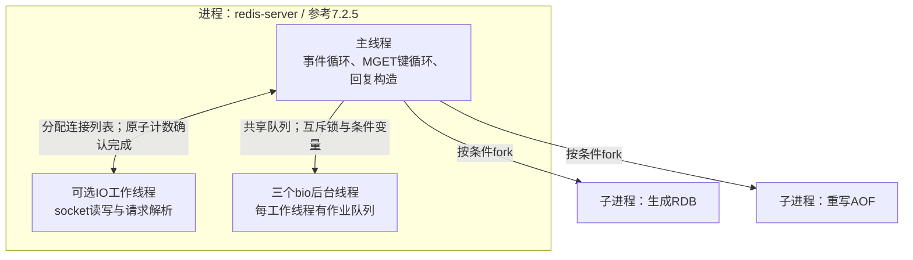
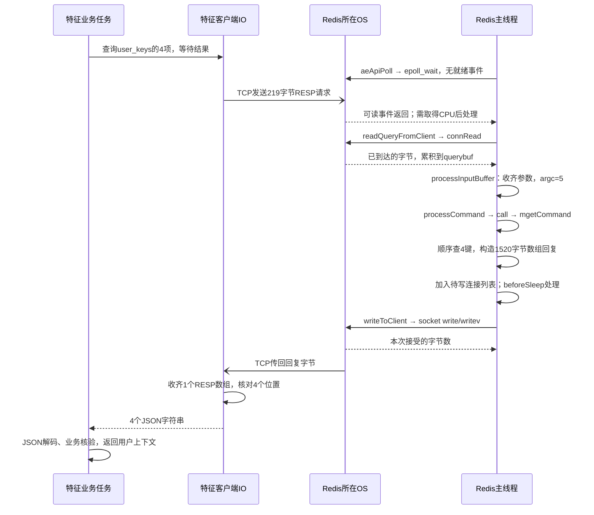
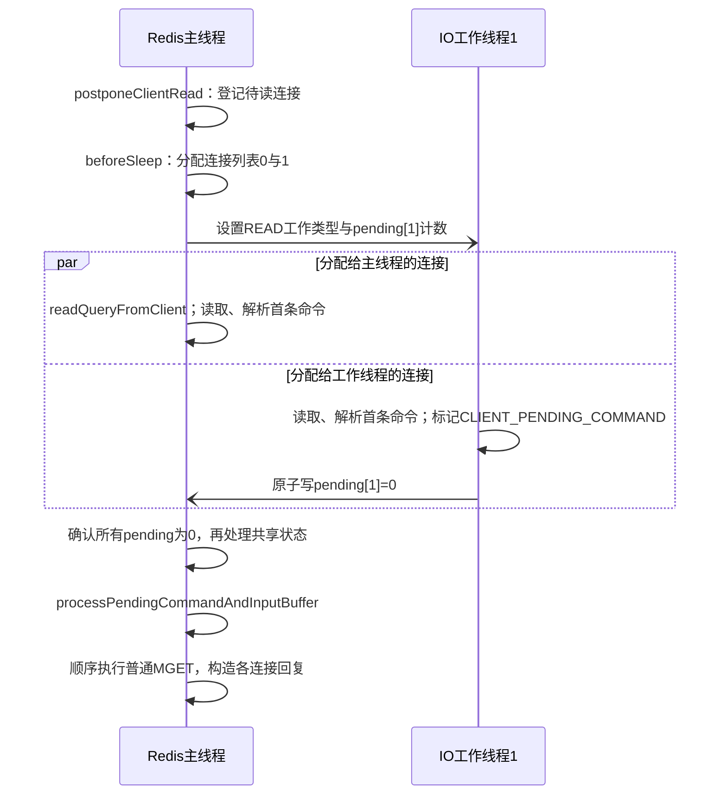

# Redis 特征查询：数据量、执行路径与操作系统负载

本章追踪用户 1 的一次推荐请求：**业务接口查什么，产生多少 Redis 命令和字节，这些工作由哪些线程、进程与操作系统资源完成。** 它补充[特征服务五视图](05_feature_data.md)，不重复[键值字典](10_feature_catalog.md)。这里只分析特征服务的 Redis；DataSystem 中的模型注意力状态不在此数据路径内。

以下严格区分三种依据：接口和数据格式是目标设计；字节量由[现有教学样例](assets/walkthrough_sample.json)计算；Redis 内部机制依据官方文档及固定版本源码。**没有运行推荐服务或测得吞吐、时延、CPU、内存峰值。** 下文瓶颈是根据执行机制推导的待验证因素。 Redis 版本、单实例/集群、持久化及 IO 线程配置尚未选定，不能据此声称已经部署了某种线程结构。

## 1. 一次推荐实际读取什么

### 1.1 四次业务查询，基础情形为四条 MGET

假设：发布清单已在特征服务装载；业务键为不可变 Redis String；使用单实例、长期连接、不拆批、无重试。这里不计连接初始化、鉴权、健康检查和管理查询。

| 顺序 | 调用方与特征接口 | Redis 键组 | 本例键数 | 返回的数据 |
|---|---|---|---:|---|
| 1 | PaiRec：`GetUserContext("1")` | `user/history/user_rep:dense/user_rep:sparse` | 4 | 用户属性、10 项历史、64 维用户向量、2 项兴趣词项 |
| 2 | PaiRec：`BatchGetItemRepresentations(raw_item_id)` | `item_rep` | 10 | 历史物品 `2,3,80936,781,111774,1230,26403,991,2362,1202` 的编码 |
| 3 | 生成服务：`BatchGetItemRepresentations(semantic_id)` | `sid_map` | 2 | 两个生成编码分别关联 `["4","1201"]`、`["9002"]` |
| 4 | PaiRec：`BatchGetItemFeatures` | `item` | 5 | `4,1201,9002,9001` 的属性；`9003` 缺失 |
| 合计 | PaiRec 3 次、生成服务 1 次 RPC | 4 个读取批次 | **21** | 20 个值、1 个缺失位置 |

这四批在同一请求中有数据依赖：第 2 批要先取得历史 ID，第 3 批要等生成模型输出，第 4 批要等三路候选合并。**不能把四批提前放进一个 pipeline**。不同推荐请求可以交错；向量、稀疏服务查询自身索引不增加这份 Redis 账单。当前 OneTrans 的 Provider、TSV 和参数查询也不计入。

```python
release = "demo_tenrec_v1"
prefix = "rec:qkv:" + release
user_keys = [
    prefix + ":user:1",
    prefix + ":history:1",
    prefix + ":user_rep:dense:demo_dssm_64_v1:1",
    prefix + ":user_rep:sparse:video_type_binary_v1:1",
]
# 每个列表对应一次基础批读；实际客户端使用参数数组，不拼接命令文本。
user_records = redis.mget(user_keys)
# 返回一个数组，位置0..3分别对应上述四个键，而不是四条独立命令回复。
```

### 1.2 样例字节量：计算口径先于数字

采用紧凑 UTF-8 JSON，即 `json.dumps(value, ensure_ascii=False, separators=(",", ":"))`，不加空白或压缩。Redis 协议按 RESP2 计算：命令是字符串数组，MGET 回复是一个包含各值的数组，缺失项为 `$-1\r\n`。这是应用协议字节，不含 TCP/IP、TLS、容器网络、重传及连接建立开销。[RESP 官方规范](https://redis.io/docs/latest/develop/reference/protocol-spec/)。

用户、历史和物品编码使用样例中的完整记录。反查值按数据字典补入发布头与编码版本。**候选样例只有接口所选字段，因此候选行仅按“发布头＋物品 ID＋样例字段”计算**；完整物品记录还有来源、有效计数和缺失计数等字段，实际从 Redis 读取会更大。即使 RPC 只请求 `category_code`，当前 String/JSON 存储仍须读回整个值，再由特征服务投影字段。

| 批次 | JSON 值字节合计 | MGET 请求字节 | RESP2 回复字节 | 数字的适用范围 |
|---|---:|---:|---:|---|
| 用户 4 键 | 1,484 | 219 | 1,520 | 对应本例完整用户记录 |
| 历史编码 10 键 | 1,327 | 561 | 1,412 | 对应本例完整编码记录 |
| 生成编码反查 2 键 | 278 | 136 | 298 | 按约定记录头重建的两个反查值 |
| 候选 5 键 | 1,632 | 206 | 1,673 | **字段投影下限**；含一个缺失回复 |
| 合计 | **4,721** | **1,122** | **4,903** | 按此样例投影至少 6,025 字节双向 RESP2 流量 |

例如 64 维向量若用 float32，仅数字需 256 字节；本例向量记录的 JSON 是 638 字节，包含十进制数字、字段名、用户、版本和历史摘要。因此不能用 `维度 × 4` 估算本方案的 Redis value。上述数字也不是 Redis 内存占用：键、对象、字典、分配器、缓冲区和碎片尚未计入。

完整计算代码见[样例字节计算器](assets/redis_workload_example.py)，逐键长度与总数见[计算结果](assets/redis_workload_example.json)。脚本直接读取同目录的 `walkthrough_sample.json`，构造上述四组键和值，再计算每段字节；不连接 Redis，不产生请求流量。在文档目录执行以下命令可独立复核已有结果：

```bash
python3 assets/redis_workload_example.py --check
```

核心编码规则如下：每个值带长度前缀，每个回复保留全部位置。完整脚本还显式构造候选字段投影，防止把下限误当成完整存储值。

```python
def bulk(data):
    return b"$" + str(len(data)).encode() + b"\r\n" + data + b"\r\n"

def array(elements):
    return b"*" + str(len(elements)).encode() + b"\r\n" + b"".join(elements)

# values是紧凑JSON的UTF-8字节；None表示键缺失。
reply = array([b"$-1\r\n" if v is None else bulk(v) for v in values])
```

实际装载格式确定后，应换成真实存储值再计算，不能把投影下限作为网络或内存容量保证。

## 2. 从业务批次到Redis命令

### 2.1 MGET 省掉什么，没有省掉什么

MGET 是一条命令读取多个 String。其文档复杂度为 `O(N)`，N 为键数；查找与回复构造仍逐项发生，传输和客户端 JSON 解码还随返回字节量增长。它减少命令往返及解析开销，不会把 10 个键变成一次键查找。[MGET 官方说明](https://redis.io/docs/latest/commands/mget/)、[Redis 7.2.5 的 mgetCommand](assets/source_snapshots/redis_7.2.5/src/t_string.c.html#L543)。

```text
一条 MGET key1 key2 key3
  -> 一个数组回复 [value1, nil, value3]

pipeline中的 GET key1、GET key2、GET key3
  -> 三条依次对应的命令回复 value1、nil、value3
```

当前旧客户端混淆这两种层次，见[回复解析证据](assets/source_snapshots/pairec_sh/pairec-demo/src/cpp/brpcClients/redis_client.cpp.html#L136)。新适配应先检查单条回复为数组，再按数组元素恢复输入位置。不能把缺失值压缩掉。

还有一个类型约束：**MGET 对不存在的键和非 String 的键都会返回 nil**。所以把 nil 解释为业务 `NOT_FOUND` 的前提，是装载与命名空间控制保证这些键只有 String；MGET 本身不能证明“键存在但类型错误”。发布验收应核对类型，疑似损坏时另行检查 `TYPE`，错误不能假装成正常缺失。JSON 内容错误则在 FeatureService 解码时明确失败。

### 2.2 Redis Cluster 不等于单实例多连接

开源 Redis Cluster 要求一条多键命令的键属于**同一哈希槽**；仅落在同一个主节点还不够。当前键名没有共同的 `{hash_tag}`，因此不能照搬“用户四键一条 MGET”到任意集群。跨槽请求需要客户端拆分，或另行设计经过评审的键布局。[Redis Cluster 规范](https://redis.io/docs/latest/operate/oss_and_stack/reference/cluster-spec/)。

| 部署和读取方式 | 正确的批读方法 | 对负载的影响 |
|---|---|---|
| 单实例 | 按条数、字节上限直接 MGET | 本例基础为 4 条命令 |
| Cluster，同槽键组 | 按槽组成 MGET，再路由到负责节点 | 一个业务 RPC 可能分成多条命令 |
| Cluster，散布于不同槽的键 | 按节点组织单键 GET 的 pipeline，或分别发送同槽 MGET | 命令数可能接近键数；节点间可并行，须恢复原顺序 |
| 扩容或迁移期间 | 客户端处理 `MOVED/ASK`，继续扣除原期限 | 路由更新和重试增加实际网络次数 |

把同一 release 的所有键强行放到一个 hash tag 会集中到一个槽，不能同时声称获得均匀分片。当前集群模式、键布局和集群客户端能力均未确定，应在选型后明确批次数，而非写死“四次 Redis 调用”。

Pipeline 是不逐条等待结果、连续发送多条命令的方式；它减少往返和系统调用机会，但不是事务，也不会自动提供跨槽 MGET。过深的 pipeline 会增加待处理请求与回复缓冲，仍要限制每批条数、字节和等待时间。[官方 pipeline 说明](https://redis.io/docs/latest/develop/using-commands/pipelining/)。

## 3. Redis 边界前：特征任务与连接额度

[特征服务进程视图](05_feature_data.md)已用五个候选展开输入、伪代码、等待和结果所有权。本章从客户端提交 Redis 命令处接续：**特征服务尚未实现，不能把目标的等待任务画成已经确定的 OS 线程结构。** 旧适配采用同步 CGO，原生调用线程保留到返回，Go 仍可调度其他任务；仅看 `CallMethod(..., done=NULL)` 不能推导协作挂起。目标 C++ 服务没有这条 Go/C 交接路径，等待方式须按最终客户端核实。

```text
一个业务任务的期限：接入时单调时钟 + remaining_timeout_ms
额度覆盖：排队 → 连接/在途额度 → 发送与收齐RESP → 归还额度
请求计算：校验与拼键在发送前；JSON解码、版本核对、投影在读回后
结果约束：每条回复归属原请求；任务仍在解码时，缓冲不得被连接复用覆盖
```

连接数不等于 OS 线程数，也不等于 Redis 命令执行并行度。同一连接是否允许多个在途命令，由客户端协议实现决定。多副本应合计 `副本数 × 每节点连接数` 和在途字节；仅扩大连接池可能把排队从客户端转移到 Redis。

超时取消可阻止未发出的任务；已经进入 Redis 的普通读命令不能靠调用方超时即时撤回。清单缓存、类型核验、Cluster 拆批和重试也影响命令数，实施后必须单独记录。基础四批账单只计第 1 节列明的操作。

## 4. Redis 内部执行：主线程、IO线程和后台进程

### 4.1 参考范围与执行单元

以下使用 **Redis Open Source 7.2.5、Linux、普通 TCP/RESP2、无 TLS** 的源码路径。这是机制参考，不是项目部署配置。图中 OS 线程由内核调度；当前 MGET 没有“每个键一个协程”的执行结构。

| 执行单元 | 工作及所持数据 | 启用条件 |
|---|---|---|
| 主线程 | 事件循环、普通命令查键与回复构造；持有数据库及每连接的解析状态 | `io-threads=1` 时也负责网络读写；一次 MGET 的键循环不交给其他命令线程 |
| 网络 IO 工作线程 | 分配给本线程的连接列表、socket 读写、可选请求解析 | `io-threads>1`；读还需 `io-threads-do-reads=yes`，实际使用取决于线程是否活跃 |
| `bio_close_file/bio_aof/bio_lazy_free` 三个后台线程 | 各类作业队列；执行关闭文件、AOF 同步、延迟释放 | 服务初始化建立，队列无任务时等待；不是每次 MGET 新建 |
| 持久化子进程 | fork 后生成 RDB 或重写 AOF | 满足配置或触发条件时创建；读请求不逐条派给子进程 |

图法：进程与线程结构示意图（非 UML）。双向边表示同进程任务交接；fork 边表示条件创建。



版本和配置应和结论一起记录。[7.2.5 配置](https://github.com/redis/redis/blob/7.2.5/redis.conf)区分写线程与可选读线程；[8.0.0 配置](https://github.com/redis/redis/blob/8.0.0/redis.conf)的 IO 配置描述已经变化。以下的等待循环和同步方法只依据 7.2.5，不能泛化成所有 Redis 版本的永久行为。下文源码链接指向随文归档的该版本官方文件，下载来源与许可见[证据清单](09_evidence_and_gaps.md)。

### 4.2 用户 1 的四键 MGET：处理、数据流和时序

继续第 1.1 节的 `user_keys`：这是用户属性、历史、64 维向量与兴趣词项的四个完整键。Redis 的 `client *c` 是**一条连接在服务端的状态对象**，不是用户 1 的用户记录；其中 `querybuf` 是已读入的请求字节，`argc/argv` 是解析后的命令参数，`buf/reply` 是待发送回复缓冲。长连接处理后续请求时会继续使用这个连接对象。

| 输入 | 处理 | 输出 |
|---|---|---|
| 219 字节 RESP2 请求 | 累积 TCP 字节；收齐数组及各参数才执行 | `argc=5`；`argv=["MGET", user_keys[0], user_keys[1], user_keys[2], user_keys[3]]` |
| 四个键及当前内存数据库 | `mgetCommand` 按输入次序逐键查找 String | 四个 JSON 值分别为 144、336、638、366 字节 |
| 四个值 | 构造一个 RESP2 数组回复并写入发送缓冲 | 总计 1,520 字节；数组四个位置均非 nil |
| 客户端收齐的数组 | 特征服务解码、核对版本与历史摘要 | `user/history/dense_query/sparse_query`，用户身份为 `"1"` |

这一步 Redis 不知道 `history_hash` 的业务含义，也不调用模型。完整业务输入输出见[用户查询请求](assets/request_example/02_user_context.request.json)和[响应](assets/request_example/02_user_context.response.json)。

图法：UML 时序图。展示 `io-threads=1`、连接已建立、主线程从空闲进入处理的成功路径。客户端 IO 属于特征进程；Redis 所在 OS 不暗示两进程同主机。TCP 传输为异步箭头；系统调用与返回为实线调用、虚线返回。



函数对应关系如下。它将网络、命令和数据库访问分开，便于从慢点反查代码；箭头只表示当前普通请求路径，未列所有错误或维护分支。

| 阶段 | 可核对的函数链 | 等待或计算发生在哪里 |
|---|---|---|
| 等待连接事件 | [`aeMain → aeProcessEvents → aeApiPoll`](assets/source_snapshots/redis_7.2.5/src/ae.c.html#L361) → [`epoll_wait`](assets/source_snapshots/redis_7.2.5/src/ae_epoll.c.html#L109) | 无事件且允许等待时主线程休眠；有事件不等于立即获得 CPU |
| 读取并解析 | [`connSocketEventHandler`](assets/source_snapshots/redis_7.2.5/src/socket.c.html#L257) → [`readQueryFromClient → processInputBuffer → processMultibulkBuffer`](assets/source_snapshots/redis_7.2.5/src/networking.c.html#L2520) | socket 字节进入 `querybuf`；不足一条命令时保留状态，等待后续可读事件 |
| 执行命令 | [`processCommandAndResetClient`](assets/source_snapshots/redis_7.2.5/src/networking.c.html#L2462) → [`processCommand → call`](assets/source_snapshots/redis_7.2.5/src/server.c.html#L3833) → [`mgetCommand`](assets/source_snapshots/redis_7.2.5/src/t_string.c.html#L543) | 主线程验证命令并执行键循环；不会每查一个键就切换一个工作线程 |
| 查找并构造回复 | [`lookupKeyRead → lookupKeyReadWithFlags → lookupKey → dictFind`](assets/source_snapshots/redis_7.2.5/src/db.c.html#L88)；[`addReplyBulk/addReplyNull`](assets/source_snapshots/redis_7.2.5/src/networking.c.html#L1008) | 内存字典查找、命中统计、输出缓冲构造；无逐键文件读取 |
| 发送回复 | [`beforeSleep`](assets/source_snapshots/redis_7.2.5/src/server.c.html#L1625) → [`handleClientsWithPendingWrites → writeToClient`](assets/source_snapshots/redis_7.2.5/src/networking.c.html#L2023) → [`connSocketWrite/Writev`](assets/source_snapshots/redis_7.2.5/src/socket.c.html#L154) | 先尝试非阻塞发送；剩余未发完则安装可写事件，回调 `sendReplyToClient` 继续 |

图中的 219/1,520 字节不是“一次 read 加一次 write”的承诺：TCP 可拆包，也可合并多个命令。`EAGAIN` 表示本次暂时无法继续 IO；Redis 留下尚未完成的缓冲，等待后续事件，不同步等待慢客户端把全部数据收走。Redis 对 socket 的成功写入仅表示内核接受这些字节，不代表特征服务已经完成解码。

MGET 的主执行逻辑可概括为以下伪代码，`keys` 就是本批输入键列表；JSON 在这里仍是字节字符串：

```python
reply_elements = []
for key in keys:
    value = lookup_in_memory_database(key)  # 对应lookupKeyRead，含失效与统计处理
    if value is None or value.redis_type != "String":
        reply_elements.append(RESP_NULL)
    else:
        reply_elements.append(resp_bulk(value.bytes))
append_to_client_output(resp_array(reply_elements))
```

此处 `RESP_NULL/resp_bulk/resp_array` 分别表示协议空值、带长度字符串、数组编码，不是 Redis 源码中的 Python API。候选五键同理，第五个位置为 nil；不是删去 `9003` 后回四项。本方案不设逐键 TTL，但 Redis 通用查找仍含过期检查；读命令还会更新命中统计及按条件更新访问元数据，不能简单理解为进程内没有任何内存写操作。

### 4.3 开启网络 IO 线程后：并行的是哪一段

7.2.5 用线程私有连接列表分配一批 IO 工作，主线程也处理其中一份。`io-threads=N` 中的 N 包含主线程，额外创建 N−1 个 IO 工作线程。每个列表只由本轮分配到的线程处理；完成计数归零前，主线程不进入该批共享客户端状态的后处理。[初始化与 IOThreadMain](assets/source_snapshots/redis_7.2.5/src/networking.c.html#L4173)。

以两个连接都可读、读线程已启用且处于活跃状态为例。`pending[i]` 在图中简写官方 `io_threads_pending[i]` 原子计数，不是网络请求总量。



这里的异步箭头表示**同进程共享内存中的工作交接**，不是 socket 或 RPC。线程化读取最多先解析出一条待执行命令，设置 `CLIENT_PENDING_COMMAND`；主线程汇合后才执行，并继续处理缓冲中的后续命令。[读取交接](assets/source_snapshots/redis_7.2.5/src/networking.c.html#L4443)、[解析时的执行限制](assets/source_snapshots/redis_7.2.5/src/networking.c.html#L2559)。

```text
IOThreadMain：轮询本线程pending计数；有工作则处理自己的连接列表，结束时写0
主线程汇合：循环读取所有工作线程pending，直到全部为0
停用IO线程：主线程持有对应mutex；工作线程进入mutex等待
重新启用：主线程解锁，工作线程获得继续执行的机会
```

上述循环来自 [IOThreadMain/startThreadedIO/stopThreadedIO](assets/source_snapshots/redis_7.2.5/src/networking.c.html#L4173) 和[写线程分发/汇合](assets/source_snapshots/redis_7.2.5/src/networking.c.html#L4318)。**活跃 IO 线程与主线程汇合包含忙等，即反复读取状态并消耗 CPU；不是统一使用条件变量睡眠。** 待处理连接少时实现会停用多 IO 线程。若工作线程被 OS 延迟调度，主线程等待汇合也可能变慢；增加线程数不保证降低时延，更不会使本例四个键的数据库查找同时执行。

### 4.4 后台任务：条件变量在哪里使用

后台 `bio` 和网络 IO 线程是两套机制。7.2.5 为关闭文件、AOF 同步、延迟释放分配后台工作线程及队列；AOF fsync 与关闭 AOF 共用 `bio_aof`。一次普通 MGET 不会直接创建这些作业。[队列映射](assets/source_snapshots/redis_7.2.5/src/bio.c.html#L66)。

下面按源代码顺序写出同步点。`queue` 是选中工作线程的作业队列，`mutex` 是保护队列的互斥锁，`condition` 是等待/通知使用的条件变量；`job` 是一项文件或释放任务。

```text
投递方 bioSubmitJob：
  lock(mutex) → queue.append(job) → 更新计数 → cond_signal(condition) → unlock(mutex)

工作线程 bioProcessBackgroundJobs：
  lock(mutex)
  队列空：cond_wait(condition, mutex)  # 等待时释放mutex，返回前重新取得它
  队列非空：取得队首job → unlock(mutex)
  执行close/fsync/free                # 耗时工作不在队列锁内
  lock(mutex) → 删除完成job → 减计数 → 通知等待方 → 继续检查队列
```

依据：[投递](assets/source_snapshots/redis_7.2.5/src/bio.c.html#L152)、[等待与处理](assets/source_snapshots/redis_7.2.5/src/bio.c.html#L211)。条件通知让等待者有机会继续，不保证马上取得 CPU，也不表示 fsync 已完成。后台 fsync 可能等待存储 IO，延迟释放仍消耗 CPU；共享队列锁与内核调度是不同的等待来源。

通信边界至此可明确：FeatureService ↔ Redis 用 TCP/RESP 进行进程间通信；Redis 内部的 IO 列表、原子计数、mutex 和条件变量是线程同步，没有额外网络跳转。持久化 fork 产生的子进程有独立执行上下文与写时复制内存，不承担本例的业务 RPC；其文件 IO 对在线请求的影响见下一节。

## 5. CPU、内存、网络和磁盘分别承受什么

### 5.1 在线读请求的主要资源

| 资源 | 本例工作与潜在瓶颈 | 应核对的证据 |
|---|---|---|
| FeatureService CPU | 21 个键的构造、协议处理；20 条 JSON 的解码、历史摘要与版本核对；业务响应编码 | 进程 CPU、请求分段耗时、解码耗时与返回字节；不能全归因于 Redis |
| Redis 主线程 CPU | 批命令解析、键哈希查找、数组回复；与其他请求及维护命令竞争 | 各线程 CPU、命令执行时间、排队时延；主线程饱和时多开连接不能并行化同实例键查找 |
| IO 与内核 CPU | socket 读写、协议处理、网络收发、必要时加解密 | Redis IO 线程配置、系统态 CPU、网络吞吐和重传；TLS 是否启用需另行确认 |
| 调度 | 可运行线程竞争 CPU；线程化 IO 汇合还要等其他线程完成，容器达到配额后可能被节流 | CPU 配额、节流时间、运行队列和上下文切换；平均 CPU 不高也可能有调度等待 |
| 内存 | 常驻键值、对象与分配器；输入/输出缓冲；特征进程中的解码对象；发布切换时两版共存 | `used_memory`、RSS、内存配额、缓冲字节、逐记录大小分布；不拿 JSON 字节直接当 RSS |
| 网络 | 基础投影每请求至少 1,122 字节入 Redis、4,903 字节出 Redis | 分请求字节和实例网络量，另计协议外开销、重试及装载；包数需实际观测 |

容量需要全量数据分布。本方案每个完整 release 的业务键数可写为：

```text
keys_per_release = 4 * U + I + I_sid + S + 1
U     = 用户数（每用户：属性、历史、向量、兴趣词项）
I     = 物品目录数，含目标物品与仅在历史出现的物品
I_sid = 有物品语义编码记录的物品数
S     = 不重复语义编码数，即反向关联键数
1     = 本release发布清单；其他管理键另计
```

值大小按真实向量维度、历史长度、统计字段和 SID 一对多数量分布计算，再加键与 Redis 管理开销。双版本切换、恢复、持久化子进程和缓冲峰值需要额外余量。[Redis 内存说明](https://redis.io/docs/latest/operate/oss_and_stack/management/optimization/memory-optimization/)。若内存压力导致换页，读请求可能发生缺页和磁盘等待；这不是 MGET 正常为每个键读取磁盘。

### 5.2 离线装载和持久化何时产生磁盘 IO

正常 MGET 读内存，不逐请求扫描 Tenrec 文件或读取 RDB。磁盘压力主要来自装载输入、持久化、恢复及操作系统内存压力。持久化尚未选定，以下是机制条件，不是当前部署配置。

| 条件 | CPU、内存与磁盘行为 | 对在线查询的影响 |
|---|---|---|
| 离线装载新 release | 读取快照并发送写命令；Redis 分配新对象；是否记录 AOF 由配置决定 | 与读请求争用命令执行、内存及网络；应单独统计装载速率 |
| BGSAVE | 主进程 fork，子进程遍历内存并生成 RDB | fork 的页表工作会暂停主执行一段时间；子进程争用 CPU/磁盘 |
| fork 后主进程修改内存页 | 写时复制（COW）：被修改的共享页产生额外物理副本 | 新版本装载与快照重叠可能增加内存峰值；不是 fork 立即完整复制所有数据 |
| AOF 追加与同步 | 写命令形成日志；`always/everysec/no` 改变同步时机，`everysec` 可使用后台 fsync | fsync 和共享磁盘拥塞仍可能影响主线程；MGET 本身不新增业务写日志 |
| AOF 重写 | 后台子进程生成压缩后的持久化表示；实现随版本变化 | CPU、COW 内存与磁盘流量叠加，需要与正常追加区分 |
| 恢复或快照重载 | 读取持久数据、解析并重建内存记录 | READY 前完成恢复核对；不可把未恢复的键误报为正常冷启动 |

机制依据：[Redis 持久化](https://redis.io/docs/latest/operate/oss_and_stack/management/persistence/)。`no` 指不由 Redis 主动按 AOF 策略 fsync，不表示没有日志写入或磁盘 IO。采用只读快照业务也不意味着没有恢复成本或后台任务。

旧版本回收同样是写操作。超大 `DEL` 会占用主执行时间；可按受控扫描与批次回收，需要时使用 `UNLINK` 将对象释放交给后台，但后台释放仍消耗 CPU 和内存带宽。不能把“异步”解释为“没有成本”。[UNLINK 官方说明](https://redis.io/docs/latest/commands/unlink/)。

## 6. 高并发：请求如何交错，工作积压在哪里

同一推荐请求的四批有数据依赖，不同请求之间可以交错；完成请求甲的用户四键后，Redis 可以先执行请求乙的候选五键，再处理甲后续的历史编码。这是可发生的顺序，不是调度或公平性保证。图中的连接甲只是可能复用同一连接的例子；目标连接池不保证同一用户或请求始终绑定同一连接。

```text
连接甲：MGET 用户1的4键 ──等待PaiRec与模型的后续处理── MGET 用户1的历史编码10键
连接乙：       MGET 另一请求的候选5键
主线程：       命令甲1 → 命令乙1 → 后续就绪命令
每条普通MGET：本条键循环完成后，才可能执行另一条普通命令
```

OS 可以抢占 Redis 主线程去运行别的进程；这不会让另一个 Redis IO 线程接替执行本条 MGET 的数据库循环。过大的批次会延长其他命令的等待。反过来，把批次拆成大量小命令又会增加协议、路由与调度成本，需要同时测条数和字节，不能只设一个很大的 `top_k` 上限。

| 积压位置 | 保存了什么；如何继续 | 负载与控制责任 |
|---|---|---|
| 特征入口/连接额度队列 | 尚未发送的业务任务，等额度或期限到达 | FeatureService 限入口并发、排队长度和期限；不能把所有任务无限挂起留在内存 |
| 客户端发送缓冲、TCP 缓冲 | 已编码命令或尚未被 Redis 读出的字节 | 客户端限制在途条数与字节、复用连接；OS 提供 TCP 流控，但不了解推荐请求是否已过期 |
| Redis `querybuf` 与待读列表 | 收到但未解析/执行的字节，或待 IO 处理的连接 | Redis 主执行时间、IO 线程与调度共同影响消耗速度；连接更多不等于查键更快 |
| Redis `buf/reply` 与发送缓冲 | 已生成但未传完的回复 | 慢调用方使输出缓冲增长；核对实际缓冲限制，客户端持续收取并限制深 pipeline |
| 特征回复缓冲与解码任务 | 收齐的 JSON 及待投影的记录 | 特征服务 CPU 或内存受限时也会积压；读回后应及时解码/释放，不长期占住连接额度 |
| IO 线程汇合、后台队列 | 一轮 IO 尚未完成，或持久化/释放作业待处理 | IO 忙等消耗 CPU，后台队列有自己的同步；核对线程 CPU、容器节流与磁盘等待 |

Redis 7.2.5 对输入大小和客户端输出缓冲有检查，但阈值/启用条件依配置；它们不能代替业务入口限流。[输入缓冲检查](assets/source_snapshots/redis_7.2.5/src/networking.c.html#L2700)、[输出缓冲检查](assets/source_snapshots/redis_7.2.5/src/networking.c.html#L3848)。客户端超时后的重试还可能与原命令叠加，应使用同一期限和受限重试次数。

仅在第 1 节基础假设下，令推荐请求速率为 `Q`（请求/秒）：

```text
feature_rpc_per_second = 4 * Q
redis_commands_per_second = 4 * Q
redis_key_lookups_per_second = 21 * Q
redis_request_bytes_per_second = 1122 * Q
redis_reply_bytes_per_second >= 4903 * Q  # 完整物品值比样例投影更大
```

例如 `Q=1000` 只是算术演示，得到 4,000 条基础命令/秒、21,000 个键查找/秒，应用协议请求约 1.122 MB/s、回复至少 4.903 MB/s。**这不是吞吐验收或容量建议。** 真实历史长度、候选上限、编码碰撞、批次拆分、命中率和重试都会改变系数。

## 7. 验证瓶颈时记录什么

| 要回答的问题 | 最少记录什么 | 不能据此直接推出什么 |
|---|---|---|
| 请求慢在特征服务还是 Redis | 业务 RPC 总时延、入口/连接等待、Redis 批时延、解码耗时 | Redis 命令时间短不代表整个 RPC 快 |
| 一次业务调用到底查了多少 | `request_id`、方法、逻辑键数、去重键数、实际命令/节点/重试、请求和回复字节 | 四次业务 RPC 不必然等于四条 Redis 命令 |
| 是主执行线程还是网络受限 | 各线程 CPU、命令统计、网络量、回复缓冲及实际字节分布 | 多核总 CPU 低不代表主执行线程有余量 |
| 是否受持久化和调度干扰 | 持久化事件、fork/COW 信息、磁盘时延、容器 CPU 节流、RSS 与缺页 | 慢请求不能只靠增大超时解决原因 |
| 分片是否有效 | 各节点请求、键和字节分布，路由重试及热点键 | 节点数增加不保证流量均匀 |

Redis `INFO` 的 `commandstats/stats/clients/memory/persistence/cpu`，配合逐线程与容器指标，提供互补证据；实际可用字段依版本核对。`SLOWLOG` 主要记录命令执行，不包含全部客户端网络与特征 JSON 解码时间。[SLOWLOG 官方说明](https://redis.io/docs/latest/commands/slowlog/)、[官方时延诊断](https://redis.io/docs/latest/operate/oss_and_stack/management/optimization/latency/)。不把高频 `MONITOR` 放进正常推荐路径。

首期验收应先固定版本、拓扑、持久化、客户端和批次限制，读取一份真实发布的记录大小分布，再以正常推荐流量与离线装载分别观察。入口排队、连接等待、网络、命令执行和解码属于不同成本；先确定主因，再调整副本、连接、批次或存储部署。测量程序保持在系统外，不向业务服务引入压力模拟逻辑。
