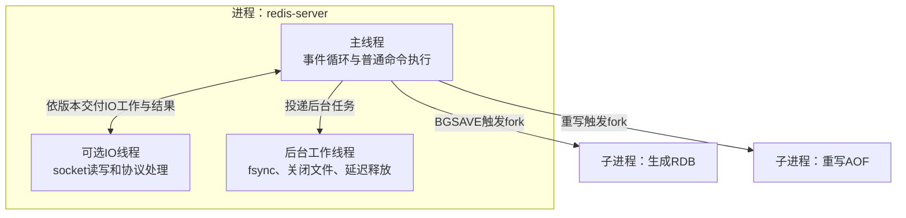
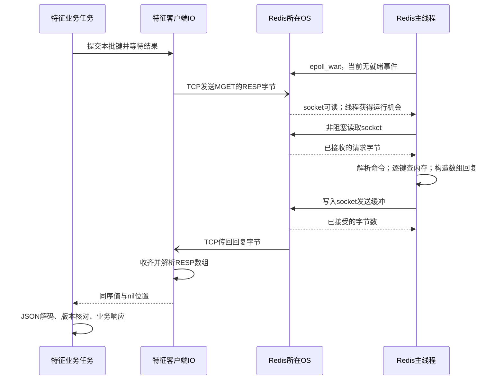

# Redis 特征查询：数据量、执行路径与操作系统负载

本章追踪用户 1 的一次推荐请求：**业务接口查什么，产生多少 Redis 命令和字节，这些工作由哪些线程、进程与操作系统资源完成。** 它补充[特征服务五视图](05_feature_data.md)，不重复[键值字典](10_feature_catalog.md)。这里只分析特征服务的 Redis；DataSystem 中的模型注意力状态不在此数据路径内。

以下严格区分三种依据：接口和数据格式是目标设计；字节量由[现有教学样例](assets/walkthrough_sample.json)计算；Redis 内部机制依据官方文档及固定版本源码。**没有运行推荐服务或测得吞吐、时延、CPU、内存峰值。** Redis 版本、单实例/集群、持久化及 IO 线程配置尚未选定，不能据此声称已经部署了某种线程结构。

## 1. 一次推荐实际读取什么

### 1.1 四次业务查询，基础情形为四条 MGET

假设：发布清单已在特征服务装载；业务键为不可变 Redis String；使用单实例、长期连接、不拆批、无重试。这里不计连接初始化、鉴权、健康检查和管理查询。

| 顺序 | 调用方与特征接口 | Redis 键组 | 本例键数 | 返回的数据 |
|---|---|---|---:|---|
| 1 | PaiRec：`GetUserContext("1")` | `user/history/user_rep:dense/user_rep:sparse` | 4 | 用户属性、10 项历史、64 维用户向量、2 项兴趣词项 |
| 2 | PaiRec：`BatchGetItemRepresentations(raw_item_id)` | `item_rep` | 10 | 历史物品 `2,3,80936,781,111774,1230,26403,991,2362,1202` 的编码 |
| 3 | 生成服务：`BatchGetItemRepresentations(semantic_id)` | `sid_map` | 2 | 两个生成编码分别关联 `["4","1201"]`、`["9002"]` |
| 4 | PaiRec：`BatchGetItemFeatures` | `item` | 5 | `4,1201,9002,9001` 的属性；`9003` 缺失 |
| 合计 | PaiRec 3 次、生成服务 1 次 RPC | 4 个读取批次 | **21** | 20 个值、1 个缺失位置 |

这四批在同一请求中有数据依赖：第 2 批要先取得历史 ID，第 3 批要等生成模型输出，第 4 批要等三路候选合并。**不能把四批提前放进一个 pipeline**。不同推荐请求可以交错；向量、稀疏服务查询自身索引不增加这份 Redis 账单。当前 OneTrans 的 Provider、TSV 和参数查询也不计入。

```python
release = "demo_tenrec_v1"
prefix = "rec:qkv:" + release
user_keys = [
    prefix + ":user:1",
    prefix + ":history:1",
    prefix + ":user_rep:dense:demo_dssm_64_v1:1",
    prefix + ":user_rep:sparse:video_type_binary_v1:1",
]
# 每个列表对应一次基础批读；实际客户端使用参数数组，不拼接命令文本。
user_records = redis.mget(user_keys)
# 返回一个数组，位置0..3分别对应上述四个键，而不是四条独立命令回复。
```

### 1.2 样例字节量：计算口径先于数字

采用紧凑 UTF-8 JSON，即 `json.dumps(value, ensure_ascii=False, separators=(",", ":"))`，不加空白或压缩。Redis 协议按 RESP2 计算：命令是字符串数组，MGET 回复是一个包含各值的数组，缺失项为 `$-1\r\n`。这是应用协议字节，不含 TCP/IP、TLS、容器网络、重传及连接建立开销。[RESP 官方规范](https://redis.io/docs/latest/develop/reference/protocol-spec/)。

用户、历史和物品编码使用样例中的完整记录。反查值按数据字典补入发布头与编码版本。**候选样例只有接口所选字段，因此候选行仅按“发布头＋物品 ID＋样例字段”计算**；完整物品记录还有来源、有效计数和缺失计数等字段，实际从 Redis 读取会更大。即使 RPC 只请求 `category_code`，当前 String/JSON 存储仍须读回整个值，再由特征服务投影字段。

| 批次 | JSON 值字节合计 | MGET 请求字节 | RESP2 回复字节 | 数字的适用范围 |
|---|---:|---:|---:|---|
| 用户 4 键 | 1,484 | 219 | 1,520 | 对应本例完整用户记录 |
| 历史编码 10 键 | 1,327 | 561 | 1,412 | 对应本例完整编码记录 |
| 生成编码反查 2 键 | 278 | 136 | 298 | 按约定记录头重建的两个反查值 |
| 候选 5 键 | 1,632 | 206 | 1,673 | **字段投影下限**；含一个缺失回复 |
| 合计 | **4,721** | **1,122** | **4,903** | 按此样例投影至少 6,025 字节双向 RESP2 流量 |

例如 64 维向量若用 float32，仅数字需 256 字节；本例向量记录的 JSON 是 638 字节，包含十进制数字、字段名、用户、版本和历史摘要。因此不能用 `维度 × 4` 估算本方案的 Redis value。上述数字也不是 Redis 内存占用：键、对象、字典、分配器、缓冲区和碎片尚未计入。

完整计算代码见[样例字节计算器](assets/redis_workload_example.py)，逐键长度与总数见[计算结果](assets/redis_workload_example.json)。脚本直接读取同目录的 `walkthrough_sample.json`，构造上述四组键和值，再计算每段字节；不连接 Redis，不产生请求流量。在文档目录执行以下命令可独立复核已有结果：

```bash
python3 assets/redis_workload_example.py --check
```

核心编码规则如下：每个值带长度前缀，每个回复保留全部位置。完整脚本还显式构造候选字段投影，防止把下限误当成完整存储值。

```python
def bulk(data):
    return b"$" + str(len(data)).encode() + b"\r\n" + data + b"\r\n"

def array(elements):
    return b"*" + str(len(elements)).encode() + b"\r\n" + b"".join(elements)

# values是紧凑JSON的UTF-8字节；None表示键缺失。
reply = array([b"$-1\r\n" if v is None else bulk(v) for v in values])
```

实际装载格式确定后，应换成真实存储值再计算，不能把投影下限作为网络或内存容量保证。

## 2. 从业务批次到Redis命令

### 2.1 MGET 省掉什么，没有省掉什么

MGET 是一条命令读取多个 String。其文档复杂度为 `O(N)`，N 为键数；查找与回复构造仍逐项发生，传输和客户端 JSON 解码还随返回字节量增长。它减少命令往返及解析开销，不会把 10 个键变成一次键查找。[MGET 官方说明](https://redis.io/docs/latest/commands/mget/)、[Redis 7.2.5 的 mgetCommand](https://github.com/redis/redis/blob/7.2.5/src/t_string.c#L510)。

```text
一条 MGET key1 key2 key3
  -> 一个数组回复 [value1, nil, value3]

pipeline中的 GET key1、GET key2、GET key3
  -> 三条依次对应的命令回复 value1、nil、value3
```

当前旧客户端混淆这两种层次，见[回复解析证据](assets/source_snapshots/pairec_sh/pairec-demo/src/cpp/brpcClients/redis_client.cpp.html#L136)。新适配应先检查单条回复为数组，再按数组元素恢复输入位置。不能把缺失值压缩掉。

还有一个类型约束：**MGET 对不存在的键和非 String 的键都会返回 nil**。所以把 nil 解释为业务 `NOT_FOUND` 的前提，是装载与命名空间控制保证这些键只有 String；MGET 本身不能证明“键存在但类型错误”。发布验收应核对类型，疑似损坏时另行检查 `TYPE`，错误不能假装成正常缺失。JSON 内容错误则在 FeatureService 解码时明确失败。

### 2.2 Redis Cluster 不等于单实例多连接

开源 Redis Cluster 要求一条多键命令的键属于**同一哈希槽**；仅落在同一个主节点还不够。当前键名没有共同的 `{hash_tag}`，因此不能照搬“用户四键一条 MGET”到任意集群。跨槽请求需要客户端拆分，或另行设计经过评审的键布局。[Redis Cluster 规范](https://redis.io/docs/latest/operate/oss_and_stack/reference/cluster-spec/)。

| 部署和读取方式 | 正确的批读方法 | 对负载的影响 |
|---|---|---|
| 单实例 | 按条数、字节上限直接 MGET | 本例基础为 4 条命令 |
| Cluster，同槽键组 | 按槽组成 MGET，再路由到负责节点 | 一个业务 RPC 可能分成多条命令 |
| Cluster，散布于不同槽的键 | 按节点组织单键 GET 的 pipeline，或分别发送同槽 MGET | 命令数可能接近键数；节点间可并行，须恢复原顺序 |
| 扩容或迁移期间 | 客户端处理 `MOVED/ASK`，继续扣除原期限 | 路由更新和重试增加实际网络次数 |

把同一 release 的所有键强行放到一个 hash tag 会集中到一个槽，不能同时声称获得均匀分片。当前集群模式、键布局和集群客户端能力均未确定，应在选型后明确批次数，而非写死“四次 Redis 调用”。

Pipeline 是不逐条等待结果、连续发送多条命令的方式；它减少往返和系统调用机会，但不是事务，也不会自动提供跨槽 MGET。过深的 pipeline 会增加待处理请求与回复缓冲，仍要限制每批条数、字节和等待时间。[官方 pipeline 说明](https://redis.io/docs/latest/develop/using-commands/pipelining/)。

## 3. 特征服务的连接、等待与处理成本

以下是目标实现约束，具体线程池和客户端尚未完成：多个业务任务共享长期 Redis 连接，限制等待队列与在途批次；批次完成 RESP 读取后及时释放连接，JSON 解码、版本验证和字段投影在服务进程完成。

```text
接入业务RPC
  -> 检查版本、期限与数量
  -> 生成键、去重、按路由和字节上限分批
  -> 等待连接额度
  -> 发送RESP，等待该批完整回复
  -> 恢复原位置，解码JSON，核对版本和history_hash
  -> 投影业务字段，返回业务RPC
```

| 等待或计算 | 谁承担 | 为什么需要单独记录 |
|---|---|---|
| 入口排队、并发额度等待 | FeatureService | 服务过载时可能尚未访问 Redis 就超时 |
| 连接额度等待 | 客户端/连接池 | 连接不足或慢回复会占住在途额度 |
| RESP 编码与解析 | Redis 客户端和 Redis | 返回值大小影响复制、缓冲和协议处理 |
| 键查找与数组回复构造 | Redis 命令执行路径 | 与键数、值大小和同实例其他命令有关 |
| JSON 解码、校验、字段投影 | FeatureService | Redis 将 JSON 当普通字符串，不理解其业务字段 |
| 响应编码与 bRPC 返回 | FeatureService | 与所选业务字段和调用方读取速度有关 |

连接池不能按“一请求一连接”无限扩张；也不能把客户端连接数当成 Redis 的执行线程数。是否允许同一连接有多个在途请求，由客户端协议实现决定。增加特征副本时，要同时计算“副本数 × 每节点连接数”及总在途字节，而不是只看单副本配置。

`remaining_timeout_ms` 覆盖本次业务调用的剩余期限，排队、连接等待和重试都继续消耗它。超时取消能够阻止未发出的任务；已经进入 Redis 的普通读命令未必能被客户端即时撤回。不能因为调用方超时，就从负载统计中扣掉已经发出的命令。

发布清单可按已批准事件刷新进程内只读快照，不必每次查管理键。若实现决定逐请求查询清单、追加类型检查、重试或拆批，它们都必须作为新增命令计数，不应隐藏在上述四批账单中。

## 4. Redis 内部执行：主线程、IO线程和后台进程

### 4.1 先固定版本再解释线程

本章用 **Redis Open Source 7.2.5 的 Linux 实现**解释普通 String/MGET 的执行路径；这是机制参考版本，不是项目部署选择。网络 IO 可用线程和普通命令执行是否并行是两个问题，不能用“Redis 永远只有一个线程”概括。

| 执行单元 | 本章参考实现的工作 | 版本或配置条件 |
|---|---|---|
| 主事件循环/命令执行线程 | 处理可执行命令、查键、构造回复，并执行维护工作 | 7.2.5 普通 MGET 的键循环在主执行路径；慢批次会延后其他命令 |
| 可选网络 IO 线程 | socket 读写及部分协议解析 | 7.2.5 的 `io-threads>1` 可分担写，读还取决于 `io-threads-do-reads`；默认不启用多 IO 线程 |
| 后台工作线程 | 按任务类型处理文件关闭、AOF fsync、延迟释放对象 | 有任务时工作，无任务时等待；不是每条读请求新建线程 |
| 后台持久化子进程 | BGSAVE 或 AOF 重写 | 满足配置或触发条件时 fork；不是常驻的“每请求写盘线程” |

7.2.5 网络路径将线程化读取完成的命令交回主执行路径处理，见 [networking.c](https://github.com/redis/redis/blob/7.2.5/src/networking.c#L4124)。后台任务的线程与队列见 [bio.c](https://github.com/redis/redis/blob/7.2.5/src/bio.c#L70)。

版本差异已有具体例子：[7.2.5 配置](https://github.com/redis/redis/blob/7.2.5/redis.conf#L1194)区分写线程与可选读线程；[8.0.0 配置](https://github.com/redis/redis/blob/8.0.0/redis.conf#L1215)说明启用 IO 线程后涵盖读、写和协议解析。不能把某一版本的开关、线程等待方式或 TLS 限制套到所有版本。部署时须记录实际 `redis_version` 与生效配置。

图法：进程与线程关系示意图（非 UML）。包含关系区分进程和线程；箭头表示任务交付或按条件创建，不是业务步骤顺序。



### 4.2 一次 MGET 怎样经过操作系统

图法：UML 时序图。展示参考配置 `io-threads=1`、连接已建立、Redis 空闲后接到一次读命令的路径。客户端 IO 是特征服务内部组件；“Redis 所在 OS”是内核执行者，不表示两个容器在同一主机。TCP 消息用异步箭头，系统调用及业务等待用同步箭头。



这是可读的成功轨迹，不是一条命令固定产生一次 `read/write` 的承诺。TCP 可拆包或合并多个命令；部分读写需继续处理。发送缓冲不足时可能返回 `EAGAIN`，Redis 等待可写事件后续发；不会为了这一个慢客户端同步等待整个网络传输完成。[Redis 网络实现](https://github.com/redis/redis/blob/7.2.5/src/networking.c)、[Linux epoll 适配](https://github.com/redis/redis/blob/7.2.5/src/ae_epoll.c#L99)。

“就绪”也不等于立刻取得 CPU：内核将可运行线程安排到 CPU，仍受其他任务和容器配额影响。无事件时 `epoll_wait` 可休眠；有持续工作时事件循环继续处理。后台队列没有任务时则可在条件变量等待，被投递任务唤醒，见 [bioProcessBackgroundJobs](https://github.com/redis/redis/blob/7.2.5/src/bio.c#L190)。这些等待机制不能简单换算成“每个 MGET 一次上下文切换”。

## 5. CPU、内存、网络和磁盘分别承受什么

### 5.1 在线读请求的主要资源

| 资源 | 本例工作与潜在瓶颈 | 应核对的证据 |
|---|---|---|
| FeatureService CPU | 21 个键的构造、协议处理；20 条 JSON 的解码、历史摘要与版本核对；业务响应编码 | 进程 CPU、请求分段耗时、解码耗时与返回字节；不能全归因于 Redis |
| Redis 主线程 CPU | 批命令解析、键哈希查找、数组回复；与其他请求及维护命令竞争 | 各线程 CPU、命令执行时间、排队时延；主线程饱和时多开连接不能并行化同实例键查找 |
| IO 与内核 CPU | socket 读写、协议处理、网络收发、必要时加解密 | Redis IO 线程配置、系统态 CPU、网络吞吐和重传；TLS 是否启用需另行确认 |
| 调度 | 可运行线程竞争 CPU，容器达到配额后可能被节流 | CPU 配额、节流时间、运行队列和上下文切换；平均 CPU 不高也可能有调度等待 |
| 内存 | 常驻键值、对象与分配器；输入/输出缓冲；特征进程中的解码对象；发布切换时两版共存 | `used_memory`、RSS、内存配额、缓冲字节、逐记录大小分布；不拿 JSON 字节直接当 RSS |
| 网络 | 基础投影每请求至少 1,122 字节入 Redis、4,903 字节出 Redis | 分请求字节和实例网络量，另计协议外开销、重试及装载；包数需实际观测 |

容量需要全量数据分布。本方案每个完整 release 的业务键数可写为：

```text
keys_per_release = 4 * U + I + I_sid + S + 1
U     = 用户数（每用户：属性、历史、向量、兴趣词项）
I     = 物品目录数，含目标物品与仅在历史出现的物品
I_sid = 有物品语义编码记录的物品数
S     = 不重复语义编码数，即反向关联键数
1     = 本release发布清单；其他管理键另计
```

值大小按真实向量维度、历史长度、统计字段和 SID 一对多数量分布计算，再加键与 Redis 管理开销。双版本切换、恢复、持久化子进程和缓冲峰值需要额外余量。[Redis 内存说明](https://redis.io/docs/latest/operate/oss_and_stack/management/optimization/memory-optimization/)。若内存压力导致换页，读请求可能发生缺页和磁盘等待；这不是 MGET 正常为每个键读取磁盘。

### 5.2 离线装载和持久化何时产生磁盘 IO

正常 MGET 读内存，不逐请求扫描 Tenrec 文件或读取 RDB。磁盘压力主要来自装载输入、持久化、恢复及操作系统内存压力。持久化尚未选定，以下是机制条件，不是当前部署配置。

| 条件 | CPU、内存与磁盘行为 | 对在线查询的影响 |
|---|---|---|
| 离线装载新 release | 读取快照并发送写命令；Redis 分配新对象；是否记录 AOF 由配置决定 | 与读请求争用命令执行、内存及网络；应单独统计装载速率 |
| BGSAVE | 主进程 fork，子进程遍历内存并生成 RDB | fork 的页表工作会暂停主执行一段时间；子进程争用 CPU/磁盘 |
| fork 后主进程修改内存页 | 写时复制（COW）：被修改的共享页产生额外物理副本 | 新版本装载与快照重叠可能增加内存峰值；不是 fork 立即完整复制所有数据 |
| AOF 追加与同步 | 写命令形成日志；`always/everysec/no` 改变同步时机，`everysec` 可使用后台 fsync | fsync 和共享磁盘拥塞仍可能影响主线程；MGET 本身不新增业务写日志 |
| AOF 重写 | 后台子进程生成压缩后的持久化表示；实现随版本变化 | CPU、COW 内存与磁盘流量叠加，需要与正常追加区分 |
| 恢复或快照重载 | 读取持久数据、解析并重建内存记录 | READY 前完成恢复核对；不可把未恢复的键误报为正常冷启动 |

机制依据：[Redis 持久化](https://redis.io/docs/latest/operate/oss_and_stack/management/persistence/)。`no` 指不由 Redis 主动按 AOF 策略 fsync，不表示没有日志写入或磁盘 IO。采用只读快照业务也不意味着没有恢复成本或后台任务。

旧版本回收同样是写操作。超大 `DEL` 会占用主执行时间；可按受控扫描与批次回收，需要时使用 `UNLINK` 将对象释放交给后台，但后台释放仍消耗 CPU 和内存带宽。不能把“异步”解释为“没有成本”。[UNLINK 官方说明](https://redis.io/docs/latest/commands/unlink/)。

## 6. 怎样把业务请求换算为负载，并验证瓶颈

仅在第 1 节基础假设下，令推荐请求速率为 `Q`：

```text
feature_rpc_per_second = 4 * Q
redis_commands_per_second = 4 * Q
redis_key_lookups_per_second = 21 * Q
redis_request_bytes_per_second = 1122 * Q
redis_reply_bytes_per_second >= 4903 * Q  # 完整物品值比样例投影更大
```

例如 `Q=1000` 只是算术演示，得到 4,000 条基础命令/秒、21,000 个键查找/秒，应用协议请求约 1.122 MB/s、回复至少 4.903 MB/s。**这不是吞吐验收或容量建议。** 真实历史长度、候选上限、编码碰撞、批次拆分、命中率和重试都会改变系数。

| 要回答的问题 | 最少记录什么 | 不能据此直接推出什么 |
|---|---|---|
| 请求慢在特征服务还是 Redis | 业务 RPC 总时延、入口/连接等待、Redis 批时延、解码耗时 | Redis 命令时间短不代表整个 RPC 快 |
| 一次业务调用到底查了多少 | `request_id`、方法、逻辑键数、去重键数、实际命令/节点/重试、请求和回复字节 | 四次业务 RPC 不必然等于四条 Redis 命令 |
| 是主执行线程还是网络受限 | 各线程 CPU、命令统计、网络量、回复缓冲及实际字节分布 | 多核总 CPU 低不代表主执行线程有余量 |
| 是否受持久化和调度干扰 | 持久化事件、fork/COW 信息、磁盘时延、容器 CPU 节流、RSS 与缺页 | 慢请求不能只靠增大超时解决原因 |
| 分片是否有效 | 各节点请求、键和字节分布，路由重试及热点键 | 节点数增加不保证流量均匀 |

Redis `INFO` 的 `commandstats/stats/clients/memory/persistence/cpu`，配合逐线程与容器指标，提供互补证据；实际可用字段依版本核对。`SLOWLOG` 主要记录命令执行，不包含全部客户端网络与特征 JSON 解码时间。[SLOWLOG 官方说明](https://redis.io/docs/latest/commands/slowlog/)、[官方时延诊断](https://redis.io/docs/latest/operate/oss_and_stack/management/optimization/latency/)。不把高频 `MONITOR` 放进正常推荐路径。

首期验收应先固定版本、拓扑、持久化、客户端和批次限制，读取一份真实发布的记录大小分布，再以正常推荐流量与离线装载分别观察。入口排队、连接等待、网络、命令执行和解码属于不同成本；先确定主因，再调整副本、连接、批次或存储部署。测量程序保持在系统外，不向业务服务引入压力模拟逻辑。
