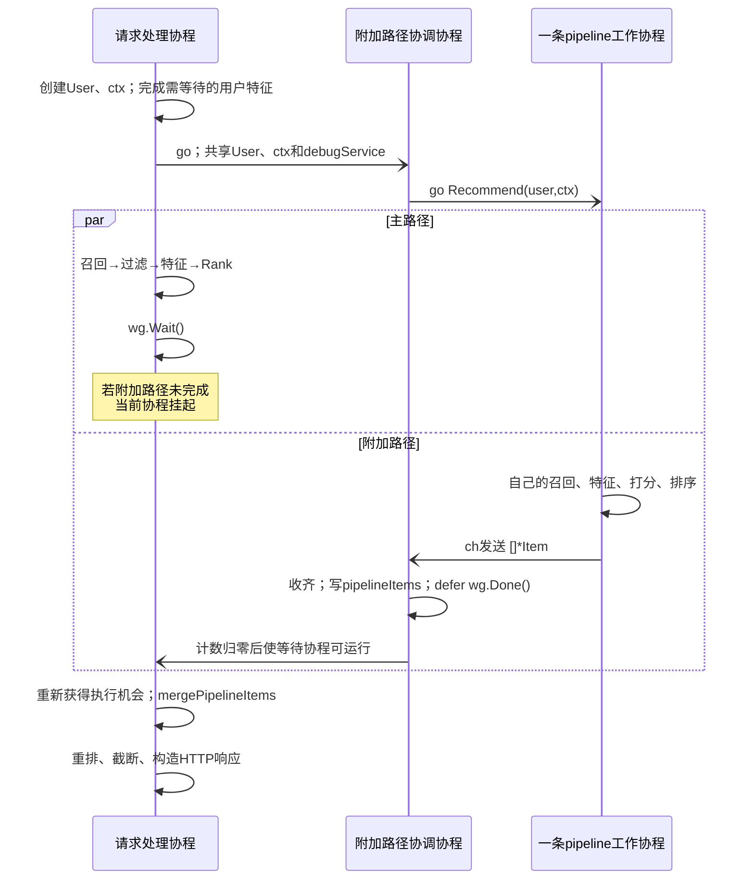
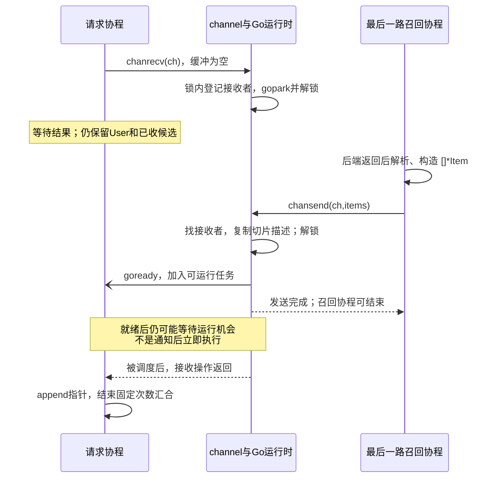
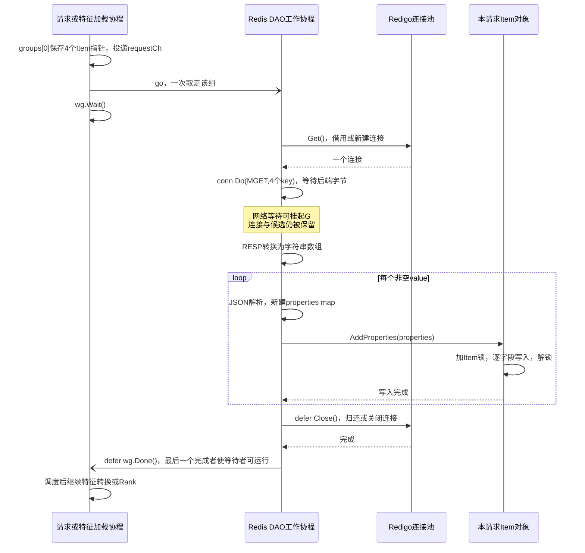
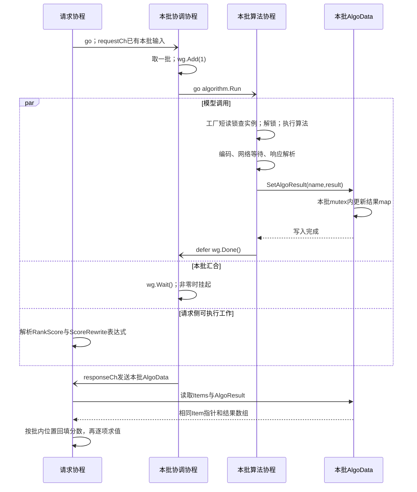
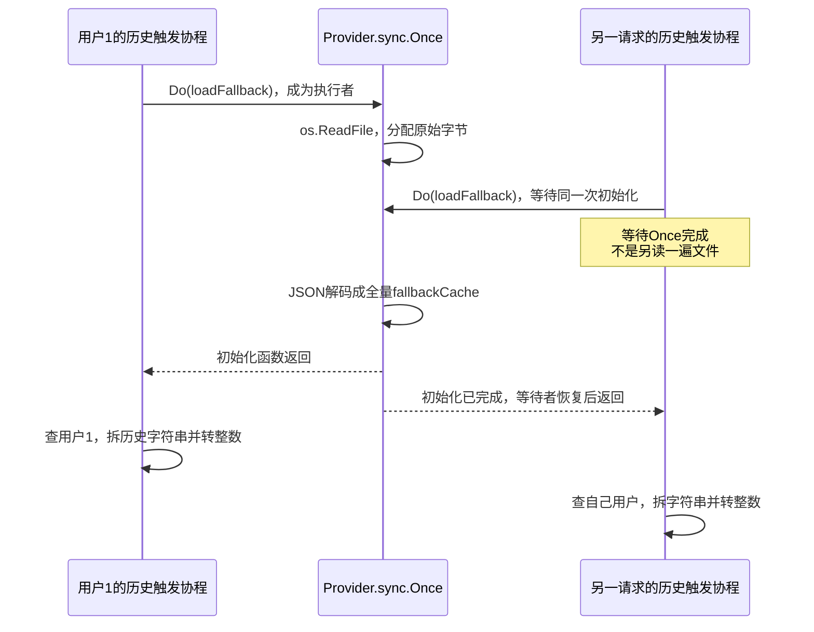
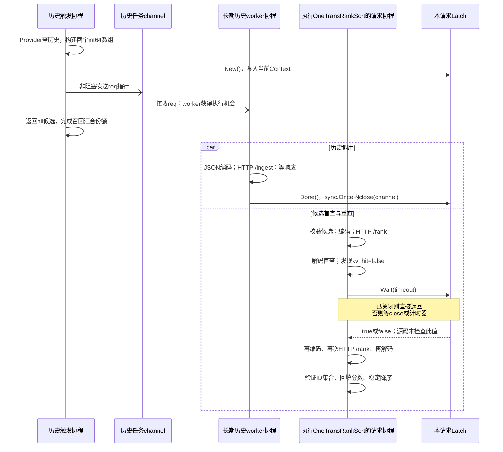

# PaiRec 进程内部：源码执行、数据生命期与 OS 负载

本文沿一次请求进入 PaiRec 后的函数调用展开，不把下游服务的耗时当作 PaiRec 的 CPU 时间。架构边界见 [03](03_pairec_orchestration.md)，端到端接口见 [08](08_request_walkthrough.md)。这里回答的是：**哪个执行者拿着什么数据，在什么代码处计算或等待，谁使它继续运行；请求、候选或历史增多后，哪一处先积压。**

参考[前期进程分析](assets/source_snapshots/prior_design/pairec-orchestration-analysis.md.html)的分析深度，重新核对源码。特别纠正“协程数等于线程数”“channel 等待必有一次 futex”“空闲连接上限等于并发上限”等会误导 OS 分析的表述。以下是静态代码分析和条件推导，未运行模型或压测。

## 1. 先固定执行路径，才有可计算的负载

### 1.1 三条路径不能混算

| 分析对象 | 实际执行什么 | 本文用途 |
|---|---|---|
| 官方 PaiRec v2.6.2 | `RecommendController → UserRecommendService`，可选特征 DAO、默认 Rank、附加 pipeline 和排序插件 | §2—6 拆解编排框架内部；只有配置启用的分支才计入工作量 |
| 当前 OneTrans 适配 | 历史触发器挂在 Recall 接口，候选打分挂在 Sort 接口；历史来自进程内 Provider | §7 拆解已实现队列、首次文件装载、闸门、HTTP 和重查 |
| 目标固定编排 | 统一特征服务、三路召回、召回合并、OneTrans 精排、重排 | §10 说明上述证据怎样约束目标实现；不把尚未实现的任务池当现状 |

官方依赖版本由[模块文件](assets/source_snapshots/pairec_v2.6.2/go.mod.html#L1)固定；当前适配示例[配置](assets/source_snapshots/pairec4tigerllm_8506/configs/pairec_config.onetrans_rank.json.html#L1)只启用生成召回和历史触发器、在 Sort 执行 OneTrans。它没有同时启用本文演示的 Redis DAO 和多算法默认 Rank。

为读清普通路径，使用下面的**教学配置**。名称表示已注册的实例，不是提供了一份可启动配置；数值不是实测，也不改变 08 的接口样例。

```python
request = {"uid": "1", "size": 4, "scene_id": "home_feed", "category": "default"}
execution_case = {
    "recall_instances": ["vector", "sparse", "generated"],
    "attached_pipelines": 0,
    "user_feature_async": False,
    "item_feature_loaders": ["redis_string_json"],
    "general_rank_enabled": False,
    "custom_ranks": 0,
    "rank_batch_count": 2,
    "rank_algorithms": ["score_model"],
    "rank_processor": "ordinary_map",  # 普通map生成器；不是EasyRec protobuf分支
}
# 召回合并/去重后，进入特征和Rank的四个对象；分数尚未写入。
item_ids = ["4", "1201", "9002", "9001"]
```

### 1.2 本文的执行者和计数单位

`goroutine` 是 Go 运行时调度的任务；下文简称“协程”。`G` 是一个协程，`M` 是 OS 线程，`P` 是执行普通 Go 代码所需的运行时资源，数量为 `GOMAXPROCS`。OS 调度的是 M，不知道“召回协程”这个业务概念。P 不是固定 CPU 核，也不是一个线程。

```python
R = 3       # 成功查到的召回实例数；不是配置中名字的数量
N = 4       # 当前阶段实际持有的候选数；不是最终返回size
B = 2       # 默认Rank批数：ceil(未被customRank接管的候选数 / batch_count)
A = 1       # 每批算法数
F = 1       # 本场景启用的物品特征加载器数
J = 0       # 附加pipeline条数
# 不把R+B+B*A称为OS线程数，也不把各阶段创建数当同时存活数。
```

## 2. 从 HTTP 到请求对象：第一次分配与共享从哪里开始

### 2.1 输入、处理、输出及调用栈

[入口实现](assets/source_snapshots/pairec_v2.6.2/web/recommend_controller.go.html#L72)在同一处理协程中完成读取、解析和编排：

```go
// 与源码同序的摘录；省略日志及错误响应，不省略数据边界。
RequestBody = io.ReadAll(httpRequest.Body)       // []byte，完整请求体
json.Unmarshal(RequestBody, &param)             // RecommendParam，含features map
ctx := context.NewRecommendContext()
ctx.Param = &param
ctx.Config = recconf.Config                     // 指向当前配置对象，不是深拷贝
ctx.RecommendId = requestId
items := service.NewUserRecommendService().Recommend(ctx)
// 每个结果新建ItemData，仅复制ID、类型、召回来源。
jsonBytes := json.Marshal(response)
io.WriteString(writer, string(jsonBytes))
```

这里的 `RecommendContext` 是业务结构体，[定义](assets/source_snapshots/pairec_v2.6.2/context/recommend_context.go.html#L18)没有继承标准库 `context.Context`。入口没有把 `httpRequest.Context()` 传给编排；客户端取消不能因此自动取消 DAO 或模型请求。服务端[30 秒 Read/WriteTimeout](assets/source_snapshots/pairec_v2.6.2/app.go.html#L80)也不是“30 秒后杀掉 Recommend 协程”。入口读取没有在此处设置请求体字节上限；上游网关限制需单独核对。

HTTP/1.x 下，标准库通常以连接服务协程顺序处理该连接的请求；HTTP/2 的流并发不同。本文称“请求处理协程”是一次处理的角色，不断言每个请求都新建一个 OS 线程或一个连接。标准库传输与连接语义见 [net/http](https://pkg.go.dev/net/http)。

### 2.2 进程内数据地图

下表中的“复制”分清复制容器和复制容器指向的数据。把 `[]*Item` 发进 channel，只交付切片描述及指针，不会复制整批特征。

| 对象 | 创建与写入点 | 谁共享或继续持有 | 回收边界与负载 |
|---|---|---|---|
| `RequestBody []byte`、`param.Features map` | Controller 读体、JSON 解码 | Controller、`ctx.Param` | 读体与解析有独立分配；包含大数组时按字节增长 |
| `*User`、`User.Properties` | `NewUserWithContext` 复制输入 map 条目并写 uid | 主路径、各召回、pipeline、特征与日志 | 容器新建，嵌套 slice/map 值仍可能共享；不是深拷贝 |
| `[]*Item` | 各召回返回，GetItems 追加指针 | Filter、特征、Rank、排序；可被异步日志保留 | 等待期间仍存活；切片截短不保证底层数组立即缩小 |
| `Item.Properties`、`algoScores` | 特征、Rank 回填 | 同一 Item 上的后续步骤 | 方法锁保护 map 操作；不自动保护嵌套对象和任意直接字段写入 |
| `AlgoData.RequestData` | 普通生成器为每项合并用户/物品字段 | 同批多个算法并发读取 | 每项新 map；批切片复制，value 仍是浅拷贝 |
| `RecommendContext.contexParams` | `AddContextParam` 在锁内更新 | 当前适配用它交付 latch、错误和 trace | 此锁不覆盖整个 Context；例如 `Log` 的 append 是另一回事 |

证据：[User 构建](assets/source_snapshots/pairec_v2.6.2/module/user.go.html#L37)、[Item 字段与锁](assets/source_snapshots/pairec_v2.6.2/module/item.go.html#L15)、[GetFeatures 复制](assets/source_snapshots/pairec_v2.6.2/module/item.go.html#L229)、[AlgoData 生成](assets/source_snapshots/pairec_v2.6.2/service/rank/algo_data.go.html#L104)。因此，优化重点不只是“少建协程”，还包括缩短这些对象在等待路径上的存活时间。

## 3. 编排主函数：串行段、附加路径和最终汇合

### 3.1 沿函数执行，不把阶段名当独立线程

以下等价控制流来自 [UserRecommendService.Recommend](assets/source_snapshots/pairec_v2.6.2/service/user_recommend.go.html#L45)。每个普通调用先在当前协程执行；只有 `go` 才创建新协程。

```go
user := module.NewUserWithContext(uid, ctx)
userFeatureService.LoadUserFeatures(user, ctx) // 见3.3：返回不一定代表所有异步特征完成
var pipelineItems []*Item
wg.Add(1)
go func() {
    defer wg.Done()
    pipelineItems = pipeline.Recommend(user, ctx, debugService)
}()
items := recallService.GetItems(user, ctx)     // 内部创建R个协程，当前协程汇合
items = Filter(user, items, ctx)               // 顺序调用配置的过滤器
items = generalRankService.Rank(user, items, ctx)
items = featureService.LoadFeatures(user, items, ctx)
rankService.Rank(user, items, ctx)             // 原地写分，不返回新的候选集合
wg.Wait()                                    // 附加路径晚到时停在这里
items = mergePipelineItems(items, pipelineItems)
items = Sort(user, items, ctx)                // 逐个调用排序插件
items = items[:min(ctx.Size, len(items))]
go FeatureLog(user, items, ctx)               // 不等待，但仍可持有对象
// 另有一致性日志、配置的clean hooks；不等于它们已执行结束。
return items
```

教学配置没有附加 pipeline 时，外层仍派生一个协程，但 [pipeline.Recommend](assets/source_snapshots/pairec_v2.6.2/service/pipeline/pipeline.go.html#L45)查表无配置即返回。若有 J 条，则内部再派生 J 个协程，每条跑完整处理链；不是主路径失败后才运行的兜底。[pipeline 内部](assets/source_snapshots/pairec_v2.6.2/service/pipeline/user_recommend.go.html#L42)在召回为空时提前返回，主路径不能直接套用这个分支。

图法：**UML 时序图**。以下打开“一条附加 pipeline”这个条件分支；两条路径都在同一 PaiRec 进程中，`pipelineItems` 的发布由 WaitGroup 汇合保证。



若用户特征耗时为 `Tuser`，主路径和附加路径从分叉到完成分别为 `Tmain`、`Tpipe`，则理想无额外调度延迟时：

```python
T_before_sort = Tuser + max(Tmain, Tpipe) + Tmerge
T_wait_at_join = max(0, Tpipe - Tmain)
# 不能把两个并发路径耗时相加作为响应时间；两者CPU时间却都消耗进程配额。
```

`mergePipelineItems` 为主列表建 `map[id]*Item`，对重复 ID 复制并合并 Properties，对新 ID 追加指针。[源码](assets/source_snapshots/pairec_v2.6.2/service/user_recommend.go.html#L183)没有把 pipeline 对象的 `Score` 自动覆盖到主对象；不同路径同一 ID 的对象不是天然同一个指针。合并需约 `Nmain+Npipe` 次 ID 访问，重复项还需按属性数复制，不是常量开销。

### 3.2 串行段的实际 CPU 工作

`Filter`、`Sort` 是调用接口，不是固定成本。当前教学基线只展开去重和分数排序，不把未启用的 DPP、多样性矩阵计算强加给所有请求。

- [UniqueFilter](assets/source_snapshots/pairec_v2.6.2/filter/unique_filter.go.html#L26)创建新指针切片和 ID map，按输入次序保留首个对象，并合并重复项的算法/召回分。哈希访问是期望线性工作，仍会分配 map、读取非连续对象。
- [GeneralRank](assets/source_snapshots/pairec_v2.6.2/service/general_rank/general_rank.go.html#L216)未配置时直接返回原切片；启用冷启动粗排才新增分流、一个协程和汇合。不能将它固定算成一次模型 RPC。
- [排序链](assets/source_snapshots/pairec_v2.6.2/sort/sort.go.html#L65)按配置顺序调用插件。仅比较 Item.Score 时，比较和交换主要在请求协程；对象指针交换不复制整份特征。具体顺序也必须核对：`ItemScoreSort` 的 [Less 是升序](assets/source_snapshots/pairec_v2.6.2/sort/item_score.go.html#L15)，当前 OneTrans 适配才显式降序且稳定排序。
- 最后才执行 `items[:size]`，所以 `size=4` 不代表之前只过滤或打分四个候选。尽早限量能省下后续 CPU、RPC 和内存，但必须先确定召回融合及候选覆盖语义。

### 3.3 用户特征的“异步”有两层，返回时机不同

[LoadUserFeatures](assets/source_snapshots/pairec_v2.6.2/service/feature/user_feature_service.go.html#L106)不是简单逐项同步调用。每个配置的 feature 通常在子协程执行；是否算入当前 `wg`，由 `FeatureAsyncLoadMap` 决定。

```go
// 无自定义featureFunc时的主干；异步计数另由User维护。
for _, fea := range features {
    if async[fea] {
        user.IncrementFeatureAsyncLoadCount(1)
        go func() { defer user.DescFeatureAsyncLoadCount(1); fea.LoadFeatures(...) }()
    } else {
        wg.Add(1)
        go func() { defer wg.Done(); fea.LoadFeatures(...) }()
    }
}
wg.Wait() // 只等此wg包含的任务，不等上面的全部异步任务
```

存在自定义 `featureFunc` 时，另有一个 `wg2` 等待所有 feature，再由另一个协程执行转换；当前方法只等 `wg`，并不等待该转换协程完成。`User` 的[异步计数减至零关闭 channel](assets/source_snapshots/pairec_v2.6.2/module/user.go.html#L281)是一套独立通知；只有显式等待它的使用者才获得这层保证。

因此 `LoadUserFeatures` 的墙钟耗时可能小于实际取数任务寿命。每个 `User.Properties` 更新有锁，但“某个派生字段依赖另一个 feature 先完成”是业务依赖，不会由 map 锁自动建立。目标统一特征服务应返回明确完成的数据视图，不能原样继承这个模糊的返回条件。

## 4. 召回内部：发起、交付、挂起与唤醒

### 4.1 从配置到结果容器的处理过程

[RecallService.GetItems](assets/source_snapshots/pairec_v2.6.2/service/recall.go.html#L52)先按 scene/category 解析名字，再查实例；未查到的实例不进入 `recalls`。存在实验覆盖配置时，每次请求都会 JSON 编码该配置、算摘要，再查派生实例；派生实例尚未注册时才进入[包级 mutex](assets/source_snapshots/pairec_v2.6.2/service/recall.go.html#L24)，反射调用 `CloneWithConfig`。只有首次派生实例的锁与克隆属于冷路径，编码和摘要仍是该分支的稳态 CPU 成本。

```go
ch := make(chan []*Item, len(recalls))
for _, r := range recalls {
    go func(r Recall) {
        defer func() {
            if recover() != nil { ch <- nil } // 实际还记录堆栈
        }()
        result := r.GetCandidateItems(user, ctx)
        ch <- result
    }(r)
}
for range recalls {
    part := <-ch
    ret = append(ret, part...) // 复制指针到ret，不复制Item实体
}
close(ch)
```

三个实例各发送一次，缓冲容量也是三，因此正常路径即使父协程尚未读取，三个结果也能全部入队；不能把此处写成“三个发送者通常被满队列阻塞”。真正关键的是父协程必须收到三次；若一个调用不返回也未 panic，其他结果已到也不能提前结束。

```python
# 一种可能的完成顺序；这不是目标融合优先级。
channel_messages = [
    ["1201", "9002"],          # sparse先完成
    ["4", "1201", "9001"],    # vector后完成
    ["9002"],                  # generated最后完成
]
ret_ids = ["1201", "9002", "4", "1201", "9001", "9002"]
# GetItems不去重，完成次序会影响后续“保留首项”的过滤结果。
```

候选数为 `K=sum(len(part))` 时，合并至少写 K 个指针，ret 扩容还可能复制已有指针；每个召回自己的 JSON/协议解码分配、Item 构造另计。高并发时相同的 R 不代表相同负载：每路 50 项和 5000 项在合并、GC、后续模型输入上相差很大。

### 4.2 从 `<-ch` 到 runtime：不是“一次等待对应一次 futex”

下面按 **Go 1.24.0 机制参考**解释；项目 go.mod 的 `go 1.24` 不证明部署二进制恰是这个补丁版本。已保存 [chan.go](assets/source_snapshots/go_go1.24.0/src/runtime/chan.go.html#L521)、[WaitGroup](assets/source_snapshots/go_go1.24.0/src/sync/waitgroup.go.html#L93) 和许可。

```go
// chanrecv的语义化伪码，省略race detector及栈管理。
lock(channel.lock)
if buffer_not_empty {
    copy_slice_header_to_receiver()
    unlock(channel.lock)
    return                       // 快路径，不挂起、不需要OS唤醒
}
enqueue_receiver_wait_record()   // runtime的sudog，指向等待G及接收位置
park_and_unlock_atomically()     // gopark；保证不会丢失在此刻到来的通知

// chansend若找到等待接收者，优先直接交付。
lock(channel.lock)
receiver := dequeue_waiting_receiver()
copy_slice_header_to(receiver)
unlock(channel.lock)
goready(receiver.G)              // 只是变成可运行，不等于立即占到CPU
```

图法：**UML 时序图**。只展开最后一路尚未完成的情况；生命线表示 Go 执行任务或进程内运行时。



这里至少有两种延迟：结果尚未生产的等待，以及通知后等待 Go/OS 调度的延迟。`gopark` 挂起 G，M/P 可以执行其他 G；内核是否需要唤醒空闲 M 是运行时后续决定。不能把一次 channel 收发计为一次内核上下文切换，也不能从 futex 次数推回召回调用次数。

网络读等待又是不同路径：[netpollblock](assets/source_snapshots/go_go1.24.0/src/runtime/netpoll.go.html#L548)登记 G 等待 socket 就绪，[Linux netpoll](assets/source_snapshots/go_go1.24.0/src/runtime/netpoll_epoll.go.html#L99)利用 epoll。已经就绪的 fd 不必经历完整休眠；收到多个响应也不保证一响应一次 IRQ 或一次 epoll 唤醒。网络解码后的协程才会走上图的 channel 交付。

### 4.3 正确性决定性能数据能否使用

正常发送和 panic 恢复发送都是一次；panic 分支返回 `nil`，因此“召回耗时下降、结果变少”也可能是失败，不能当优化成功。该汇合没有 `select` 请求取消分支；为其增加超时也不会自动停止子调用。目标改造应同时做到取消传给调用方、结果可安全丢弃、已接收候选可及时释放，否则只是更早向用户返回，后台工作量仍在。

## 5. 物品特征内部：从分组到 Redis、解析和锁内写回

本节分析官方 `FeatureRedisDao` 的实际行为；它是框架负载证据，**不是撤回“目标必须经特征服务查询”的设计**。把同一实现搬进独立特征服务后，这部分解析和数据库负载也随之转移；PaiRec 只保留 RPC、解码和对象装配。

### 5.1 加载器层和 DAO 层分别创建多少任务

[FeatureService.LoadFeatures](assets/source_snapshots/pairec_v2.6.2/service/feature/feature_service.go.html#L77)在 `AsynLoadFeature=true` 时为 F 个加载器各建协程，并在外层 `wg.Wait()` 汇合；false 时顺序调用。每个 [Feature.LoadFeatures](assets/source_snapshots/pairec_v2.6.2/service/feature/feature.go.html#L35)先执行 DAO，再按配置逐项转换。不同加载器异步运行，不会自动等待彼此转换的依赖。

[Redis DAO 分组](assets/source_snapshots/pairec_v2.6.2/module/feature_redis_dao.go.html#L206)的代码值得单独展开：

```go
cpuCount := max(len(items)/100, 1) // 整数除法；不是runtime.NumCPU，也不是ceil
for i, item := range items {
    groups[i%cpuCount] = append(groups[i%cpuCount], item)
}
requestCh := make(chan []*Item, cpuCount)
for _, group := range groups { requestCh <- group }
for i := 0; i < cpuCount; i++ {
    wg.Add(1)
    go func() {
        defer wg.Done()
        select {
        case group := <-requestCh:
            keys := collect_cache_misses(group)
            if len(keys) == 0 { return }
            conn := redisPool.Get()
            defer conn.Close()     // 在整个解析和回填之后归还
            fetch_and_fill(group, keys, conn)
        default:
        }
    }()
}
wg.Wait()
```

```python
# 每个启用的Redis物品加载器，全部未命中缓存时：
for_N = {
    4:   {"workers": 1, "group_sizes": [4]},
    199: {"workers": 1, "group_sizes": [199]},
    200: {"workers": 2, "group_sizes": [100, 100]},
    250: {"workers": 2, "group_sizes": [125, 125]},
}
# N=0仍创建一个worker，但没有分组消息，它从select的default退出。
```

所以“每批至多 100 项”“按核数并发”都不准确。N 从 199 增到 200 时任务及连接需求会跳变。若 F 个这类加载器并发，新增 DAO 任务数为各 `max(floor(N/100),1)` 之和，而不是 F×固定核数。

### 5.2 四个候选的一次 MGET：完整 IPO 和数据复制

下例固定 String+JSON、缓存关闭，键前缀是教学值。响应数值只展示格式，不假称真实数据库已有。

```python
input_items = ["4", "1201", "9002", "9001"]
keys = ["item:" + item_id for item_id in input_items]
redis_command = ["MGET", *keys]
redis_values = [
    '{"category":"video_type_0","ctr":0.21}',
    '{"category":"video_type_1","ctr":0.37}',
    None,
    '{"category":"video_type_0","ctr":0.18}',
]
# redis.Strings把nil项转成空字符串，此DAO会跳过；本身不提供逐项missing状态。
output_properties = {
    "4":    {"category":"video_type_0", "ctr":0.21},
    "1201": {"category":"video_type_1", "ctr":0.37},
    "9002": {},
    "9001": {"category":"video_type_0", "ctr":0.18},
}
```

读取、转换与写回在同一个 DAO worker 中。[itemFeatureFetchByString](assets/source_snapshots/pairec_v2.6.2/module/feature_redis_dao.go.html#L277)先取得全部 `[]string`，再逐个 `json.Unmarshal([]byte(str), &properties)`；转换会分配 map 与字段对象，并把字段经 `Item.AddProperties` 写入原 Item。网络值不是直接成为 Item 的零复制视图。连接通过 defer 在整个函数返回后归还，因此 JSON 解析和回填时间也算连接占用时间。

图法：**UML 时序图**。Redis 命令如何执行见 [11](11_redis_workload.md)，本图只打开 PaiRec 内部。



### 5.3 缓存命中不只是快路径：这里还有位置错配风险

源码构造 `keys` 时跳过缓存命中的 Item，却把**完整原 group**交给 `itemFeatureFetchByString`；后者用 `items[i]` 接收第 i 个返回值。这是静态可复核的错配风险：

```python
group = ["4", "1201", "9002"]
cache_hit = {"4"}
keys_sent = ["item:1201", "item:9002"]
values_received = ["value_of_1201", "value_of_9002"]
current_assignment = {"4": "value_of_1201", "1201": "value_of_9002"}
expected_assignment = {"1201": "value_of_1201", "9002": "value_of_9002"}
```

触发条件是**同组部分命中，且某个命中项位于至少一个未命中项之前**；若命中项全在组尾，前面的未命中项仍可按位置对应。全部命中或全部未命中也不会走出这个例子的错位。应先维护 `missItems` 与 `keys` 等长映射，再比较缓存开启前后的性能。否则候选质量和访问量变化会被误当作优化。本轮只记录设计/实现缺口，不改服务源码。

### 5.4 连接池实际保护什么

[PaiRec 初始化](assets/source_snapshots/pairec_v2.6.2/persist/redisdb/redis.go.html#L81)设置 `MaxIdle`、空闲时限、Dial 和 TestOnBorrow，没有设置 `MaxActive` 或 `Wait`。[Redigo v1.9.3](assets/source_snapshots/redigo_v1.9.3/redis/pool.go.html#L206)对此的行为是：无空闲连接可借时允许继续建立连接；不能推断出现一个“固定容量的连接等待队列”。池的互斥锁保护计数和链表，拨号、借出后的 MGET 不在锁内串行执行。

使用空闲超过一分钟的连接时还可能先 PING；新建连接含解析地址、TCP 建连、可选 AUTH 和 SELECT。配置默认连接/读/写超时分别为 50/100/100 ms，[来源](assets/source_snapshots/pairec_v2.6.2/persist/redisdb/redis.go.html#L117)。它们不是整个特征阶段共同的 100 ms 截止时间；F 个串行加载器可以多次花费预算。

高并发下应先辨别：是在现有连接上等待响应，还是频繁建连、内核 socket/FD 增长；不要尚未读配置就用“连接池排队”解释全部慢请求。未来若增加 `MaxActive`，还必须决定满额时等、拒绝或降级，并把等待纳入请求截止时间。

## 6. 默认 Rank 内部：特征物化、两层协程和结果回填

本节不是 OneTrans 的 HTTP 适配；后者在 §7 单独分析。默认 Rank 的任务结构来自 [RankService.Rank](assets/source_snapshots/pairec_v2.6.2/service/rank/rank_service.go.html#L102)。

### 6.1 RPC 之前已经完成哪些 CPU 与内存工作

1. 解析场景 RankConf 与实验覆盖；把 customRank 接管的物品分出。`B=ceil(N/batch_count)` 必须使用剩余 N。
2. `user.MakeUserFeatures()` 在读锁内遍历用户字段；字符串还尝试转浮点。EasyRec 分支另用 `MakeUserFeatures2`。
3. 每项 `GetFeatures()` 在 Item 锁内加入召回属性并复制 map；普通 `AddFeatures` 再建一个 map，先放用户字段、后放物品字段。同名字段由物品覆盖。
4. 每到 batch_count，`GeneratorAlgoData` 复制 map 引用切片及 Item 指针切片，清零生成器长度。**先物化所有批，再启动算法协程**，所以此段没有和模型 RPC 流水重叠。

```python
# 教学展示普通生成器的数据，不是OneTrans /rank载荷。
user_features = {"uid": 1.0, "age": 2.0}  # MakeUserFeatures把可解析的字符串转为float64
item_features = {"category": "video_type_0", "ctr": 0.21}
row0 = {**user_features, **item_features}
algo_data = {
    "Items": ["pointer_to_item_4", "pointer_to_item_1201"],
    "RequestData": [row0, {"uid":1.0, "age":2.0, "category":"video_type_1", "ctr":0.37}],
    "AlgoResult": {},
    "Err": None,
}
```

若 U 个用户字段、I 个物品字段、N 个候选，普通 map 路径至少有数量级 `N×(U+I)` 的条目写入，另有 `N×I` 的 GetFeatures 复制；不是将 U 个用户字段只存一份即可解释全部内存。嵌套数组仍浅共享，同一批 A 个算法拿到相同 `GetFeatures()` 对象，应作为只读数据使用；加 B×A 个协程不代表复制 B×A 份完整输入。

### 6.2 两层任务不是固定大小的全局池

```go
// 所有AlgoData已生成。B = len(algoDataList)。
requestCh  := make(chan IAlgoData, B)
responseCh := make(chan IAlgoData, B)
for _, data := range algoDataList { requestCh <- data }
for i := 0; i < B; i++ {
    go func() {                              // 批次协调协程
        data := <-requestCh                  // 预填B条，各协调者只取一批
        for _, name := range algorithms {
            wg.Add(1)
            go func(name string) {           // 算法协程
                defer wg.Done()
                result, err := algorithm.Run(name, data.GetFeatures())
                if err != nil { data.SetError(err) } else { data.SetAlgoResult(name,result) }
            }(name)
        }
        wg.Wait()                            // 等本批所有算法，不是等网络fd
        responseCh <- data                   // 交付整个批次对象
    }()
}
// 当前请求协程此时解析打分表达式，再收B批，逐项回填。
```

图法：**UML 时序图**。只放大 B=2 中的一批，以免用一条生命线暗示一个线程串行执行全部批；另一批有同构任务，可以与本批重叠。



B=2、A=1 时新增 2 个批次协调协程和 2 个算法协程；A=3 时则是 2+6。requestCh 恰好预填 B 条，B 个协调者各读一次；它不提供跨请求容量控制。responseCh 容量 B，最多 B 次发送，正常完成者不因请求侧暂忙而卡在满队列。

WaitGroup 计数与等待者登记在 [Wait/Done](assets/source_snapshots/go_go1.24.0/src/sync/waitgroup.go.html#L45)中维护；需要等待时进入运行时信号量队列，[semacquire1/semrelease1](assets/source_snapshots/go_go1.24.0/src/runtime/sema.go.html#L142)负责挂起和就绪。最后一个 Done 后协调协程也要先被调度，才会发送 responseCh；随后请求协程还要再次获得运行机会。两个汇合层各有自己的排队机会，不能用一个“EAS RTT”解释整个 Rank 耗时。

### 6.3 锁、错误和打分表达式的实际边界

[AlgorithmFactory.Run](assets/source_snapshots/pairec_v2.6.2/algorithm/algorithm.go.html#L107)只在查算法实例与转换函数时持读锁，调用算法前已经解锁。正常模型网络 RTT 不在全局读锁内；配置初始化的写锁却覆盖 `initAlgo`，因此热更新期间才需特别检查读者阻塞。仅凭调用频繁不能判定此锁已经是热点。

[AlgoDataBase](assets/source_snapshots/pairec_v2.6.2/service/rank/algo_data.go.html#L42)的结果 map 有 mutex，`SetError` 却直接赋值 Err。A>1 且多算法并发失败时存在写竞争；最终 WaitGroup 只保证汇合后的读取，不能修复此前写写竞争。任一 Err 非空时，该批正常结果回填被跳过，后面的 RankScore 表达式分支仍可能运行。需要同时看错误、输入覆盖和分数，不能只看 RPC 完成率。

[回填](assets/source_snapshots/pairec_v2.6.2/service/rank/rank_service.go.html#L303)用 `min(len(result),len(items))` 按**位置**配对，不按返回 ID join。随后请求协程逐项执行 ScoreRewrite 和 RankScore，访问 Item 的算法分/属性。多算法响应同时到达，会使回填、map 写入、表达式求值集中在短窗口；网络结束后 p99 仍可能增长。customRank 在尾部另有 rankWG 汇合，不能把只观测默认批次完成当作 Rank 返回。

### 6.4 HTTP 连接限制须跟随实际处理器

| 代码分支 | 实际设置 | 负载含义 |
|---|---|---|
| 普通 EAS HTTP client | [MaxIdleConnsPerHost=200](assets/source_snapshots/pairec_v2.6.2/algorithm/eas/client.go.html#L13)，未设 MaxConnsPerHost | 这是闲置缓存数量；活动连接不因此最多200 |
| EasyRec SDK 分支 | [MaxConnsPerHost=2000，MaxIdleConnsPerHost=300](assets/source_snapshots/pairec_v2.6.2/algorithm/eas/model.go.html#L91) | 前者才限制同host连接总量，满额可等待；范围是对应Transport，不是全进程全部算法共用一个池 |
| OneTrans 适配 | [自建 Transport 仅设置 DialContext](assets/source_snapshots/pairec4tigerllm_8506/services/sort/onetrans_rank_sort.go.html#L72) | 未设总连接限额；默认空闲缓存与活动上限仍须分清 |

算法层或 SDK 还可能重试。一次 `algorithm.Run` 不能无条件等于一次网络请求；测量时同时记录逻辑调用数、实际发送次数与连接复用率。连接参数含义依据 [Transport 定义](https://pkg.go.dev/net/http#Transport)。

## 7. 当前 OneTrans 适配：真正留在 PaiRec 内部的工作

### 7.1 首次历史请求：`sync.Once` 会把文件读取放进在线路径

[Provider.GetUserHistory](assets/source_snapshots/pairec4tigerllm_8506/services/feature/provider.go.html#L50)先查可选 Kafka 内存缓存；未命中走 `getFromFallback → once.Do(loadFallback)`。后者 [os.ReadFile 后整体 JSON 解码](assets/source_snapshots/pairec4tigerllm_8506/services/feature/provider.go.html#L108)，不是每次只从磁盘取一个用户。

```go
p.once.Do(func() {
    data, err := os.ReadFile(p.fallbackPath) // 首次请求承担文件IO
    if err != nil { log_and_return() }
    json.Unmarshal(data, &p.fallbackCache)  // 所有用户进入长期map
})
row := p.fallbackCache[userID]
history := parseHistoryString(row["click_history"]) // 每次Split、Atoi、分配[]int
```

图法：**UML 时序图**。两请求共享同一个 Provider，均未命中实时缓存；文件未装载。



这里既有文件 IO，也有第一次大堆分配和 GC 压力；同一 Provider 的并发请求会等待 Once，而不是各自读磁盘。若首次加载失败，Once 仍完成，后续请求不会自动重试。两个插件各自构建 Provider 时还可能各有一份缓存，不能因为路径相同就当作进程内唯一副本。

稳态查询仍有 `fmt.Printf`、Split、Atoi 与 slice 分配。慢 stdout、长历史、高请求率可把看似“本地查表”变成 CPU/日志成本。可在启动阶段校验并预解析，但需要明确失败时是否拒绝启动，以及文件更新后的发布办法。

### 7.2 从历史 ID 到队列：容量限制在哪一层

[BuildIngest](assets/source_snapshots/pairec4tigerllm_8506/services/recall/onetrans_s_stage.go.html#L72)把 `[]int` 复制为两个 `[]int64`：原始物品 ID 和等长序号。H=10 时两个数组的元素下限共 `16×10=160 B`，不含容量余量、slice 头、request、latch、Provider 内存及后续 JSON。

[deliverS](assets/source_snapshots/pairec4tigerllm_8506/services/recall/onetrans_s_stage.go.html#L230)先创建请求级 latch 并放到 Context，再非阻塞发送队列：

```go
req := BuildIngest(user, ctx)       // 此时已完成查表、解析与两份数组分配
if len(req.ItemIDs) == 0 { return }
req.latch = NewLatch()
ctx.AddContextParam(latchKey, req.latch)
select {
case queue <- req:                 // 若worker已等待，可直接交付，不必先驻留缓冲
    return
 default:
    if injectSync { Ingest(req) }  // 在当前召回协程同步调用，会延长召回汇合
    req.latch.Done()               // 丢弃也放行，不是成功证明
}
```

因此队满丢弃发生在输入构造之后，不能省掉前面的分配和 Provider 工作。worker 数和 queue 容量约束的是此实例接受的历史任务，**不是全进程HTTP请求数**；`injectSync=true` 时，满队列的新请求绕过 worker 数直接发同步调用，也就不能再把 W 当作历史调用并发硬上限。

[consumer](assets/source_snapshots/pairec4tigerllm_8506/services/recall/onetrans_s_stage.go.html#L260)长期循环接收；没有任务时 G 等待 channel，收到请求后用同步 `http.Client.Do`，返回后调用 Done，再收下一项。默认 W=4/Q=1024 只是构造默认值，应以实际配置为准。

### 7.3 闸门是完成通知，不是历史状态的版本锁

[latch](assets/source_snapshots/pairec4tigerllm_8506/services/scachelatch/scachelatch.go.html#L24)由无缓冲 channel 和 `sync.Once` 组成；Done 关闭 channel，可让所有接收者继续；Wait 用 `select` 与计时器竞争。它保存在**当前请求 Context**，并没有一张按 user_id 共用的全局闸门表。不同请求的同一用户仍可同时 ingest，远端用户级 KV 也没有因此获得请求隔离。

[OneTransRankSort.Sort](assets/source_snapshots/pairec4tigerllm_8506/services/sort/onetrans_rank_sort.go.html#L108)在调用协程中先验证候选、建 ID 数组与去重 map，再发首查。KV miss 且存在 latch 才等待；源码忽略 Wait 返回的 bool，超时后也会再查一次。这与源码旁“超时仍用首查”的注释不同，本文以执行语句为准。

图法：**UML 时序图**。这里只画 PaiRec 内的候选打分调用者、队列消费者和同步对象，HTTP 作为执行者自身的阻塞调用表示。



`Ingest` 仅检查 HTTP 状态，没有读取业务 accepted，也没有读完响应体。[当前调用](assets/source_snapshots/pairec4tigerllm_8506/services/recall/onetrans_s_stage.go.html#L104)关闭未读 Body 时不能保证连接可复用；需用 Transport 观测或抓包核对，不能直接断言每次必新建连接。候选 `call` 则读取最多 1 MiB 并解码；每次调用都重新 Marshal，重查不是复用一份已编码报文。

### 7.4 重查为什么会扩大 CPU 和网络负载

```python
lambda_rank = 1000.0     # 示例：每秒进入适配器的请求数
p_miss_with_latch = 0.3  # 首次未命中且本请求存在latch的比例，待实测
rank_http_calls_per_s = lambda_rank * (1 + p_miss_with_latch)  # 1300
# 增加的不仅是网络：候选查表、PS查询、编码等远端工作也可能重复，见13。
T_sort = T_first_call + T_validate_fill_sort
if retry_after_miss:  # 首查未命中、存在本请求的latch，进入重查分支
    T_sort += T_latch_wait + T_second_call
# 每个call都有完整TimeoutMS，没有统一扣减预算。
```

适配器进入 Sort 前已有原 Item 列表；等待首查或 latch 时，它还持有 requestItems、originalOrder、inputSet 和 payload。第一次响应在重查期间也可能尚未被覆盖回收。候选增大不仅让请求包更大，还让这些等待中的对象更大。

校验成功后先建 `map[id]score`，写 `Item.Score`、算法分和属性，再 `SliceStable` 降序。这里是 ID 配对，与 §6 默认 Rank 的位置配对不同；同分时保留输入次序。不能将两条路径的数据正确性或开销公式互换。

## 8. CPU、调度、IO、内存、网络：由代码推出需求

### 8.1 一次请求在 G/M/P 上如何前进

| 代码位置 | G 的状态变化 | M/P 和 OS 的实际工作 | 保留的数据 |
|---|---|---|---|
| JSON解码、分组、构建AlgoData、分数回填 | 可运行→运行，必要时被抢占 | 需要Go执行资源和OS CPU时间；大量map访问可带来缓存未命中 | 当前对象与新分配结果 |
| `<-ch`、`wg.Wait`、Latch.Wait | 条件不满足才挂起；通知后可运行 | M/P通常可跑其他G；不保证发生内核睡眠或立刻执行 | 栈引用的User、候选、批结果 |
| 原生Go网络客户端等待可读/可写 | G进入netpoll等待 | 内核socket缓冲、协议栈、epoll；线程可执行别的G | 连接、请求体、响应缓冲 |
| Provider首次 `os.ReadFile` | 文件系统调用可能阻塞调用线程 | 可能页缓存命中，也可能磁盘读取；运行时可让其他线程接管P | 文件字节、解码中的全量缓存 |
| 同步CGO调用bRPC | G尚未从C调用返回 | 调用原生线程仍在C栈；不等于一直占CPU；Go可让其他工作继续 | Go/C两侧副本、Controller、RPC状态 |
| 后台日志写文件 | 独立G或同步日志库路径 | 编码CPU、锁、文件页缓存与回写；慢输出会增加存活任务 | 日志快照或原对象引用 |

CGO 不属于官方教学路径的必经部分；当前其他召回适配存在这条分支，逐调用证据见 [06 §3](06_rpc.md)。`done=NULL` 只能说明调用同步，不能直接推出 bRPC 内部 pthread/bthread 配置。`GOMAXPROCS` 也不限制 C++ 自建工作线程。

Go 机制不能简化为 `M=GOMAXPROCS`：系统调用、运行时、CGO、空闲线程都会改变 M 数；容器 CPU 配额限制的是可用 CPU 时间，P 多也不能突破它。运行时定义参见 [G/M/P 说明](https://go.dev/src/runtime/HACKING)。

### 8.2 CPU：将服务时间拆成可定位的成本

```python
# 各项是需要测量的每请求CPU秒；不能用网络墙钟耗时代替。
C_request = (C_parse + C_config + C_recall_decode + C_merge_filter
             + C_feature_decode_transform + C_rank_materialize
             + C_rank_decode_expression + C_sort_response + C_logs)
cpu_seconds_per_second = admitted_requests_per_second * C_request
# 示例：1000请求/s × 0.004 CPU秒/请求 = 4 CPU秒/s，尚未计运行时与后台工作。
```

在 N、U、I 较大时，`GetFeatures/AddFeatures` 的重复 map 构建可能先于 RPC 成为热点。若默认 Rank 的模型响应很快，B×A 协程启动、编码、回填和表达式就更显眼。应从 CPU profile 的 `encoding/json`、map、表达式和排序栈验证；不能把“网络调用很多”作为 CPU 一定不忙的依据。

CPU 资源不足还可能是 cgroup 限额到期而被节流，不只是机器 CPU 已满。要联合进程/线程 CPU、容器 `cpu.stat` 的节流增量与 Go 运行队列等待看；增加 P 可能反而让同一周期更快用完配额。

### 8.3 调度：区分业务等待、Go排队和OS排队

```python
T_stage = (T_business_wait       # 等下游、channel条件、连接额度
           + T_go_runnable_wait # 已就绪但尚未获Go执行机会
           + T_os_runnable_wait # M可运行但未获CPU或被容器节流
           + T_cpu_execution)
# 这是观测分解；同一段时间不能在多个分量重复累计。
```

下游一批响应到达后，算法 G 要解码→Done，协调 G 要发送结果，请求 G 要回填；高并发时三类 G 会集中变成可运行。只看 backend RT 会漏掉其后的排队。Go trace 的 runnable-to-running 延迟与 OS 调度数据配合，才能判断应减少并发、减 CPU 工作，还是调整实际 CPU 配额。

OS 的 PSI 表示 CPU/内存/IO 资源等待压力，不标识 PaiRec 哪个业务锁；它适合与函数/协程栈联查，不能代替应用阶段时间。[Linux PSI 定义](https://docs.kernel.org/accounting/psi.html)。

### 8.4 内存：在途量和对象大小相乘，GC不能回收仍被引用的数据

```python
# W是同一对象群从创建到释放的平均存活秒数，不一定等于HTTP响应时延。
N_inflight = admitted_requests_per_second * mean_lifetime_seconds
live_request_bytes = N_inflight * mean_retained_bytes_per_request
# 教学值：1000/s × 0.2s × 200KiB ≈ 39.1MiB
# 下游变慢至2s且仍接收1000/s：约390.6MiB；此时不是宣称泄漏。
```

需要分别记录活对象、分配速率和 RSS。高分配速率增加 GC 标记及辅助工作；不是所有 GC 成本都发生在 Stop-The-World。降低 GOGC 不能回收仍由队列、日志或 Context 持有的对象，过低还可能增加 CPU 负担。[Go GC 指南](https://go.dev/doc/gc-guide)。

`items[:size]` 只是缩短切片长度；底层指针数组以及异步日志握住的切片可能继续保持大批 Item 可达。最后一个引用消失之后才具备回收条件，GC 回收也不保证 RSS 即刻下降。可比较响应结束与最后任务完成时间，检查 heap 的 inuse 与 alloc 两种视角。

### 8.5 网络与磁盘 IO：不能由业务调用数直接算网卡负载

一条 MGET 包含多少键、返回多少字节，取决于 §5 分组、缓存命中和字段编码。若每秒 λ 个推荐，单个加载器 d 组、每组往返有效载荷 b 字节，该加载器协议边界数据量约 `λ×d×b`；多个加载器须按 `λ×Σ(d_f×b_f)` 相加（f 是加载器编号）；TCP/TLS、连接握手、重传以及同机访问另计。重试和 OneTrans 重查都增加次数。候选 TopK 不限制整个 HTTP 报文体上限，也不限制前面召回返回量。

磁盘方面，稳态网络查询不要求 PaiRec 每次读文件，但 Provider 冷启动、配置读取与日志会产生文件路径。文件写通常先到页缓存，不能把 write 返回时间当作落盘完成。普通运行日志可能由日志库后台刷写；[Debug FileOutput](assets/source_snapshots/pairec_v2.6.2/service/debug/debug_service.go.html#L102)另有进程级 `fileOutputMux`，在锁内 Write/Close。查看到文件锁等待时，应先确认该输出分支与采样率是否启用。

## 9. 高并发：按阶段叠加，而不是“请求数乘一张图的协程数”

### 9.1 同时在途与累计创建是两种数字

对 §1 教学配置，不计日志和HTTP运行时辅助任务：

```python
created_recall = R
created_feature = 1             # F=1、外层同步、N=4：仅DAO一个worker
created_rank = B + B*A          # 两个批协调+两个算法
created_pipeline_wrapper = 1   # 即使J=0，也有快速返回的外层G
# 创建总数为9；它们在不同阶段，不是整个请求期间同时存活9个。
# 用户特征加载、customRank、附加pipeline、异步日志需按启用情况另加。
```

稳态可按阶段 `n_i ≈ λ_i×W_i` 估计同时在途任务，再乘该阶段的实际任务结构；`λ_i` 用进入该阶段的速率，W 包含其自身排队与执行。部分失败或提前返回会改变 λ_i。无法在系统持续积压时拿稳定平均值公式冒充容量预测。

例如 N=1000、batch_count=100、A=3，仅默认 Rank 就创建 `B+B×A=40` 个子协程；若有 200 个请求同时停在此阶段，对应最多约 8000 个这些角色的存活实例，但不等于 8000 个都可运行、8000 条TCP连接或8000个线程。模型内重试、连接复用和已完成的批次都会改变实际值。

### 9.2 历史队列的积压与同步兜底反馈

```python
W = 4
Q = 1024
mean_ingest_occupancy = 0.1  # 秒，worker一次任务含编码/网络/等待/收尾
service_rate = W / mean_ingest_occupancy  # 理想40项/s，不是实测吞吐承诺
arrival_rate = 100
queue_growth = arrival_rate - service_rate  # 60项/s，持续过载假设
fill_seconds = Q / queue_growth             # 约17.1s，从空队列开始
```

队列有界不代表进程内存绝对有界：输入构造发生在入队前；同步兜底可以新增在途调用；HTTP请求本身还在继续。排队迟迟未消费的历史任务缺少请求截止时间，原请求结束后仍可能计算已经没有读取者的历史。该队列需观测**任务年龄**，仅看长度无法发现低流量下被慢任务拖住的问题。

当 `injectSync=true`，队满→调用者同步发历史请求→下游更忙→原 worker 更慢→更多新请求走同步兜底，是可能的正反馈路径。OS 增加线程或调整调度不能消除它；需要应用定义何时丢弃、合并同用户任务或拒绝新工作，并核对历史版本语义。

### 9.3 从现象到证据：开发、OS、性能三层联合判断

| 观察到的现象 | 首先核对的函数/等待点 | 支持该判断的证据 | 什么会推翻判断 |
|---|---|---|---|
| 下游RT稳定，PaiRec p99上升 | Rank回填/表达式、JSON、排序 | CPU profile相应栈占比增、Go就绪排队增长；无相应backend增长 | CPU闲且任务大多停在网络读，说明还需查下游或传输 |
| G数增长，线程CPU不高 | 召回固定次数汇合、特征wg、latch | goroutine栈大量同一等待点；最慢分支/队列年龄增加 | runnable堆积且cgroup节流高，应转查CPU供给 |
| 连接和FD持续增加 | Redis Pool.Get / OneTrans Transport | ActiveCount、新建连接率、TIME_WAIT/重用率一起变化 | 连接数稳定而接收字节积压，可能是慢读取/回压 |
| heap增大，响应早已发出 | 异步日志、历史worker、Context持有 | heap对象与后台任务栈对应，响应后任务仍长时间存活 | 减少在途后heap仍不回落，需进一步区分缓存、泄漏、分配器驻留 |
| 少量重载期间全体算法慢 | AlgorithmFactory.Init写锁 | mutex/阻塞采样与配置更新时间吻合 | 无锁等待，且网络RT同步上升，不应归因工厂锁 |
| 首批请求特别慢，之后恢复 | Provider.once、全量文件解码 | 首次ReadFile/JSON CPU和Once等待同时出现 | 已预热仍持续慢，需查每次解析或输出 |
| 命中率上升且特征结果异常 | Redis DAO keys/items位置映射 | 部分命中组的逐ID输入输出错位 | 未启用缓存或另用实现，不适用这个缺陷 |

Go CPU/heap/block/mutex profile 各测不同对象；block/mutex 采样需主动启用且有开销。运行时 trace 能解释唤醒到执行的间隔；`perf`/线程调度、socket统计和 cgroup 数据解释 OS 层。均是后续观测方案，不声称项目已接入这些新指标。

## 10. 目标编排怎样吸收这些结论

目标保持 Nginx 入口、独立特征服务、三路召回、召回合并、OneTrans 精排和重排；OneTrans 继续按其实际内部数据路径工作。移走官方 DAO、默认 Rank 并不能自动使编排“轻量”：RPC 解码、候选对象、召回合并、等待期间内存、重查和日志仍留在 PaiRec。

| 优先调整 | 代码原因与期望收益 | 必须保留或重新定义的语义 |
|---|---|---|
| 统一截止时间并向每次调用传递取消 | 当前Context与HTTP取消脱节，重查重置完整预算；减少无效在途工作 | 超时后是否允许部分召回；历史任务是否独立于在线请求存活 |
| 入口/下游并发额度与有界任务队列 | 默认Rank每批派生；部分客户端没有活动连接上限 | 满额时等待、拒绝或降级；等待必须计入预算，不能只加一个无限等待的信号量 |
| 在融合规则之后尽早限制候选、按字节限制批 | 后续分组、特征map、模型请求均随候选增大 | 多路覆盖、排序一致性、每批返回的ID/位置对应 |
| 稳定输入快照、部分命中位置映射、批错误同步 | 浅共享对象及SetError竞争、缓存错配使结果不可验证 | 先保证正确性再比较性能，不能用少做/错做工作换低延迟 |
| 初始化预热、预解析历史，显式版本发布 | Once首次文件读取进入召回；每次字符串解析 | 装载失败与热更新方式；不能静默使用半成品数据 |
| 有界日志与精简快照 | 异步写不在响应汇合中，但继续占CPU、内存、IO | 可丢哪些日志、保留多少样本；删除诊断证据会降低定位能力 |
| 按证据调整CPU配额/P、连接复用和批大小 | 分清CPU供给不足、就绪排队、网络等待、内存压力 | 每次改变后对照相同候选量、成功率、输入版本与结果覆盖 |

建议先做一份可关联的阶段事件，而不是继续堆总耗时。以下是**待补的观测格式**；`task_id` 表示当前进程的一项工作，`parent_task_id` 关联发起者，并非新RPC业务字段。

```json
{
  "request_id": "request-user-1",
  "task_id": "rank-batch-0-model-0",
  "parent_task_id": "rank-batch-0",
  "stage": "rank_algorithm",
  "candidate_count": 2,
  "event": "run_start",
  "monotonic_ns": 125000000,
  "input_bytes": 360,
  "attempt": 1
}
```

至少区分创建/入队、开始执行、外部调用起止、结果就绪、消费者继续执行、任务完成；关联候选数、字节数、实际发送次数和错误。用同一请求串起这些事件，才能解释“后端完成了，PaiRec 为什么还没返回”，并对接开发工程师的函数栈、OS专家的调度与IO观测、性能工程师的容量和尾延迟分析。
