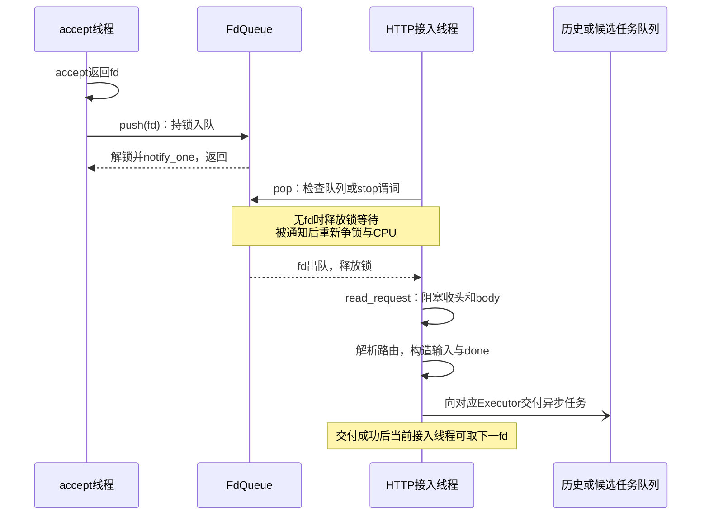
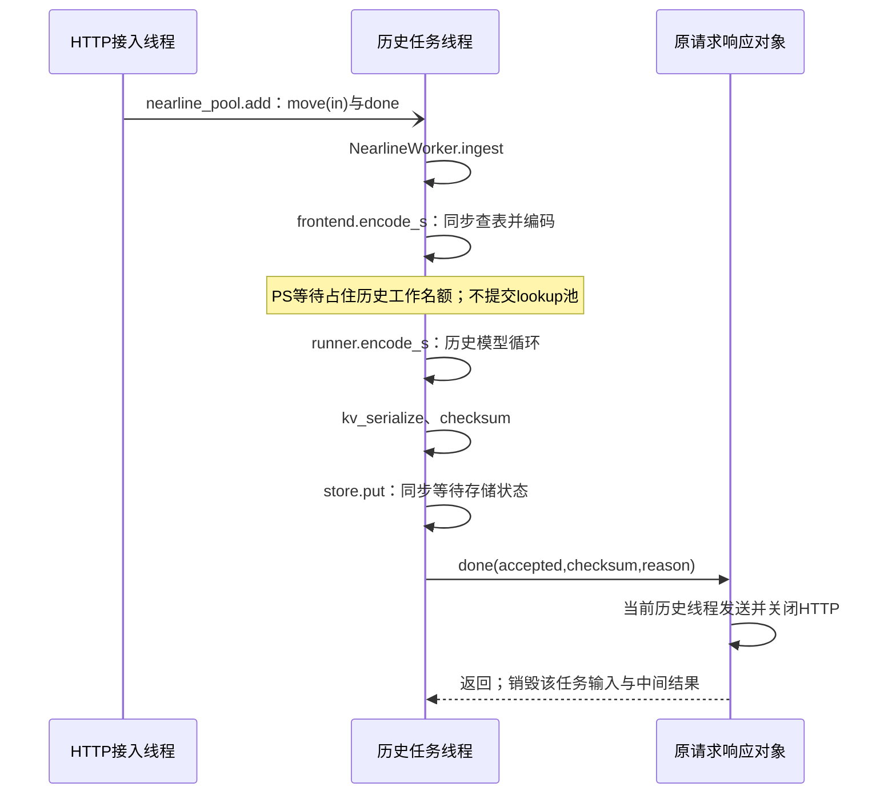
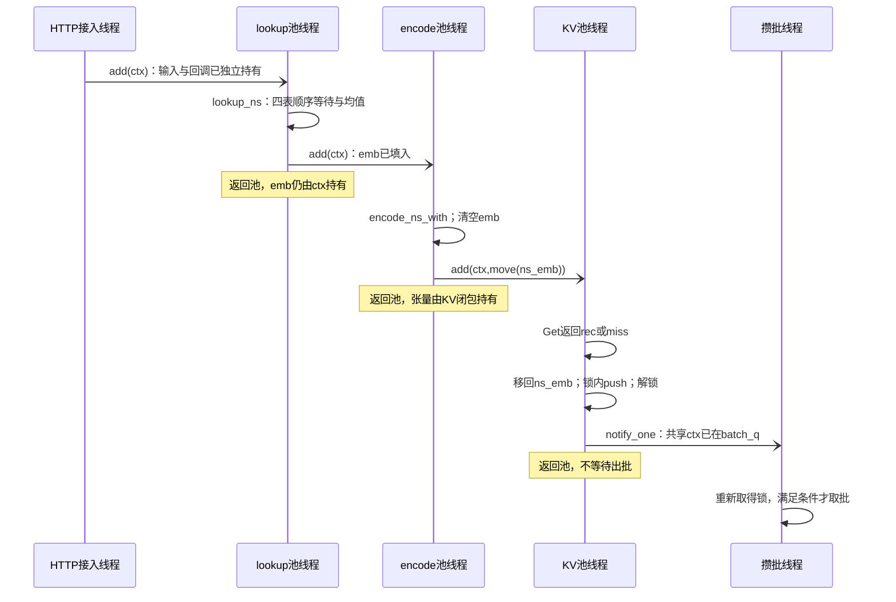
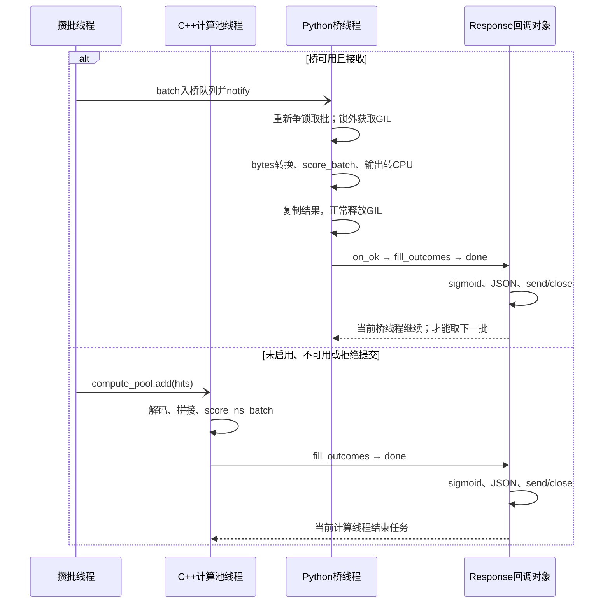
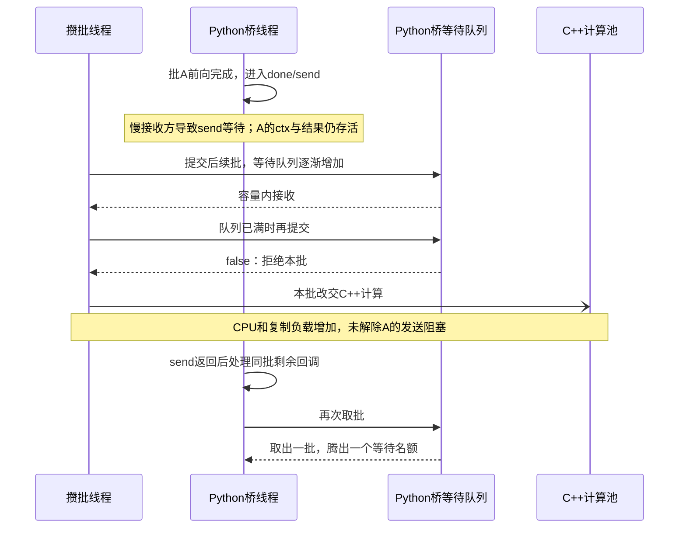

# OneTrans 进程内部：逐函数执行、同步与 OS 负载分析

本文从一个请求进入 `onetrans_server` 开始，追踪它的数据、任务和结果直到连接关闭。业务接口、特征配方、部署边界仍以 [OneTrans 4+1](02_onetrans.md)为准；这里回答的是：**哪段代码在运行，哪个线程在等谁，数据在哪里保留，负载如何扩大，以及用什么证据判断瓶颈。**

分析依据是随文归档的源码，不是一次运行记录；未启动模型、未做压测，也没有据此指定 Host、CPU 核数或服务副本数。[前期编排分析](assets/source_snapshots/prior_design/pairec-orchestration-analysis.md.html)提供逐阶段追踪的组织方式，其 Go 运行时结论不能移植到这个 C++ 进程。

PS 指模型参数服务；KV 在本文指模型注意力的键和值张量，存储在 DataSystem 中的是计算结果字节，不是原始历史或业务特征。

## 1. 先固定路径、数据和计量单位

### 1.1 本文具体分析哪条执行路径

```yaml
历史请求:
  route: POST /ingest
  dispatch: HTTP接入线程 -> nearline_pool -> NearlineWorker.ingest
  computation: 始终为C++历史前向
候选请求:
  route: POST /rank
  dispatch: HTTP装配 -> ScoreFlow -> lookup -> encode -> KV -> batch
  computation: C++计算池，或同进程Python桥；每个命中批择一执行
外部数据面分析基线:
  embedding_source: ps
  kv_backend: datasystem
本地分支:
  embedding_source_local: 不发PS请求；查本地参数数组并复制结果
  kv_backend_local: 进程内map和mutex；不同进程不共享此状态
不计入主链:
  - pipeline.cpp中的旧OnlineWorker.score，不是当前rank路由使用的ScoreFlow
  - ScoreFlow返回future的工具重载，生产HTTP路由使用回调重载
  - Python历史构建路径；本次HTTP ingest不调用它
```

选择哪条路径同时取决于构建选项和启动参数。没有编入真实 PS 或 DataSystem 时，入口可能仍使用本地实现；`compute_backend=python` 也不保证每个批次都走 Python。分析网络调用率前必须先核对实际后端，不能把上述分支的工作量相加。[入口装配](assets/source_snapshots/OneTrans_HSE_project/cpp/tools/server_main.cpp.html#L141)、[生产路由](assets/source_snapshots/OneTrans_HSE_project/cpp/tools/server_main.cpp.html#L286)。

### 1.2 一个贯穿全文的请求

```python
# 接口演算；历史、候选和分数示例不证明Provider/TSV/参数表已实际覆盖。
request_id = "demo-user-1-001"
user_id = "1"
history_ids = [2, 3, 80936, 781, 111774, 1230, 26403, 991, 2362, 1202]
candidate_ids = [4, 1201, 9002, 9001]
ingest_input = {"user_id": user_id, "item_ids": history_ids,
                "timestamps": list(range(10))}
rank_input = {"request_id": request_id, "user_id": user_id,
              "items": [{"item_id": str(i)} for i in candidate_ids]}

# 随库模型：用实际manifest替换，不能把默认形状强加给别的模型。
D = 128                         # 每个token向量的维度
H = 4                           # 注意力头数；每头32维
Ns = 5                          # 每候选五个输入token
S = [50, 38, 27, 16]            # 四层历史张量宽度
M = 4                           # 单请求候选数
B = 1                           # 示例计算批中的命中请求数
C = 4                           # 批中命中候选总行数，通常C=sum(M_i)
U = 1                           # 批中内容不同的历史payload数
```

IPO 是 Input、Process、Output，即输入、处理和输出。`payload` 是序列化后的字节串；`logits` 是模型输出头的原始数值；`token` 在这里指模型输入向量。`Ctx` 是单请求状态对象；`shared_ptr` 用引用计数保持对象存活，`move` 转交已有容器资源，普通 `vector` 拷贝则复制元素。后两者不能混称为零复制。[输入结构](assets/source_snapshots/OneTrans_HSE_project/cpp/src/engine/frontend.h.html#L22)、[Ctx](assets/source_snapshots/OneTrans_HSE_project/cpp/src/serving/flow.h.html#L65)、[Tensor](assets/source_snapshots/OneTrans_HSE_project/cpp/src/common/tensor.h.html#L17)。

候选批是“若干请求的候选行”，不是把所有请求拼成一个用户。`row0s` 保存各请求首行，`row_kv_idx` 关联每行的历史。不要把 HTTP 并发请求数、活跃线程数、待处理任务数、批数和候选行数统称为“并发量”。

### 1.3 对同步机制的判读规则

OneTrans 的接入和各池运行在 OS 线程上；没有证据表明一个 Folly IO 线程能在执行当前同步 PS/SDK 调用时，自动改为执行另一个请求任务。等待期间线程可能睡眠、CPU 可运行别的线程，但这个池的工作名额仍被占用。bRPC、Folly、SDK 内部如何等待，要以实际链接版本和线程栈为证据。

条件变量的 `notify_one` 不是“立刻切换到被通知线程”。等待者还需重新取得 mutex，并获得 CPU 调度；mutex 无竞争时不必进入内核。不能由一次通知推定一次 futex 系统调用、一次上下文切换或固定的网卡中断数。CPU 时间、线程占用的墙钟时间、任务在队列里等待的时间也必须分开。

## 2. 常驻对象、启动和执行资源

### 2.1 在接第一条请求之前已经占用什么

`main` 先 `ArtifactStore::load` 读取整个权重文件，再分别 `OneTransModel::load`、`EmbeddingFrontend::load`、`EmbeddingTables::load`。`ArtifactStore::get` 复制张量；`EmbeddingTables` 把复制出的参数数组移入表。因此即使随后选择 PS，也已装载本地表，并继续由局部共享对象持有。不能把“PS 承载参数”理解成模型进程不保留参数副本。[装载顺序](assets/source_snapshots/OneTrans_HSE_project/cpp/tools/server_main.cpp.html#L141)、[张量取出](assets/source_snapshots/OneTrans_HSE_project/cpp/src/common/tensor.cpp.html#L102)、[本地表装载](assets/source_snapshots/OneTrans_HSE_project/cpp/src/serving/embed_lookup.cpp.html#L7)。

`RankAssembler` 在启动时全量读取用户、物品 TSV，存入内存表。`/rank` 的 `find` 是内存查找；每次请求复制所需类别列表和 15 维数值，不再读取 TSV 文件。`/score` 虽绕过装配，入口启动仍加载这些文件。文件读取、初次页面访问、动态库与 Python 初始化属于启动负载，不应反复计入每请求磁盘 I/O。[TSV 装载](assets/source_snapshots/OneTrans_HSE_project/cpp/src/serving/rank_assembler.cpp.html#L18)。

Python 启动还读取权重，构建 PyTorch 模型并选择 CUDA 或 CPU；解释器嵌在同一进程中。模型与张量的地址空间、容器内存限额都与 C++ 共享，GPU 内存另计。启用桥不删除 C++ 模型或计算池。[Python 装载](assets/source_snapshots/OneTrans_HSE_project/cpp/tools/bridge_score.py.html#L30)。

### 2.2 线程池是怎样创建和接收任务的

`ScoreFlow` 创建 lookup、encode、KV、compute 四个 Executor；`start` 创建一个攒批线程。入口另建历史 Executor，HTTP `run` 创建固定接入线程。相同二进制即使只被调用 `/ingest`，也不会按角色自动裁掉候选池。[建池](assets/source_snapshots/OneTrans_HSE_project/cpp/src/serving/flow.cpp.html#L19)、[历史池](assets/source_snapshots/OneTrans_HSE_project/cpp/tools/server_main.cpp.html#L207)。

```cpp
// Executor::add的实际边界；省略类型和统计，不是新实现。
{
    lock_guard lock(mu_);
    if (stopped_) throw logic_error(...);
    pending = executor.getPendingTaskCount();
    if (pending >= cap_) throw ExecutorOverloaded(...);
}                                      // 已释放封装层mutex
executor.add(move(task));               // Folly管理队列和工作线程唤醒
// 当前调用方不等待task完成；检查和真正入队之间可有其他提交者进入。
```

这是一道 pending 快照的软检查，不是原子“预留名额”，也不计所有已运行、攒批等待或等待响应的请求。Folly 的内部队列和唤醒细节由链接版本决定；源码仅创建普通 `NamedThreadFactory`，不能照注释写成已绑核。任务之间的异步交接由运行时保证发布/获取可见性，业务代码没有对整个 `Ctx` 持一把跨阶段锁。[Executor 实现](assets/source_snapshots/OneTrans_HSE_project/cpp/src/common/executor.cpp.html#L7)。

```yaml
入口代码默认值_不是已部署配置:
  http_threads: 8
  nearline_threads: 2
  lookup_threads: 4
  encode_threads: 2
  kv_threads: 4
  compute_threads: 0       # 转hardware_concurrency；取不到时为4，不自动等于容器CPU配额
  queue_cap: 1024         # 各Executor的pending软检查
  max_batch: 32           # 请求个数，非候选行数；覆盖ScoreFlow自身默认16
  max_wait_ms: 5
  compute_backend: auto
  embedding_source: local
  kv_backend: local
  kv_ttl_seconds: 0       # 不过期
Python桥等待队列容量: 16  # 代码成员值；不含正在执行批次，非queue_cap
```

非正 `nearline_threads` 被 Executor 转成 1，不能用于关闭历史池。总 OS 线程数还含 bRPC、SDK、Python/PyTorch、设备运行库的线程，不能直接把上面数字相加当作实测值。[入口默认值](assets/source_snapshots/OneTrans_HSE_project/cpp/tools/server_main.cpp.html#L52)。

## 3. 公共 HTTP 路径：收包、分发和响应所有权

### 3.1 `run → FdQueue → handle_connection`

`run` 所在线程在阻塞 `accept` 返回后得到一个 fd（文件描述符），设置 `TCP_NODELAY`，调用 `FdQueue::push`。`push` 只在 mutex 内把整数 fd 放进队列，解锁后通知一个等待者。接入线程的 `pop` 在谓词 `!q.empty() || stopped` 成立前等待；检查谓词和出队都持同一把锁，避免通知先到造成永久漏醒。[连接交付](assets/source_snapshots/OneTrans_HSE_project/cpp/src/net/http_server.cpp.html#L35)、[accept 循环](assets/source_snapshots/OneTrans_HSE_project/cpp/src/net/http_server.cpp.html#L127)。

图法：UML 时序图，均为进程内部执行者或队列；异步箭头表示交付，不表示同步等待业务完成。



上图最后一步交付到任务队列，实际工作线程在后两章展开。连接队列没有显式容量；`listen(...,512)` 是监听队列配置，不限制已被 accept 接收并放进 `FdQueue` 的 fd。若接入线程都被慢请求体占住，accept 仍可能继续交付，增长的是 fd、内核 socket 缓冲及队列，不必伴随 CPU 满载。

### 3.2 `read_request` 的对象、复制和阻塞

函数以 4096 字节栈缓冲重复 `recv`，追加到 `buf`；找到头部结束后复制出 `raw_head` 和 `rest`，解析方法、路径和 `Content-Length`，再把 body 放入 `req.body`。头部扫描上限为 64 KiB，声明 body 上限为 16 MiB；这不是业务候选数上限，也不是每条连接的总内存上限。JSON 随后还生成解析树，再复制为输入向量。[收包](assets/source_snapshots/OneTrans_HSE_project/cpp/src/net/http_server.cpp.html#L189)、[请求解析](assets/source_snapshots/OneTrans_HSE_project/cpp/src/serving/json_io.cpp.html#L12)。

这里没有非阻塞 socket 配置，也没有接收截止时间。数据不足时当前接入线程停在 `recv`，不会像 Go 可轮询网络协程一样自动让该线程接着处理另一连接。若数据已经在缓冲区，`recv` 可以直接返回；不能把每次函数调用都计成线程睡眠。解析失败或连接读结束则关闭 fd，尚未创建模型任务。

### 3.3 `done` 保存的是什么，谁发送响应

`handle_connection` 在异步路由前递增 `pending_async`，创建捕获 `fd`、`this` 和共享原子布尔值的 `done`。模型输入必须另行复制/移动进任务；不能保存 `req.body` 的借用指针，因为接入函数返回后本地 `HttpRequest` 会销毁。

```cpp
// http_server.cpp:277的关键控制流。
done = [fd, called] (HttpResponse response) {
    if (called->exchange(true)) return;  // 防止同连接重复写回
    write_response(fd, response);        // 当前调用done的线程执行
    pending_async.fetch_sub(1);          // 发送/关闭之后才减
};
```

`write_response` 组装响应头，分别一次 `send` 头、一次 `send` body，然后 `shutdown/close`。它没有独立发送池，没有完整处理短写的循环，也没有发送超时。socket 发送缓冲足够时很快返回；不足且对端缓慢读取时，**计算完成线程可能睡眠在 send**。即使发送成功也只说明字节交给本机 socket，不能当作对端业务已接收。两个计数 `pending_async`、`ScoreFlow::inflight` 都没有用于全局准入控制。[响应与回调](assets/source_snapshots/OneTrans_HSE_project/cpp/src/net/http_server.cpp.html#L251)。

## 4. 历史路径：一个任务内顺序完成全部工作

### 4.1 HTTP 路由交付 `IngestInput`

`parse_ingest_input` 把 user 字符串、ID 数组、timestamps 数组复制进 `IngestInput`，只检查两个数组等长。调用方目前构造 `0..9` 占位序号；服务不按它排序，也不把它作为位置编码。路由把 `in` 移入历史任务闭包，复制响应回调，调用 `nearline_pool->add`。成功提交即结束接入线程上的处理；若解析或入队抛异常，直接在此线程回调 HTTP 400。[路由](assets/source_snapshots/OneTrans_HSE_project/cpp/tools/server_main.cpp.html#L234)。

图法：UML 时序图。历史池生命线代表处理该任务的线程；响应对象是代码角色，实际发送仍在历史线程中完成。



### 4.2 `EmbeddingFrontend::encode_s`：截断、查表和输入编码

先令 `valid=min(len(item_ids),50)`，复制尾部 valid 个 ID，再创建长度 50 的 `padded` 和 mask。本例前 40 槽 ID 为 0、mask 为 0；后 10 槽有效。即使只有 10 项有效历史，查表仍发 50 个 ID，包含重复的 0；没有在客户端把这 40 项折成一次查表。[历史前端](assets/source_snapshots/OneTrans_HSE_project/cpp/src/engine/frontend.cpp.html#L78)。

PS 分支的 `LookupFn` 每次新建 protobuf request/response、Controller，把 ID 一个个加入 request，以 `done=nullptr` 同步调用 `Lookup`。返回后再从 protobuf 的 weights 复制成 `vector<float>`；本次协议对象随函数退出释放。共享 Channel 没有被外层全局 mutex 包住，但单个历史任务必须等本次 RPC 终态才能往下执行。源码超时为 5000 ms、连接超时 1000 ms，不是整个推荐请求期限。[PS 客户端](assets/source_snapshots/OneTrans_HSE_project/cpp/src/serving/ps_client.cpp.html#L56)。

本地参数分支则逐 ID 从常驻数组复制 D 个 float，ID 越界抛异常；不能与 PS 的“服务端缺行补零”行为混为一谈。[本地查询](assets/source_snapshots/OneTrans_HSE_project/cpp/src/serving/embed_lookup.cpp.html#L30)。

拿到 `[50,128]` 后，padding 行清零；构造临时 `Mlp` 并用普通赋值复制 `s_mlp_w1/w2`，对全部 50 行做两层线性变换及激活。再清零 padding token，加 50 个槽位自身的位置向量，做逐行 RMSNorm（均方根归一化），产生 `s_emb=[1,50,128]`、`s_mask=[1,50]`。本例真实历史对应位置 40..49；timestamps 完全没有传入该函数。临时参数副本、seq_emb、s_tokens 和临时向量在函数返回后释放，返回的两张量由历史任务持有。

### 4.3 `TwoStageRunner::encode_s`：生成四层 K/V

函数复制输入到可变历史表示，每层执行：归一化 → Q/K/V 投影 → 保存该层历史 K/V → 构造有效历史掩码 → 注意力 → 输出投影和残差 → 归一化与历史前馈网络 → 从尾部裁出下一层宽度。层宽依次 50、38、27、16；有效长度与物理宽度分别记录。注意力的 mask 能跳过部分点积，不会让前面的投影或后面的前馈网络只运行十行。[历史循环](assets/source_snapshots/OneTrans_HSE_project/cpp/src/engine/two_stage.cpp.html#L53)。

IPO 可以写成以下形状链；这里没有新的队列、RPC 或阶段间唤醒，所有 CPU 循环仍在同一历史线程。

```text
[1,50,128] + [1,50] mask
  -> 每层 Q/K/V 与有效注意力
  -> K[l],V[l]: [1,S[l],4,32]，l=0..3
  -> UserKV{s_len=10, per_layer_len, k[], v[]}
```

逐层临时张量在离开作用域时释放，已保存四层的 K/V 累计保留到序列化和写入结束。更深的具体循环与计算量在第 7 节，不用“Transformer 已调用”代替计算分析。

### 4.4 `kv_serialize → checksum → store.put`

`kv_serialize` 生成 JSON 头并预留连续 payload：11 字节魔数、4 字节头长、头内容、逐层 K/V 原始 float32 字节。它把张量复制到 payload，不是直接把 `UserKV` 指针交给存储。随后的 `rec.payload=move(payload)` 避免再复制字符串容器；`rec.checksum()` 却调用当前 SHA256 实现，**先复制整份 payload 并补齐到 64 字节块，再逐块计算**，生成十六进制结果。SHA 临时缓冲在计算返回后释放。[序列化](assets/source_snapshots/OneTrans_HSE_project/cpp/src/kv/serialize.cpp.html#L41)、[校验和](assets/source_snapshots/OneTrans_HSE_project/cpp/src/common/sha256.cpp.html#L25)。

DataSystem `put` 以 `rec.key.str()` 和 `rec.payload` 同步调用 `KVClient::Set`，只把 SDK 返回状态转为 bool。键按模型版本和用户构造，不含本次 request_id；`created_at`、`seq_ts_last=9` 并不写入 payload。SDK 的复制、共享内存、网络及超时细节不能从这层接口推定。LocalKVStore 的行为不同：先复制整个 record/payload，再持 mutex 替换 map 项，旧记录如仍被候选读者持有则继续存活。[DataSystem 写入](assets/source_snapshots/OneTrans_HSE_project/cpp/src/kv/datasystem_store.cpp.html#L46)、[本地写入](assets/source_snapshots/OneTrans_HSE_project/cpp/src/kv/store.cpp.html#L49)。

PS、计算、序列化或存储异常由 `NearlineWorker::ingest` 转为 `accepted=false`；SDK Set 返回失败也令 accepted 为假，但未必填充具体 reason。路由收到结果后构造 JSON 并调用 done：写成功才用 HTTP 200，失败为 400。`ingest_us` 从历史任务开始计，到 ingest 返回结束，不含历史池排队和 HTTP 发送。[完整历史任务](assets/source_snapshots/OneTrans_HSE_project/cpp/src/serving/pipeline.cpp.html#L98)。

## 5. 候选路径：逐阶段交付、积压和攒批

### 5.1 `parse_rank_request → assemble → submit`

这三步都先在 HTTP 接入线程发生。JSON 解析把字符串 ID 转整数；用户和物品的 TSV 内存表提供完整 `ScoreInput`。每个物品的两个类别列表与 dense 数组被复制进候选对象，用户 dense 创建为 15 个 float。`rank.item_ids` 仍被响应闭包保留，用于最终按原顺序绑定分数；因此这些 ID 同时存在于解析结果和模型输入中。[解析](assets/source_snapshots/OneTrans_HSE_project/cpp/src/serving/json_io.cpp.html#L60)、[装配](assets/source_snapshots/OneTrans_HSE_project/cpp/src/serving/rank_assembler.cpp.html#L78)。

`ScoreFlow::submit` 分配 `shared_ptr<Ctx>`，把 input 和 done 移进去，递增 inflight，提交 lookup 闭包。后续不是整对象不断 move：各阶段闭包捕获同一个共享指针；阶段内写自己的结果，完成后才发布给下一队列。`Ctx` 没有整请求 mutex，正常路径依赖这个顺序交付，不是几个阶段同时修改它。[submit](assets/source_snapshots/OneTrans_HSE_project/cpp/src/serving/flow.cpp.html#L52)。

### 5.2 `stage_lookup → lookup_ns`：四次顺序参数查询

lookup 闭包真正被工作线程执行后才开始 `lookup_us` 计时。输入是 1 个用户 ID、M 个物品 ID，以及逐候选的 artist/album 列表。`lookup_ns` 依次执行 user、item、artist、album 查表；多值类别先展平列表，一次查回全部行，再按每个候选求均值。空类别组不发对应 RPC，而输出零向量。本例每候选两个类别槽各一个 ID时，四次响应分别有 1、4、4、4 行，合计 13×128 个 float。

等待 PS 时，此 lookup 线程不能领取另一任务；别的 lookup 线程可以查询别的请求。即使同批多个请求都是用户 1，查表也已在各自请求阶段分别发出，没有自动合并重复 ID。PS 返回的 protobuf→vector 复制、类别均值 CPU 都计在 lookup 内。结果写入 `ctx.emb={uid,items,artists,albums}` 后，调用 `stage_encode(ctx)` 仅提交下一任务，然后返回。[lookup 阶段](assets/source_snapshots/OneTrans_HSE_project/cpp/src/serving/flow.cpp.html#L79)、[四表与均值](assets/source_snapshots/OneTrans_HSE_project/cpp/src/engine/frontend.cpp.html#L123)。

### 5.3 `stage_encode → encode_ns_with`：特征转五组 token

编码池得到 `ctx` 后创建 `[M,30]` 数值数组：每行复制相同的 15 维用户数值及该候选 15 维数值。`piecewise_forward` 对 30 个字段的各分段参数计算，当前输出 `[M,240]`。用户参数 `[128]` 被广播复制为 `[M,128]`；与 item/artist/album 一起形成五组输入。

每组临时 `Mlp` 都复制自己的两份权重，计算投影与 GELU，再散射到 `[M,5,128]` 的组槽位。最后 RMSNorm 创建 `ns_emb`。这是 C++ CPU 编码，即使候选最后选择 Python/GPU，也不会把这段自动搬到 GPU。[编码函数](assets/source_snapshots/OneTrans_HSE_project/cpp/src/engine/frontend.cpp.html#L168)。

成功后 `ctx.emb=NsEmbeddings{}` 释放查表中间数组；`stage_kv(ctx,move(ctx.ns_emb))` 将张量移入 KV 任务闭包。这个移动主要转交 vector 的缓冲所有权，不按候选元素重新复制；但前述数值拼接、用户广播和组散射确实已经发生。KV 队列积压时，闭包持续持有这份 10,240 字节示例张量及 ctx 输入，不需要编码线程继续等待。[交付点](assets/source_snapshots/OneTrans_HSE_project/cpp/src/serving/flow.cpp.html#L106)。

### 5.4 `stage_kv → DatasystemKVStore::get`

KV 池取到闭包后，调用 `store.get({model_version,user_id})`。这是每请求一次 Get，注释里的 mget 不是跨请求批读。SDK 把值放到新 `std::string val`；adapter 移到 `UserKVRecord::payload`，解析 JSON 格式头，返回 `shared_ptr<const UserKVRecord>`。网络和格式头解析都在当前 `kv_us` 里；正文张量要到计算阶段才反序列化。[KV 阶段](assets/source_snapshots/OneTrans_HSE_project/cpp/src/serving/flow.cpp.html#L130)、[adapter](assets/source_snapshots/OneTrans_HSE_project/cpp/src/kv/datasystem_store.cpp.html#L12)。

SDK 返回未找到/错误、空串或格式头解析抛异常时，rec 为空，后续走 miss。可解析格式头并不保证正文可安全反序列化，更不证明历史属于本次请求。本文不把损坏输入与真实无历史当成同一种业务结果。

读取完成后，闭包将候选张量移回 `ctx.ns_emb`。KV 线程持 `batch_mu` 检查停止标记，记录入攒批时间并 push ctx；离开锁区后 `batch_cv.notify_one()`，随后结束本任务。若已停止，则先解锁，再在当前 KV 线程 `fail_ctx`；不能持队列锁发送错误 HTTP。

### 5.5 交付时序：谁释放执行名额，谁持有数据

图法：UML 时序图。只展开候选进程；远端调用记在执行它的线程步骤里。每条异步箭头之后，上一个线程不等待下游业务完成。



### 5.6 `take_batch`：谓词、窗口和锁的真实边界

```cpp
// 与源码相同的同步结构；工作线程不在本锁区内做Get或模型计算。
unique_lock lock(batch_mu);
batch_cv.wait(lock, [&] { return !batch_q.empty() || batch_stop; });
if (batch_q.empty()) return {};                 // 停止且无任务
const auto deadline = now() + batch_wait_ms;
while (batch_q.size() < max_batch) {
    if (batch_cv.wait_until(lock, deadline) == timeout) break;
}
// 仍持锁：移动最多max_batch个shared_ptr到局部vector，并pop_front。
return batch;                                  // 退出时解锁；随后on_batch
```

首项等待使用谓词；窗口等待没有相同谓词，而是在每次醒来后用 `while` 重新检查队列大小。通知可能发生在批线程尚未等待时；数据已经在队列里，下一次谓词检查仍能看到。窗口被伪唤醒也不会重新获得完整 5 ms，而是继续使用同一绝对 deadline。停止标记没有进入第二个循环的判定，故 stop 不承诺立即中止此窗口。[取批源码](assets/source_snapshots/OneTrans_HSE_project/cpp/src/serving/flow.cpp.html#L174)。

取批时的 B 是请求数：例如 32 个各有 50 候选的请求可以产生 1600 行，源码没有独立的行数/字节上限。`max_wait_ms` 从批线程发现首项时开始；前面的 Get 队列、batch_q 积压、上批拼接、miss 回调发送都不受这个窗口约束。

### 5.7 `on_batch`：先处理 miss，再拼命中批

先给所有请求写批大小和等待时间。miss 请求分配 `[M,2]` 零 logits，当场调用 done，并递减 inflight；这段在唯一攒批线程上。只要一个 miss 的 HTTP 发送变慢，本批尚未处理的请求以及后面的整个 batch_q 都会被延后；并不是只有该 miss 自己慢。

命中请求进入 `hits`。函数累计候选行数 C，分配 `ns_blob`，逐请求 memcpy 候选张量；`row0s` 记录各请求输出边界。用**完整 payload 字符串**作 unordered_map 的键：哈希要读取字节，首次出现还复制到 map 键，再复制到 `bb.kv_payloads`。`ctx.rec` 的原始 payload 并未释放。U 小于 B 能减少后续解码数，但此前已执行 B 次 Get，且仍可能保留 B 份接收值。[拼批与去重](assets/source_snapshots/OneTrans_HSE_project/cpp/src/serving/flow.cpp.html#L192)。

```python
# 单请求命中批的交付描述，payload实际为二进制，不在图中展开。
row0s = [0]
row_kv_idx = [0, 0, 0, 0]
ns_blob_shape = [4, 5, 128]
logits_shape = [4, 2]
# 例如再来3候选请求：row0s=[0,4]，C=7；历史内容相同则仍U=1。
```

两条后端路径都先支付了以上构造成本。bridge 可用且 submit 成功，`BridgeBatch` 被移动到桥队列；否则提交 C++ 计算池。`hits` 被完成闭包捕获，因此即使某个请求已先回调，批中的其他引用还可能使它的 ctx 保持存活。[后端选择](assets/source_snapshots/OneTrans_HSE_project/cpp/src/serving/flow.cpp.html#L267)。

## 6. 两种候选后端：计算任务、回调和慢失败路径

### 6.1 C++：`dispatch_cpp → score_ns_batch → fill_outcomes`

`dispatch_cpp` 将命中 ctx 列表移入 compute 任务闭包。工作线程先按 `kv_idx` 将每种历史反序列化一次：解析格式头、分配每层 K/V vector，再 memcpy 正文字节。`kv_rows` 仅重复保存这些 UserKV 的指针；这是复用解码结果，不等于模型计算复用全部中间张量。

随后 `embs.push_back(c->ns_emb)` 复制每请求候选张量；创建 `ns_cat=[C,5,128]` 再逐份复制；调用 `score_ns_batch`。函数返回 logits 后，再复制为 `std::string blob`；`fill_outcomes` 按 row0s 为每个请求分配输出 Tensor 并 memcpy，调用各请求的 done。[C++ 批任务](assets/source_snapshots/OneTrans_HSE_project/cpp/src/serving/flow.cpp.html#L286)。

计算计时只围住 `score_ns_batch`，不含 compute 队列等待、反序列化、拼接或 HTTP 回调。计时结束不等于这个工作线程空闲：它必须继续拆分、sigmoid、JSON 编码和发送。一个慢发送只占住执行本批的 compute 线程，但会使本批后续回调等待。局部解码历史、拼接数组和捕获的 ctx 要到整个任务闭包退出后才统一失去相应引用。

### 6.2 Python：队列并没有替代同步计算调用

`PythonComputeBridge::submit` 持 `mu` 检查 stopped/ready 和 `q.size()<16`，通过后把整个 batch move 进队列，解锁、notify_one。失败返回 false，攒批线程回退 C++。桥线程的谓词为 `stopped || !q.empty()`；被唤醒后重新取得锁，取一批并 pop，离开锁区，才调用 `call_score`。**模型执行和 HTTP 回调不持桥队列 mutex，但唯一桥线程仍被占用。**[桥队列](assets/source_snapshots/OneTrans_HSE_project/cpp/src/serving/compute_bridge.cpp.html#L166)。

`call_score` 取得 GIL（Python 解释器访问锁），构造 Python 参数：每个历史 payload 调 `PyBytes_FromStringAndSize`，候选 ns_blob 也复制为 bytes，行映射转换为 Python 整数列表。随后 `PyObject_CallObject(score_batch)` 同步调用，等 Python 返回 bytes，再复制为 C++ string，正常释放 Python 引用和 GIL。只有这之后 `run` 才调用 `batch.on_ok`。[C API 边界](assets/source_snapshots/OneTrans_HSE_project/cpp/src/serving/compute_bridge.cpp.html#L206)。

Python 的 `score_batch` 又执行以下链条，所有变量属于本次批调用：

```python
# 与当前函数对应的步骤摘要；省略异常检查。
ns_emb = torch.frombuffer(bytearray(ns_blob), dtype=torch.float32)
ns_emb = ns_emb.reshape(C, 5, 128).to(device)
cache = {}                          # 每次调用重新创建；不是跨批历史缓存
for history_index in row_map:
    if history_index not in cache:
        # frombuffer视图指向本次Python bytes；CUDA时逐层to(device)复制。
        cache[history_index] = decode_and_move_history(kv_blobs[history_index], device)
logits = runner.score_ns_batch(histories_for_rows, ns_emb)
result = logits.detach().to("cpu").contiguous().numpy().tobytes()
```

上面 `decode_and_move_history` 对应 `_kv_from_payload`，`histories_for_rows` 是按 row_map 指向 cache 值的列表。源码 `deserialize_with_meta` 和 `deserialize` 会分别解析头；正文 `_view_tensor` 用 `torch.frombuffer` 建视图。局部读侧没有再复制每个 K/V 为 CPU数组，但 bytes 已由 C++ 复制过；CUDA搬运和后面的 stack/cat 仍生成存储。候选 `bytearray(ns_blob)` 则确实再复制一次。[Python 入口](assets/source_snapshots/OneTrans_HSE_project/cpp/tools/bridge_score.py.html#L84)、[历史字节视图](assets/source_snapshots/OneTrans_HSE_project/onetrans/serving/serialize.py.html#L123)。

同一桥一次只调用一批；PyTorch 算子可由底层 CPU 线程或 GPU 执行，具体并行度不等于 1，也不由 `compute_threads` 控制。输出 `.to("cpu")` 后还需产生可读 CPU bytes，故不能把桥调用返回解释为“仅提交 GPU 就立即返回”。GIL 不是 GPU 锁，底层算子如何释放它由运行库版本决定。

### 6.3 成功计算与响应写回的内部时序

图法：UML 时序图。Response 是原请求的回调对象，不是单独响应线程。两个分支互斥，完成回调运行在调用它的线程。



### 6.4 一个慢/失败请求怎样影响其他请求

下面假设参数、KV 都命中，只让批 A 的响应接收方变慢。不是所有 send 都会阻塞；此例条件是发送缓冲已不能吸收剩余响应。



若是 lookup/encode/KV 入队被拒绝，`fail_ctx` 在发现失败的提交者线程回调 HTTP 503；它也可能被发送阻塞。若 miss 回调慢，堵住的是攒批线程，甚至还没到桥队列。C++ 计算池拒绝则更严重：`dispatch_cpp` 的 `compute_pool->add` 位于批线程调用链、没有对应捕获，异常可能逃出线程导致进程终止。不能以“有 queue_cap”推定任何过载都受控返回 503。

Python 已接收批次后执行异常，`on_fail` 返回失败，不再回退重算。还需验证两个生命周期缺口：初始化线程 detach 后超时，可能晚到地置 ready，但工作线程未创建；`call_score` 中抛异常可能越过末尾 GIL Release。正常路径的容量结论不能掩盖这些失败路径，本文未做故障复现。[初始化](assets/source_snapshots/OneTrans_HSE_project/cpp/src/serving/compute_bridge.cpp.html#L106)、[未保护提交](assets/source_snapshots/OneTrans_HSE_project/cpp/src/serving/flow.cpp.html#L286)。

### 6.5 与调用方闸门的关系：一次请求可能做两次候选工作

配套 PaiRec 当前先尝试 `/rank`，只有 miss 且存在该请求的历史投递闸门时才等待，再调用一次 rank；即使等待超时，源码也会重查。历史成功、失败或被丢弃均可能放行闸门，因此放行不证明 accepted=true；首查命中旧历史时不等待新写入。这是当前行为，区别于目标编排“先检查历史写入成功，再做单次rank”。

```python
# 当前配套调用方的简化控制流；不是OneTrans服务内部的额外线程池。
enqueue_ingest(history, gate)
result = post_rank(user_id, candidate_ids)
if not result.trace.kv_hit and gate is not None:
    gate.wait(timeout)
    result = post_rank(user_id, candidate_ids)
```

两次请求分别查询参数、编码、读取KV；首查miss虽不执行候选前向，前置成本已经支付。HTTP请求取消不删除已写用户KV，也不会自动停止服务端已提交的任务。用户级键可被同用户另一历史覆盖，所以 kv_hit=true 不等于本次历史匹配。[历史投递](assets/source_snapshots/pairec4tigerllm_8506/services/recall/onetrans_s_stage.go.html#L230)、[miss后重查](assets/source_snapshots/pairec4tigerllm_8506/services/sort/onetrans_rank_sort.go.html#L159)。

## 7. 计算内核与可核算的工作量

### 7.1 `matmul_nt` 与注意力循环：实际跳过什么

`linear_rows` 直接进入 `matmul_nt`，循环顺序是输出行、输出维、输入维，每个输出元素逐项累加。源码没有显式 BLAS 调用或单前向内部线程分发；外层 compute 池可以同时运行多个批任务，编译器是否向量化需要构建与采样证据。[矩阵循环](assets/source_snapshots/OneTrans_HSE_project/cpp/src/common/tensor.cpp.html#L11)。

```cpp
// 每次调用的主乘加数 = rows * out_dim * in_dim。
for (row = 0; row < rows; ++row)
    for (out = 0; out < out_dim; ++out) {
        float acc = 0;
        for (in = 0; in < in_dim; ++in)
            acc += x[row * in_dim + in] * w[out * in_dim + in];
        y[row * out_dim + out] = acc;
    }
```

`sdpa_masked` 针对每个查询位置、每个头扫描所有 key：不允许的 key 在点积之前 `continue`；有效项才做 d 维 QK 点积。全掩码行直接输出零，否则再完整扫描 key 做 softmax，并扫描一次累计 V，概率为零时跳过 d 维乘加。所以 **mask 会减少点积，不能消除所有键扫描、投影和 FFN**。[注意力循环](assets/source_snapshots/OneTrans_HSE_project/cpp/src/engine/model.cpp.html#L30)。

一次注意力调用只分配长度为 `k_rows` 的 scores 数组，并在行/头之间复用。候选计算逐候选调用它，没有为全批保留 `[C,H,Ns,S+Ns]` 的C++浮点分数矩阵；不能按一般框架的注意力实现套算这里的峰值。

### 7.2 历史前向的固定成本与有效历史成本

每层 QKV 投影有 `3*S_l*D²` 主乘加，输出投影为 `S_l*D²`，历史 FFN（前馈网络）两层为 `2*S_l*D*F`，F 是 FFN 隐层维度。随库 F=512。Norm、GELU、残差和掩码还有额外计算；这几项矩阵即使是padding位置也全部执行。`ffn_forward` 为整层分配 `[S_l,F]` 隐藏数组。[FFN](assets/source_snapshots/OneTrans_HSE_project/cpp/src/engine/model.cpp.html#L22)、[随库FFN参数](assets/source_snapshots/OneTrans_HSE_project/cpp/artifacts/weights/manifest.json.html#L309)。

历史前向最后一层仍执行注意力、输出投影、FFN、裁剪，再返回缓存。虽然只缓存此前产生的 K/V，计量**当前实际工作量**时不能把末层后续计算删掉。[完整层循环](assets/source_snapshots/OneTrans_HSE_project/cpp/src/engine/two_stage.cpp.html#L71)。

### 7.3 候选 C++：按行投影、物化历史、逐 token FFN

`score_ns_impl` 先复制 `ns_emb.data` 为可更新的 ns。每层按以下顺序执行，不是一次抽象的黑盒 Transformer 调用：

1. 对 `C*Ns` 行做 RMSNorm；`project_ns` 在“候选行×5个token”循环中分别用对应权重投影 QKV，再拆成三个全批数组。
2. 分配 `kk/vv=[C,S_l+Ns,D]`。每个候选都复制完整历史K/V及自身候选K/V，即使四个候选引用同一UserKV，仍复制四次，padding区也复制。
3. 构造 byte mask，逐候选执行 `sdpa_masked`；随后对全批投影、残差和第二次Norm。
4. `apply_ns_ffn` 再在“候选行×token”循环中调用 `ffn_forward(...,n=1)`。因此每次只分配F个float的隐藏数组，当前为2KiB，但一批四层共调用 `4*C*5` 次，分配次数和累计字节随C增长。
5. 移动更新后的ns到下一层。最后对每候选五个token求均值，执行两个输出头的线性层与bias，得到 `[C,2]`；`/rank` 后续只对第一头取sigmoid。

[逐token投影和FFN](assets/source_snapshots/OneTrans_HSE_project/cpp/src/engine/two_stage.cpp.html#L16)、[候选主循环](assets/source_snapshots/OneTrans_HSE_project/cpp/src/engine/two_stage.cpp.html#L129)。函数内部局部变量B表示候选行数，**对应本文C**，不是本文“请求个数B”。

### 7.4 Python 计算核心：相同语义不等于相同执行成本

当前桥调用 `TwoStageRunner.score_ns_batch`。函数逐层归一化并投影候选；针对row_map中的每行，把对应历史K/V先各 `torch.stack` 一份，再与候选K/V做 `torch.cat`，生成注意力输入和浮点mask；随后调用 PyTorch SDPA（缩放点积注意力）、输出投影、逐位置FFN和残差，最后池化及head。[Python批循环](assets/source_snapshots/OneTrans_HSE_project/onetrans/serving/two_stage.py.html#L174)。

batch路径中 stack 已物化每候选历史，cat又物化拼接结果；不能用另一个单用户接口里的 `expand` 来声称当前路径只保留一个历史视图。两份历史stack和两份cat结果在本层同时存活，其规模可以从代码算出；SDPA的内部工作区、融合方式、CPU线程数及是否跳过masked算术则取决于实际PyTorch/设备后端，不能套用上节C++跳算公式当实测硬件指令量。

这里只分析从C++序列化历史进入Python候选函数的路径。Python自己的 `encode_s` 如何创建历史缓存，不属于本次 `/ingest`，不能将它的QKV视图所有权计入当前历史服务的常驻内存。

### 7.5 主矩阵乘加的可复核公式

MAC 表示一次“乘后累加”。以下只算主要矩阵与注意力点积，**不含**前端编码、Norm、GELU、exp、除法、残差、mask扫描、复制和分配。不能把 MAC 直接换算为延迟；换算 FLOPs 时通常把一 MAC 计为两次浮点运算。

```python
F = 512
T = 2                            # 输出头数
per_token_mac = 4 * D * D + 2 * D * F  # QKV、输出投影、FFN = 196608
v = [10, 10, 10, 10]             # 本例各层有效历史；末层后裁到5不再生成第五层KV
history_mac = sum(s * per_token_mac + D * vl * (vl + 1)
                  for s, vl in zip(S, v))
# 候选i在层l有效历史为v[i][l]；本例四个候选均来自同一历史。
candidate_mac_per_row = sum(Ns * per_token_mac +
                            2 * D * (Ns * vl + Ns * (Ns + 1) // 2)
                            for vl in v) + D * T
candidate_batch_mac = C * candidate_mac_per_row
```

注意力项包括允许的QK和PV；PV概率浮点下溢为0时源码还会少算，所以公式以有效项概率非零为条件。历史有效项呈因果三角形，候选每行能看有效历史及自身前缀，因此分别出现 `v*(v+1)/2` 和 `Ns*v+Ns*(Ns+1)/2`。

| 随库形状下的输入 | 历史主MAC/请求 | 候选主MAC/行 | 四候选主MAC |
|---|---:|---:|---:|
| 本例10项历史，各层有效10项 | 25,811,968 | 3,998,976 | 15,995,904 |
| 满50项历史，逐层有效50/38/27/16 | 26,403,328 | 4,115,456 | 16,461,824 |

本例历史加四候选是41,807,872主MAC；历史只算一次，再被四候选复用。十项历史不会把历史CPU工作变成满历史的五分之一：固定宽度投影/FFN占据大部分主MAC。前端还额外运行历史两层输入MLP、候选五组MLP、分段编码和权重复制，计算与内存成本不能漏掉。

### 7.6 字节基数、累计复制和峰值不能混用

```python
kv_body_bytes = 2 * sum(S) * D * 4                     # 134144 B，131 KiB
encoded_candidate_bytes = C * Ns * D * 4               # C=4时10240 B
raw_output_bytes = C * T * 4                           # C=4时32 B

# C++每层kk/vv显式物化；这是相应数组的数据大小，不是整个进程RSS。
cpp_kv_concat_peak = 2 * C * (max(S) + Ns) * D * 4     # C=4时225280 B
cpp_kv_concat_total = sum(2 * C * (s + Ns) * D * 4 for s in S)
# C=4时累计618496 B；四层并非一直同时保留这些kk/vv。

# Python批路径：本层历史stack与拼接cat同时存在，不含其他激活及运行库工作区。
python_stack_cat_peak = 2 * C * (2 * max(S) + Ns) * D * 4  # C=4时430080 B
```

历史计算同时保留输入副本、逐层已缓存K/V、当前层QKV/Norm/残差等数组和FFN隐藏层；峰值显著大于最后131KiB正文。历史SHA又会在序列化后短时保留payload副本。候选C++第一层FFN单次隐藏数组仅2048 B，四候选四层累计分配80次、163840 B；累计字节多不意味着这80份同时存活。

候选C++注意力第一层scores临时数组只有55个float，即220 B，且按候选逐次构造；其 byte mask 为 `C*5*55` 字节。Python使用浮点mask并可能有不同内部临时空间，不能直接把C++峰值乘一个系数。精确峰值需要将对象生存区间与分配器/设备缓存实际占用对齐，而不是相加所有公式。


## 8. 从单请求变成高并发：内存、调度与 I/O 如何耦合

### 8.1 先做调用数和字节账，而不是先选线程数

正常一次历史请求向 PS 发一次 50 行 Lookup，向 DataSystem 发一次 Set；一次候选请求通常发四次 Lookup、一次 Get。M=4 且每项类别槽各1个ID时，PS响应原始float分别为历史25,600 B、候选6,656 B。历史payload正文134,144 B，另有格式头。候选编码10,240 B、输出32 B；最终HTTP很小不能代表整条请求很轻。

```python
# 实际到达率；rank_rate必须包含PaiRec miss后再查和其他重试。
ps_rpc_rate = ingest_rate + rank_rate * average_lookup_calls_per_rank
kv_set_rate = ingest_rate
kv_get_rate = rank_rate
kv_value_write_Bps = ingest_rate * average_payload_bytes
kv_value_read_Bps = rank_rate * payload_return_rate * average_payload_bytes
# 不含协议、错误回包、worker内部复制/转发；不是物理网卡流量。
```

即使一批全是同用户且 U=1，候选的 PS 和 Get 仍按请求发送；批内去重仅改变后段。历史和候选两个独立本地 KVStore 无法满足共享，不能用本地微测网络为零的数字替代拆分部署。

### 8.2 候选批的内存到底保留几份

设 `A=C×Ns×D×4` 为编码输入字节，`V` 为一份历史 payload 大小。DataSystem 读取的各请求记录通常各有接收字符串，即使内容相同也不是同一缓冲；LocalKVStore 返回共享记录指针时这部分不同。

```text
on_batch在构造过程中：
  仍存活：各ctx输入 + 候选张量(A) + 各请求payload(约B×V)
  新增：ns_blob(A) + dedup字符串键(约U×V) + bb.kv_payloads(约U×V)
  另有：哈希桶、行映射、shared_ptr、计时与回调对象
```

这不是精确峰值，也不能把各阶段分配总量全部相加当峰值：`dedup` 在 on_batch 返回后释放，C++ 分支的桥 blob 也可随后释放；但新计算任务可能在提交者返回前开始，二者可以短暂重叠。C++ 又有 embs 副本 A、ns_cat A、模型内部候选副本和逐层临时量；Python 则有 C++ batch、Python bytes、候选 bytearray，以及设备侧张量。应观察每个分配的起止寿命，不能用 U×V 代表整个批的 RSS。

HTTP 完成后的 ctx 也可能仍被本批的 hits/on_ok/on_fail 引用。引用计数归零只使 C++ 对象释放；分配器或设备缓存是否立刻把页面归还 OS/驱动，是另一问题。因此请求计数回落而 RSS暂未下降，不足以单独证明泄漏。

### 8.3 一条具体的积压链

从低负载增加外部请求，固定每请求四候选。若 PS 的墙钟耗时先上升，lookup 线程更久不能返回池，lookup 队列增加；这时大量任务尚无 ns_emb，主要保留 HTTP连接、原始特征和回调。继续增加 lookup 线程可能把更多工作送到已经慢的 PS，而不是消除延迟。

PS 恢复后，排队任务集中完成，encode 的可运行工作增加。CPU不足或被配额节流时，编码队列上涨；一旦编码完成较快而 Get 较慢，积压移到 KV 队列，此时每项多保留编码张量。Get集中返回又会把负载推到攒批和模型。不同阶段有不同驻留字节，不能用统一的“每请求一个小对象”估算。

服务内没有贯穿这些队列的统一请求截止时间；PaiRec 的本地超时不会让队列自动剔除任务。于是外部调用方已放弃的请求仍可能继续占用池名额并产生下游查询，计算实际到达率时不能只统计最后成功返回的请求。

桥消费较慢时等待队列达到16批，后续新批回退C++。CPU计算任务增多，与编码、JSON、批拼接、网络完成线程争CPU；编码变慢又改变后段到达节奏。这是代码允许的跨后端负载转移，不是已经测得的必然雪崩。反证是桥拒绝计数没有增长，或C++批数增长后CPU仍有余量且排队未增加。

```python
# 按同一阶段、同一时间窗统计；接受和完成单位都必须是请求或都为批。
inflight_change_per_second = admitted_per_second - finished_per_second
mean_inflight = arrival_rate * mean_residence_seconds  # 稳定负载下的Little关系
estimated_occupancy = arrival_rate * mean_worker_occupancy_seconds / worker_count
# 最后一式只粗看非批处理池；occupancy含同步外部等待和任务内回调。
# 队列有积压但CPU不满，可能是线程在等PS/SDK/send，而不是需要更多CPU核。
```

### 8.4 每种 OS 现象应怎样解释

**CPU/调度。** C++数值循环、编码、JSON、SHA和拼接是可运行工作；睡眠中的同步调用主要占线程名额和内存。增加线程只有在CPU或外部并发尚有余量时才可能改善；过多可运行线程会增加调度等待、缓存扰动及容器节流。需要分线程CPU时间、等待栈和运行队列，不能用单一进程CPU百分比推断全部阶段。

**内存/页面。** 权重和TSV是常驻基线；各池待处理闭包、batch_q、桥队列及同步调用对象是随负载变化的部分。Tensor构造先置零再被计算覆盖；张量及权重副本造成分配、首次触页与内存带宽需求。只有观察到分配热点、内存带宽压力、页错误或内存回收与延迟同步，才能将瓶颈归到内存，而不是看到 memcpy 就下结论。

**网络/socket。** HTTP按请求关闭连接，PS有自己的Channel，DataSystem用自己的SDK；三者的连接复用、缓冲和内部线程不相同。Get字节增长可能使网络受限，也可能是worker本地等待或CPU处理格式头，必须分开SDK耗时、实际链路字节和远端处理耗时。对本机或共享内存访问不能假设每个payload都走物理网卡。

**文件I/O。** 权重/TSV主要在启动读取；热路径默认不重复读它们。诊断日志若同步输出，可能成为文件/管道等待；DataSystem的持久化或溢写策略属于其部署配置，不能从OneTrans的Set调用推定磁盘写次数。**GPU/驱动。** 只有Python-CUDA候选分支需要GPU；主机拼批、字节转换、设备搬运和输出回传均可让GPU计算之外的墙钟时间增加，GPU空闲也可能是主机没有及时供给。

## 9. 用证据排除误判，再选择改动

### 9.1 当前计时漏了什么

| 现有输出 | 实际含义与限制 |
|---|---|
| `ingest_us` | 历史任务开始后的编码、查表、前向、序列化和写入总时间；不含 HTTP 接收、历史池排队和响应发送 |
| `lookup_us`、`encode_us`、`kv_us` | 相应任务内部耗时；不含此前线程池排队。`feature_us=lookup_us+encode_us`，不含接入线程上的 TSV 装配 |
| `backend_rpc_us` | 命中路径当前累加 KV 读取耗时，不是所有后端 RPC 总和，PS 查询在 `lookup_us` 内 |
| `batch_wait_us`、`batch_size` | 从进入攒批队列到取批后的等待；大小是请求数，包含本批 miss 请求 |
| `compute_us`、`batch_compute_us` | C++ 路径记录前向时间，前者按命中请求数均摊；反序列化、拼接和计算池排队不在内。Python 路径当前未写这些字段，零值不能解释成未计算 |
| `flow.backend.python/cpp`、`flow.bridge_overflow` | 后端提交或回退计数；不是实际设备与成功完成证明。`online.batch_size` 则记录命中候选行数，与响应的 `batch_size` 单位不同 |
| `/metrics` 中的直方图 | 当前桶只增加命中桶，输出未转成累计桶；不能直接按标准 Prometheus 累计直方图求分位数。`online.qps` 也是累加计数且全 miss 批不增加，不能当作总入口 QPS |

依据：[批次计数和回填](assets/source_snapshots/OneTrans_HSE_project/cpp/src/serving/flow.cpp.html#L192)、[C++计时](assets/source_snapshots/OneTrans_HSE_project/cpp/src/serving/flow.cpp.html#L316)、[指标桶实现](assets/source_snapshots/OneTrans_HSE_project/cpp/src/serving/pipeline.cpp.html#L39)。

每次 `Metrics::Timer` 析构还会依次调用两次count和一次observe，各自取得同一个指标mutex；`dump` 在锁内复制map快照，格式化在锁外。指标也是真实CPU和同步工作，是否有争用必须由等待栈确认。[指标实现](assets/source_snapshots/OneTrans_HSE_project/cpp/src/serving/pipeline.cpp.html#L23)。


### 9.2 瓶颈判断必须同时有支持证据和反证

| 待验证假设 | 支持它需要看到什么 | 应主动寻找的反证 |
|---|---|---|
| 接入被慢请求体占满 | 接入线程集中在recv；fd队列增长，任务入lookup/历史池速率下降 | 请求体已收完且接入线程在JSON/TSV CPU，瓶颈是解析或装配 |
| PS使lookup池不足 | lookup池线程在同步Lookup，PS墙钟变长且前队列增长 | PS时间稳定而mean-bag/复制CPU上涨，不能只增RPC并发 |
| CPU模型算不过来 | compute前排队持续增长，线程CPU落在matmul/注意力/FFN循环 | 线程落在done/send、deserialize或分配器，前向计时不支持此结论 |
| 批内去重改善历史内存 | U下降后解码量下降，且驻留字节/峰值降低 | B份Get结果及payload字符串键仍主导RSS，解码减少不等于总内存减少 |
| Python桥被GPU限制 | 桥排队与设备执行/传输同步增长，主机提交及时 | GPU空闲而桥线程在Python转换、GIL或HTTP发送，不能加GPU解决 |
| 队列锁/指标锁成瓶颈 | 等锁调用栈和锁等待时间随并发显著增加 | 大多数时间在PS/SDK或纯计算；锁存在不是争用证据 |

同一个阶段计时变长也可能来自调度延迟。补齐 `enqueued/start/end/callback/send_complete`，并关联 request_id、批ID、M/C/U、实际后端、设备和错误类别。观测批中的共享工作只记一次，不能给每请求都摊整批时间后求和当进程CPU时间。

```python
queue_us = stage_start_us - stage_enqueued_us
stage_wall_us = stage_end_us - stage_start_us
callback_us = callback_return_us - callback_start_us
send_us = socket_close_us - send_start_us
# 上述是建议观测字段；当前trace并不完整提供。
```

### 9.3 可以实施的改动及语义代价

**先把容量检查变成可回收的名额。** 在读取大请求体前/任务提交前控制连接、请求及字节数，给batch_q和桥批加候选行/字节上限，并捕获compute提交异常。名额要覆盖同步调用、计算和响应的生命周期，在所有失败分支释放。代价是过载请求明确被拒绝，联调不能再把其当正常候选不足；只减小线程池队列可能把积压挪到fd队列。

**把响应发送从计算执行者拆开。** 可采用有界响应队列加可靠非阻塞/超时发送，完整处理短写。这样慢接收方不占模型线程，但不会消灭响应字节和fd的内存成本；必须规定队满拒绝、断开、发送失败和关闭时谁拥有回调与缓冲，不能改成无界发送队列。CPU成本可能从compute移到发送端，应看总CPU与尾延迟。

**先减少明确的冗余拷贝，再讨论零复制。** C++分支可延后构造Python专用BridgeBatch；候选拼接可直接写预分配输出，避免embs副本；前端Mlp可借用只读权重，避免每请求复制。历史payload去重可用内容摘要加字节核验或共享所有权，不能仅按用户ID复用可能已过期的历史。代价是更严格的对象寿命、不变性与并发保证；Tensor缓冲复用也要在最后读者完成后归还。

**参数查询合批/缓存需要版本约束。** 同请求四表可并行或跨请求同表合批；同ID响应需按原位置恢复，重复和缺失语义不能变。并行会缩短部分墙钟等待但提高PS瞬时并发；缓存必须绑定模型版本与参数更新策略。把类别重复ID去重也需要保留每候选均值的原始重复计数，不能无意改变权重。

**C++数值内核优化需要逐层对拍。** 以合适矩阵库/向量化替代标量循环，或消除每候选历史物化，都可能降低CPU与带宽成本；同时注意库内线程和外层compute线程相乘。浮点累积顺序、GELU、mask及有效长度必须对拍，不能只验证最终排名“大致一样”。对Python批扩大或使用其他注意力内核，也要同时量测设备内存、等待窗口和尾延迟。

**显式选择过载时的后端策略。** 目前桥满就CPU回退。可以选择限量回退、拒绝或在预算内等待，而不是无限把GPU压力转给CPU。代价是可用性、时延和不同数值后端输出之间的取舍；配置名为python不能代替实际后端证据。

**最后处理取消与历史身份。** 请求断开或本地超时应停止尚未提交阶段，已开始PS/SDK调用按能力取消或等待安全完成；不能提前释放仍被原生代码读写的对象。若避免旧历史命中，需要带历史版本/请求身份的key或一致性校验，同时增加清理策略。这个改动涉及数据语义，不是调度参数，不能用更多线程或OS优化代替。

### 9.4 关闭、失败与自审边界

HTTP stop先关闭监听并join接入线程，后最多约10秒等待pending_async；已在recv中的连接没有相应超时保障。ScoreFlow stop先置停止并join批线程，再排空线程池；尚在KV池中的任务与batch_q遗留请求需要逐项核对完成路径。不能把“调用join”直接认定为所有请求已回复、fd已关、Python引用已释放。[HTTP关闭](assets/source_snapshots/OneTrans_HSE_project/cpp/src/net/http_server.cpp.html#L172)、[Flow关闭](assets/source_snapshots/OneTrans_HSE_project/cpp/src/serving/flow.cpp.html#L37)。

开发视角应核对每个输入、ctx、payload、Python引用、回调和fd的最后拥有者及失败出口；OS视角应区分线程睡眠、可运行等待、锁等待和页面/网络I/O；性能视角应先固定模型、M/C/U、命中率、后端和实际线程配置，再改变外部并发。只有三者对上同一请求与批次，才能解释延迟、资源和错误；本文的公式及因果均不冒充已测结果。
